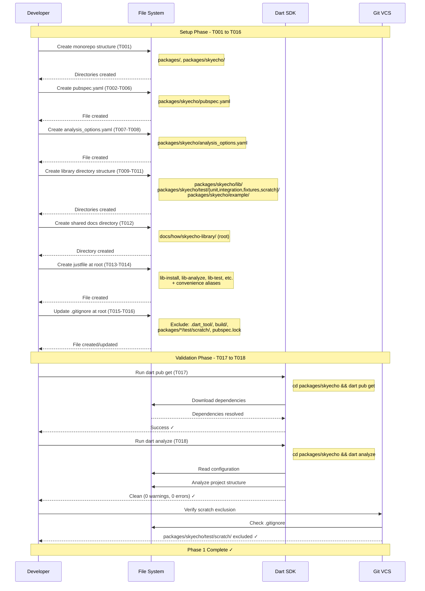

# Phase 1: Project Foundation & Structure - Tasks & Alignment Brief

**Phase Title**: Project Foundation & Structure
**Phase Slug**: phase-1-project-foundation
**Plan**: [dart-repo-foundation-with-mocking-plan.md](../../dart-repo-foundation-with-mocking-plan.md)
**Spec**: [dart-repo-foundation-with-mocking-spec.md](../../dart-repo-foundation-with-mocking-spec.md)
**Created**: 2025-10-16
**Status**: READY

---

## Tasks

| Status | ID | Task | Type | Dependencies | Absolute Path(s) | Validation | Notes |
|--------|----|----|------|--------------|------------------|------------|-------|
| [ ] | T001 | Create packages/ directory structure | Setup | – | /Users/jordanknight/github/skyecho-controller-app/packages/, /Users/jordanknight/github/skyecho-controller-app/packages/skyecho/ | Directories exist | Monorepo structure (new) |
| [ ] | T002 | Create `pubspec.yaml` file in library package | Setup | T001 | /Users/jordanknight/github/skyecho-controller-app/packages/skyecho/pubspec.yaml | File exists and is valid YAML | Plan task 1.1 (part 1) - monorepo path |
| [ ] | T003 | Add project metadata to pubspec.yaml (name, description, version) | Setup | T002 | /Users/jordanknight/github/skyecho-controller-app/packages/skyecho/pubspec.yaml | Name: "skyecho", version: "0.1.0", description present | Plan task 1.1 (part 2); Serial (shared file) |
| [ ] | T004 | Add SDK constraints to pubspec.yaml (Dart >=3.0.0 <4.0.0) | Setup | T003 | /Users/jordanknight/github/skyecho-controller-app/packages/skyecho/pubspec.yaml | SDK constraint defined with compatible range | Plan task 1.1 (part 3); Serial (shared file) |
| [ ] | T005 | Add main dependencies with compatible ranges (`http: ^1.2.1`, `html: ^0.15.4`) | Setup | T004 | /Users/jordanknight/github/skyecho-controller-app/packages/skyecho/pubspec.yaml | Both deps present with `^` ranges per spec | Plan task 1.2 (part 1); Serial (shared file) |
| [ ] | T006 | Add dev dependency `test: ^1.24.0` for testing framework | Setup | T005 | /Users/jordanknight/github/skyecho-controller-app/packages/skyecho/pubspec.yaml | Dev dependency present with `^` range | Plan task 1.2 (part 2); Serial (shared file) |
| [ ] | T007 | Create `analysis_options.yaml` file in library package | Setup | T001 | /Users/jordanknight/github/skyecho-controller-app/packages/skyecho/analysis_options.yaml | File exists and is valid YAML | Plan task 1.3 (part 1); [P] eligible (new file) |
| [ ] | T008 | Configure strict linting in analysis_options.yaml (implicit-casts: false, common lints) | Setup | T007 | /Users/jordanknight/github/skyecho-controller-app/packages/skyecho/analysis_options.yaml | Strict mode enabled, lints configured per rules.md | Plan task 1.3 (part 2); Serial (shared file) |
| [ ] | T009 | Create lib/ directory for library source code | Setup | T001 | /Users/jordanknight/github/skyecho-controller-app/packages/skyecho/lib/ | Directory exists | Plan task 1.4 (part 1); [P] eligible (new dir) |
| [ ] | T010 | Create test/ subdirectories (unit/, integration/, fixtures/, scratch/) | Setup | T001 | /Users/jordanknight/github/skyecho-controller-app/packages/skyecho/test/unit/, /Users/jordanknight/github/skyecho-controller-app/packages/skyecho/test/integration/, /Users/jordanknight/github/skyecho-controller-app/packages/skyecho/test/fixtures/, /Users/jordanknight/github/skyecho-controller-app/packages/skyecho/test/scratch/ | All 4 subdirectories exist | Plan task 1.4 (part 2); [P] eligible (new dirs) |
| [ ] | T011 | Create example/ directory for CLI application | Setup | T001 | /Users/jordanknight/github/skyecho-controller-app/packages/skyecho/example/ | Directory exists | Plan task 1.4 (part 3); [P] eligible (new dir) |
| [ ] | T012 | Create docs/how/skyecho-library/ directory for deep guides (shared docs at root) | Setup | – | /Users/jordanknight/github/skyecho-controller-app/docs/how/skyecho-library/ | Directory exists | Plan task 1.4 (part 4); Shared docs [P] eligible |
| [ ] | T013 | Create `justfile` in repository root with header comment | Setup | – | /Users/jordanknight/github/skyecho-controller-app/justfile | File exists with valid just syntax | Plan task 1.5 (part 1); Root file [P] eligible |
| [ ] | T014 | Add justfile recipes with monorepo paths (lib-*, and convenience aliases) | Setup | T013 | /Users/jordanknight/github/skyecho-controller-app/justfile | All recipes present with cd packages/skyecho commands | Plan task 1.5 (part 2); Serial (shared file) |
| [ ] | T015 | Create or update `.gitignore` at root with Dart and scratch test exclusions | Setup | – | /Users/jordanknight/github/skyecho-controller-app/.gitignore | File exists, includes required patterns | Plan task 1.6 (part 1); Root file [P] eligible |
| [ ] | T016 | Verify .gitignore excludes: .dart_tool/, build/, **/scratch/, packages/skyecho/pubspec.lock, .packages | Setup | T015 | /Users/jordanknight/github/skyecho-controller-app/.gitignore | All patterns present (project-wide conventions) | Plan task 1.6 (part 2); Serial (shared file); **/scratch/ = project convention |
| [ ] | T017 | Run `just install` to verify dependency resolution via justfile | Validation | T006, T014 | /Users/jordanknight/github/skyecho-controller-app/ | Command succeeds, packages/skyecho/.dart_tool/ created | Validates BOTH justfile recipe AND dart pub get; justfile-first approach |
| [ ] | T018 | Run `just analyze` to verify project configuration via justfile | Validation | T008, T017 | /Users/jordanknight/github/skyecho-controller-app/ | Command succeeds with zero warnings/errors | Validates BOTH justfile recipe AND dart analyze; final validation step |
| [ ] | T019 | Create `docs/how/monorepo-setup.md` with path dependency instructions | Doc | T001 | /Users/jordanknight/github/skyecho-controller-app/docs/how/monorepo-setup.md | File exists with Flutter app setup guide, path dependency examples, gotchas documented | Proactive doc for future package creation; [P] eligible |

**Total Tasks**: 19 (expanded from 8 plan tasks, +1 for monorepo structure, +1 for monorepo docs)

**Parallelization Guidance**:
- Task T001 must complete first (creates packages/ structure)
- Tasks T002-T006 are serial (same file: packages/skyecho/pubspec.yaml)
- Tasks T007-T008 are serial (same file: packages/skyecho/analysis_options.yaml)
- Tasks T009-T012 can run in parallel (different directories) after T001
- Tasks T013-T014 are serial (same file: justfile at root)
- Tasks T015-T016 are serial (same file: .gitignore at root)
- Tasks T017-T018 are serial (T017 must complete before T018)

---

## Alignment Brief

### Objective

**Primary Goal**: Establish the foundational Dart project structure, configuration files, and build tooling required for all subsequent development phases using a **monorepo architecture**.

**Monorepo Rationale** (Option 1):
- ✅ **Clean separation**: Pure Dart library (`packages/skyecho/`) remains independently publishable to pub.dev
- ✅ **Flutter app integration**: Future Flutter app will depend on library via `path: ../skyecho` in pubspec
- ✅ **Independent testing**: Can test library without Flutter dependencies (lighter, faster)
- ✅ **Separate versioning**: Library and app can evolve at different paces
- ✅ **Clear boundaries**: Documentation organized by concern (library docs, app docs)
- ✅ **Standard pattern**: Follows Dart/Flutter ecosystem conventions for multi-package projects

**Success Criteria** (from plan acceptance criteria):
- [ ] `just install` succeeds (validates justfile recipe + dart pub get integration)
- [ ] `just analyze` passes with zero warnings/errors (validates justfile recipe + dart analyze)
- [ ] Monorepo directory structure matches specification
- [ ] `justfile` recipes execute without error (support multi-package commands)
- [ ] `.gitignore` properly excludes **/scratch/ (project convention: scratch dirs anywhere in tree)

**Justfile-First Philosophy**: We validate using justfile recipes (`just install`, `just analyze`) rather than direct Dart commands. This ensures the developer workflow is tested end-to-end, not just individual tools. Justfile becomes the canonical interface for all project operations.

**Behavior Checklist**:
- [ ] Monorepo structure created with packages/ directory
- [ ] Library package follows standard Dart conventions (lib/, test/, pubspec.yaml)
- [ ] Dependencies use compatible version ranges (`^`) per library best practices
- [ ] Strict linting enabled for code quality enforcement
- [ ] Test directory structure supports TAD workflow (scratch/ for probes, unit/ for promoted)
- [ ] Build automation via justfile provides consistent developer experience (justfile-first philosophy)
- [ ] Justfile recipes validated through actual execution (not just syntax checking)
- [ ] Shared documentation at root (docs/how/) available to all packages

---

### Critical Findings Affecting This Phase

**None of the 5 critical discoveries directly affect Phase 1** since this phase only establishes project structure and configuration. However, Phase 1 creates the foundation that enables solutions to all critical findings in later phases:

- **Discovery 01** (HTML parsing): Enabled by proper project structure for lib/ code
- **Discovery 02** (MockClient): Enabled by test/ directory structure
- **Discovery 03** (Fuzzy matching): Enabled by lib/ for implementation
- **Discovery 04** (Cookie jar): Enabled by proper dependency management (http package)
- **Discovery 05** (Field cloning): Enabled by lib/ for implementation

**Phase 1 prepares the infrastructure** for implementing solutions to these findings in Phases 3-6.

---

### Invariants & Guardrails

**Project Structure Invariants**:
- **MUST** follow monorepo structure with packages/ directory at root
- **MUST** follow standard Dart package layout within packages/skyecho/ (lib/, test/, pubspec.yaml)
- **MUST** use absolute paths in all documentation and configuration
- **MUST** exclude **/scratch/ from version control and test runs (project-wide convention: scratch dirs anywhere in tree)
- **SHOULD** keep pubspec.yaml minimal (only required dependencies)
- **MUST** place shared documentation at root (docs/), not within individual packages
- **MUST** exclude library package lock files (packages/skyecho/pubspec.lock), but NOT app lock files

**Dependency Version Constraints**:
- **MUST** use compatible version ranges (`^`) for all dependencies
- **MUST NOT** pin to exact versions (prevents user flexibility)
- **SHOULD** prefer stable, well-maintained packages

**Linting Configuration**:
- **MUST** enable strict analysis mode (implicit-casts: false)
- **MUST** achieve zero warnings/errors before committing
- **SHOULD** use Effective Dart recommended lints

**Performance Budget**:
- Not applicable to Phase 1 (no executable code yet)

**Security Considerations**:
- **MUST NOT** commit secrets or credentials
- **MUST** exclude lock files for libraries (pubspec.lock)

---

### Inputs to Read

**Specification Documents**:
- `/Users/jordanknight/github/skyecho-controller-app/docs/plans/001-dart-repo-foundation-with-mocking/dart-repo-foundation-with-mocking-spec.md` - Feature requirements
- `/Users/jordanknight/github/skyecho-controller-app/docs/plans/001-dart-repo-foundation-with-mocking/dart-repo-foundation-with-mocking-plan.md` - Implementation plan (Phase 1 section)

**Architecture & Rules**:
- `/Users/jordanknight/github/skyecho-controller-app/docs/rules-idioms-architecture/architecture.md` - System structure
- `/Users/jordanknight/github/skyecho-controller-app/docs/rules-idioms-architecture/rules.md` - Enforceable standards
- `/Users/jordanknight/github/skyecho-controller-app/docs/rules-idioms-architecture/idioms.md` - Dart patterns

**Reference Materials**:
- [Effective Dart](https://dart.dev/guides/language/effective-dart) - Language guidelines
- [Dart package layout](https://dart.dev/tools/pub/package-layout) - Standard conventions
- [just manual](https://github.com/casey/just) - Justfile syntax

---

### Visual Alignment Aids

#### System State Flow Diagram

```mermaid
flowchart TD
    Start([Empty Repository]) -->|T001| MonorepoCreated[packages/ structure]
    MonorepoCreated -->|T002-T006| PubspecCreated[packages/skyecho/pubspec.yaml]
    MonorepoCreated -->|T007-T008| AnalysisCreated[packages/skyecho/analysis_options.yaml]
    MonorepoCreated -->|T009-T011| LibDirsCreated[packages/skyecho/{lib,test,example}]
    Start -->|T012| DocDirsCreated[docs/how/skyecho-library/]
    Start -->|T013-T014| JustCreated[justfile with monorepo recipes]
    Start -->|T015-T016| GitignoreCreated[.gitignore with packages/* patterns]

    PubspecCreated -->|T017| DepsInstalled[Dependencies Resolved]
    AnalysisCreated -->|T017| DepsInstalled

    DepsInstalled -->|T018| Validated{dart analyze clean?}
    LibDirsCreated -->|T018| Validated
    JustCreated -->|T018| Validated
    GitignoreCreated -->|T018| Validated
    DocDirsCreated -->|T018| Validated

    Validated -->|Yes| Complete([Phase 1 Complete - Monorepo Ready])
    Validated -->|No| FixIssues[Fix Configuration Issues]
    FixIssues --> Validated

    Complete --> Phase2[Phase 2: Capture Device HTML]
```

#### Actor Interaction Sequence



---

### Test Plan

**Testing Approach for Phase 1**: Lightweight (No TAD)

**Rationale**: Phase 1 is purely configuration and setup with no business logic. Testing consists of validation commands rather than unit tests.

**Validation Strategy**:
- **No unit tests required** for configuration files (would be trivial/non-valuable)
- **Manual validation** via Dart SDK commands (`pub get`, `analyze`)
- **File existence checks** via shell commands
- **Syntax validation** via tools (YAML linters, just parser)

**Named Validations**:

1. **Dependency Resolution Validation** (T016)
   - **Rationale**: Verifies pubspec.yaml is valid and dependencies are available
   - **Command**: `dart pub get`
   - **Expected Output**: Dependencies downloaded successfully, .dart_tool/ directory created
   - **Failure Mode**: Invalid YAML, missing packages, version conflicts

2. **Analysis Configuration Validation** (T017)
   - **Rationale**: Verifies analysis_options.yaml is valid and strict mode works
   - **Command**: `dart analyze`
   - **Expected Output**: Zero warnings, zero errors (on empty project)
   - **Failure Mode**: Invalid YAML, unsupported lint rules, configuration errors

3. **Gitignore Exclusion Validation** (manual)
   - **Rationale**: Verifies test/scratch/ is properly excluded from version control
   - **Command**: `git status` (after creating test file in scratch/)
   - **Expected Output**: test/scratch/ directory not listed
   - **Failure Mode**: Scratch tests appear in git status

4. **Justfile Syntax Validation** (manual)
   - **Rationale**: Verifies justfile recipes are executable
   - **Command**: `just --list`
   - **Expected Output**: All 7 recipes listed
   - **Failure Mode**: Syntax errors, missing recipes

**No Test Fixtures Required**: Phase 1 has no parsing or business logic requiring fixtures.

**No Mocks Required**: Phase 1 has no external dependencies to mock.

---

### Implementation Outline

**Step-by-step execution mapped to tasks**:

**Step 1: Create monorepo structure** (T001)
- Create packages/ directory at root
- Create packages/skyecho/ directory for library package

**Step 2: Create pubspec.yaml in library package** (T002-T006)
- Create file at packages/skyecho/pubspec.yaml
- Add project metadata (name: "skyecho", version: "0.1.0")
- Add SDK constraints (>=3.0.0 <4.0.0)
- Add main dependencies (http ^1.2.1, html ^0.15.4)
- Add dev dependencies (test ^1.24.0)

**Step 3: Create analysis configuration in library package** (T007-T008)
- Create packages/skyecho/analysis_options.yaml
- Configure strict mode (implicit-casts: false, implicit-dynamic: false)
- Add Effective Dart lints

**Step 4: Create library directory structure** (T009-T011)
- Create packages/skyecho/lib/ for source code
- Create packages/skyecho/test/{unit,integration,fixtures,scratch}/
- Create packages/skyecho/example/ for CLI app

**Step 5: Create shared docs directory** (T012)
- Create docs/how/skyecho-library/ at root (shared across packages)

**Step 6: Create justfile at root** (T013-T014)
- Create justfile at root with header comment
- Add recipes with monorepo awareness:
  - `lib-install`: `cd packages/skyecho && dart pub get`
  - `lib-analyze`: `cd packages/skyecho && dart analyze`
  - `lib-format`: `cd packages/skyecho && dart format .`
  - `lib-test`: `cd packages/skyecho && dart test`
  - `lib-test-unit`: `cd packages/skyecho && dart test test/unit/`
  - `lib-test-integration`: `cd packages/skyecho && dart test test/integration/`
  - Convenience aliases: `install`, `analyze`, `format`, `test`, `test-unit`, `test-integration`

**Step 7: Configure root gitignore** (T015-T016)
- Create or update .gitignore at root
- Add project-wide patterns:
  - `.dart_tool/` (Dart SDK artifacts at any level)
  - `build/` (build outputs at any level)
  - `**/scratch/` (project convention: scratch dirs anywhere in tree)
  - `packages/skyecho/pubspec.lock` (library package lock file)
  - `.packages` (legacy Dart package cache)

**Step 8: Create monorepo documentation** (T019)
- Create docs/how/monorepo-setup.md
- Document Flutter app creation process
- Include path dependency examples (correct: `path: ../skyecho`)
- Document common gotchas (wrong paths, IDE refresh, hot reload limitations)
- Provide workflow instructions (pub get requirements)

**Step 9: Validate setup via justfile** (T017-T018)
- `just install` (validates both justfile recipe AND dart pub get) → should succeed
- `just analyze` (validates both justfile recipe AND dart analyze) → should be clean
- Verify git status doesn't show any scratch/ directories

**Step 10: Final verification**
- Check all files created with absolute paths
- Verify monorepo structure matches specification
- Confirm all justfile recipes syntax is valid with `just --list`
- Verify monorepo-setup.md exists and is comprehensive

---

### Commands to Run

**Setup Commands** (run sequentially):

```bash
# Navigate to repository root
cd /Users/jordanknight/github/skyecho-controller-app

# Verify monorepo structure ready (after T001)
test -d packages/skyecho && echo "✓ Monorepo structure created" || echo "⚠️  Run T001 first"

# Verify justfile syntax (after justfile created at root)
just --list

# T017: Install dependencies via justfile (validates both recipe AND dart pub get)
just install

# T018: Verify analysis configuration via justfile (validates both recipe AND dart analyze)
just analyze

# Verify git exclusions (after .gitignore created, test **/scratch/ pattern)
mkdir -p packages/skyecho/test/scratch && touch packages/skyecho/test/scratch/probe.dart
mkdir -p scratch && touch scratch/test.dart
git status | grep -q "scratch" && echo "❌ FAILED: scratch not excluded" || echo "✅ PASSED: scratch excluded everywhere"
rm packages/skyecho/test/scratch/probe.dart scratch/test.dart
rmdir packages/skyecho/test/scratch scratch
```

**Validation Commands** (run to confirm completion):

```bash
# Navigate to repository root
cd /Users/jordanknight/github/skyecho-controller-app

# Check root-level files exist
test -f justfile && echo "✓ justfile (root)"
test -f .gitignore && echo "✓ .gitignore (root)"

# Check monorepo structure exists
test -d packages && echo "✓ packages/"
test -d packages/skyecho && echo "✓ packages/skyecho/"

# Check library package files exist
test -f packages/skyecho/pubspec.yaml && echo "✓ packages/skyecho/pubspec.yaml"
test -f packages/skyecho/analysis_options.yaml && echo "✓ packages/skyecho/analysis_options.yaml"

# Check library directories exist
test -d packages/skyecho/lib && echo "✓ packages/skyecho/lib/"
test -d packages/skyecho/test/unit && echo "✓ packages/skyecho/test/unit/"
test -d packages/skyecho/test/integration && echo "✓ packages/skyecho/test/integration/"
test -d packages/skyecho/test/fixtures && echo "✓ packages/skyecho/test/fixtures/"
test -d packages/skyecho/test/scratch && echo "✓ packages/skyecho/test/scratch/"
test -d packages/skyecho/example && echo "✓ packages/skyecho/example/"

# Check shared docs exist
test -d docs/how/skyecho-library && echo "✓ docs/how/skyecho-library/ (shared)"

# Verify dependencies resolved
test -d packages/skyecho/.dart_tool && echo "✓ Dependencies resolved"

# Verify analysis clean (run from library package)
cd packages/skyecho && dart analyze --fatal-infos && cd ../.. && echo "✓ Analysis clean"

# Verify justfile recipes
just --list | grep -E "(lib-install|lib-analyze|install|analyze)" && echo "✓ Justfile recipes present"
```

**Cleanup Commands** (if needed to restart):

```bash
# Navigate to repository root
cd /Users/jordanknight/github/skyecho-controller-app

# Remove generated files (keep source)
rm -rf packages/skyecho/.dart_tool/
rm -f packages/skyecho/pubspec.lock

# Remove all Phase 1 artifacts (CAUTION: destructive)
# rm -rf packages/
# rm justfile .gitignore
# rm -rf docs/how/skyecho-library/
```

---

### Risks & Unknowns

| Risk | Severity | Likelihood | Mitigation | Status |
|------|----------|------------|------------|--------|
| Dependency version conflicts with existing packages | Medium | Low | Use compatible ranges (`^`); test with `dart pub get` | Open |
| Incorrect directory structure breaks Dart conventions | Low | Low | Follow official Dart package layout guide | Open |
| Analysis options too strict, causes false positives | Low | Low | Start with recommended Effective Dart lints | Open |
| Justfile syntax errors on different platforms | Low | Low | Keep recipes simple, use Dart SDK commands only | Open |
| .gitignore patterns don't exclude scratch directory | Low | Medium | Test with `git status` after creating scratch file | Open |

**Unknowns**:
- None identified for Phase 1 (standard project setup)

**Assumptions**:
- Dart SDK 3.0+ is installed on developer machine
- just command runner is installed (for justfile execution)
- Git is initialized in repository

---

### Ready Check

**Pre-Implementation Checklist**:

- [ ] Dart SDK 3.0+ installed (`dart --version`)
- [ ] just command runner installed (`just --version`)
- [ ] Repository is git-initialized (`git status`)
- [ ] Working directory is clean (no uncommitted changes)
- [ ] All specification documents reviewed (spec.md, plan.md, architecture.md)
- [ ] Task dependencies understood (see Tasks section)
- [ ] Commands to run are copy-paste ready (see Commands section)

**Post-Implementation Verification**:

- [ ] All 19 tasks marked as complete (`[x]` in Status column)
- [ ] Monorepo structure created (packages/, packages/skyecho/)
- [ ] `just install` succeeds (validates justfile recipe AND dart pub get)
- [ ] `just analyze` returns zero warnings/errors (validates justfile recipe AND dart analyze)
- [ ] All directories exist with correct names (see Directory Layout)
- [ ] justfile recipes execute (`just --list` shows lib-* recipes + aliases)
- [ ] .gitignore excludes **/scratch/ everywhere (verified with git status - project convention)
- [ ] docs/how/monorepo-setup.md exists with path dependency instructions
- [ ] Acceptance criteria met (see Objective section)

**GO/NO-GO Decision**:

- [ ] **GO**: All pre-implementation checks passed, ready to execute Phase 1
- [ ] **NO-GO**: Blockers identified, see notes below

**Blocker Notes** (if NO-GO):
_Document any issues preventing Phase 1 execution here..._

---

## Phase Footnote Stubs

**NOTE**: This section will be populated during implementation by `/plan-6-implement-phase`.

Footnotes will be added post-implementation to capture:
- Configuration tweaks or deviations from plan
- Discoveries about Dart SDK behavior
- Adjustments to linting rules
- Platform-specific justfile considerations

**Footnote Table** (populated by plan-6):

| Tag | Category | Description | Impact | Related Tasks |
|-----|----------|-------------|--------|---------------|
| - | - | - | - | - |

_No footnotes yet. Run `/plan-6-implement-phase` to begin implementation and capture learnings._

---

## Evidence Artifacts

**Execution Log**: `/Users/jordanknight/github/skyecho-controller-app/docs/plans/001-dart-repo-foundation-with-mocking/tasks/phase-1-project-foundation/execution.log.md`

**Log Structure**:
```markdown
# Phase 1 Implementation Log

## Execution Timeline
- Start: YYYY-MM-DD HH:MM
- End: YYYY-MM-DD HH:MM
- Duration: X minutes

## Task Execution Details
- T001: [Status] [Notes]
- T002: [Status] [Notes]
...

## Validation Results
- dart pub get: [Output]
- dart analyze: [Output]
- justfile test: [Output]

## Discoveries & Deviations
[Any learnings captured during implementation]

## Footnotes Created
[References to footnote tags added during implementation]
```

**Supporting Files** (if any):
- None expected for Phase 1 (pure configuration, no test outputs)

**Verification Evidence**:
- Terminal output from `dart pub get`
- Terminal output from `dart analyze`
- Terminal output from `just --list`
- Git status output showing scratch exclusion

---

## Directory Layout

**Phase 1 Task Directory**:

```
docs/plans/001-dart-repo-foundation-with-mocking/
├── dart-repo-foundation-with-mocking-spec.md
├── dart-repo-foundation-with-mocking-plan.md
└── tasks/
    └── phase-1-project-foundation/
        ├── tasks.md                    # This file
        └── execution.log.md            # Created by /plan-6-implement-phase
```

**Repository Structure After Phase 1 (Monorepo)**:

```
skyecho-controller-app/                           # Root (not a package itself)
├── .gitignore                                    # T015-T016 (root, monorepo-aware patterns)
├── justfile                                      # T013-T014 (root, multi-package recipes)
├── CLAUDE.md                                     # Project guidance (existing)
├── README.md                                     # Root README (Phase 9)
│
├── packages/                                     # T001 (monorepo packages directory)
│   ├── skyecho/                                 # T001 (Pure Dart library package)
│   │   ├── lib/                                 # T009 (library source code)
│   │   │   └── skyecho.dart                     # (Phase 3-6: main library file ~600 lines)
│   │   ├── test/                                # T010 (test directory structure)
│   │   │   ├── unit/                           # T010 (TAD promoted tests, Phase 3-6)
│   │   │   │   ├── errors_test.dart            # (Phase 3: error hierarchy tests)
│   │   │   │   ├── http_test.dart              # (Phase 3: cookie jar tests)
│   │   │   │   ├── skyecho_client_test.dart    # (Phase 3, 6: client tests)
│   │   │   │   ├── device_status_test.dart     # (Phase 4: parsing tests)
│   │   │   │   ├── setup_form_test.dart        # (Phase 5: form parsing tests)
│   │   │   │   └── setup_update_test.dart      # (Phase 6: update logic tests)
│   │   │   ├── integration/                    # T010 (hardware tests, Phase 7)
│   │   │   │   ├── helpers.dart                # (Phase 7: canReachDevice helper)
│   │   │   │   └── device_smoke_test.dart      # (Phase 7: real device tests)
│   │   │   ├── fixtures/                       # T010 (Phase 2: real device HTML)
│   │   │   │   ├── README.md                   # (Phase 2: firmware version info)
│   │   │   │   ├── landing_page_sample.html    # (Phase 2: captured from device)
│   │   │   │   └── setup_form_sample.html      # (Phase 2: captured from device)
│   │   │   └── scratch/                        # T010 (gitignored, TAD probes)
│   │   │       └── (exploratory tests, not committed)
│   │   ├── example/                            # T011 (Phase 8: CLI app)
│   │   │   └── main.dart                       # (Phase 8: ping, status, configure commands)
│   │   ├── pubspec.yaml                        # T002-T006 (package metadata & deps)
│   │   ├── analysis_options.yaml               # T007-T008 (strict linting)
│   │   ├── README.md                           # (Phase 9: library README)
│   │   └── .dart_tool/                         # (generated by dart pub get, gitignored)
│   │
│   └── skyecho_flutter_app/                    # (Future phase: Flutter UI)
│       ├── lib/
│       │   ├── main.dart                       # (Future: Flutter app entry point)
│       │   └── ...
│       ├── test/
│       ├── pubspec.yaml                        # (Future: depends on skyecho via path: ../skyecho)
│       ├── analysis_options.yaml
│       └── README.md
│
├── docs/                                        # Shared documentation (root level)
│   ├── plans/                                   # Planning artifacts
│   │   └── 001-dart-repo-foundation-with-mocking/
│   │       ├── dart-repo-foundation-with-mocking-spec.md
│   │       ├── dart-repo-foundation-with-mocking-plan.md
│   │       └── tasks/
│   │           └── phase-1-project-foundation/
│   │               ├── tasks.md                # (this file)
│   │               └── execution.log.md        # (created by /plan-6-implement-phase)
│   │
│   ├── rules-idioms-architecture/              # Project doctrine
│   │   ├── constitution.md                     # Guiding principles
│   │   ├── rules.md                            # Enforceable MUST/SHOULD
│   │   ├── idioms.md                           # Dart patterns
│   │   └── architecture.md                     # System structure
│   │
│   └── how/                                    # Deep guides (shared across packages)
│       ├── skyecho-library/                    # T012 (Phase 9: library guides)
│       │   ├── 1-overview.md                   # (Phase 9)
│       │   ├── 2-usage.md                      # (Phase 9)
│       │   ├── 3-testing.md                    # (Phase 9)
│       │   ├── 4-integration.md                # (Phase 9)
│       │   └── 5-extending.md                  # (Phase 9)
│       └── skyecho-app/                        # (Future: Flutter app guides)
```

**Key Monorepo Benefits**:
- ✅ Library at `packages/skyecho/` is independently publishable
- ✅ Future Flutter app at `packages/skyecho_flutter_app/` depends on library via path
- ✅ Shared docs at root (`docs/`) accessible to all packages
- ✅ Root-level tooling (`justfile`, `.gitignore`) supports multi-package workflows
- ✅ Clean separation: library has no Flutter dependencies
- ✅ Standard Dart/Flutter ecosystem pattern

---

## Critical Insights Discussion

**Session**: 2025-10-17
**Context**: Phase 1 Tasks & Alignment Brief - Monorepo Structure Setup
**Analyst**: AI Clarity Agent
**Reviewer**: Development Team
**Format**: Water Cooler Conversation (5 Critical Insights)

### Insight 1: Main Plan Had Outdated Directory Paths

**Did you know**: The main implementation plan (`dart-repo-foundation-with-mocking-plan.md`) still had the OLD directory structure for ALL of Phases 2-10, which would cause every future phase to generate tasks with incorrect paths.

**Implications**:
- Every future `/plan-5-phase-tasks-and-brief` execution would read outdated paths from plan.md
- Phase 2-10 tasks would be generated with wrong paths (unless caught manually each time)
- Developers would face confusion from mismatch between plan and tasks
- Task dependencies and absolute paths wouldn't match monorepo reality
- Hundreds of file path references needed updating across 8 remaining phases

**Discussion Summary**:
User requested using a specialized subagent to thoroughly review and fix all paths systematically. This ensures comprehensive, consistent updates across all phases without human error.

**Decision**: Use specialized subagent to systematically update all monorepo paths in plan.md across Phases 2-10

**Action Items**:
- [x] Launch subagent to audit and fix all paths in plan.md
- [x] Subagent updated 97+ path references across all 10 phases
- [x] All test examples, acceptance criteria, and commands updated

**Affects**: Main plan.md (Phases 2-10), ensures future phase task generation uses correct `packages/skyecho/` paths

---

### Insight 2: Gitignore Pattern Was Too Narrow

**Did you know**: Using `packages/*/test/scratch/` as a gitignore pattern would ONLY exclude the scratch directory at that specific level, but NOT catch scratch directories accidentally created elsewhere in the tree.

**Implications**:
- Scratch tests could leak into version control if placed at wrong level
- Developer creates `test/my_quick_test.dart` at wrong level → gets committed
- Pattern didn't enforce project-wide TAD convention
- `.dart_tool/`, `build/`, `.packages` needed comprehensive patterns
- `pubspec.lock` exclusion needed to be specific to library packages only

**Discussion Summary**:
User confirmed project convention: "any scratch/ and its contents regardless of where it is in the tree should never be checked in, its a convention of ours." Updated pattern to `**/scratch/` to catch scratch directories anywhere.

**Decision**: Use `**/scratch/` pattern to exclude any scratch directory anywhere in the repository tree (project-wide convention)

**Action Items**:
- [x] Updated T016 to use `**/scratch/` pattern
- [x] Updated .gitignore specification with comprehensive patterns
- [x] Updated validation commands to test `**/scratch/` at multiple levels
- [x] Updated Success Criteria, Invariants, and Post-Implementation Verification
- [x] Updated main plan.md Task 1.6 and acceptance criteria

**Affects**: Phase 1 tasks.md (T016), main plan.md (Task 1.6), enforces TAD scratch convention

---

### Insight 3: Future Flutter App Needs Path Dependency Documentation

**Did you know**: When we eventually create the Flutter app in `packages/skyecho_flutter_app/`, developers won't automatically know HOW to properly reference the library package as a path dependency, leading to common mistakes.

**Implications**:
- Future developers (or you in 2 months) won't have clear instructions
- Common mistakes: wrong path (`../../skyecho`), absolute paths, wrong pub get command
- No documentation explaining dependency workflow or hot reload limitations
- IDE might not auto-refresh imports without restart
- Changes to library require `flutter pub get` again in app

**Discussion Summary**:
User chose Option A (proactive documentation) to create `docs/how/monorepo-setup.md` NOW rather than deferring until the Flutter app is actually created. This prevents mistakes when that time comes.

**Decision**: Create `docs/how/monorepo-setup.md` in Phase 1 with path dependency examples, Flutter app setup instructions, and common gotchas

**Action Items**:
- [x] Added new task T019 to Phase 1 for creating monorepo-setup.md
- [x] Updated Phase 1 task count to 19 tasks
- [x] Added Step 8 to Implementation Outline
- [x] Updated Post-Implementation Verification to check for monorepo-setup.md

**Affects**: Phase 1 tasks.md (adds T019), provides critical reference for future package creation

---

### Insight 4: Justfile Recipes Need Execution Validation

**Did you know**: The justfile recipes we're creating have NEVER been tested beyond syntax checking (`just --list`), so if there's a typo in the `cd` path or command, we won't know until someone tries to use it.

**Implications**:
- A developer runs `just install` and it fails mysteriously
- The `cd packages/skyecho` path could be wrong
- The `&&` chaining could break on some shells
- Convenience aliases might not work as expected
- We only discover these issues when trying to use the justfile in practice

**Discussion Summary**:
User emphasized justfile-first philosophy: "we should use the justfile extensively in our testing process. We should rely on those commands. We should not run dart/flutter etc commands directly if possible unless it doesn't make sense to 'save' them for other developers in the justfile."

**Decision**: Update validation tasks (T017-T018) to use justfile recipes instead of direct Dart commands; establishes justfile as canonical developer interface

**Action Items**:
- [x] Updated T017 to use `just install` instead of `cd packages/skyecho && dart pub get`
- [x] Updated T018 to use `just analyze` instead of `cd packages/skyecho && dart analyze`
- [x] Added T014 (justfile) as dependency for T017-T018
- [x] Updated Implementation Outline Step 9 to use justfile commands
- [x] Updated Setup Commands to use `just install` and `just analyze`
- [x] Updated Post-Implementation Verification to check justfile execution

**Affects**: Phase 1 tasks.md (T017-T018, Commands section, Implementation Outline), enforces justfile-first philosophy

---

### Insight 5: Success Criteria Didn't Match Actual Validation

**Did you know**: The Success Criteria in the Objective section still referenced commands that are no longer being run in the validation tasks, creating a mismatch between what we SAY we're validating vs what we ACTUALLY validate.

**Implications**:
- Success Criteria talked about Dart commands, but we're actually using justfile
- Someone reading the Objective section won't know we've adopted justfile-first philosophy
- The criteria didn't reflect the dual validation (justfile recipe + Dart command)
- Inconsistency between documentation and implementation
- Future readers wouldn't understand the architectural decision

**Discussion Summary**:
User chose both Option A (update criteria to match implementation) AND Option D (add philosophy explanation) to make it crystal clear with both updated commands and rationale.

**Decision**: Update Success Criteria to use justfile commands + Add justfile-first philosophy note

**Action Items**:
- [x] Updated Success Criteria to use `just install` and `just analyze`
- [x] Added "Justfile-First Philosophy" explanation paragraph
- [x] Updated Behavior Checklist to emphasize justfile-first approach
- [x] Added item: "Justfile recipes validated through actual execution"

**Affects**: Phase 1 tasks.md Objective section (Success Criteria, Behavior Checklist)

---

## Session Summary

**Insights Surfaced**: 5 critical insights identified and discussed
**Decisions Made**: 5 decisions reached through collaborative discussion
**Action Items Created**: All completed during session (real-time updates)
**Files Updated**: 2 files modified throughout session:
- `/Users/jordanknight/github/skyecho-controller-app/docs/plans/001-dart-repo-foundation-with-mocking/dart-repo-foundation-with-mocking-plan.md` (97+ path updates)
- `/Users/jordanknight/github/skyecho-controller-app/docs/plans/001-dart-repo-foundation-with-mocking/tasks/phase-1-project-foundation/tasks.md` (19 tasks, comprehensive updates)

**Shared Understanding Achieved**: ✓

**Confidence Level**: High - We have high confidence in proceeding with Phase 1 implementation

**Next Steps**:
1. Review updated Phase 1 tasks.md to confirm all changes align with expectations
2. Verify monorepo structure and justfile-first philosophy make sense for project
3. Run `/plan-6-implement-phase --phase "Phase 1: Project Foundation & Structure" --plan "/Users/jordanknight/github/skyecho-controller-app/docs/plans/001-dart-repo-foundation-with-mocking/dart-repo-foundation-with-mocking-plan.md"` when ready to implement

**Notes**:
- Monorepo structure (Option 1) successfully adopted with comprehensive path updates
- Project-wide conventions established: `**/scratch/` exclusion, justfile-first validation
- Proactive documentation created for future Flutter app integration
- All validation now tests developer workflow end-to-end, not just individual tools

---

**Next Step**: Run `/plan-6-implement-phase --phase "Phase 1: Project Foundation & Structure" --plan "/Users/jordanknight/github/skyecho-controller-app/docs/plans/001-dart-repo-foundation-with-mocking/dart-repo-foundation-with-mocking-plan.md"` after receiving **GO** approval.

---

**Phase 1 Ready for Implementation** ✓
