# Phase 2: Capture Real Device HTML Fixtures - Tasks & Alignment Brief

**Phase Title**: Capture Real Device HTML Fixtures
**Phase Slug**: phase-2-capture-real-device-html-fixtures
**Plan**: [dart-repo-foundation-with-mocking-plan.md](../../dart-repo-foundation-with-mocking-plan.md)
**Spec**: [dart-repo-foundation-with-mocking-spec.md](../../dart-repo-foundation-with-mocking-spec.md)
**Created**: 2025-10-17
**Status**: READY

---

## Tasks

| Status | ID | Task | Type | Dependencies | Absolute Path(s) | Validation | Notes |
|--------|----|----|------|--------------|------------------|------------|-------|
| [ ] | T001 | Connect to SkyEcho WiFi network and document connection details | Setup | – | Network settings, device docs | Computer connected to SkyEcho_XXXX network; SSID and password documented | Plan task 2.1; Manual network configuration |
| [ ] | T002 | Verify device accessibility via HTTP request | Validation | T001 | Command line (curl) | `curl http://192.168.4.1/` returns HTML (status 200) | Plan task 2.2; Confirms device is reachable |
| [ ] | T003 | Capture landing page HTML from device root endpoint | Core | T002 | /Users/jordanknight/github/skyecho-controller-app/packages/skyecho/test/fixtures/landing_page_sample.html | HTML file saved with complete page source | Plan task 2.3; Use browser "Save As" or curl -o |
| [ ] | T004 | Capture setup page HTML from /setup endpoint | Core | T002 | /Users/jordanknight/github/skyecho-controller-app/packages/skyecho/test/fixtures/setup_form_sample.html | HTML file saved with complete form source | Plan task 2.4; Navigate to /setup first |
| [ ] | T005 | Extract and document firmware version information | Doc | T003, T004 | /Users/jordanknight/github/skyecho-controller-app/packages/skyecho/test/fixtures/README.md | README.md exists with Wi-Fi version, ADS-B version, capture date, device model | Plan task 2.5; Extract from HTML or device display |
| [ ] | T006 | Verify captured setup form includes all expected field types | Validation | T004 | /Users/jordanknight/github/skyecho-controller-app/packages/skyecho/test/fixtures/setup_form_sample.html | Manual inspection confirms: text inputs, checkboxes, radio buttons, select dropdowns present | Plan task 2.6; Critical for parsing implementation (Phases 5-6) |
| [ ] | T007 | Verify captured landing page includes status table structure | Validation | T003 | /Users/jordanknight/github/skyecho-controller-app/packages/skyecho/test/fixtures/landing_page_sample.html | Manual inspection confirms: "Current Status" table with key/value pairs present | Plan task 2.7; Critical for DeviceStatus parsing (Phase 4) |

**Total Tasks**: 7 (mapped 1:1 from plan tasks 2.1-2.7)

**Parallelization Guidance**:
- Tasks T001-T002 must run sequentially (network setup before device verification)
- Tasks T003-T004 can run in parallel after T002 (independent captures)
- Task T005 depends on T003 and T004 (need both HTML files to extract firmware info)
- Tasks T006-T007 can run in parallel after T003-T004 (independent validations)

---

## Alignment Brief

### Objective

**Primary Goal**: Capture realistic HTML fixtures from the physical SkyEcho 2 device to enable offline development and testing in subsequent phases.

**Success Criteria** (from plan acceptance criteria):
- [ ] Both fixture files (`landing_page_sample.html`, `setup_form_sample.html`) captured and committed
- [ ] Firmware version documented in `fixtures/README.md`
- [ ] HTML samples accurately represent actual device structure
- [ ] All expected form field types present in setup form (text, checkbox, radio, select)
- [ ] Status table present in landing page with key/value pairs

**Behavior Checklist**:
- [ ] Connect to SkyEcho WiFi network successfully
- [ ] Device responds to HTTP requests at http://192.168.4.1
- [ ] Landing page HTML captured with complete structure
- [ ] Setup form HTML captured with all form elements
- [ ] Firmware metadata documented (Wi-Fi version, ADS-B version, date)
- [ ] Manual verification confirms HTML structure matches expectations
- [ ] Fixtures committed to git for use in future phases

---

### Non-Goals (Scope Boundaries)

❌ **NOT doing in this phase**:

- **No HTML parsing implementation** - Phase 2 only captures raw HTML; parsing logic deferred to Phases 4-5
- **No test code writing** - No unit tests or TAD probes; fixtures are the deliverable, not tests
- **No MockClient setup** - Phase 3 handles HTTP mocking; this phase just captures real responses
- **No error handling implementation** - SkyEchoError classes deferred to Phase 3
- **No fixture normalization or cleaning** - Capture HTML exactly as-is from device (warts and all)
- **No automated capture scripts** - Manual capture is sufficient; automation not worth the effort
- **No multiple firmware version support** - Single firmware sample is enough initially per plan assumptions
- **No HTML validation against schema** - Trust device output; we'll discover issues during parsing implementation
- **No device configuration changes** - Capture current state only; don't modify device settings
- **No network troubleshooting guide** - Assume WiFi connection knowledge; document SSID/password only

**Rationale**: Phase 2 is purely manual data collection to create realistic test fixtures. All HTML processing, testing infrastructure, and error handling are explicitly scoped to later phases. Keeping this phase minimal enables fast fixture capture without implementation complexity.

---

### Critical Findings Affecting This Phase

From plan § 3 (Critical Research Findings):

#### 🚨 Critical Discovery 01: Dart HTML Package Parsing Behavior
**Finding**: The `html` package does not execute JavaScript; only static HTML is parsed.

**What it constrains**: We must capture **server-rendered HTML** from the device, not JavaScript-modified DOM.

**Impact on Phase 2 tasks**:
- **T003, T004**: Capture HTML using "View Source" or `curl` (NOT browser dev tools "Inspect Element" which shows JS-modified DOM)
- **T006, T007**: Verify form elements and status table exist in the raw HTML source, not just visible in browser

**Tasks addressing this**: T003, T004, T006, T007

---

#### 🚨 Critical Discovery 02: MockClient HTTP Response Handling
**Finding**: `MockClient` requires explicit handling of all request paths; unhandled requests throw exceptions.

**What it constrains**: Captured HTML must be **comprehensive** and **complete** to serve as mock responses in unit tests.

**Impact on Phase 2 tasks**:
- **T003, T004**: Ensure entire page is captured (not truncated or partial)
- **T006, T007**: Verify all expected elements are present so future tests won't encounter missing data

**Tasks addressing this**: T003, T004, T006, T007

---

#### 🚨 Critical Discovery 03: Fuzzy Label Matching Strategy
**Finding**: HTML label formatting varies (extra whitespace, case differences).

**What it constrains**: Captured fixtures should preserve **actual label formatting** (whitespace, case) as-is from device.

**Impact on Phase 2 tasks**:
- **T003, T004**: Do NOT clean up or normalize HTML; capture exactly as device returns it
- **T006**: Note any label formatting quirks in README.md for future reference

**Tasks addressing this**: T003, T004, T005, T006

---

### Invariants & Guardrails

**Fixture Quality**:
- **MUST** capture complete HTML documents (not fragments)
- **MUST** preserve exact device output (no manual edits or cleanup)
- **MUST** use UTF-8 encoding when saving files
- **SHOULD** capture during normal device operation (GPS fix obtained, valid status data)

**Device Access**:
- **MUST** connect to SkyEcho WiFi network (device acts as access point)
- **MUST** use HTTP (not HTTPS) - device does not support TLS
- **SHOULD** capture from device in known-good state (not during firmware update)

**Documentation**:
- **MUST** document firmware versions (Wi-Fi and ADS-B) in README.md
- **MUST** document capture date for version tracking
- **SHOULD** document any unusual device state or conditions during capture

**Security Considerations**:
- **MUST NOT** capture or commit any sensitive data (though device has no auth, ensure no personal location data in captures)
- **SHOULD** review HTML before committing to ensure no surprises

---

### Inputs to Read

**Specification Documents**:
- `/Users/jordanknight/github/skyecho-controller-app/docs/plans/001-dart-repo-foundation-with-mocking/dart-repo-foundation-with-mocking-spec.md` - Feature requirements
- `/Users/jordanknight/github/skyecho-controller-app/docs/plans/001-dart-repo-foundation-with-mocking/dart-repo-foundation-with-mocking-plan.md` - Phase 2 section

**Device Documentation** (if available):
- uAvionix SkyEcho 2 user manual
- Device web interface documentation

**Reference Materials**:
- [HTTP/1.1 Specification](https://datatracker.ietf.org/doc/html/rfc2616) - For understanding device responses
- [HTML5 Standard](https://html.spec.whatwg.org/) - For validating captured HTML structure

---

### Visual Alignment Aids

#### System State Flow Diagram

```mermaid
flowchart TD
    Start([Start: Computer Not Connected]) -->|T001| Connected[Connected to SkyEcho WiFi]
    Connected -->|T002| Verified{Device Reachable?}
    Verified -->|Yes| CaptureRoot[T003: Capture Landing Page]
    Verified -->|No| Troubleshoot[Check WiFi Connection]
    Troubleshoot --> Connected

    CaptureRoot --> SaveRoot[landing_page_sample.html Saved]
    Connected -->|T004| CaptureSetup[Navigate to /setup]
    CaptureSetup --> SaveSetup[setup_form_sample.html Saved]

    SaveRoot --> ExtractFW[T005: Extract Firmware Versions]
    SaveSetup --> ExtractFW
    ExtractFW --> CreateREADME[README.md Created]

    SaveSetup --> ValidateForm{T006: Verify Form Fields?}
    ValidateForm -->|All Present| FormOK[✓ Text, Checkbox, Radio, Select]
    ValidateForm -->|Missing| FormFail[❌ Missing Field Types]

    SaveRoot --> ValidateStatus{T007: Verify Status Table?}
    ValidateStatus -->|Present| StatusOK[✓ Current Status Table]
    ValidateStatus -->|Missing| StatusFail[❌ Missing Status Table]

    FormOK --> AllValidated{All Validations Pass?}
    StatusOK --> AllValidated
    CreateREADME --> AllValidated

    AllValidated -->|Yes| Complete([Phase 2 Complete])
    AllValidated -->|No| Recapture[Recapture HTML]
    FormFail --> Recapture
    StatusFail --> Recapture
    Recapture --> CaptureRoot
```



#### Actor Interaction Sequence

```mermaid
sequenceDiagram
    participant Dev as Developer
    participant WiFi as SkyEcho WiFi Network
    participant Device as SkyEcho Device (192.168.4.1)
    participant FS as File System (fixtures/)

    Note over Dev,FS: T001-T002: Setup & Verification

    Dev->>WiFi: Connect to SkyEcho_XXXX network
    WiFi-->>Dev: Connection established
    Dev->>Device: GET http://192.168.4.1/
    Device-->>Dev: HTTP 200 + HTML
    Note right of Dev: Device is reachable ✓

    Note over Dev,FS: T003: Capture Landing Page

    Dev->>Device: GET http://192.168.4.1/ (or browser "Save As")
    Device-->>Dev: Complete landing page HTML
    Dev->>FS: Save as landing_page_sample.html
    FS-->>Dev: File saved

    Note over Dev,FS: T004: Capture Setup Page

    Dev->>Device: GET http://192.168.4.1/setup (or navigate in browser)
    Device-->>Dev: Complete setup form HTML
    Dev->>FS: Save as setup_form_sample.html
    FS-->>Dev: File saved

    Note over Dev,FS: T005: Document Firmware

    Dev->>FS: Read landing_page_sample.html
    FS-->>Dev: HTML content
    Dev->>Dev: Extract "Wi-Fi Version: X.X.XX"
    Dev->>Dev: Extract "ADS-B Version: Y.Y.YY"
    Dev->>FS: Write README.md with versions + date
    FS-->>Dev: README saved

    Note over Dev,FS: T006-T007: Manual Validation

    Dev->>FS: Read setup_form_sample.html
    FS-->>Dev: HTML content
    Dev->>Dev: Inspect for <input type="text">
    Dev->>Dev: Inspect for <input type="checkbox">
    Dev->>Dev: Inspect for <input type="radio">
    Dev->>Dev: Inspect for <select>
    Note right of Dev: All field types present ✓

    Dev->>FS: Read landing_page_sample.html
    FS-->>Dev: HTML content
    Dev->>Dev: Search for "Current Status" heading
    Dev->>Dev: Verify adjacent <table> with rows
    Note right of Dev: Status table present ✓

    Note over Dev,FS: Phase 2 Complete ✓
```



---

### Test Plan

**Testing Approach**: **Manual** (per plan § Testing Philosophy)

**Rationale**: Phase 2 is pure data collection with no code to test. Validation is manual inspection of captured HTML to ensure it contains expected structures for future parsing implementation.

**Physical Device Availability**: ✅ SkyEcho 2 device is accessible at http://192.168.4.1 during development (confirmed in Phase 1 planning).

#### Manual Validation Steps

**Validation 1: Device Connectivity** (T002)
- **Procedure**: Run `curl -v http://192.168.4.1/` from command line
- **Expected Output**: HTTP 200 status, HTML content returned
- **Failure Mode**: Connection refused, timeout, or non-200 status
- **Recovery**: Check WiFi connection, verify device is powered on

**Validation 2: Landing Page Structure** (T007)
- **Procedure**: Open `landing_page_sample.html` in text editor, search for "Current Status"
- **Expected Output**: Find `<h2>` or similar heading containing "Current Status", followed by `<table>` with `<tr>` rows containing `<td>` cells with key/value pairs
- **Example HTML Pattern**:
  ```html
  <h2>Current Status</h2>
  <table>
    <tr><td>ICAO Address</td><td>ABC123</td></tr>
    <tr><td>GPS Fix</td><td>3D</td></tr>
    ...
  </table>
  ```
- **Failure Mode**: Missing table, malformed HTML, empty table
- **Recovery**: Recapture landing page (T003), inspect device in browser for differences

**Validation 3: Setup Form Field Types** (T006)
- **Procedure**: Open `setup_form_sample.html` in text editor, search for field types
- **Expected Output**: Find instances of:
  - `<input type="text"` (at least 1 occurrence)
  - `<input type="checkbox"` (at least 1 occurrence)
  - `<input type="radio"` (at least 2 occurrences with same `name` attribute)
  - `<select>` with `<option>` children (at least 1 occurrence)
- **Failure Mode**: Missing any of the 4 field types
- **Recovery**: Check if form is complete; may need to explore additional device pages

**Validation 4: Firmware Version Documentation** (T005)
- **Procedure**: Open `fixtures/README.md`, verify it contains structured firmware information
- **Expected Output**: README includes sections for:
  - Wi-Fi Version (e.g., "0.2.41-SkyEcho")
  - ADS-B Version (e.g., "2.0.0")
  - Capture Date (e.g., "2025-10-17")
  - Optional: Device model, serial number
- **Failure Mode**: Missing README or incomplete version information
- **Recovery**: Re-extract version strings from HTML, update README

**No Automated Tests Required**: Phase 2 has no code changes, only data collection. All validation is manual inspection.

---

### Implementation Outline

**Step-by-step execution mapped to tasks**:

**Step 1: Setup Device Connection** (T001)
- Connect computer to SkyEcho WiFi network (typically "SkyEcho_XXXX")
- Document SSID and password for future reference
- Verify IP address assigned to computer (should be 192.168.4.X)

**Step 2: Verify Device Accessibility** (T002)
- Run: `curl -I http://192.168.4.1/` to check connectivity
- Expected: HTTP/1.1 200 OK
- Alternative: Open http://192.168.4.1/ in browser, verify page loads
- **Ideal State Checklist** (for clean baseline capture):
  - [ ] GPS has 3D fix if possible (check device status)
  - [ ] Device in normal operation (not during firmware update or error state)
  - [ ] Status values are populated (not all "N/A" or "Searching...")
  - [ ] 1-2 clients connected (typical state, not zero or maxed out)
  - Note: Indoor development without GPS is acceptable; document as edge case in README

**Step 3: Capture Landing Page HTML** (T003)
- Use curl to capture raw HTML:
  ```bash
  curl http://192.168.4.1/ -o packages/skyecho/test/fixtures/landing_page_sample.html
  ```
- Verify file saved successfully (should be > 1KB)

**Step 4: Capture Setup Page HTML** (T004)
- Use curl to capture raw HTML:
  ```bash
  curl http://192.168.4.1/setup -o packages/skyecho/test/fixtures/setup_form_sample.html
  ```
- Verify file saved successfully (should be > 1KB)

**Step 5: Extract and Document Firmware Versions** (T005)
- Open `landing_page_sample.html` in text editor
- Search for version strings (typically near top of page):
  - "Wi-Fi Version:" (extract value)
  - "ADS-B Version:" (extract value)
- Create `packages/skyecho/test/fixtures/README.md` with template:
  ```markdown
  # SkyEcho 2 Device HTML Fixtures

  **Capture Date**: 2025-10-17
  **Device Model**: uAvionix SkyEcho 2

  ## Tested Firmware Versions
  - **Wi-Fi Version**: [extracted value]
  - **ADS-B Version**: [extracted value]

  **Note**: This library is tested against the firmware versions listed above. Other versions may work but are not guaranteed. Report compatibility issues via GitHub.

  ## Capture Method
  - Landing page: `curl http://192.168.4.1/`
  - Setup form: `curl http://192.168.4.1/setup`

  ## Device State During Capture
  - GPS Fix: [3D/2D/None]
  - Clients Connected: [number]
  - SSID: [SkyEcho_XXXX]
  - Capture Conditions: [Ideal state per checklist / Indoor no-GPS / Other edge case]

  ## Edge Cases and State Variations
  **Note**: Initial capture targets ideal state (GPS 3D fix, normal operation, populated status values).
  Edge case states will be documented as discovered during Phases 4-6 development:
  - **Indoor No-GPS**: Common during development; status shows "N/A" or "Searching..." for position fields
  - **2D Fix**: Fewer satellites, altitude unavailable
  - **Multiple Clients**: May affect WiFi performance or displayed client count
  - **Firmware Updates/Errors**: Avoid capturing during these states; recapture if needed

  Document any edge cases encountered during development here for future reference.

  ## Notes
  - Captured HTML represents server-rendered output (no JavaScript execution)
  - All form field types present: text, checkbox, radio, select
  - Status table present with key/value pairs
  ```

**Step 6: Validate Setup Form Field Types** (T006)
- Open `setup_form_sample.html` in text editor
- Search for: `<input type="text"`, `<input type="checkbox"`, `<input type="radio"`, `<select>`
- Confirm at least one instance of each type exists
- Document findings in README if any field types missing

**Step 7: Validate Landing Page Status Table** (T007)
- Open `landing_page_sample.html` in text editor
- Search for: "Current Status" (or similar heading)
- Verify adjacent `<table>` element exists with multiple `<tr>` rows
- Confirm table has key/value structure (two `<td>` cells per row)
- Document findings in README if table structure differs from expectations
- **Before committing**: Take a few minutes to manually review both HTML files for overall completeness and structure - look for anything obviously missing or malformed

**Step 8: Final Verification**
- Verify all 3 files exist:
  - `packages/skyecho/test/fixtures/landing_page_sample.html`
  - `packages/skyecho/test/fixtures/setup_form_sample.html`
  - `packages/skyecho/test/fixtures/README.md`
- Check file sizes (HTML files should be > 1KB each, not empty)
- Review git status: `git status packages/skyecho/test/fixtures/`

---

### Commands to Run

**Setup Commands** (run sequentially):

```bash
# Navigate to repository root
cd /Users/jordanknight/github/skyecho-controller-app

# T001: Connect to WiFi (manual - use system WiFi settings)
# Look for SSID like "SkyEcho_3155" or similar
# Default password typically on device label or documentation

# T002: Verify device accessibility
curl -I http://192.168.4.1/
# Expected output: HTTP/1.1 200 OK

# T003: Capture landing page HTML
curl http://192.168.4.1/ -o packages/skyecho/test/fixtures/landing_page_sample.html

# Verify capture successful
ls -lh packages/skyecho/test/fixtures/landing_page_sample.html
# Expected: File size > 1KB

# T004: Capture setup page HTML
curl http://192.168.4.1/setup -o packages/skyecho/test/fixtures/setup_form_sample.html

# Verify capture successful
ls -lh packages/skyecho/test/fixtures/setup_form_sample.html
# Expected: File size > 1KB
```

**Validation Commands** (run to confirm completion):

```bash
# Navigate to repository root
cd /Users/jordanknight/github/skyecho-controller-app

# Verify all fixture files exist
test -f packages/skyecho/test/fixtures/landing_page_sample.html && echo "✓ Landing page captured"
test -f packages/skyecho/test/fixtures/setup_form_sample.html && echo "✓ Setup form captured"
test -f packages/skyecho/test/fixtures/README.md && echo "✓ README documented"

# T007: Check for status table in landing page
grep -i "current status" packages/skyecho/test/fixtures/landing_page_sample.html && echo "✓ Status table found"

# T006: Check for form field types in setup form
grep -q '<input type="text"' packages/skyecho/test/fixtures/setup_form_sample.html && echo "✓ Text inputs found"
grep -q '<input type="checkbox"' packages/skyecho/test/fixtures/setup_form_sample.html && echo "✓ Checkboxes found"
grep -q '<input type="radio"' packages/skyecho/test/fixtures/setup_form_sample.html && echo "✓ Radio buttons found"
grep -q '<select' packages/skyecho/test/fixtures/setup_form_sample.html && echo "✓ Select dropdowns found"

# Check file sizes (should not be empty)
du -h packages/skyecho/test/fixtures/*.html
```

**Git Commands** (after validation passes):

```bash
# Check git status
git status packages/skyecho/test/fixtures/

# Expected: 3 new untracked files
# - landing_page_sample.html
# - setup_form_sample.html
# - README.md
```

---

### Risks & Unknowns

| Risk | Severity | Likelihood | Mitigation | Status |
|------|----------|------------|------------|--------|
| Device not accessible on network | High | Low | Ensure WiFi connection established; verify device powered on; check firewall settings | Open |
| HTML structure differs significantly from spec assumptions | High | Medium | Manual inspection (T006-T007) will reveal differences; document findings in README; may require plan adjustments | Open |
| Missing expected form field types | Medium | Medium | Validate all 4 types present (T006); explore other device pages if needed; may need to adjust Phase 5 parsing scope | Open |
| Firmware version not visible in HTML | Low | Low | Check device display or settings page; document in README even if version unknown | Open |
| HTML capture truncated or incomplete | Medium | Low | Verify file sizes > 1KB; re-capture if needed; use curl instead of browser if issues | Open |
| JavaScript-modified DOM captured instead of server HTML | Medium | Medium | Use curl or "View Source" (not Inspect Element) per Critical Discovery 01 | Open |
| Device in error state during capture | Low | Medium | Verify device has GPS fix and normal operation before capture; recapture if needed | Open |
| Multiple firmware versions needed for robustness | Low | High | Single version sufficient per plan assumptions; defer multi-version support to future | Accepted |

**Unknowns**:
- Exact SSID and password for SkyEcho WiFi network (device-specific)
- Actual HTML structure and field names (will discover during capture)
- Firmware version currently installed on device (will document in T005)

**Assumptions**:
- Device is accessible at default IP 192.168.4.1 per spec
- Device serves HTML via HTTP (port 80) not HTTPS
- Single firmware version capture is sufficient for initial implementation
- HTML structure is relatively stable across firmware versions (fuzzy matching will handle minor variations)

---

### Ready Check

**Pre-Implementation Checklist**:

- [ ] Physical SkyEcho 2 device available and powered on
- [ ] Computer WiFi capable (can connect to device access point)
- [ ] Device SSID and password known or obtainable
- [ ] Repository cloned and Phase 1 complete (fixtures directory exists)
- [ ] `curl` command available (or browser for alternative capture method)
- [ ] Text editor available for HTML inspection
- [ ] Phase 2 plan section reviewed and understood
- [ ] Critical Research Findings 01-03 reviewed (impact on capture method)

**Post-Implementation Verification**:

- [ ] All 7 tasks marked as complete (`[x]` in Status column)
- [ ] Connected to SkyEcho WiFi network successfully
- [ ] Device responded to HTTP requests (T002 validation passed)
- [ ] `landing_page_sample.html` captured and non-empty (> 1KB)
- [ ] `setup_form_sample.html` captured and non-empty (> 1KB)
- [ ] `README.md` created with firmware versions and capture metadata
- [ ] Status table verified present in landing page (T007)
- [ ] All 4 form field types verified present in setup form (T006)
- [ ] All acceptance criteria met (see Objective section)
- [ ] Files ready for git commit

**GO/NO-GO Decision**:

- [ ] **GO**: All pre-implementation checks passed, device accessible, ready to capture fixtures
- [ ] **NO-GO**: Blockers identified, see notes below

**Blocker Notes** (if NO-GO):
_Document any issues preventing Phase 2 execution here (e.g., device not available, network issues, etc.)_

---

## Phase Footnote Stubs

**NOTE**: This section will be populated during implementation by `/plan-6-implement-phase`.

Footnotes will be added post-implementation to capture:
- Device-specific network configuration details
- HTML structure variations discovered during capture
- Firmware version quirks or anomalies
- Any deviations from expected HTML format

**Footnote Table** (populated by plan-6):

| Tag | Category | Description | Impact | Related Tasks |
|-----|----------|-------------|--------|---------------|
| - | - | - | - | - |

_No footnotes yet. Run `/plan-6-implement-phase` to begin implementation and capture findings._

---

## Evidence Artifacts

**Execution Log**: `/Users/jordanknight/github/skyecho-controller-app/docs/plans/001-dart-repo-foundation-with-mocking/tasks/phase-2-capture-real-device-html-fixtures/execution.log.md`

**Log Structure**:
```markdown
# Phase 2 Implementation Log

## Execution Timeline
- Start: YYYY-MM-DD HH:MM
- End: YYYY-MM-DD HH:MM
- Duration: X minutes

## Task Execution Details
- T001: [Status] [WiFi SSID documented]
- T002: [Status] [Device response captured]
- T003: [Status] [Landing page file size: X KB]
- T004: [Status] [Setup form file size: X KB]
- T005: [Status] [Firmware versions: Wi-Fi X.X.X, ADS-B Y.Y.Y]
- T006: [Status] [Field types found: text, checkbox, radio, select]
- T007: [Status] [Status table structure validated]

## Device State During Capture
- SSID: [actual SSID]
- IP Address: 192.168.4.1
- GPS Fix: [3D/2D/None]
- Clients Connected: [number]
- Wi-Fi Version: [X.X.XX]
- ADS-B Version: [Y.Y.YY]

## HTML Structure Discoveries
[Any findings about actual HTML structure, differences from assumptions, etc.]

## Validation Results
- Status table location: [line number or section]
- Form field types count: text=X, checkbox=Y, radio=Z, select=W
- HTML file encodings: [UTF-8 confirmed]

## Footnotes Created
[References to footnote tags if any issues encountered]
```

**Fixture Files** (primary deliverables):
- `landing_page_sample.html` - Captured landing page HTML
- `setup_form_sample.html` - Captured setup form HTML
- `README.md` - Firmware version and capture metadata

**Verification Evidence**:
- Terminal output from curl commands
- File size verification (ls -lh output)
- Grep validation results (field types, status table presence)

---

## Directory Layout

**Phase 2 Task Directory**:

```
docs/plans/001-dart-repo-foundation-with-mocking/
├── dart-repo-foundation-with-mocking-spec.md
├── dart-repo-foundation-with-mocking-plan.md
└── tasks/
    ├── phase-1-project-foundation/
    │   ├── tasks.md
    │   └── execution.log.md
    └── phase-2-capture-real-device-html-fixtures/
        ├── tasks.md                    # This file
        └── execution.log.md            # Created by /plan-6-implement-phase
```

**Fixture Files After Phase 2**:

```
packages/skyecho/test/fixtures/
├── README.md                           # T005: Firmware version documentation
├── landing_page_sample.html            # T003: Landing page HTML
└── setup_form_sample.html              # T004: Setup form HTML
```

**Key Deliverables**:
- ✅ 3 fixture files captured from real SkyEcho 2 device
- ✅ Firmware version documented for traceability
- ✅ HTML structure validated (status table, form field types)
- ✅ Ready for use in Phases 3-6 (parsing and testing)

---

## Phase 2 Status: READY FOR IMPLEMENTATION

**Prerequisites Met**: ✅ Phase 1 complete, fixture directory exists, device accessible
**Blockers**: ❌ None identified
**Next Step**: Run `/plan-6-implement-phase --phase "Phase 2: Capture Real Device HTML Fixtures" --plan "/Users/jordanknight/github/skyecho-controller-app/docs/plans/001-dart-repo-foundation-with-mocking/dart-repo-foundation-with-mocking-plan.md"` after receiving **GO** approval.
