# Phase 3: Error Hierarchy & HTTP Infrastructure - Tasks & Alignment Brief

**Phase Title**: Error Hierarchy & HTTP Infrastructure (TAD)
**Phase Slug**: phase-3-error-hierarchy-http-infrastructure
**Plan**: [dart-repo-foundation-with-mocking-plan.md](../../dart-repo-foundation-with-mocking-plan.md)
**Spec**: [dart-repo-foundation-with-mocking-spec.md](../../dart-repo-foundation-with-mocking-spec.md)
**Created**: 2025-10-17
**Status**: READY
**Testing Approach**: TAD (Test-Assisted Development)

---

## Tasks

| Status | ID | Task | Type | Dependencies | Absolute Path(s) | Validation | Notes |
|--------|----|----|------|--------------|------------------|------------|-------|
| [x] | T001 | Verify scratch directory exists and is gitignored | Setup | – | /Users/jordanknight/github/skyecho-controller-app/packages/skyecho/test/scratch/, /Users/jordanknight/github/skyecho-controller-app/.gitignore | Directory exists; `git status` doesn't show scratch/ | Plan task 3.1; Scratch dir already created in Phase 1; verify exclusion |
| [x] | T002 | Write scratch probes exploring SkyEchoError hierarchy construction and formatting | Test | T001 | /Users/jordanknight/github/skyecho-controller-app/packages/skyecho/test/scratch/errors_scratch.dart | 3-5 probe tests written; tests explore error types, toString(), hint formatting | Plan task 3.2; TAD exploration phase; no Test Doc blocks needed |
| [x] | T003 | Implement SkyEchoError base class and 4 subclasses in library | Core | T002 | /Users/jordanknight/github/skyecho-controller-app/packages/skyecho/lib/skyecho.dart | All 5 error classes defined with message and optional hint parameters | Plan task 3.3; Serial (shared file skyecho.dart) |
| [x] | T004 | Write scratch probes for _CookieJar cookie parsing from Set-Cookie headers | Test | T003 | /Users/jordanknight/github/skyecho-controller-app/packages/skyecho/test/scratch/cookie_jar_scratch.dart | 5-10 probes testing parsing of various Set-Cookie formats, edge cases | Plan task 3.4; Per Critical Discovery 04 |
| [x] | T005 | Write scratch probes for _CookieJar cookie storage and retrieval | Test | T004 | /Users/jordanknight/github/skyecho-controller-app/packages/skyecho/test/scratch/cookie_jar_scratch.dart | Probes test storing multiple cookies, overwriting, domain handling | Plan task 3.4 continued; Same file as T004; Serial |
| [x] | T006 | Write scratch probes for _CookieJar toHeader() Cookie header generation | Test | T005 | /Users/jordanknight/github/skyecho-controller-app/packages/skyecho/test/scratch/cookie_jar_scratch.dart | Probes test header format, multiple cookies, empty jar | Plan task 3.4 continued; Same file; Serial |
| [x] | T007 | Implement _CookieJar class with ingest() and toHeader() methods | Core | T006 | /Users/jordanknight/github/skyecho-controller-app/packages/skyecho/lib/skyecho.dart | Private class with Map storage, ingest() parses Set-Cookie, toHeader() returns header map | Plan task 3.5; Per Critical Discovery 04; Serial (shared file) |
| [x] | T008 | Write scratch probes for _Response wrapper testing checkOk(), statusCode, body access | Test | T007 | /Users/jordanknight/github/skyecho-controller-app/packages/skyecho/test/scratch/response_scratch.dart | Probes test wrapping http.Response, checkOk() for 200 vs 404, body access | Plan task 3.6; New file; [P] eligible |
| [x] | T009 | Implement _Response class wrapping http.Response with checkOk() helper | Core | T008 | /Users/jordanknight/github/skyecho-controller-app/packages/skyecho/lib/skyecho.dart | Private class wraps http.Response, checkOk() throws SkyEchoHttpError on non-200 | Plan task 3.7; Serial (shared file skyecho.dart) |
| [x] | T010 | Write scratch probes for SkyEchoClient.ping() success case with MockClient | Test | T009 | /Users/jordanknight/github/skyecho-controller-app/packages/skyecho/test/scratch/client_ping_scratch.dart | Probes test ping returns true when device responds with 200 | Plan task 3.8; Per Critical Discovery 02; New file; [P] eligible |
| [x] | T011 | Write scratch probes for SkyEchoClient.ping() timeout and connection failure | Test | T010 | /Users/jordanknight/github/skyecho-controller-app/packages/skyecho/test/scratch/client_ping_scratch.dart | Probes test ping returns false on timeout, network error | Plan task 3.8 continued; Same file; Serial |
| [x] | T012 | Write scratch probes for SkyEchoClient.ping() HTTP error responses | Test | T011 | /Users/jordanknight/github/skyecho-controller-app/packages/skyecho/test/scratch/client_ping_scratch.dart | Probes test ping returns false on 404, 500 responses | Plan task 3.8 continued; Same file; Serial |
| [x] | T013 | Implement SkyEchoClient skeleton with constructor, _CookieJar, and ping() method | Core | T012 | /Users/jordanknight/github/skyecho-controller-app/packages/skyecho/lib/skyecho.dart | Class with baseUrl, timeout params, _cookieJar field, ping() returns Future<bool> | Plan task 3.9; Per Critical Discovery 02 (MockClient); Serial (shared file) |
| [x] | T014 | Promote valuable error tests to unit/errors_test.dart with Test Doc blocks | Test | T013 | /Users/jordanknight/github/skyecho-controller-app/packages/skyecho/test/unit/errors_test.dart | 2-3 promoted tests with complete 5-field Test Doc blocks | Plan task 3.10; Promotion heuristic: Critical path, Opaque behavior; New file; [P] eligible |
| [x] | T015 | Promote valuable _CookieJar tests to unit/http_test.dart with Test Doc blocks | Test | T013 | /Users/jordanknight/github/skyecho-controller-app/packages/skyecho/test/unit/http_test.dart | 2-3 promoted tests covering Set-Cookie parsing edge cases with Test Docs | Plan task 3.11; Edge cases justify promotion; New file; [P] eligible |
| [x] | T016 | Promote valuable ping tests to unit/skyecho_client_test.dart with Test Doc blocks | Test | T013 | /Users/jordanknight/github/skyecho-controller-app/packages/skyecho/test/unit/skyecho_client_test.dart | 2-3 promoted tests (success, timeout, error) with Test Docs | Plan task 3.12; Critical path for client; New file; [P] eligible |
| [x] | T017 | Delete non-valuable scratch tests and document learning in execution log | Doc | T014, T015, T016 | /Users/jordanknight/github/skyecho-controller-app/packages/skyecho/test/scratch/*.dart | Scratch directory contains only files still being explored; learning captured in log | Plan task 3.13; Keep learning notes |
| [x] | T018 | Verify scratch directory excluded from test runner | Validation | T017 | Command: `just test` | Running `just test` executes only promoted tests, not scratch/ | Plan task 3.14; Validate .gitignore and test exclusion |

**Total Tasks**: 18 (expanded from plan tasks 3.1-3.14)

**Parallelization Guidance**:
- T001: Standalone verification
- T002-T003: Sequential (scratch explores, then implement)
- T004-T007: Sequential (all cookie jar work; scratch explores incrementally, then implement)
- T008-T009: Sequential (scratch, then implement)
- T010-T013: Sequential (ping scratch exploration, then implement client)
- T014-T016: [P] Can run in parallel (independent test files being created)
- T017-T018: Sequential (cleanup, then verify)

**Critical Path**: T001 → T002-T003 → T007 → T009 → T013 → T014-T016 (parallel) → T018

---

## Alignment Brief

### Objective

**Primary Goal**: Implement foundational error types and HTTP client infrastructure using TAD (Test-Assisted Development) approach with scratch → promote workflow.

**Success Criteria** (from plan acceptance criteria):
- [ ] All error classes implemented with message and hint parameters
- [ ] _CookieJar parses Set-Cookie headers and generates Cookie headers correctly
- [ ] SkyEchoClient.ping() works with MockClient (per Critical Discovery 02)
- [ ] At least 6-8 promoted tests with complete Test Doc blocks (5 required fields)
- [ ] packages/skyecho/test/scratch/ excluded from test runs
- [ ] All promoted tests pass and are deterministic (no network calls, no flakes)

**Behavior Checklist**:
- [ ] SkyEchoError base class with message and optional hint
- [ ] Four error subclasses: SkyEchoNetworkError, SkyEchoHttpError, SkyEchoParseError, SkyEchoFieldError
- [ ] Error toString() includes hint when provided (format: "message\nHint: hint")
- [ ] _CookieJar ingests Set-Cookie headers from http.Response
- [ ] _CookieJar generates Cookie header map for requests
- [ ] _Response wraps http.Response and provides checkOk() helper
- [ ] SkyEchoClient has baseUrl, timeout parameters
- [ ] SkyEchoClient maintains internal _CookieJar instance
- [ ] SkyEchoClient.ping() returns bool (true if reachable, false otherwise)
- [ ] Scratch tests written first, implementation driven by exploration
- [ ] Valuable tests promoted with Test Doc blocks, non-valuable tests deleted
- [ ] Test suite runs in < 5 seconds (per constitution performance requirement)

---

### Non-Goals (Scope Boundaries)

❌ **NOT doing in this phase**:

- **No HTML parsing implementation** - DeviceStatus and SetupForm parsing deferred to Phases 4-5
- **No form field types or parsing logic** - Only error infrastructure and HTTP client skeleton in this phase
- **No fetchStatus() or fetchSetupForm() methods** - Only ping() implemented; other client methods in Phases 4-6
- **No real network calls in unit tests** - Use MockClient exclusively per TAD and mock policy; integration tests in Phase 7
- **No POST request implementation** - Only GET for ping(); POST logic deferred to Phase 6 (applySetup)
- **No comprehensive error recovery** - Simple error types only; sophisticated retry/fallback logic out of scope
- **No cookie persistence to disk** - In-memory only; persistence not required per spec
- **No cookie expiration handling** - Simple cookie storage without expiry logic (device sessions are ephemeral)
- **No advanced HTTP features** - No redirects, no compression, no streaming; basic GET only
- **No logging or telemetry** - Library users control logging per constitution
- **No dartdoc comments yet** - Public API documentation deferred to Phase 9
- **No performance optimization** - Focus on correctness; optimization deferred to Phase 10 if needed
- **No coverage tooling setup** - Coverage measurement deferred to later phases; focus on test quality

**Rationale**: Phase 3 establishes the foundational error types and basic HTTP client infrastructure needed for subsequent phases. By limiting scope to errors, cookie management, and ping method, we create a solid base without getting ahead of HTML parsing requirements. TAD approach means we explore behavior in scratch tests first, then promote only valuable tests with proper documentation.

---

### Critical Findings Affecting This Phase

From plan § 3 (Critical Research Findings):

#### 🚨 Critical Discovery 02: MockClient HTTP Response Handling
**Finding**: `MockClient` requires explicit handling of all request paths; unhandled requests throw exceptions.

**What it constrains**: All unit tests must use `http.MockClient` with comprehensive mock responses for every endpoint accessed.

**Impact on Phase 3 tasks**:
- **T010-T013**: Ping scratch probes and implementation must use MockClient from `http` package
- **T014-T016**: Promoted tests must provide explicit mock responses for GET `/` requests
- **Test structure**: Each test must configure MockClient handler function that returns `http.Response` for expected paths

**Example from plan**:
```dart
final mock = MockClient((req) async {
  if (req.url.path == '/') return http.Response('OK', 200);
  return http.Response('Not Found', 404);
});
```

**Tasks addressing this**: T010, T011, T012, T013, T016

---

#### 🚨 Critical Discovery 04: Cookie Jar Without Sessions Library
**Finding**: Dart's `http` package doesn't persist cookies across requests automatically; no built-in session management.

**What it constrains**: Must implement custom `_CookieJar` class to parse `Set-Cookie` headers and generate `Cookie` headers for subsequent requests.

**Impact on Phase 3 tasks**:
- **T004-T007**: Cookie jar scratch probes must explore Set-Cookie parsing formats (with/without path, domain, expires)
- **T007**: _CookieJar implementation must handle multiple cookies, overwrites, and header generation
- **T013**: SkyEchoClient must maintain _CookieJar instance and apply cookies to all HTTP requests
- **T015**: Promoted tests should cover edge cases (empty cookies, malformed headers, special characters)

**Example from plan**:
```dart
class _CookieJar {
  final Map<String, String> _cookies = {};

  void ingest(http.Response r) {
    final sc = r.headers['set-cookie'];
    // Parse and store
  }

  Map<String, String> toHeader() =>
    _cookies.isEmpty ? {} : {'cookie': _cookies.entries.map(...).join('; ')};
}
```

**Tasks addressing this**: T004, T005, T006, T007, T013, T015

---

### Invariants & Guardrails

**TAD Workflow Requirements**:
- **MUST** write scratch probes before implementation for each component
- **MUST** explore behavior iteratively in scratch tests (fast iteration, no documentation)
- **MUST** promote only valuable tests using heuristic: Critical path, Opaque behavior, Regression-prone, or Edge case
- **MUST** add 5-field Test Doc blocks to ALL promoted tests (Why, Contract, Usage Notes, Quality Contribution, Worked Example)
- **MUST** delete scratch tests that don't add durable value after promotion
- **MUST** keep learning notes from scratch exploration in execution log

**Test Quality Requirements**:
- **MUST** use Given-When-Then naming format for all tests
- **MUST** follow Arrange-Act-Assert (AAA) pattern in test bodies
- **MUST** ensure promoted tests are deterministic (no network calls, no sleep, no flakes)
- **SHOULD** run full test suite in < 5 seconds (constitution performance requirement)
- **MUST** use MockClient for all HTTP interactions (no real network in unit tests)

**Code Quality Requirements**:
- **MUST** use private class prefix (`_`) for internal classes (_CookieJar, _Response)
- **MUST** throw appropriate SkyEchoError subclasses for all error conditions
- **MUST** include actionable hints in all thrown errors where helpful
- **MUST** pass `dart analyze` with zero warnings/errors
- **SHOULD** follow Effective Dart style guidelines

**Scope Constraints**:
- **MUST** implement only error types, cookie jar, _Response wrapper, and ping() method
- **MUST NOT** implement HTML parsing, form handling, or POST requests
- **MUST NOT** add real network calls to unit tests (integration tests in Phase 7)
- **SHOULD** keep all code in single file (`lib/skyecho.dart`) per architecture decision

---

### Inputs to Read

**Specification Documents**:
- `/Users/jordanknight/github/skyecho-controller-app/docs/plans/001-dart-repo-foundation-with-mocking/dart-repo-foundation-with-mocking-spec.md` - Feature requirements, mock policy
- `/Users/jordanknight/github/skyecho-controller-app/docs/plans/001-dart-repo-foundation-with-mocking/dart-repo-foundation-with-mocking-plan.md` - Phase 3 section, Critical Discoveries, Testing Philosophy
- `/Users/jordanknight/github/skyecho-controller-app/docs/initial-details.md` - Error class structure, _CookieJar implementation details

**Project Doctrine** (rules and idioms):
- `/Users/jordanknight/github/skyecho-controller-app/docs/rules-idioms-architecture/constitution.md` - TAD workflow, performance requirements
- `/Users/jordanknight/github/skyecho-controller-app/docs/rules-idioms-architecture/rules.md` - Code quality standards, testing requirements
- `/Users/jordanknight/github/skyecho-controller-app/docs/rules-idioms-architecture/idioms.md` - Dart patterns, error handling idioms

**Fixtures** (captured in Phase 2, available for reference):
- `/Users/jordanknight/github/skyecho-controller-app/packages/skyecho/test/fixtures/landing_page_sample.html` - Real device HTML (not used in Phase 3 but available)
- `/Users/jordanknight/github/skyecho-controller-app/packages/skyecho/test/fixtures/README.md` - Firmware version info

**Project Configuration**:
- `/Users/jordanknight/github/skyecho-controller-app/.gitignore` - Verify scratch exclusion
- `/Users/jordanknight/github/skyecho-controller-app/packages/skyecho/pubspec.yaml` - Dependencies (http, html, test packages)
- `/Users/jordanknight/github/skyecho-controller-app/packages/skyecho/analysis_options.yaml` - Linting rules

---

### Visual Alignment Aids

#### System State Flow Diagram


#### Actor Interaction Sequence (TAD Workflow)

```mermaid
sequenceDiagram
    participant Dev as Developer
    participant Scratch as test/scratch/
    participant Impl as lib/skyecho.dart
    participant Unit as test/unit/
    participant Runner as Test Runner (just test)

    Note over Dev,Runner: T001-T003: Error Hierarchy

    Dev->>Scratch: Write error scratch probes (T002)
    Dev->>Runner: Run scratch tests (fast iteration)
    Runner-->>Dev: Tests guide implementation
    Dev->>Impl: Implement SkyEchoError hierarchy (T003)
    Dev->>Runner: Verify scratches pass
    Runner-->>Dev: ✓ All scratches pass

    Note over Dev,Runner: T004-T007: Cookie Jar

    Dev->>Scratch: Write _CookieJar probes (T004-T006)
    Note right of Dev: Explore: parsing, storage, headers
    Dev->>Runner: Run cookie scratches
    Runner-->>Dev: Tests reveal edge cases
    Dev->>Impl: Implement _CookieJar (T007)
    Dev->>Runner: Verify cookie scratches pass
    Runner-->>Dev: ✓ Cookie logic works

    Note over Dev,Runner: T008-T009: Response Wrapper

    Dev->>Scratch: Write _Response probes (T008)
    Dev->>Impl: Implement _Response (T009)

    Note over Dev,Runner: T010-T013: Client & Ping

    Dev->>Scratch: Write ping probes with MockClient (T010-T012)
    Note right of Dev: Per Critical Discovery 02
    Dev->>Impl: Implement SkyEchoClient + ping() (T013)
    Dev->>Runner: Run all scratches
    Runner-->>Dev: ✓ All behavior verified

    Note over Dev,Runner: T014-T016: Promotion (Parallel)

    par Promote Valuable Tests
        Dev->>Unit: Promote error tests → errors_test.dart (T014)
        Note right of Dev: Add Test Doc blocks
        and
        Dev->>Unit: Promote cookie tests → http_test.dart (T015)
        Note right of Dev: Add Test Doc blocks
        and
        Dev->>Unit: Promote ping tests → skyecho_client_test.dart (T016)
        Note right of Dev: Add Test Doc blocks
    end

    Dev->>Runner: Run promoted tests only
    Runner-->>Dev: ✓ 6-8 tests pass (no scratch/)

    Note over Dev,Runner: T017-T018: Cleanup

    Dev->>Scratch: Delete non-valuable scratches (T017)
    Dev->>Runner: Verify `just test` excludes scratch/ (T018)
    Runner-->>Dev: ✓ Only unit/ tests run

    Note over Dev,Runner: Phase 3 Complete ✓
```



---

### Test Plan

**Testing Approach**: **TAD (Test-Assisted Development)** per plan § Testing Philosophy

**Rationale**: Phase 3 involves implementing foundational abstractions (errors, HTTP client) with opaque behavior that benefits from exploratory testing. TAD scratch → promote workflow allows rapid iteration during exploration, then careful curation of valuable tests with proper documentation.

**Mock Usage**: **Targeted Mocks** per plan mock policy
- Use `http.MockClient` for all HTTP interactions (per Critical Discovery 02)
- Use real error objects, real cookie data in tests
- No mocking of error classes or cookie jar (test real implementations)

**Physical Device Availability**: ❌ Not required for Phase 3 (all unit tests with MockClient)

#### TAD Scratch Test Examples

**Scratch tests are exploratory** - fast iteration, no Test Doc blocks, focus on discovering behavior:

```dart
// packages/skyecho/test/scratch/errors_scratch.dart
import 'package:test/test.dart';
import 'package:skyecho/skyecho.dart';

void main() {
  test('error with hint formats correctly', () {
    final err = SkyEchoParseError('bad html', hint: 'check structure');
    expect(err.toString(), contains('bad html'));
    expect(err.toString(), contains('Hint:'));
  });

  test('error without hint omits hint line', () {
    final err = SkyEchoNetworkError('timeout');
    expect(err.toString(), isNot(contains('Hint:')));
  });

  test('different error types are distinct', () {
    final parse = SkyEchoParseError('parse fail');
    final http = SkyEchoHttpError(404, 'not found');
    expect(parse, isA<SkyEchoParseError>());
    expect(http, isA<SkyEchoHttpError>());
  });
}
```

```dart
// packages/skyecho/test/scratch/cookie_jar_scratch.dart
import 'package:test/test.dart';
import 'package:http/http.dart' as http;
import 'package:skyecho/skyecho.dart';

void main() {
  test('ingest simple cookie', () {
    final jar = _CookieJar();
    final response = http.Response('OK', 200, headers: {'set-cookie': 'session=abc123'});
    jar.ingest(response);
    expect(jar.toHeader(), equals({'cookie': 'session=abc123'}));
  });

  test('ingest multiple cookies', () {
    final jar = _CookieJar();
    jar.ingest(http.Response('', 200, headers: {'set-cookie': 'a=1'}));
    jar.ingest(http.Response('', 200, headers: {'set-cookie': 'b=2'}));
    final header = jar.toHeader();
    expect(header['cookie'], contains('a=1'));
    expect(header['cookie'], contains('b=2'));
  });

  test('cookie overwrite same name', () {
    final jar = _CookieJar();
    jar.ingest(http.Response('', 200, headers: {'set-cookie': 'session=old'}));
    jar.ingest(http.Response('', 200, headers: {'set-cookie': 'session=new'}));
    expect(jar.toHeader(), equals({'cookie': 'session=new'}));
  });
}
```

#### Promoted Test Examples (with Test Doc blocks)

**Promoted tests are documentation** - Test Doc blocks required, focus on long-term value:

```dart
// packages/skyecho/test/unit/errors_test.dart
import 'package:test/test.dart';
import 'package:skyecho/skyecho.dart';

void main() {
  group('SkyEchoError hierarchy', () {
    test('given_parse_error_with_hint_when_toString_then_includes_both', () {
      /*
      Test Doc:
      - Why: Ensures error messages are actionable for debugging HTML parsing failures
      - Contract: SkyEchoParseError.toString() returns "message\nHint: hint" when hint provided
      - Usage Notes: Always provide hint when throwing parse errors to guide resolution
      - Quality Contribution: Catches missing hints; documents error formatting contract
      - Worked Example: SkyEchoParseError('Form not found', hint: 'Check /setup page') → "Form not found\nHint: Check /setup page"
      */

      // Arrange
      final error = SkyEchoParseError(
        'Could not find form',
        hint: 'Ensure device HTML structure matches expected format',
      );

      // Act
      final message = error.toString();

      // Assert
      expect(message, contains('Could not find form'));
      expect(message, contains('Hint:'));
      expect(message, contains('Ensure device HTML structure'));
    });

    test('given_network_error_without_hint_when_toString_then_message_only', () {
      /*
      Test Doc:
      - Why: Validates that hints are optional and toString() works without them
      - Contract: SkyEchoNetworkError.toString() returns message only when hint is null
      - Usage Notes: Hints are optional; use when actionable guidance exists
      - Quality Contribution: Documents optional hint behavior; prevents hint-related bugs
      - Worked Example: SkyEchoNetworkError('Connection timeout') → "Connection timeout" (no Hint: line)
      */

      // Arrange
      final error = SkyEchoNetworkError('Connection timeout');

      // Act
      final message = error.toString();

      // Assert
      expect(message, equals('Connection timeout'));
      expect(message, isNot(contains('Hint:')));
    });
  });
}
```

```dart
// packages/skyecho/test/unit/http_test.dart
import 'package:test/test.dart';
import 'package:http/http.dart' as http;
import 'package:skyecho/skyecho.dart';

void main() {
  group('_CookieJar', () {
    test('given_set_cookie_header_when_ingesting_then_stores_cookie', () {
      /*
      Test Doc:
      - Why: Validates core cookie persistence functionality (per Critical Discovery 04)
      - Contract: _CookieJar.ingest() extracts cookie name=value from Set-Cookie header
      - Usage Notes: Call ingest() on every http.Response to maintain session
      - Quality Contribution: Ensures session management works; catches Set-Cookie parsing bugs
      - Worked Example: Set-Cookie: session=abc123 → toHeader() returns {'cookie': 'session=abc123'}
      */

      // Arrange
      final jar = _CookieJar();
      final response = http.Response('OK', 200, headers: {
        'set-cookie': 'session=abc123; Path=/; HttpOnly'
      });

      // Act
      jar.ingest(response);
      final header = jar.toHeader();

      // Assert
      expect(header, isNotEmpty);
      expect(header['cookie'], contains('session=abc123'));
    });

    test('given_multiple_cookies_when_generating_header_then_joins_with_semicolon', () {
      /*
      Test Doc:
      - Why: Ensures multiple cookies are formatted correctly per HTTP spec (RFC 6265)
      - Contract: _CookieJar.toHeader() joins multiple cookies with "; " separator
      - Usage Notes: Cookie header format is "name1=value1; name2=value2"
      - Quality Contribution: Catches cookie header formatting bugs; documents HTTP spec compliance
      - Worked Example: Cookies {a=1, b=2} → {'cookie': 'a=1; b=2'}
      */

      // Arrange
      final jar = _CookieJar();
      jar.ingest(http.Response('', 200, headers: {'set-cookie': 'a=1'}));
      jar.ingest(http.Response('', 200, headers: {'set-cookie': 'b=2'}));

      // Act
      final header = jar.toHeader();

      // Assert
      expect(header['cookie'], matches(RegExp(r'a=1.*b=2|b=2.*a=1')));
      expect(header['cookie'], contains(';'));
    });
  });
}
```

```dart
// packages/skyecho/test/unit/skyecho_client_test.dart
import 'package:test/test.dart';
import 'package:http/http.dart' as http;
import 'package:http/testing.dart';
import 'package:skyecho/skyecho.dart';

void main() {
  group('SkyEchoClient.ping', () {
    test('given_device_responds_200_when_pinging_then_returns_true', () {
      /*
      Test Doc:
      - Why: Validates core connectivity check functionality
      - Contract: ping() returns true when device responds with HTTP 200 OK
      - Usage Notes: Use ping() to check device availability before making requests
      - Quality Contribution: Documents expected success behavior; ensures reliable connectivity checks
      - Worked Example: GET / → 200 OK → ping() = true
      */

      // Arrange
      final mock = MockClient((req) async {
        expect(req.url.path, equals('/'));
        return http.Response('OK', 200);
      });
      final client = SkyEchoClient('http://test', httpClient: mock);

      // Act
      final result = await client.ping();

      // Assert
      expect(result, isTrue);
    });

    test('given_network_timeout_when_pinging_then_returns_false', () {
      /*
      Test Doc:
      - Why: Ensures ping() gracefully handles network failures without throwing
      - Contract: ping() returns false on timeout/network errors (no exception thrown)
      - Usage Notes: ping() is safe to call; catches all exceptions and returns bool
      - Quality Contribution: Documents error handling contract; prevents uncaught exceptions
      - Worked Example: Timeout after 5 seconds → ping() = false (no throw)
      */

      // Arrange
      final mock = MockClient((req) async {
        throw TimeoutException('Connection timeout');
      });
      final client = SkyEchoClient('http://test', httpClient: mock, timeout: Duration(seconds: 1));

      // Act
      final result = await client.ping();

      // Assert
      expect(result, isFalse);
    });

    test('given_http_404_when_pinging_then_returns_false', () {
      /*
      Test Doc:
      - Why: Validates ping() handles HTTP errors (non-200 responses) correctly
      - Contract: ping() returns false for any HTTP status code != 200
      - Usage Notes: ping() checks connectivity and correct endpoint; 404 means device/endpoint not available
      - Quality Contribution: Documents HTTP error handling; catches status code bugs
      - Worked Example: GET / → 404 Not Found → ping() = false
      */

      // Arrange
      final mock = MockClient((req) async {
        return http.Response('Not Found', 404);
      });
      final client = SkyEchoClient('http://test', httpClient: mock);

      // Act
      final result = await client.ping();

      // Assert
      expect(result, isFalse);
    });
  });
}
```

#### Test Promotion Heuristic

**Promote scratch tests if they meet ANY of these criteria**:

1. **Critical path** - Core functionality that must always work (error formatting, cookie storage, ping success)
2. **Opaque behavior** - Non-obvious logic that needs documentation (cookie header format, error toString() format)
3. **Regression-prone** - Edge cases likely to break in future (multiple cookies, cookie overwrites, timeout handling)
4. **Edge case** - Boundary conditions or error paths (empty cookies, malformed headers, network failures)

**Delete scratch tests if**:
- They duplicate promoted test coverage
- They test implementation details not contracts
- They explore behavior already well-documented in promoted tests

**Estimated promotion**: 6-8 promoted tests total (2-3 per component: errors, cookies, ping)

---

### Implementation Outline

**Step-by-step execution mapped to tasks**:

#### Phase 1: Setup & Verification (T001)
1. Verify `packages/skyecho/test/scratch/` directory exists (created in Phase 1)
2. Run `git status packages/skyecho/test/scratch/` - should show nothing (excluded by .gitignore)
3. Verify `.gitignore` contains `**/scratch/` pattern

#### Phase 2: Error Hierarchy (T002-T003)
4. **T002**: Create `packages/skyecho/test/scratch/errors_scratch.dart`
   - Write 3-5 probe tests exploring error construction, toString(), hint formatting
   - Run scratch tests to verify behavior
5. **T003**: Implement in `packages/skyecho/lib/skyecho.dart`:
   - `SkyEchoError` base class with String message, String? hint parameters
   - `toString()` method: returns message + "\nHint: $hint" if hint present
   - `SkyEchoNetworkError` subclass (for connection, timeout errors)
   - `SkyEchoHttpError` subclass (for HTTP status code errors - add int statusCode field)
   - `SkyEchoParseError` subclass (for HTML parsing failures)
   - `SkyEchoFieldError` subclass (for form field mapping errors)
6. Run `just test` to verify scratch tests pass

#### Phase 3: Cookie Jar (T004-T007)
7. **T004-T006**: Create `packages/skyecho/test/scratch/cookie_jar_scratch.dart`
   - Write 5-10 probes testing:
     - Parsing simple Set-Cookie: name=value
     - Parsing with attributes (Path=/, HttpOnly, etc.)
     - Storing multiple cookies
     - Overwriting cookies with same name
     - Generating Cookie header (name1=value1; name2=value2 format)
     - Edge cases: empty jar, malformed headers, special characters
8. **T007**: Implement `_CookieJar` in `packages/skyecho/lib/skyecho.dart`:
   - Private class with `Map<String, String> _cookies` storage
   - `void ingest(http.Response r)` method:
     - Extract `set-cookie` header
     - Parse name=value (ignore attributes like Path, HttpOnly for simplicity)
     - Store in _cookies map
   - `Map<String, String> toHeader()` method:
     - Return empty map if no cookies
     - Return `{'cookie': 'name1=value1; name2=value2'}` joining all cookies
9. Run scratch tests to verify cookie jar works

#### Phase 4: Response Wrapper (T008-T009)
10. **T008**: Create `packages/skyecho/test/scratch/response_scratch.dart`
    - Write probes testing:
      - Wrapping http.Response
      - Accessing statusCode, body from wrapper
      - checkOk() returns ok for 200 status
      - checkOk() throws SkyEchoHttpError for 404, 500
11. **T009**: Implement `_Response` in `packages/skyecho/lib/skyecho.dart`:
    - Private class wrapping `http.Response _response`
    - Expose `int get statusCode => _response.statusCode`
    - Expose `String get body => _response.body`
    - `void checkOk()` method:
      - If statusCode != 200, throw SkyEchoHttpError(statusCode, body)

#### Phase 5: Client & Ping (T010-T013)
12. **T010-T012**: Create `packages/skyecho/test/scratch/client_ping_scratch.dart`
    - Write probes with MockClient (per Critical Discovery 02):
      - Ping success: MockClient returns 200 → ping() = true
      - Ping HTTP error: MockClient returns 404 → ping() = false
      - Ping network error: MockClient throws → ping() = false
      - Ping timeout: MockClient delays → ping() = false
13. **T013**: Implement `SkyEchoClient` in `packages/skyecho/lib/skyecho.dart`:
    - Constructor: `SkyEchoClient(String baseUrl, {http.Client? httpClient, Duration? timeout})`
      - Store baseUrl as Uri
      - Store timeout (default 5 seconds)
      - Create `_CookieJar _cookieJar = _CookieJar()`
      - Store httpClient (or create default http.Client())
    - `Future<bool> ping()` method:
      - Try GET request to baseUrl
      - Return true if status 200
      - Return false on any exception or non-200 status
14. Run all scratch tests to verify full integration

#### Phase 6: Promote Valuable Tests (T014-T016 in parallel)
15. **T014**: Create `packages/skyecho/test/unit/errors_test.dart`
    - Identify 2-3 most valuable error scratch tests (use promotion heuristic)
    - Copy to unit file with Test Doc blocks (5 fields required)
    - Run `just test` to verify promoted tests pass
16. **T015**: Create `packages/skyecho/test/unit/http_test.dart`
    - Identify 2-3 most valuable cookie jar scratch tests
    - Copy to unit file with Test Doc blocks
    - Run `just test` to verify
17. **T016**: Create `packages/skyecho/test/unit/skyecho_client_test.dart`
    - Identify 2-3 most valuable ping scratch tests
    - Copy to unit file with Test Doc blocks
    - Run `just test` to verify

#### Phase 7: Cleanup & Validation (T017-T018)
18. **T017**: Delete non-valuable scratch tests
    - Review all scratch files
    - Delete tests that duplicate promoted coverage
    - Keep scratch files if still exploring behavior
    - Document learning notes in execution log
19. **T018**: Verify scratch exclusion
    - Run `just test` - should execute ONLY unit/ tests (no scratch/)
    - Verify test output shows 6-8 tests passing
    - Verify test suite runs in < 5 seconds

---

### Commands to Run

**Setup Commands** (run once):

```bash
# Navigate to repository root
cd /Users/jordanknight/github/skyecho-controller-app

# Verify scratch directory exists
ls packages/skyecho/test/scratch/

# Verify dependencies are installed
just install
```

**Development Commands** (run frequently during TAD):

```bash
# Run all tests (unit only, scratch excluded)
just test

# Run tests with verbose output
cd packages/skyecho && dart test --reporter expanded

# Run specific test file (during scratch exploration)
cd packages/skyecho && dart test test/scratch/errors_scratch.dart

# Run specific unit test file (after promotion)
cd packages/skyecho && dart test test/unit/errors_test.dart

# Run analysis
just analyze

# Format code
cd packages/skyecho && dart format lib/ test/
```

**Validation Commands** (run before phase complete):

```bash
# Verify scratch excluded from test runs
just test
# Should show only unit/ tests (6-8 tests), not scratch/

# Verify git ignores scratch directory
git status packages/skyecho/test/scratch/
# Should show "nothing to commit" (scratch files not tracked)

# Verify test suite performance (< 5 seconds)
time just test

# Verify zero lint errors
just analyze
# Should show "No issues found!"
```

**Example Test Execution Output** (expected):

```bash
$ just test
cd packages/skyecho && dart test
00:02 +6: All tests passed!
```

---

### Risks & Unknowns

| Risk | Severity | Likelihood | Mitigation | Status |
|------|----------|------------|------------|--------|
| Set-Cookie header format variations | Medium | High | Scratch tests explore real device headers from Phase 2; simple parsing (name=value only) | Open |
| MockClient setup complexity | Low | Medium | Follow Critical Discovery 02 example; test early in scratch probes | Open |
| Cookie jar edge cases (special chars, escaping) | Low | Medium | Start simple (no escaping), defer complex cases if not needed | Accepted |
| Error hint formatting inconsistency | Low | Low | Establish format in scratch tests, document in promoted tests | Open |
| Test promotion subjectivity | Low | Medium | Use explicit heuristic (Critical path, Opaque behavior, Regression-prone, Edge case) | Open |
| Scratch tests leak into CI | Medium | Low | Validate .gitignore and test runner exclusion in T018 | Open |
| Test suite performance > 5 seconds | Low | Low | MockClient tests are fast; monitor with `time just test` | Open |
| Too many promoted tests (dilutes value) | Low | Medium | Limit to 6-8 total; delete duplicates; focus on highest value | Open |

**Unknowns**:
- Exact Set-Cookie header format from real SkyEcho device (will discover in scratch tests)
- Whether cookie attributes (Path, HttpOnly) need parsing (start without, add if needed)
- Number of valuable tests to promote (target 6-8, adjust based on heuristic)
- Whether _Response wrapper adds value or is overkill (explore in scratch, promote if useful)

**Assumptions**:
- Simple cookie parsing (name=value) is sufficient for device session management
- Device uses HTTP (not HTTPS) so no secure cookie handling needed
- Timeout of 5 seconds is appropriate (can adjust in future if needed)
- MockClient adequately simulates real http.Client for unit tests
- Single file implementation (lib/skyecho.dart) is maintainable at current scale

---

### Ready Check

**Pre-Implementation Checklist**:

- [ ] Phase 1 complete (project structure exists)
- [ ] Phase 2 complete (fixtures captured, though not used in Phase 3)
- [ ] Dependencies installed (`just install` succeeded)
- [ ] Analysis passes (`just analyze` clean)
- [ ] `packages/skyecho/test/scratch/` directory exists
- [ ] `.gitignore` contains `**/scratch/` pattern
- [ ] Understanding of TAD scratch → promote workflow
- [ ] Familiarity with Critical Discovery 02 (MockClient) and 04 (Cookie Jar)
- [ ] Test Doc block format understood (5 required fields)
- [ ] Promotion heuristic understood (Critical path, Opaque behavior, Regression-prone, Edge case)

**Post-Implementation Verification**:

- [ ] All 18 tasks marked as complete (`[x]` in Status column)
- [ ] `lib/skyecho.dart` contains 5 error classes, _CookieJar, _Response, SkyEchoClient
- [ ] SkyEchoClient has baseUrl, timeout, _cookieJar, ping() method
- [ ] At least 6-8 promoted tests exist in `test/unit/` with Test Doc blocks
- [ ] All promoted tests follow Given-When-Then naming
- [ ] All promoted tests have complete 5-field Test Doc blocks
- [ ] All promoted tests use Arrange-Act-Assert pattern
- [ ] No network calls in unit tests (MockClient only)
- [ ] Running `just test` executes only unit/ tests (no scratch/)
- [ ] Test suite runs in < 5 seconds
- [ ] All tests pass (zero failures)
- [ ] `dart analyze` shows zero errors and warnings
- [ ] All acceptance criteria met (see Objective section above)

**GO/NO-GO Decision**:

- [ ] **GO**: All pre-implementation checks passed, ready to implement Phase 3 with TAD workflow
- [ ] **NO-GO**: Blockers identified, see notes below

**Blocker Notes** (if NO-GO):
_Document any issues preventing Phase 3 execution here (e.g., dependencies missing, prior phase incomplete, etc.)_

---

## Phase Footnote Stubs

**NOTE**: This section will be populated during implementation by `/plan-6-implement-phase`.

Footnotes will be added post-implementation to capture:
- Specific Set-Cookie header formats encountered
- Cookie jar parsing challenges or simplifications made
- MockClient setup patterns that worked well
- Promotion decisions (which tests promoted, which deleted, rationale)
- Any deviations from expected error hierarchy or client structure

**Footnote Table** (populated by plan-6):

| Tag | Category | Description | Impact | Related Tasks |
|-----|----------|-------------|--------|---------------|
| - | - | - | - | - |

_No footnotes yet. Run `/plan-6-implement-phase` to begin implementation and capture findings._

---

## Evidence Artifacts

**Execution Log**: `/Users/jordanknight/github/skyecho-controller-app/docs/plans/001-dart-repo-foundation-with-mocking/tasks/phase-3-error-hierarchy-http-infrastructure/execution.log.md`

**Log Structure**:
```markdown
# Phase 3 Implementation Log: Error Hierarchy & HTTP Infrastructure (TAD)

## Execution Timeline
- Start: YYYY-MM-DD HH:MM
- End: YYYY-MM-DD HH:MM
- Duration: X minutes

## TAD Workflow Summary
**Scratch Exploration**:
- errors_scratch.dart: X probes written, Y insights discovered
- cookie_jar_scratch.dart: X probes written, key findings: [...]
- response_scratch.dart: X probes written
- client_ping_scratch.dart: X probes written

**Implementation**:
- Error classes: 5 total (base + 4 subclasses)
- _CookieJar: ingest() and toHeader() methods
- _Response: checkOk() wrapper
- SkyEchoClient: constructor, _cookieJar, ping() method

**Test Promotion**:
- Promoted: X error tests, Y cookie tests, Z ping tests
- Deleted: X non-valuable scratch tests
- Total promoted tests: X (target 6-8)

**Promotion Rationale**:
- Test A: Promoted because [Critical path / Opaque behavior / Regression-prone / Edge case]
- Test B: Deleted because [duplicates coverage / implementation detail / well-documented]

## Task Execution Details
- T001: [Status] [Verification findings]
- T002: [Status] [Number of scratch probes, key discoveries]
- T003: [Status] [Error classes implemented]
...
- T018: [Status] [Test exclusion verified]

## Critical Findings Application
**Discovery 02 (MockClient)**: Applied in T010-T013, T016
- MockClient setup pattern: [describe]
- Explicit endpoint handling: [describe]

**Discovery 04 (Cookie Jar)**: Applied in T004-T007, T015
- Set-Cookie parsing approach: [describe]
- Cookie storage strategy: [describe]
- Header generation format: [describe]

## Code Artifacts
**lib/skyecho.dart** (X lines):
- SkyEchoError hierarchy (base + 4 subclasses)
- _CookieJar class (ingest, toHeader)
- _Response class (checkOk wrapper)
- SkyEchoClient class (constructor, ping)

**test/unit/** (X promoted tests):
- errors_test.dart: X tests with Test Doc blocks
- http_test.dart: X tests with Test Doc blocks
- skyecho_client_test.dart: X tests with Test Doc blocks

## Validation Results
- Test suite runtime: X seconds (target < 5 seconds)
- Test pass rate: 100% (X/X tests passing)
- Scratch exclusion: Verified (`just test` runs only unit/)
- Analysis: Zero errors, zero warnings
```

**Code Files Created/Modified**:
- `packages/skyecho/lib/skyecho.dart` - Main library file with all implementations
- `packages/skyecho/test/scratch/errors_scratch.dart` - Error exploration (deleted in T017)
- `packages/skyecho/test/scratch/cookie_jar_scratch.dart` - Cookie exploration (deleted in T017)
- `packages/skyecho/test/scratch/response_scratch.dart` - Response exploration (deleted in T017)
- `packages/skyecho/test/scratch/client_ping_scratch.dart` - Ping exploration (deleted in T017)
- `packages/skyecho/test/unit/errors_test.dart` - Promoted error tests
- `packages/skyecho/test/unit/http_test.dart` - Promoted cookie jar tests
- `packages/skyecho/test/unit/skyecho_client_test.dart` - Promoted ping tests

**Test Evidence**:
- Test runner output showing 6-8 passing tests
- Analysis output showing zero issues
- Performance measurement (time just test)
- Git status showing scratch/ ignored

---

## Directory Layout

**Phase 3 Task Directory**:

```
docs/plans/001-dart-repo-foundation-with-mocking/
├── dart-repo-foundation-with-mocking-spec.md
├── dart-repo-foundation-with-mocking-plan.md
└── tasks/
    ├── phase-1-project-foundation/
    │   ├── tasks.md
    │   └── execution.log.md
    ├── phase-2-capture-real-device-html-fixtures/
    │   ├── tasks.md
    │   └── execution.log.md
    └── phase-3-error-hierarchy-http-infrastructure/
        ├── tasks.md                    # This file
        └── execution.log.md            # Created by /plan-6-implement-phase
```

**Library Structure After Phase 3**:

```
packages/skyecho/
├── lib/
│   └── skyecho.dart                    # ~200-300 lines after Phase 3
│       ├── SkyEchoError (base)
│       ├── SkyEchoNetworkError
│       ├── SkyEchoHttpError
│       ├── SkyEchoParseError
│       ├── SkyEchoFieldError
│       ├── _CookieJar (private)
│       ├── _Response (private)
│       └── SkyEchoClient (with ping method)
├── test/
│   ├── unit/
│   │   ├── errors_test.dart           # 2-3 promoted tests
│   │   ├── http_test.dart             # 2-3 promoted tests
│   │   └── skyecho_client_test.dart   # 2-3 promoted tests
│   ├── scratch/                        # Excluded from git and test runner
│   │   └── (scratch files deleted in T017)
│   ├── fixtures/                       # From Phase 2 (not used in Phase 3)
│   │   ├── landing_page_sample.html
│   │   ├── setup_form_sample.html
│   │   └── README.md
│   └── integration/                    # Empty until Phase 7
└── pubspec.yaml
```

**Key Deliverables**:
- ✅ 5 error classes (base + 4 subclasses) with message and hint
- ✅ _CookieJar with ingest() and toHeader() for session management
- ✅ _Response wrapper with checkOk() helper
- ✅ SkyEchoClient skeleton with ping() method
- ✅ 6-8 promoted unit tests with Test Doc blocks
- ✅ Test suite runs in < 5 seconds
- ✅ Scratch tests properly excluded from CI

---

## Phase 3 Status: READY FOR IMPLEMENTATION

**Prerequisites Met**: ✅ Phase 1 complete (project structure), Phase 2 complete (fixtures available)
**Blockers**: ❌ None identified
**Testing Approach**: TAD (Test-Assisted Development) with scratch → promote workflow
**Next Step**: Run `/plan-6-implement-phase --phase "Phase 3: Error Hierarchy & HTTP Infrastructure (TAD)" --plan "/Users/jordanknight/github/skyecho-controller-app/docs/plans/001-dart-repo-foundation-with-mocking/dart-repo-foundation-with-mocking-plan.md"` after receiving **GO** approval.

---

## Critical Insights Discussion

**Session**: 2025-10-17
**Context**: Pre-implementation clarity check for Phase 3 Error Hierarchy & HTTP Infrastructure (TAD)
**Analyst**: AI Clarity Agent

### Implementation Notes from Clarity Session

**Key Decision from Insight #3 - MockClient Multi-Request Testing:**

Add multi-request cookie persistence test in T011 or T012 scratch tests:

```dart
// In client_ping_scratch.dart - Add this probe
test('cookies persist across requests', () {
  var firstCall = true;
  final mock = MockClient((req) async {
    if (firstCall) {
      firstCall = false;
      return http.Response('OK', 200, headers: {'set-cookie': 'sess=123'});
    }
    // Verify cookie sent on second request
    expect(req.headers['cookie'], contains('sess=123'));
    return http.Response('OK', 200);
  });

  final client = SkyEchoClient('http://test', httpClient: mock);
  await client.ping(); // Sets cookie
  await client.ping(); // Should send cookie
});
```

**Rationale**: MockClient testing is inherently stateless, but real SkyEcho workflows require session continuity (cookies from first request used in subsequent requests). This test verifies `_CookieJar` integration works end-to-end, not just in isolation. If valuable (catches integration bug), promote to T016 with Test Doc block. If cookie jar already works correctly, delete in T017.

**Other Session Outcomes:**
- Cookie parsing: Build while flying, figure out Set-Cookie format during implementation (simple name=value parsing likely sufficient)
- Error hint quality: Trust judgment to write actionable hints at implementation time
- Phase 3 value gap: Accept that ping() alone isn't compelling; move quickly to Phase 4 after completion

**Session Confidence**: High - Ready to implement Phase 3 with TAD workflow.
