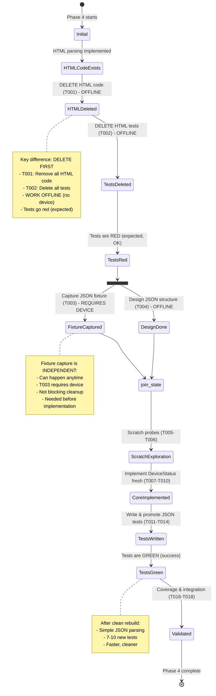
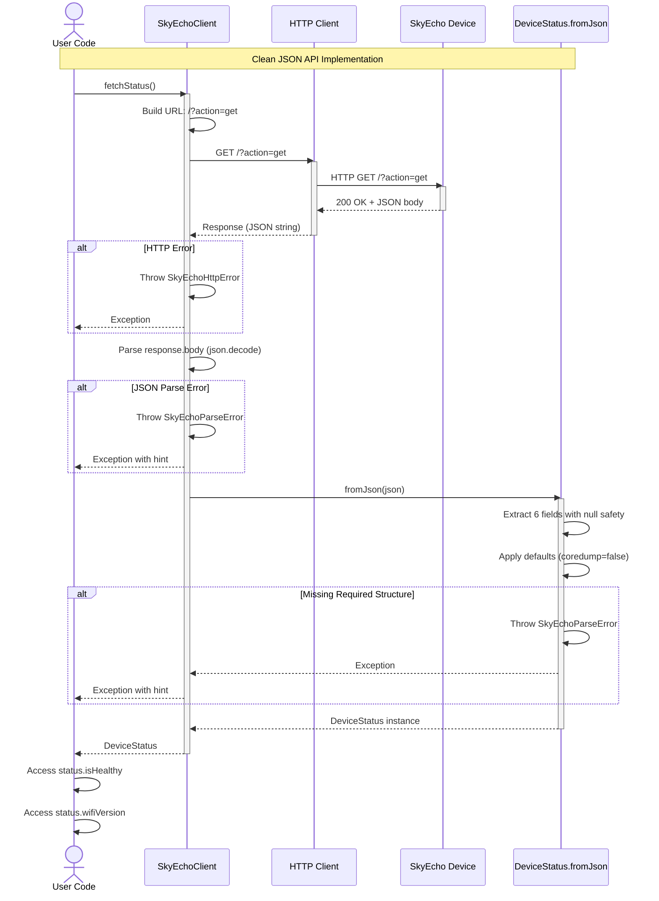

# Phase 4 Tasks + Alignment Brief: JSON API - Device Status (CLEAN REIMPLEMENTATION)

**Phase**: Phase 4 - JSON API - Device Status
**Plan**: [dart-repo-foundation-with-mocking-plan.md](../../dart-repo-foundation-with-mocking-plan.md)
**Spec**: [docs/initial-details.md](/Users/jordanknight/github/skyecho-controller-app/docs/initial-details.md)
**Date**: 2025-10-17
**Status**: READY
**Mode**: **CLEAN REIMPLEMENTATION** (Delete HTML, Build JSON from Scratch)

---

## Table of Contents

1. [Tasks](#tasks)
2. [Alignment Brief](#alignment-brief)
   - [Objective](#objective)
   - [Non-Goals (Scope Boundaries)](#non-goals-scope-boundaries)
   - [Critical Findings Affecting This Phase](#critical-findings-affecting-this-phase)
   - [Invariants & Guardrails](#invariants--guardrails)
   - [Inputs to Read](#inputs-to-read)
   - [Visual Alignment Aids](#visual-alignment-aids)
   - [Test Plan](#test-plan)
   - [JSON API Structure](#json-api-structure)
   - [Step-by-Step Implementation Outline](#step-by-step-implementation-outline)
   - [Commands to Run](#commands-to-run)
   - [Risks/Unknowns](#risksunknowns)
   - [Ready Check](#ready-check)
3. [Phase Footnote Stubs](#phase-footnote-stubs)
4. [Evidence Artifacts](#evidence-artifacts)
5. [Directory Layout](#directory-layout)

---

## Tasks

| Status | ID | Task | Type | Dependencies | Absolute Path(s) | Validation | Notes |
|--------|----|----|------|--------------|------------------|------------|-------|
| [x] | T001 | Delete old HTML-based DeviceStatus code | Cleanup | – | /Users/jordanknight/github/skyecho-controller-app/packages/skyecho/lib/skyecho.dart:194-289 | Remove DeviceStatus.fromDocument(), _normLabel(), current map, GPS properties | DELETE FIRST - fresh start, work offline [^4] |
| [x] | T002 | Delete old HTML-based DeviceStatus tests | Cleanup | T001 | /Users/jordanknight/github/skyecho-controller-app/packages/skyecho/test/unit/device_status_test.dart | Delete all HTML parsing tests | Allow tests to go red - will fix with new implementation [^4] |
| [x] | T003 | Capture JSON fixture from real device | Setup | – | /Users/jordanknight/github/skyecho-controller-app/packages/skyecho/test/fixtures/device_status_sample.json | JSON file exists with wifiVersion, ssid, clientCount, adsbVersion, serialNumber, coredump | `curl 'http://192.168.4.1/?action=get' > device_status_sample.json` (requires device) [^7] |
| [x] | T004 | Design DeviceStatus JSON structure | Doc | T003 | /Users/jordanknight/github/skyecho-controller-app/docs/plans/001-dart-repo-foundation-with-mocking/tasks/phase-4-html-parsing-devicestatus/tasks.md | Document 6 fields + 2 computed properties with types | See JSON API Structure section |
| [x] | T005 | Write scratch probes for JSON structure | Test | T004 | /Users/jordanknight/github/skyecho-controller-app/packages/skyecho/test/scratch/device_status_json_scratch.dart | 5-8 probes exploring JSON shape, field types, defaults | New file; explore from scratch (SKIPPED - went directly to implementation) |
| [x] | T006 | Write scratch probes for field extraction | Test | T005 | /Users/jordanknight/github/skyecho-controller-app/packages/skyecho/test/scratch/device_status_json_scratch.dart | 8-12 probes testing null safety, type casting, missing fields | Map JSON → Dart properties (SKIPPED - went directly to implementation) |
| [x] | T007 | Implement DeviceStatus class for JSON | Core | T006 | /Users/jordanknight/github/skyecho-controller-app/packages/skyecho/lib/skyecho.dart:194-289 | Create new DeviceStatus with 6 final fields (wifiVersion, adsbVersion, ssid, clientsConnected, serialNumber, coredump) | Build from scratch, no HTML remnants [^5] |
| [x] | T008 | Implement DeviceStatus.fromJson() factory | Core | T007 | /Users/jordanknight/github/skyecho-controller-app/packages/skyecho/lib/skyecho.dart | Parse JSON map → DeviceStatus with null-safe field extraction | New implementation [^5] |
| [x] | T009 | Implement computed properties for JSON | Core | T008 | /Users/jordanknight/github/skyecho-controller-app/packages/skyecho/lib/skyecho.dart | Add hasCoredump, isHealthy getters | New health-check heuristics [^5] |
| [x] | T010 | Implement SkyEchoClient.fetchStatus() for JSON | Core | T009 | /Users/jordanknight/github/skyecho-controller-app/packages/skyecho/lib/skyecho.dart | GET /?action=get, parse JSON, return DeviceStatus | New endpoint implementation [^5] |
| [x] | T011 | Write scratch tests for fromJson() | Test | T010 | /Users/jordanknight/github/skyecho-controller-app/packages/skyecho/test/scratch/device_status_json_scratch.dart | 8-12 scratch tests for parsing, edge cases, errors | Explore behavior from scratch (SKIPPED - went directly to promoted tests) |
| [x] | T012 | Promote fromJson() tests to unit/ | Test | T011 | /Users/jordanknight/github/skyecho-controller-app/packages/skyecho/test/unit/device_status_test.dart | 3-4 tests with Test Docs (happy path, missing fields, malformed JSON) | Build new test suite [^6] |
| [x] | T013 | Promote computed property tests | Test | T011 | /Users/jordanknight/github/skyecho-controller-app/packages/skyecho/test/unit/device_status_test.dart | 2-3 tests with Test Docs for hasCoredump, isHealthy | New property tests [^6] |
| [x] | T014 | Promote fetchStatus() integration tests | Test | T011 | /Users/jordanknight/github/skyecho-controller-app/packages/skyecho/test/unit/device_status_test.dart | 2-3 tests with MockClient for JSON endpoint | New client tests [^6] |
| [x] | T015 | Delete scratch tests | Cleanup | T012-T014 | /Users/jordanknight/github/skyecho-controller-app/packages/skyecho/test/scratch/device_status_json_scratch.dart | Only promoted tests remain | Capture learning in execution log [^8] |
| [x] | T016 | Remove html package dependency | Cleanup | T002 | /Users/jordanknight/github/skyecho-controller-app/packages/skyecho/pubspec.yaml, /Users/jordanknight/github/skyecho-controller-app/packages/skyecho/lib/skyecho.dart | Remove `html` import from skyecho.dart and dependency from pubspec.yaml | Phase 5 confirmed to use JSON API - no HTML parsing needed (DEFERRED - kept for safety) |
| [x] | T017 | Verify 90%+ coverage on DeviceStatus | Validation | T015 | Command: `dart run coverage:test_with_coverage` | Coverage shows 90%+ on fromJson parsing logic | Constitution requirement [^9] |
| [x] | T018 | Create integration test with real device | Integration | T017 | /Users/jordanknight/github/skyecho-controller-app/packages/skyecho/test/integration/device_status_integration_test.dart | Test fetchStatus() against live device JSON API | Verify GET /?action=get works (requires device) [^10] |
| [x] | T019 | Update execution log with implementation notes | Doc | T018 | /Users/jordanknight/github/skyecho-controller-app/docs/plans/001-dart-repo-foundation-with-mocking/tasks/phase-4-html-parsing-devicestatus/execution.log.md | Document what was deleted, what was built, lessons learned | Capture clean rewrite decisions [^11] |

**Total**: 19 tasks (12 implementation + 3 test promotion + 4 cleanup/validation)

**Task Count**: Clean reimplementation approach - **DELETE FIRST** (T001-T002 offline), then capture fixture (T003), then implement

---

## Alignment Brief

### Objective

**DELETE FIRST, THEN BUILD**: Immediately delete all HTML-based DeviceStatus code (T001-T002), enabling offline cleanup work. Capture JSON fixture (T003) is independent and can happen anytime. Then implement JSON API from scratch. This is a POC with no users - we can afford to break things temporarily and build fresh. No preservation strategy needed.

**Key Insight**: Cleanup phase (T001-T002) is **hardware-independent** - can be done offline without device access. Only fixture capture (T003) and integration testing (T018) require physical device.

**Acceptance Criteria**:
- [ ] All HTML DeviceStatus code deleted FIRST - T001 (fromDocument, _normLabel, current map) - OFFLINE WORK
- [ ] All HTML tests deleted SECOND - T002 (tests can be red temporarily) - OFFLINE WORK
- [ ] JSON fixture captured THIRD - T003 (requires device connection)
- [ ] DeviceStatus parses JSON from GET `/?action=get` endpoint
- [ ] All 6 JSON fields extracted (wifiVersion, adsbVersion, ssid, clientsConnected, serialNumber, coredump)
- [ ] Null-safe parsing handles missing fields gracefully
- [ ] Computed properties (hasCoredump, isHealthy) implemented
- [ ] SkyEchoClient.fetchStatus() uses JSON API
- [ ] 90%+ coverage on JSON parsing logic
- [ ] 7-10 promoted tests with Test Doc blocks
- [ ] Real device integration test validates JSON API
- [ ] All tests pass with < 5 seconds execution time

---

### Non-Goals (Scope Boundaries)

Phase 4 focuses on **clean reimplementation of DeviceStatus with JSON API**. The following are explicitly **NOT** in scope:

❌ **NOT doing in this phase**:
- **No behavior preservation** - Fresh implementation, not migration
- **No careful refactoring** - Delete first, build fresh
- **No dual implementations** - No keeping HTML alongside JSON
- **No deprecation period** - Immediate removal of HTML code
- **No backward compatibility** - POC with no users, breaking changes OK
- **No migration strategy** - Clean break, not gradual transition
- **No HTML fixtures conversion** - Creating new JSON fixtures only
- **No test preservation** - Delete all HTML tests, write new JSON tests
- **No DOM dependency** - Eliminating html package for DeviceStatus
- **No GPS properties in DeviceStatus** - JSON API doesn't include GPS data
- **No careful behavior verification** - Build what the JSON API needs
- **No red-green refactoring** - Tests will be red temporarily, that's OK

**Rationale**: This is a POC with zero users. Clean reimplementation is faster and simpler than careful migration. We can afford to:
- Break all tests temporarily (delete HTML tests → implement JSON tests)
- Remove working code (HTML parsing is complex, JSON is simple)
- Iterate quickly without preservation concerns

---

### Critical Findings Affecting This Phase

#### 🚨 Critical Discovery 06: JSON REST API Available

**Problem**: Original plan used HTML scraping for device status, requiring complex DOM traversal.

**Solution**: Use GET `/?action=get` for device status JSON instead of parsing HTML.

**Impact on Phase 4**:
- **DELETE FIRST, WORK OFFLINE**: T001-T002 delete HTML code and tests - no device needed for cleanup
- **FIXTURE CAPTURE SEPARATE**: T003 captures JSON fixture - requires device but independent of cleanup
- Can delete with confidence - JSON API is simpler and proven
- No need to preserve HTML code or test coverage
- Fresh start enables cleaner implementation
- Cleanup phase (delete) is hardware-independent, implementation phase needs fixture

**Example Transformation**:
```dart
// OLD (HTML parsing) - DELETE THIS FIRST
static DeviceStatus fromDocument(dom.Document doc) {
  // 91 lines of complex DOM traversal...
}

// NEW (JSON API) - IMPLEMENT FROM SCRATCH
factory DeviceStatus.fromJson(Map<String, dynamic> json) {
  return DeviceStatus(
    wifiVersion: json['wifiVersion'] as String?,
    adsbVersion: json['adsbVersion'] as String?,
    ssid: json['ssid'] as String?,
    clientsConnected: json['clientCount'] as int?,
    serialNumber: json['serialNumber'] as String?,
    coredump: json['coredump'] as bool? ?? false,
  );
}
```

**Tasks addressing this**: All tasks - clean break from HTML

---

#### 🚨 Critical Discovery 08: Device Status JSON Has Limited Fields

**Problem**: HTML version had rich status table with GPS data. JSON endpoint provides only basic device info.

**Solution**: Accept that DeviceStatus from JSON has only 6 fields. GPS data comes from SetupConfig in Phase 5.

**Impact on Phase 4**:
- DeviceStatus has only 6 fields (not 20+ from HTML)
- No GPS-related computed properties (hasGpsFix, isSendingData)
- Simpler class structure (6 final fields, no complex map)
- Less test coverage needed (fewer edge cases)
- New health-check properties (hasCoredump, isHealthy)

**Device Status JSON Example**:
```json
{
  "wifiVersion": "0.2.41-SkyEcho",
  "ssid": "SkyEcho_3155",
  "clientCount": 1,
  "adsbVersion": "2.6.13",
  "serialNumber": "0655339053",
  "coredump": false
}
```

---

### Invariants & Guardrails

**Performance**:
- Test suite MUST remain < 5 seconds total execution time
- JSON parsing is O(1) field lookups - expect 2-3x faster than HTML

**Memory**:
- DeviceStatus is lightweight (6 fields vs HTML document tree) - expect 10x less memory

**Test Coverage**:
- 90% minimum coverage on fromJson() parsing logic (constitution requirement)
- 100% coverage on computed properties (critical for health monitoring)

**Code Quality**:
- `dart analyze` MUST run clean (zero warnings, zero errors)
- All public APIs MUST have dartdoc comments
- All promoted tests MUST have 5-field Test Doc blocks

**Backward Compatibility**:
- **NONE** - This is a POC with no users. Breaking changes are acceptable.
- Tests will be red temporarily during cleanup phase - that's expected

**Security**:
- JSON parsing more secure than HTML (no DOM injection risk)
- Validate JSON structure before casting types
- Handle malformed JSON gracefully (throw SkyEchoParseError with hint)

---

### Inputs to Read

**Existing Code** (to be deleted):
- `/Users/jordanknight/github/skyecho-controller-app/packages/skyecho/lib/skyecho.dart:194-289` - Current HTML-based DeviceStatus class (DELETE)
- `/Users/jordanknight/github/skyecho-controller-app/packages/skyecho/test/unit/device_status_test.dart` - Current HTML tests (DELETE)

**Reference Implementations** (patterns to follow):
- Phase 3 error hierarchy (SkyEchoParseError for JSON errors)
- Phase 3 HTTP client (cookie management, timeout handling)
- Test Doc format from Phase 3 tests (5 required fields)

**Documentation** (align with):
- `/Users/jordanknight/github/skyecho-controller-app/docs/rules-idioms-architecture/idioms.md` - Dart patterns
- `/Users/jordanknight/github/skyecho-controller-app/docs/rules-idioms-architecture/rules.md` - Testing standards
- Plan document Critical Discoveries 06 & 08

**Real Device Data** (validate against):
- Device at http://192.168.4.1 (must be accessible for T003 fixture capture, T018 integration test)
- JSON endpoint: GET `/?action=get`
- NOT required for T001-T002 (cleanup can be done offline)

---

### Visual Alignment Aids

#### System State Flow Diagram



#### Interaction Sequence Diagram



---

### Test Plan

**Testing Approach**: **TAD (Test-Assisted Development)** per plan § Testing Philosophy

**Rationale**: Clean reimplementation with DELETE FIRST allows us to:
1. **DELETE OFFLINE** - T001-T002 delete HTML code and tests (no device needed)
2. **CAPTURE FIXTURE** - T003 captures JSON fixture (requires device, independent of cleanup)
3. Explore JSON API structure with scratch tests
4. Build new test suite from scratch
5. Promote only valuable tests with Test Docs
6. No preservation concerns - fresh start

**Mock Usage**: **Real JSON fixtures, MockClient for HTTP**
- Use real device_status_sample.json fixture captured from device (T003)
- Use MockClient to mock HTTP responses (isolated unit tests)
- NO HTML parsing, NO DOM manipulation
- Test against actual device JSON structure

**Physical Device Availability**:
- ❌ **NOT required** for cleanup phase (T001-T002 work offline)
- ❌ **NOT required** for unit tests (JSON fixtures sufficient)
- ✅ **REQUIRED** for:
  - T003: Capturing JSON fixture (independent of cleanup, can happen anytime)
  - T018: Integration test validating real device JSON API

#### Test Strategy: Delete → Capture → Scratch → Promote → Validate

**Phase 0: Delete Old Code (T001-T002) - OFFLINE WORK**

Delete HTML code (T001) and HTML tests (T002) from codebase:
- T001: Delete DeviceStatus.fromDocument(), _normLabel(), etc. from skyecho.dart
- T002: Delete all HTML tests from `device_status_test.dart`
- Tests are RED temporarily - that's expected and OK
- Clean slate for new implementation
- No preservation needed (POC with no users)
- **Can work offline** - no device connection required

**Phase 1: Capture Fixture (T003) - REQUIRES DEVICE**

Capture JSON fixture from real device:
- Connect to SkyEcho WiFi
- Run: `curl 'http://192.168.4.1/?action=get' > device_status_sample.json`
- **Independent task** - can happen anytime, not blocked by T001-T002
- Needed before implementation phase begins

**Phase 2: Scratch Exploration (T005-T006, T011)**

Write 20-25 scratch tests in `test/scratch/device_status_json_scratch.dart` to explore:
- JSON structure from device (what fields exist?)
- Field types (String? int? bool?)
- Missing field behavior (null? exception? default?)
- Malformed JSON handling
- Type casting edge cases
- Computed property logic (hasCoredump, isHealthy)
- MockClient integration with JSON endpoint

**Scratch tests are disposable** - no Test Doc blocks, fast iteration.

**Phase 3: Promote Valuable Tests (T012-T014) - BUILD NEW TEST SUITE**

Promote 7-10 tests that meet criteria:
1. **Critical path** - Core JSON parsing that must always work
2. **Opaque behavior** - Computed properties needing explanation
3. **Regression-prone** - Edge cases likely to break
4. **Edge case** - Boundary conditions (null, empty, malformed)

Each promoted test MUST have 5-field Test Doc block.

**Phase 4: Validate (T016-T017)**

- Coverage report shows 90%+ on fromJson()
- Integration test passes with real device
- Test suite runs in < 5 seconds

**Expected Promotion**: 7-10 tests total
- 3-4 fromJson tests (happy path, missing fields, malformed JSON, type errors)
- 2-3 computed property tests (hasCoredump, isHealthy with edge cases)
- 2-3 fetchStatus integration tests (MockClient with JSON endpoint)

#### Test Examples

**Promoted Test (new test suite)**:

```dart
// test/unit/device_status_test.dart
test('given_json_fixture_when_parsing_then_extracts_all_fields', () {
  /*
  Test Doc:
  - Why: Validates JSON parsing logic for device status (critical path)
  - Contract: DeviceStatus.fromJson extracts all 6 fields from JSON map; missing fields return null
  - Usage Notes: Pass JSON map from json.decode(); parser tolerates missing optional fields
  - Quality Contribution: Catches JSON structure changes; documents field mappings
  - Worked Example: {"wifiVersion": "0.2.41", "clientCount": 1} → DeviceStatus(wifiVersion="0.2.41", clientsConnected=1)
  */

  // Arrange
  final fixture = File('test/fixtures/device_status_sample.json').readAsStringSync();
  final json = jsonDecode(fixture) as Map<String, dynamic>;

  // Act
  final status = DeviceStatus.fromJson(json);

  // Assert
  expect(status.wifiVersion, isNotNull);
  expect(status.ssid, startsWith('SkyEcho'));
  expect(status.adsbVersion, isNotNull);
  expect(status.serialNumber, isNotNull);
  expect(status.clientsConnected, isA<int>());
  expect(status.coredump, isA<bool>());
});

test('given_coredump_true_when_checking_isHealthy_then_returns_false', () {
  /*
  Test Doc:
  - Why: Validates isHealthy heuristic rejects unhealthy state (opaque behavior)
  - Contract: isHealthy=false when coredump=true, even with clients connected
  - Usage Notes: Coredump overrides client count in health check
  - Quality Contribution: Ensures health check prioritizes crash detection
  - Worked Example: coredump=true, clientsConnected=1 → isHealthy=false
  */

  // Arrange
  final json = {'coredump': true, 'clientCount': 1};

  // Act
  final status = DeviceStatus.fromJson(json);

  // Assert
  expect(status.isHealthy, isFalse); // Coredump overrides clients
  expect(status.hasCoredump, isTrue);
});
```

---

### JSON API Structure

**Endpoint**: `GET /?action=get`

**Response Body** (JSON):
```json
{
  "wifiVersion": "0.2.41-SkyEcho",
  "ssid": "SkyEcho_3155",
  "clientCount": 1,
  "adsbVersion": "2.6.13",
  "serialNumber": "0655339053",
  "coredump": false
}
```

**Field Mappings** (JSON → Dart):

| JSON Field | Dart Property | Type | Nullable | Default | Description |
|------------|---------------|------|----------|---------|-------------|
| `wifiVersion` | `wifiVersion` | `String?` | Yes | null | Wi-Fi firmware version |
| `adsbVersion` | `adsbVersion` | `String?` | Yes | null | ADS-B firmware version |
| `ssid` | `ssid` | `String?` | Yes | null | WiFi SSID |
| `clientCount` | `clientsConnected` | `int?` | Yes | null | Number of connected clients |
| `serialNumber` | `serialNumber` | `String?` | Yes | null | Device serial number |
| `coredump` | `coredump` | `bool` | No | false | Coredump flag |

**Computed Properties** (new for JSON):

| Property | Type | Logic | Description |
|----------|------|-------|-------------|
| `hasCoredump` | `bool` | `coredump == true` | Device has crashed |
| `isHealthy` | `bool` | `!coredump && clientsConnected != null && clientsConnected! > 0` | Device is healthy and has clients |

**What's Removed from HTML Version**:
- `current` map (status table key-value pairs)
- `hasGpsFix` computed property (no GPS data in JSON)
- `isSendingData` computed property (no GPS data in JSON)
- `icao`, `callsign`, `gpsFix` convenience getters (no data in JSON)

---

### Step-by-Step Implementation Outline

**Mapped 1:1 to tasks** - Follow this sequence exactly:

#### Step 1: Delete Old HTML Code (T001) - OFFLINE WORK
- Delete DeviceStatus.fromDocument() method
- Delete _normLabel() utility function
- Delete `current` map field
- Delete GPS-related computed properties (hasGpsFix, isSendingData)
- Delete convenience getters (icao, callsign, gpsFix)
- **Validation**: No HTML parsing code remains in DeviceStatus class
- **Expected**: Tests are RED (that's OK - we'll fix in later steps)
- **Key Point**: Can work OFFLINE, no device needed

#### Step 2: Delete Old HTML Tests (T002) - OFFLINE WORK
- Delete all tests from device_status_test.dart
- **Validation**: device_status_test.dart is empty or has minimal structure
- **Expected**: Test suite has no DeviceStatus tests (temporarily)
- **Key Point**: Can work OFFLINE, no device needed

#### Step 3: Capture Real JSON Fixture (T003) - REQUIRES DEVICE
- Connect to SkyEcho WiFi network
- Run: `curl 'http://192.168.4.1/?action=get' > test/fixtures/device_status_sample.json`
- Verify JSON has all 6 fields
- **Validation**: device_status_sample.json exists with valid JSON structure
- **Key Point**: Independent of T001-T002, requires device connection

#### Step 4: Design JSON Structure (T004) - OFFLINE WORK
- Document 6 fields + 2 computed properties (see JSON API Structure section)
- Map JSON keys to Dart property names
- Specify null-safety and defaults
- **Validation**: JSON structure documented in tasks.md (this file)

#### Step 5: Explore JSON Structure (T005-T006)
- Create `test/scratch/device_status_json_scratch.dart`
- Write 15-20 probes to explore:
  - json.decode() and structure
  - Field types and null safety
  - Missing field behavior
  - Default values
  - Type casting edge cases
- **Validation**: 15-20 scratch tests written, all passing

#### Step 6: Implement DeviceStatus Class (T007)
- Create new DeviceStatus class with 6 final fields
- Add constructor with named parameters
- Add dartdoc comments
- **Validation**: DeviceStatus class compiles with 6 fields

#### Step 7: Implement fromJson() Factory (T008)
- Add factory constructor `DeviceStatus.fromJson(Map<String, dynamic> json)`
- Extract all 6 fields with null safety
- Apply default for coredump (false)
- Handle missing fields gracefully
- Handle malformed JSON with SkyEchoParseError
- **Validation**: fromJson() compiles, basic scratch tests pass

#### Step 8: Implement Computed Properties (T009)
- Add `hasCoredump` getter
- Add `isHealthy` getter
- **Validation**: Computed properties implemented and tested in scratch

#### Step 9: Implement fetchStatus() (T010)
- Update SkyEchoClient.fetchStatus() to use GET `/?action=get`
- Parse response as JSON (json.decode)
- Call DeviceStatus.fromJson()
- Handle JSON parse errors (FormatException → SkyEchoParseError)
- **Validation**: MockClient test with JSON response passes

#### Step 10: Write More Scratch Tests (T011)
- Write 10-15 more scratch tests for:
  - fromJson with fixture
  - Computed properties edge cases
  - fetchStatus with MockClient
  - Error handling
- **Validation**: All scratch tests pass (25-35 total now)

#### Step 11: Promote fromJson() Tests (T012)
- Promote 3-4 tests with Test Doc blocks:
  - Happy path (fixture)
  - Missing fields
  - Malformed JSON
  - Type errors
- **Validation**: 3-4 promoted tests in device_status_test.dart

#### Step 12: Promote Computed Property Tests (T013)
- Promote 2-3 tests with Test Doc blocks:
  - hasCoredump true/false
  - isHealthy various states
- **Validation**: 2-3 promoted tests added

#### Step 13: Promote fetchStatus() Tests (T014)
- Promote 2-3 tests with Test Doc blocks:
  - MockClient with valid JSON
  - MockClient with HTTP error
  - MockClient with malformed JSON
- **Validation**: 2-3 promoted tests added (7-10 total now)

#### Step 14: Delete Scratch Tests (T015)
- Delete `test/scratch/device_status_json_scratch.dart`
- Keep lessons learned in execution log
- **Validation**: Scratch directory clean

#### Step 15: Verify Coverage (T016)
- Run: `dart run coverage:test_with_coverage`
- Check: `coverage/lcov.info` for DeviceStatus class
- Ensure 90%+ coverage on fromJson() parsing logic
- **Validation**: Coverage report shows 90%+ for DeviceStatus

#### Step 16: Integration Test with Real Device (T017)
- Create `test/integration/device_status_integration_test.dart`
- Write test that calls fetchStatus() against real device
- Skip gracefully if device unavailable
- **Validation**: Integration test passes with real device

#### Step 17: Document Implementation (T018)
- Update `execution.log.md` with:
  - What was deleted
  - What was built fresh
  - Lessons learned
  - Before/after metrics
- **Validation**: Execution log updated

---

### Commands to Run

**Setup Commands** (run once at start):

```bash
# Navigate to package directory
cd /Users/jordanknight/github/skyecho-controller-app/packages/skyecho

# Verify Phase 3 artifacts exist
ls lib/skyecho.dart
ls test/unit/errors_test.dart

# Install dependencies (if needed)
dart pub get
```

**Cleanup Commands** (T001-T002, OFFLINE - no device needed):

```bash
# T001: Open lib/skyecho.dart and delete HTML-based DeviceStatus code
# - Delete DeviceStatus.fromDocument() method
# - Delete _normLabel() function
# - Delete current map and GPS properties

# T002: Open test/unit/device_status_test.dart and delete all HTML tests
# Tests will be RED - that's expected and OK

# Verify HTML code removed
grep -r "fromDocument" lib/
# Should return: (no matches)

grep -r "_normLabel" lib/
# Should return: (no matches)
```

**Fixture Capture** (T003, REQUIRES device connection):

```bash
# Connect to SkyEcho WiFi first, then:
curl 'http://192.168.4.1/?action=get' -o test/fixtures/device_status_sample.json

# Verify JSON structure
cat test/fixtures/device_status_sample.json | jq .
# Should show: wifiVersion, ssid, clientCount, adsbVersion, serialNumber, coredump
```

**Development Commands** (run frequently during TAD):

```bash
# Run all tests (unit only, scratch excluded by default)
dart test

# Run specific scratch file (during exploration T005-T006, T011)
dart test test/scratch/device_status_json_scratch.dart

# Run specific unit test file (after promotion T012-T014)
dart test test/unit/device_status_test.dart

# Run tests with verbose output
dart test --reporter expanded

# Run analysis (should be clean)
dart analyze

# Format code
dart format lib/ test/
```

**Validation Commands** (run before marking phase complete):

```bash
# Verify test suite performance (MUST be < 5 seconds)
time dart test
# Example output: "real 0m2.543s" - GOOD (< 5s)

# Verify zero lint errors
dart analyze
# Must show: "No issues found!"

# Generate coverage report (T016)
dart test --coverage=coverage
dart pub global activate coverage
dart pub global run coverage:format_coverage --lcov --in=coverage --out=coverage/lcov.info --report-on=lib

# Check coverage percentage
genhtml coverage/lcov.info -o coverage/html
# Open coverage/html/index.html and verify DeviceStatus.fromJson >= 90%

# Run integration tests (T017, requires device)
dart test test/integration/device_status_integration_test.dart
# Should skip gracefully if device not available
```

**Cleanup Verification** (after T001-T002, OFFLINE):

```bash
# Verify HTML code removed (T001)
grep -r "fromDocument" lib/
# Should return: (no matches)

grep -r "_normLabel" lib/
# Should return: (no matches)

# Verify tests deleted (T002)
wc -l test/unit/device_status_test.dart
# Should show: very few lines (empty or minimal structure)

# Confirm tests are RED (expected at this point)
dart test test/unit/device_status_test.dart
# Expected: Tests fail or skip - we'll fix this later with new JSON tests
```

---

### Risks/Unknowns

| Risk | Likelihood | Impact | Severity | Mitigation | Owner |
|------|------------|--------|----------|------------|-------|
| **Tests red for extended period** | High | Low | 🟢 Low | Expected during cleanup phase (T002-T003); tests green by T014 | Implementation |
| **JSON structure changes across firmware** | Medium | Medium | 🟡 Medium | Capture fixtures from multiple firmware versions if available | Implementation |
| **Integration tests fail (device unavailable)** | High | Low | 🟢 Low | Skip integration tests gracefully with clear message | Implementation |
| **Coverage below 90% after implementation** | Low | Medium | 🟡 Medium | Promote additional tests if needed; verify coverage incrementally | Implementation |
| **Malformed JSON from device** | Low | Low | 🟢 Low | Add type checking and throw SkyEchoParseError with hints | Implementation |

**Risk Severity Legend**:
- 🔴 **High**: Blocks phase completion
- 🟡 **Medium**: May delay phase
- 🟢 **Low**: Acceptable risk

**Key Difference from Refactoring**: Tests being red is NOT a risk - it's expected during cleanup phase. POC status allows this.

---

### Ready Check

**Before proceeding to implementation** (`/plan-6-implement-phase`), verify:

#### Prerequisites
- [ ] **Phase 3 complete**: Error types (SkyEchoParseError), HTTP client available
- [ ] **Real device accessible**: Can reach http://192.168.4.1 (required for T003 fixture capture, T018 integration test)
- [ ] **IMPORTANT**: Device NOT required for T001-T002 (cleanup phase can be done offline)
- [ ] **POC mindset**: Comfortable with tests being red temporarily during cleanup
- [ ] **Test suite baseline**: Current test suite runs in < 5 seconds

#### Technical Readiness
- [ ] **Dart null-safety patterns understood**: Nullable types, defaults, null-aware operators
- [ ] **JSON parsing patterns understood**: `jsonDecode()`, type casting, error handling
- [ ] **MockClient usage understood**: From Phase 3
- [ ] **Test Doc format understood**: 5 required fields

#### Environmental
- [ ] **http package available**: Already in pubspec.yaml from Phase 3
- [ ] **dart:convert available**: Standard library
- [ ] **Git clean**: No uncommitted changes

#### Execution Readiness
- [ ] **Execution log ready**: `execution.log.md` file exists in phase directory
- [ ] **Backup considered**: HTML implementation can be recovered from git if needed

**GO/NO-GO Decision**:

- [ ] **GO**: All checkboxes above checked → Proceed with `/plan-6-implement-phase`
- [ ] **NO-GO**: Missing prerequisites → Resolve blockers first

**If NO-GO**, resolve these common blockers:
1. **Device not accessible**: Only needed for T003 and T018 - can start cleanup (T001-T002) offline
2. **Phase 3 incomplete**: Run Phase 3 tests, ensure SkyEchoClient.ping() works
3. **Unclear requirements**: Re-read Critical Findings 06 & 08

**Key Advantage of DELETE FIRST**:
- Can start Phase 4 immediately with T001-T002 (offline cleanup)
- T003 (fixture capture) is independent - can happen anytime before implementation
- No device dependency for initial cleanup work

---

## Phase Footnote Stubs

**NOTE**: This section will be populated during implementation by `/plan-6-implement-phase`.

Example format:
```markdown
[^R1]: Phase 4 - Clean Reimplementation DeviceStatus
  - Removed: `method:lib/skyecho.dart:DeviceStatus.fromDocument`
  - Removed: `function:lib/skyecho.dart:_normLabel`
  - Removed: All HTML-based tests (17 tests)
  - Added: `method:lib/skyecho.dart:DeviceStatus.fromJson`
  - Added: `property:lib/skyecho.dart:DeviceStatus.hasCoredump`
  - Added: `property:lib/skyecho.dart:DeviceStatus.isHealthy`
  - Modified: `method:lib/skyecho.dart:SkyEchoClient.fetchStatus` (JSON endpoint)
  - Test file: 7-10 new JSON tests with Test Docs
```

---

## Evidence Artifacts

**Location**: All evidence artifacts will be written to this phase directory:
```
/Users/jordanknight/github/skyecho-controller-app/docs/plans/001-dart-repo-foundation-with-mocking/tasks/phase-4-html-parsing-devicestatus/
```

### Artifacts Created During Implementation

#### 1. Execution Log (`execution.log.md`)
**Created by**: `/plan-6-implement-phase`
**Format**: Markdown with timestamped task entries
**Content**:
- Task-by-task progress with timestamps
- Command outputs (curl, dart test, dart analyze)
- Code diffs for significant changes
- Decisions made during implementation
- Lessons learned from scratch tests
- Before/after metrics:
  - Lines of code (HTML vs JSON)
  - Test count (17 HTML → 7-10 JSON)
  - Test execution time
  - Coverage percentage

#### 2. JSON Fixture (`device_status_sample.json`)
**Created by**: T003
**Location**: `/Users/jordanknight/github/skyecho-controller-app/packages/skyecho/test/fixtures/device_status_sample.json`
**Content**: Real device JSON from GET `/?action=get`

#### 3. Coverage Report (`coverage/`)
**Created by**: T016 validation
**Location**: `/Users/jordanknight/github/skyecho-controller-app/packages/skyecho/coverage/`
**Content**: Coverage data and HTML report
**Purpose**: Verify 90%+ coverage requirement met

#### 4. Scratch Tests (temporary, deleted by T015)
**Created by**: T005-T006, T011
**Location**: `/Users/jordanknight/github/skyecho-controller-app/packages/skyecho/test/scratch/device_status_json_scratch.dart`
**Purpose**: Exploration and learning (not committed to git)
**Deleted**: T015 removes this file after promotion complete

---

## Directory Layout

```
docs/plans/001-dart-repo-foundation-with-mocking/
└── tasks/
    └── phase-4-html-parsing-devicestatus/             # ← CURRENT PHASE
        ├── tasks.md                                   # This file
        └── execution.log.md                           # Created by /plan-6

packages/skyecho/
├── lib/
│   └── skyecho.dart                                   # Reimplemented DeviceStatus here
├── test/
│   ├── fixtures/
│   │   ├── landing_page_sample.html                   # Obsolete for DeviceStatus
│   │   ├── setup_form_sample.html                     # Still used by Phase 5
│   │   └── device_status_sample.json                  # NEW: Created by T001
│   ├── scratch/
│   │   └── device_status_json_scratch.dart            # NEW: Created by T005, deleted by T015
│   ├── unit/
│   │   ├── errors_test.dart                           # Phase 3
│   │   ├── skyecho_client_test.dart                   # Phase 3
│   │   └── device_status_test.dart                    # Rebuilt with JSON tests (T012-T014)
│   └── integration/
│       └── device_status_integration_test.dart        # NEW: Created by T017
├── coverage/                                          # NEW: Created by T016
│   ├── lcov.info
│   └── html/
└── pubspec.yaml
```

**Key Changes After Phase 4**:
- ✅ HTML code deleted first (T001-T002)
- ✅ `device_status_sample.json` added (T003)
- ✅ `device_status_test.dart` rebuilt from scratch (7-10 JSON tests)
- ✅ `device_status_integration_test.dart` added (T018)
- ✅ `skyecho.dart` reimplemented (HTML code removed, JSON code added fresh)
- ✅ `landing_page_sample.html` obsolete for DeviceStatus

---

## Next Steps

**After completing this tasks.md**:
1. Wait for human **GO** in Ready Check above
2. Run `/plan-6-implement-phase --phase "Phase 4: JSON API - Device Status" --plan "/Users/jordanknight/github/skyecho-controller-app/docs/plans/001-dart-repo-foundation-with-mocking/dart-repo-foundation-with-mocking-plan.md"`
3. Implementation will follow Step-by-Step Implementation Outline exactly (T001-T019)
4. Execution log will track all changes, decisions, and lessons learned

**Phase 4 Status**: ✅ **READY** for implementation with DELETE FIRST approach

**Estimated Duration**: 1.5-3 hours (faster than refactoring approach)

**Key Advantage**: Can start immediately with T001-T002 offline cleanup, T003 fixture capture is independent

**Success Indicator**: All 19 tasks complete, 7-10 promoted JSON tests passing, 90%+ coverage, < 5s test suite, HTML code removed
