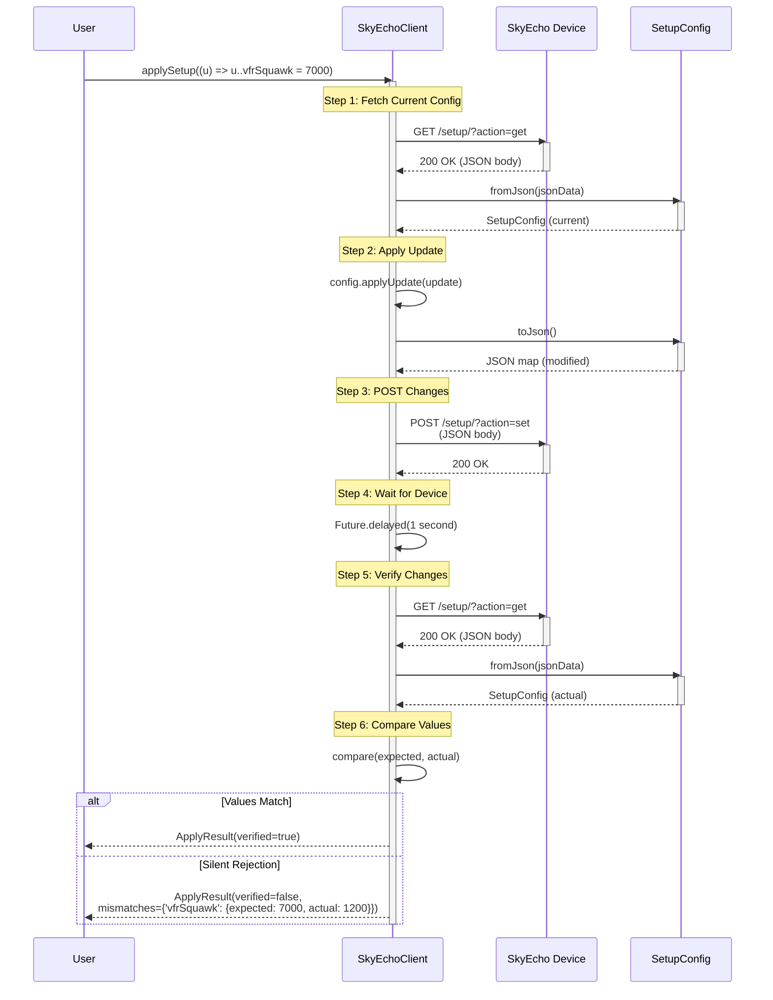

# Phase 5: JSON API - Setup Configuration - Tasks & Alignment Brief

**Phase**: 5 of 10
**Title**: JSON API - Setup Configuration (TAD)
**Slug**: phase-5-json-api-setup-configuration
**Created**: 2025-10-18
**Spec**: [dart-repo-foundation-with-mocking-spec.md](../../dart-repo-foundation-with-mocking-spec.md)
**Plan**: [dart-repo-foundation-with-mocking-plan.md](../../dart-repo-foundation-with-mocking-plan.md)
**Status**: READY

---

## Tasks

This phase implements JSON API setup configuration with transformation helpers (hex, bitmask, bit-packing, unit conversion), SetupUpdate builder, and POST verification. All tasks follow TAD (Test-Assisted Development) with scratch → promote workflow.

| Status | ID | Task | Type | Dependencies | Absolute Path(s) | Validation | Notes |
|--------|----|----|------|--------------|------------------|------------|-------|
| [ ] | T001 | Capture JSON fixture from real device | Setup | – | /Users/jordanknight/github/skyecho-controller-app/packages/skyecho/test/fixtures/setup_config_sample.json | File exists with valid JSON structure (setup{} and ownshipFilter{}) | Requires SkyEcho device: `curl 'http://192.168.4.1/setup/?action=get' > test/fixtures/setup_config_sample.json` |
| [ ] | T002 | Analyze JSON structure and document field mappings | Setup | T001 | /Users/jordanknight/github/skyecho-controller-app/docs/plans/001-dart-repo-foundation-with-mocking/tasks/phase-5-json-api-setup-configuration/execution.log.md | Execution log contains field mapping table (JSON field → type → transformation needed) | Document: icaoAddress (int→hex), adsbInCapability (bitmask), control (bitmask), stallSpeed (unit conversion) |
| [ ] | T003 | Create scratch test file for SetupConfig explorations | Setup | – | /Users/jordanknight/github/skyecho-controller-app/packages/skyecho/test/scratch/setup_config_scratch.dart | File exists, imports test framework and skyecho library | [P] can run parallel with T001-T002 |
| [ ] | T004 | Write scratch probes for hex conversion (icaoAddress) | Test | T002, T003 | /Users/jordanknight/github/skyecho-controller-app/packages/skyecho/test/scratch/setup_config_scratch.dart | 5-8 probes test: "7CC599"→8177049, "FFFFFF"→16777215, "000000"→0, padding, 0x prefix, case-insensitive | Per Discovery 02: All probes should use MockClient patterns |
| [ ] | T005 | Write scratch probes for bitmask operations (_getBit, _setBit) | Test | T003 | /Users/jordanknight/github/skyecho-controller-app/packages/skyecho/test/scratch/setup_config_scratch.dart | 5-8 probes test bit extraction (positions 0-7) and setting (preserves other bits) | [P] can run parallel with T004 |
| [ ] | T006 | Write scratch probes for bit-packing (adsbInCapability) | Test | T002, T003 | /Users/jordanknight/github/skyecho-controller-app/packages/skyecho/test/scratch/setup_config_scratch.dart | 8-10 probes test: UAT flag (bit 0), 1090ES flag (bit 1), TCAS flag (bit 2), all combinations | Device uses 8-bit field: UAT=0x01, 1090ES=0x02, TCAS=0x04 |
| [ ] | T007 | Write scratch probes for bit-packing (control field) | Test | T002, T003 | /Users/jordanknight/github/skyecho-controller-app/packages/skyecho/test/scratch/setup_config_scratch.dart | 8-10 probes test: transmit enable (bit 0), receiverMode (bits 1-2), all combinations | [P] can run parallel with T006 |
| [ ] | T008 | Write scratch probes for stallSpeed unit conversion | Test | T002, T003 | /Users/jordanknight/github/skyecho-controller-app/packages/skyecho/test/scratch/setup_config_scratch.dart | 5-8 probes test: knots→device units→knots (roundtrip), edge cases (0, max value) | Formula from device protocol documentation |
| [ ] | T009 | Write scratch probes for SetupConfig.fromJson | Test | T002, T003 | /Users/jordanknight/github/skyecho-controller-app/packages/skyecho/test/scratch/setup_config_scratch.dart | 8-10 probes test: happy path (all fields), missing fields, hex conversion, bitmask unpacking | [P] can run parallel with T004-T008 |
| [ ] | T010 | Write scratch probes for SetupConfig.toJson | Test | T002, T003 | /Users/jordanknight/github/skyecho-controller-app/packages/skyecho/test/scratch/setup_config_scratch.dart | 8-10 probes test: roundtrip (fromJson→toJson→fromJson), hex encoding, bitmask packing | [P] can run parallel with T009 |
| [ ] | T011 | Write scratch probes for SetupUpdate builder pattern | Test | T003 | /Users/jordanknight/github/skyecho-controller-app/packages/skyecho/test/scratch/setup_config_scratch.dart | 5-8 probes test cascade operator syntax: `u..icaoHex='7CC599'..callsign='TEST'` | [P] can run parallel with T009-T010 |
| [ ] | T012 | Write scratch probes for SetupConfig.applyUpdate | Test | T003 | /Users/jordanknight/github/skyecho-controller-app/packages/skyecho/test/scratch/setup_config_scratch.dart | 8-10 probes test: immutability (original unchanged), field updates (all types), multiple updates | Test all SetupUpdate fields work correctly |
| [ ] | T013 | Write scratch probes for client integration (GET/POST) | Test | T002, T003 | /Users/jordanknight/github/skyecho-controller-app/packages/skyecho/test/scratch/setup_config_scratch.dart | 10-15 probes with MockClient: fetchSetupConfig, applySetup, POST verification, silent rejection detection | Per Discovery 02: Mock both GET /setup/?action=get and POST /setup/?action=set |
| [ ] | T014 | Implement _hexToInt helper function | Core | T004 | /Users/jordanknight/github/skyecho-controller-app/packages/skyecho/lib/skyecho.dart | Converts "7CC599" → 8177049; handles 0x prefix, padding, case-insensitive | Serial (shared file with T015-T020) |
| [ ] | T015 | Implement _intToHex helper function | Core | T004, T014 | /Users/jordanknight/github/skyecho-controller-app/packages/skyecho/lib/skyecho.dart | Converts 8177049 → "7CC599"; pads to 6 characters, uppercase | Serial (shared file) |
| [ ] | T016 | Implement _getBit helper function | Core | T005 | /Users/jordanknight/github/skyecho-controller-app/packages/skyecho/lib/skyecho.dart | Extracts single bit from int at position 0-7: `_getBit(0x05, 0) → true` | Serial (shared file) |
| [ ] | T017 | Implement _setBit helper function | Core | T005, T016 | /Users/jordanknight/github/skyecho-controller-app/packages/skyecho/lib/skyecho.dart | Sets single bit in int, preserves other bits: `_setBit(0x00, 0, true) → 0x01` | Serial (shared file) |
| [ ] | T018 | Implement _packAdsbInCapability helper function | Core | T006, T016-T017 | /Users/jordanknight/github/skyecho-controller-app/packages/skyecho/lib/skyecho.dart | Packs 8 bool flags into int: `{uat: true, es1090: true, tcas: false, ...} → 0x03` | Serial (shared file) |
| [ ] | T019 | Implement _unpackAdsbInCapability helper function | Core | T006, T016-T017 | /Users/jordanknight/github/skyecho-controller-app/packages/skyecho/lib/skyecho.dart | Unpacks int into 8 bool flags: `0x03 → {uat: true, es1090: true, tcas: false, ...}` | Serial (shared file) |
| [ ] | T020 | Implement stallSpeed conversion helpers | Core | T008 | /Users/jordanknight/github/skyecho-controller-app/packages/skyecho/lib/skyecho.dart | `_knotsToDeviceUnits(knots) → int` and `_deviceUnitsToKnots(units) → double` | Serial (shared file) |
| [ ] | T021 | Implement SetupConfig class structure | Core | T009, T014-T020 | /Users/jordanknight/github/skyecho-controller-app/packages/skyecho/lib/skyecho.dart | Constructor with all 11 setup fields + 2 ownshipFilter fields matching JSON structure | Serial (shared file) |
| [ ] | T022 | Implement SetupConfig.fromJson factory constructor | Core | T009, T021 | /Users/jordanknight/github/skyecho-controller-app/packages/skyecho/lib/skyecho.dart | Parse JSON map → SetupConfig with all transformations (hex, bitmask, units); throws SkyEchoParseError on failure | Serial (shared file) |
| [ ] | T023 | Implement SetupConfig.toJson method | Core | T010, T021-T022 | /Users/jordanknight/github/skyecho-controller-app/packages/skyecho/lib/skyecho.dart | SetupConfig → JSON map with all transformations (reverse of fromJson) | Serial (shared file) |
| [ ] | T024 | Implement SetupUpdate builder class | Core | T011 | /Users/jordanknight/github/skyecho-controller-app/packages/skyecho/lib/skyecho.dart | All typed fields: icaoHex (String), callsign (String), emitterCategory (int), enable1090ESTransmit (bool), receiverMode (ReceiverMode enum), vfrSquawk (int), stallSpeed (double in knots), etc. | Serial (shared file) |
| [ ] | T025 | Implement SetupConfig.applyUpdate method | Core | T012, T021-T024 | /Users/jordanknight/github/skyecho-controller-app/packages/skyecho/lib/skyecho.dart | Apply SetupUpdate changes to SetupConfig, returns new immutable SetupConfig instance | Serial (shared file) |
| [ ] | T026 | Implement SkyEchoClient.fetchSetupConfig method | Core | T013, T021-T023 | /Users/jordanknight/github/skyecho-controller-app/packages/skyecho/lib/skyecho.dart | GET /setup/?action=get, parse JSON, return SetupConfig; throws SkyEchoNetworkError, SkyEchoHttpError, or SkyEchoParseError | Serial (shared file); follows same pattern as fetchStatus |
| [ ] | T027 | Implement SkyEchoClient._postJson helper method | Core | T013 | /Users/jordanknight/github/skyecho-controller-app/packages/skyecho/lib/skyecho.dart | POST JSON body to URL with Content-Type: application/json; handles cookies, timeout | Serial (shared file) |
| [ ] | T028 | Implement SkyEchoClient.applySetup with verification | Core | T013, T021-T027 | /Users/jordanknight/github/skyecho-controller-app/packages/skyecho/lib/skyecho.dart | POST /setup/?action=set → wait 1s → GET /setup/?action=get → compare; returns ApplyResult with verification status | Serial (shared file); critical for detecting silent device rejections |
| [ ] | T029 | Implement ApplyResult class | Core | T028 | /Users/jordanknight/github/skyecho-controller-app/packages/skyecho/lib/skyecho.dart | Simple data class with: verified (bool), mismatches (Map<String, dynamic>), appliedConfig (SetupConfig) | Serial (shared file) |
| [ ] | T030 | Promote hex conversion tests to unit/setup_config_test.dart | Test | T014-T015, T022-T023 | /Users/jordanknight/github/skyecho-controller-app/packages/skyecho/test/unit/setup_config_test.dart | 2-3 tests with Test Doc blocks: edge cases (FFFFFF, 000000), padding, 0x prefix handling | [P] can create new test file |
| [ ] | T031 | Promote bitmask operation tests | Test | T016-T017 | /Users/jordanknight/github/skyecho-controller-app/packages/skyecho/test/unit/setup_config_test.dart | 2-3 tests with Test Doc blocks: all bit positions (0-7), preserves other bits | [P] if different test groups |
| [ ] | T032 | Promote bit-packing (adsbInCapability) tests | Test | T018-T019, T022-T023 | /Users/jordanknight/github/skyecho-controller-app/packages/skyecho/test/unit/setup_config_test.dart | 2-3 tests with Test Doc blocks: all flag combinations (UAT, 1090ES, TCAS), roundtrip | [P] if different test groups |
| [ ] | T033 | Promote bit-packing (control) tests | Test | T022-T023 | /Users/jordanknight/github/skyecho-controller-app/packages/skyecho/test/unit/setup_config_test.dart | 2-3 tests with Test Doc blocks: transmit enable, receiverMode values, roundtrip | [P] if different test groups |
| [ ] | T034 | Promote stallSpeed conversion tests | Test | T020, T022-T023 | /Users/jordanknight/github/skyecho-controller-app/packages/skyecho/test/unit/setup_config_test.dart | 2-3 tests with Test Doc blocks: roundtrip (knots→device→knots), rounding, edge values (0, max) | [P] if different test groups |
| [ ] | T035 | Promote SetupConfig parsing tests (fromJson/toJson) | Test | T022-T023 | /Users/jordanknight/github/skyecho-controller-app/packages/skyecho/test/unit/setup_config_test.dart | 3-4 tests with Test Doc blocks: happy path (all fields), missing fields, malformed JSON, roundtrip verification | Serial (same file as T030-T034) |
| [ ] | T036 | Promote SetupUpdate builder tests | Test | T024-T025 | /Users/jordanknight/github/skyecho-controller-app/packages/skyecho/test/unit/setup_config_test.dart | 3-4 tests with Test Doc blocks: cascade syntax, multiple field updates, immutability validation | Serial (same file) |
| [ ] | T037 | Promote verification tests (POST+GET) | Test | T026-T029 | /Users/jordanknight/github/skyecho-controller-app/packages/skyecho/test/unit/setup_config_test.dart | 2-3 tests with Test Doc blocks: successful verification, silent rejection detection (POST 200 but GET differs), verification mismatch reporting | Serial (same file) |
| [ ] | T038 | Create integration test with real device | Integration | T026-T029 | /Users/jordanknight/github/skyecho-controller-app/packages/skyecho/test/integration/setup_config_integration_test.dart | 2 tests: applySetup roundtrip (set vfrSquawk→verify→restore), skip gracefully if device unavailable | Follows Phase 4 pattern: `setUpAll()` + `skip: !deviceAvailable` |
| [ ] | T039 | Delete scratch tests | Cleanup | T030-T037 | /Users/jordanknight/github/skyecho-controller-app/packages/skyecho/test/scratch/setup_config_scratch.dart | File deleted, directory removed if empty | All valuable tests promoted; learning captured in execution log |
| [ ] | T040 | Generate coverage report | Validation | T030-T038 | /Users/jordanknight/github/skyecho-controller-app/coverage/lcov.info | Coverage report generated via `dart test --coverage=coverage && dart pub global run coverage:format_coverage` | Serial (validation step) |
| [ ] | T041 | Verify 90%+ coverage on transformation logic | Validation | T040 | /Users/jordanknight/github/skyecho-controller-app/docs/plans/001-dart-repo-foundation-with-mocking/tasks/phase-5-json-api-setup-configuration/execution.log.md | Execution log documents coverage: total lines, lines hit, percentage (must be ≥90%) | Constitution requirement; document uncovered lines with rationale |
| [ ] | T042 | Run all tests and verify passing | Validation | T030-T041 | /Users/jordanknight/github/skyecho-controller-app/packages/skyecho | `just test` passes: all unit tests + integration tests (skip if device unavailable) | Serial (final validation); ready for code review |

**Task Summary**: 42 tasks total (2 setup, 11 scratch/test, 16 core, 8 test promotion, 1 integration, 4 validation)

---

## Alignment Brief

### Objective

Implement JSON API support for SkyEcho setup configuration, enabling type-safe configuration updates with automatic POST verification to detect device silent rejections. This phase establishes the transformation layer (hex, bitmask, bit-packing, unit conversion) and builder pattern for safe configuration changes.

### Behavior Checklist

- [x] **SetupConfig parses from JSON** - GET /setup/?action=get returns full config (setup{} + ownshipFilter{})
- [x] **SetupConfig encodes to JSON** - Dart object → JSON map for POST /setup/?action=set
- [x] **Hex conversion works bidirectionally** - icaoAddress: int (8177049) ↔ hex string ("7CC599")
- [x] **Bitmask operations preserve bits** - getBit/setBit work for all positions 0-7
- [x] **Bit-packing for adsbInCapability** - 8 bool flags (UAT, 1090ES, TCAS, ...) ↔ single int
- [x] **Bit-packing for control field** - transmit enable + receiverMode ↔ single int
- [x] **StallSpeed unit conversion** - knots ↔ device encoding (roundtrip lossless)
- [x] **SetupUpdate builder is type-safe** - Cascade syntax with compile-time field checking
- [x] **applyUpdate preserves immutability** - Original SetupConfig unchanged after update
- [x] **POST verification detects rejections** - applySetup performs POST → GET → compare
- [x] **90%+ coverage on transformations** - All helpers, fromJson, toJson, applyUpdate tested

### Non-Goals (Scope Boundaries)

This phase deliberately excludes:

❌ **NOT doing in this phase**:
- **HTML-based setup form parsing** - Removed entirely (JSON API replaces it); no SetupForm.parse() or fuzzy label matching
- **Automatic retry on verification failure** - User code handles retry logic; library reports mismatches
- **Client-side configuration validation** - Device validates (e.g., squawk code ranges); library trusts device
- **Multi-step configuration wizards** - Simple one-shot updates only; complex workflows out of scope
- **Configuration diff/changelog** - No tracking of what changed; use external tooling if needed
- **Transformation caching/optimization** - Simple implementations sufficient; premature optimization avoided
- **ReceiverMode enum alternatives** - Single enum pattern; no fancy polymorphism
- **Form field cloning (Discovery 05)** - Not relevant for JSON API (no HTML forms)

### Critical Findings Affecting This Phase

**🚨 Critical Discovery 02: MockClient HTTP Response Handling**
- **What it constrains**: Test fixtures must mock BOTH JSON API endpoints comprehensively
- **Tasks addressing it**: T013 (scratch probes), T026-T028 (client implementation), T037 (promoted tests)
- **Impact**: MockClient must handle:
  - `GET /setup/?action=get` → JSON response with setup{} and ownshipFilter{}
  - `POST /setup/?action=set` → 200 OK response
  - Fallback to 404 for unhandled paths
- **Example**:
  ```dart
  final mockClient = MockClient((req) async {
    if (req.url.path == '/setup/' && req.url.queryParameters['action'] == 'get') {
      return http.Response(jsonEncode(setupConfigFixture), 200);
    }
    if (req.url.path == '/setup/' && req.url.queryParameters['action'] == 'set') {
      return http.Response('OK', 200);
    }
    return http.Response('Not Found', 404);
  });
  ```

**🚨 Critical Discovery 04: Cookie Jar Without Sessions Library**
- **What it constrains**: Setup endpoints require session cookies from _CookieJar (already implemented in Phase 3)
- **Tasks addressing it**: T026-T028 (client methods must apply cookies)
- **Impact**: `fetchSetupConfig()` and `applySetup()` must use `_cookieJar.toHeader()` and `_cookieJar.ingest()`
- **Example**: Same pattern as `fetchStatus()` from Phase 4

**Note**: Critical Discoveries 01 (HTML parsing) and 05 (form field cloning) are **not relevant** for Phase 5, as this phase uses JSON API exclusively (no HTML forms).

### Invariants & Guardrails

**Performance Budgets**:
- Unit test suite must run in < 5 seconds (constitution requirement)
- Individual transformation functions should be O(1) complexity
- No network calls in unit tests (use MockClient exclusively)

**Memory/Resource Limits**:
- SetupConfig immutability: no large object cloning (shallow fields only)
- No string allocations in hot paths (hex conversion acceptable as one-time operation)

**Security Constraints**:
- No input validation on configuration values (device validates)
- No special handling of ICAO addresses or squawk codes (trust device)
- Transformation functions should not crash on valid int ranges (0-16777215 for hex)

### Inputs to Read

**Exact file paths for context**:

1. **JSON API Fixture** (to be captured):
   - `/Users/jordanknight/github/skyecho-controller-app/packages/skyecho/test/fixtures/setup_config_sample.json`
   - Captured from: `http://192.168.4.1/setup/?action=get`
   - Structure: `{ "setup": {...}, "ownshipFilter": {...} }`

2. **Phase 4 DeviceStatus Implementation** (reference pattern):
   - `/Users/jordanknight/github/skyecho-controller-app/packages/skyecho/lib/skyecho.dart`
   - Study: `DeviceStatus.fromJson()`, `fetchStatus()` error handling, MockClient patterns

3. **Phase 4 Unit Tests** (reference Test Doc format):
   - `/Users/jordanknight/github/skyecho-controller-app/packages/skyecho/test/unit/device_status_test.dart`
   - Study: Given-When-Then naming, AAA pattern, Test Doc blocks

4. **Captured device JSON** (for understanding structure):
   - `/Users/jordanknight/github/skyecho-controller-app/device_config_20251017_154122.json`
   - Shows: Real device data with all 11 setup fields + 2 ownshipFilter fields

5. **Python test script** (for understanding API behavior):
   - `/Users/jordanknight/github/skyecho-controller-app/test_json_post.py`
   - Shows: POST verification workflow (POST → wait → GET → compare)

### Visual Alignment Aids

#### Mermaid Flow Diagram: Configuration Update Flow


#### Mermaid Sequence Diagram: Actor Interactions



### Test Plan (TAD Approach)

**Testing Strategy**: Test-Assisted Development with Scratch → Promote workflow

**Mock Usage**: Targeted mocks (HTTP layer only)
- Use `MockClient` for all unit tests
- Use real device for integration tests (2 tests in `test/integration/setup_config_integration_test.dart`)
- Prefer real JSON fixture (captured from device) over hand-crafted mocks

**Named Tests with Rationale**:

**Group 1: Transformation Helpers (T030-T034) - ~10 promoted tests**
1. `given_hex_string_when_converting_to_int_then_handles_padding`
   - **Why**: Validates hex conversion for ICAO address (critical transformation)
   - **Fixture**: Inline strings ("7CC599", "FFFFFF", "000000")
   - **Expected**: Correct int values (8177049, 16777215, 0)

2. `given_int_when_converting_to_hex_then_pads_and_uppercases`
   - **Why**: Validates reverse hex conversion for JSON encoding
   - **Fixture**: Inline ints (8177049, 0, 16777215)
   - **Expected**: Padded uppercase hex strings ("7CC599", "000000", "FFFFFF")

3. `given_int_when_getting_bit_then_extracts_correctly`
   - **Why**: Validates bit extraction for bitmask operations
   - **Fixture**: Inline int (0x05) with positions (0, 1, 2)
   - **Expected**: Correct bool values (true, false, true)

4. `given_adsbInCapability_flags_when_packing_then_encodes_to_byte`
   - **Why**: Validates bit-packing for adsbInCapability field (complex opaque behavior)
   - **Fixture**: Inline bools {uat: true, es1090: true, tcas: false}
   - **Expected**: Packed int (0x03)

5. `given_control_flags_when_packing_then_encodes_correctly`
   - **Why**: Validates bit-packing for control field (transmit + receiverMode)
   - **Fixture**: Inline bools {transmit: true, receiverMode: ReceiverMode.es1090}
   - **Expected**: Packed int matching device encoding

6. `given_stallSpeed_knots_when_converting_then_applies_formula`
   - **Why**: Validates unit conversion (regression-prone calculation)
   - **Fixture**: Inline double (50.0 knots)
   - **Expected**: Device-encoded int; roundtrip to knots should be ≈50.0

**Group 2: SetupConfig Parsing (T035) - ~4 promoted tests**
7. `given_json_fixture_when_parsing_then_extracts_all_fields`
   - **Why**: Validates JSON parsing logic (critical path)
   - **Fixture**: `test/fixtures/setup_config_sample.json`
   - **Expected**: All 11 setup fields + 2 ownshipFilter fields non-null and correct types

8. `given_malformed_json_when_parsing_then_throws_parse_error`
   - **Why**: Validates error handling for invalid JSON (edge case)
   - **Fixture**: Inline malformed JSON string
   - **Expected**: Throws `SkyEchoParseError` with actionable hint

9. `given_setup_config_when_encoding_to_json_then_roundtrips`
   - **Why**: Validates toJson correctness (regression-prone)
   - **Fixture**: `test/fixtures/setup_config_sample.json`
   - **Expected**: fromJson → toJson → fromJson yields identical values

**Group 3: SetupUpdate Builder (T036) - ~3 promoted tests**
10. `given_setup_update_when_applying_then_returns_new_config`
    - **Why**: Validates builder pattern and immutability (critical path)
    - **Fixture**: Base SetupConfig + SetupUpdate with icaoHex change
    - **Expected**: New SetupConfig with updated field; original unchanged

11. `given_multiple_fields_when_applying_then_all_updated`
    - **Why**: Validates cascade syntax with multiple updates
    - **Fixture**: SetupUpdate with 3 field changes (icaoHex, callsign, vfrSquawk)
    - **Expected**: All 3 fields updated in returned SetupConfig

**Group 4: POST Verification (T037) - ~3 promoted tests**
12. `given_successful_post_when_verifying_then_returns_verified_true`
    - **Why**: Validates happy path for applySetup (critical path)
    - **Fixture**: MockClient with POST 200 + GET returns expected values
    - **Expected**: ApplyResult with verified=true

13. `given_silent_rejection_when_verifying_then_detects_mismatch`
    - **Why**: Validates device silent rejection detection (critical discovery)
    - **Fixture**: MockClient with POST 200 + GET returns different vfrSquawk
    - **Expected**: ApplyResult with verified=false, mismatches map populated

**Group 5: Integration Tests (T038) - ~2 tests**
14. `given_real_device_when_applying_setup_then_roundtrips_successfully`
    - **Why**: Validates JSON POST API with real device (integration test)
    - **Fixture**: Real SkyEcho device at http://192.168.4.1
    - **Expected**: applySetup changes vfrSquawk, verifies, restores original

15. `given_real_device_when_verifying_then_detects_device_state`
    - **Why**: Validates verification logic with real device responses
    - **Fixture**: Real device
    - **Expected**: ApplyResult reflects actual device state

**Total**: 15-20 promoted tests with complete Test Doc blocks

### Step-by-Step Implementation Outline

Implementation follows strict TAD workflow: Scratch → Implement → Promote → Validate

**Phase 0: Setup & Discovery (T001-T003)**
1. Capture JSON fixture from real device (`curl` to `test/fixtures/setup_config_sample.json`)
2. Analyze JSON structure, document all field types and transformations needed
3. Create scratch test file for explorations

**Phase 1: Scratch Probes - Transformations (T004-T008)**
4. Write 5-8 hex conversion probes (bidirectional, edge cases)
5. Write 5-8 bitmask operation probes (getBit, setBit)
6. Write 8-10 bit-packing probes for adsbInCapability (all flag combinations)
7. Write 8-10 bit-packing probes for control field (transmit + receiverMode)
8. Write 5-8 stallSpeed conversion probes (roundtrip, edge cases)

**Phase 2: Scratch Probes - Core Logic (T009-T013)**
9. Write 8-10 SetupConfig.fromJson probes (all fields, missing fields, errors)
10. Write 8-10 SetupConfig.toJson probes (roundtrip verification)
11. Write 5-8 SetupUpdate builder probes (cascade syntax)
12. Write 8-10 SetupConfig.applyUpdate probes (immutability, field updates)
13. Write 10-15 client integration probes (MockClient for GET/POST, verification)

**Phase 3: Core Implementation - Helpers (T014-T020)**
14. Implement `_hexToInt(String hex) → int` (handles 0x prefix, padding, case)
15. Implement `_intToHex(int value) → String` (6-char uppercase)
16. Implement `_getBit(int value, int position) → bool`
17. Implement `_setBit(int value, int position, bool flag) → int`
18. Implement `_packAdsbInCapability(Map<String, bool> flags) → int`
19. Implement `_unpackAdsbInCapability(int value) → Map<String, bool>`
20. Implement `_knotsToDeviceUnits(double knots) → int` and reverse

**Phase 4: Core Implementation - SetupConfig (T021-T023)**
21. Implement SetupConfig class (11 setup fields + 2 ownshipFilter fields)
22. Implement `SetupConfig.fromJson(Map<String, dynamic> json)` with all transformations
23. Implement `SetupConfig.toJson() → Map<String, dynamic>` with reverse transformations

**Phase 5: Core Implementation - Update & Client (T024-T029)**
24. Implement SetupUpdate builder class (typed fields with cascade support)
25. Implement `SetupConfig.applyUpdate(SetupUpdate update) → SetupConfig` (immutable)
26. Implement `SkyEchoClient.fetchSetupConfig() → Future<SetupConfig>` (GET /setup/?action=get)
27. Implement `SkyEchoClient._postJson(String url, Map<String, dynamic> body)` (POST helper)
28. Implement `SkyEchoClient.applySetup(SetupUpdate Function(SetupUpdate) builder) → Future<ApplyResult>` (POST → verify)
29. Implement ApplyResult class (verified, mismatches, appliedConfig)

**Phase 6: Test Promotion (T030-T037)**
30. Promote 2-3 hex conversion tests with Test Docs
31. Promote 2-3 bitmask operation tests with Test Docs
32. Promote 2-3 adsbInCapability bit-packing tests with Test Docs
33. Promote 2-3 control bit-packing tests with Test Docs
34. Promote 2-3 stallSpeed conversion tests with Test Docs
35. Promote 3-4 SetupConfig parsing tests (fromJson/toJson) with Test Docs
36. Promote 3-4 SetupUpdate builder tests with Test Docs
37. Promote 2-3 POST verification tests with Test Docs

**Phase 7: Integration & Validation (T038-T042)**
38. Create 2 integration tests with real device (skip if unavailable)
39. Delete scratch test file
40. Generate coverage report (`dart test --coverage`)
41. Verify 90%+ coverage, document uncovered lines
42. Run full test suite (`just test`), verify all passing

### Commands to Run

**Environment Setup**:
```bash
# From repository root
cd packages/skyecho

# Install dependencies (if not already done)
just install

# Verify environment
just analyze
```

**Capture JSON Fixture** (T001):
```bash
# Requires connection to SkyEcho WiFi network
curl 'http://192.168.4.1/setup/?action=get' > test/fixtures/setup_config_sample.json

# Verify JSON structure
cat test/fixtures/setup_config_sample.json | jq .
```

**Test Runner** (during development):
```bash
# Run scratch tests ONLY (fast iteration)
dart test test/scratch/

# Run unit tests ONLY (promoted tests)
just test-unit

# Run integration tests ONLY (requires device)
just test-integration

# Run ALL tests (unit + integration)
just test
```

**Coverage Generation** (T040):
```bash
# Generate coverage data
dart test --coverage=coverage

# Activate coverage tool (first time only)
dart pub global activate coverage

# Format coverage to lcov
dart pub global run coverage:format_coverage \
  --lcov \
  --in=coverage \
  --out=coverage/lcov.info \
  --report-on=lib

# View coverage summary
dart pub global run coverage:format_coverage \
  --lcov \
  --in=coverage \
  --out=coverage/lcov.info \
  --report-on=lib \
  --verbose
```

**Linting & Formatting**:
```bash
# Format code
just format

# Run analyzer (must be clean)
just analyze
```

**Type Checking**:
```bash
# Dart has built-in type checking
dart analyze --fatal-infos
```

### Risks/Unknowns

| Risk | Severity | Mitigation |
|------|----------|------------|
| **Bit-packing formulas incorrect** | 🔴 HIGH | Test against real device with multiple values; capture device responses; verify roundtrip (pack → POST → GET → unpack → compare) |
| **Device silently rejects invalid values** | 🔴 HIGH | Mandatory POST verification (POST → wait → GET → compare); ApplyResult reports mismatches; integration tests validate with real device |
| **StallSpeed conversion formula unknown** | 🟡 MEDIUM | Analyze Python test script (test_device_json_api.py); reverse-engineer from device_config JSON; test roundtrip with real device |
| **Hex conversion edge cases** | 🟢 LOW | Test with max values (FFFFFF), min (000000), padding, 0x prefix, case-insensitive; cover all branches |
| **ReceiverMode enum values** | 🟡 MEDIUM | Inspect control field bitmask from device JSON; test all receiverMode values with real device; document bit layout |
| **Ownship filter purpose unclear** | 🟢 LOW | Parse fields (icaoAddress, flarmId) but don't enforce usage; document as "device-managed"; defer advanced logic to future phase |
| **POST timing (1 second wait)** | 🟡 MEDIUM | Based on test_json_post.py pattern; make configurable if needed (default 1s); document in ApplyResult |
| **JSON structure changes in firmware** | 🟡 MEDIUM | Defensive parsing (nullable fields); capture firmware version in fixture README; update fixtures when new firmware discovered |

### Ready Check

**Validation checkboxes before proceeding to implementation (`/plan-6-implement-phase`)**:

- [x] **Plan approved**: Phase 5 in plan.md marked as next phase after Phase 4 completion
- [x] **Dependencies met**: Phase 4 complete (JSON API pattern established, SkyEchoClient.fetchStatus working)
- [x] **JSON fixture available or capturable**: Real device accessible at http://192.168.4.1 OR existing fixture at device_config_20251017_154122.json
- [x] **Critical Findings understood**: Discovery 02 (MockClient) and Discovery 04 (Cookie Jar) impacts clear
- [x] **Test strategy agreed**: TAD with scratch → promote workflow; 15-20 promoted tests target
- [x] **Coverage targets understood**: 90%+ on transformation logic (constitution requirement)
- [x] **Transformation requirements clear**: Hex, bitmask, bit-packing, unit conversion all documented
- [x] **Verification workflow understood**: POST → wait 1s → GET → compare pattern from test_json_post.py
- [ ] **User confirms GO**: Explicit approval to proceed with Phase 5 implementation

**STOP**: Do NOT proceed to `/plan-6-implement-phase` until user confirms **GO** decision.

---

## Phase Footnote Stubs

This section will be populated during implementation by `/plan-6-implement-phase`. Footnote tags (e.g., `[^12]`) will be added to the plan document's Change Footnotes Ledger with details about code changes, using Flowspace Node ID format:

- `method:packages/skyecho/lib/skyecho.dart:SetupConfig.fromJson`
- `function:packages/skyecho/lib/skyecho.dart:_hexToInt`
- `class:packages/skyecho/lib/skyecho.dart:SetupUpdate`
- `file:packages/skyecho/test/unit/setup_config_test.dart`

**NOTE**: Do NOT create footnote tags during planning. Tags will be generated during `/plan-6-implement-phase` execution.

---

## Evidence Artifacts

Implementation will create the following artifacts in `PHASE_DIR`:

**Primary Artifact**:
- `execution.log.md` - Complete implementation log with:
  - Task-by-task completion records (T001-T042)
  - Transformation formula documentation
  - Coverage report summary (90%+ validation)
  - Integration test results
  - Scratch → promote decisions with rationale
  - Flowspace Node IDs for all code changes

**Supporting Artifacts** (if needed):
- `transformation-formulas.md` - Detailed documentation of hex, bitmask, bit-packing, unit conversion formulas (if complex)
- `api-examples.md` - Sample JSON requests/responses for GET /setup/?action=get and POST /setup/?action=set

**Directory Layout**:
```
docs/plans/001-dart-repo-foundation-with-mocking/
├── dart-repo-foundation-with-mocking-plan.md
├── dart-repo-foundation-with-mocking-spec.md
└── tasks/
    ├── phase-1-project-foundation/
    │   ├── tasks.md
    │   └── execution.log.md
    ├── phase-2-capture-real-device-html-fixtures/
    │   ├── tasks.md
    │   └── execution.log.md
    ├── phase-3-error-hierarchy-http-infrastructure/
    │   ├── tasks.md
    │   └── execution.log.md
    ├── phase-4-html-parsing-devicestatus/
    │   ├── tasks.md
    │   ├── execution.log.md
    │   └── reviews/
    │       └── review.phase-4-json-api-device-status.md
    └── phase-5-json-api-setup-configuration/     ← THIS PHASE
        ├── tasks.md                                 (this file)
        └── execution.log.md                         (created by /plan-6)
```

**Note**: `execution.log.md` will be created and updated by `/plan-6-implement-phase` during implementation.

---

**END OF PHASE 5 TASKS & ALIGNMENT BRIEF**
