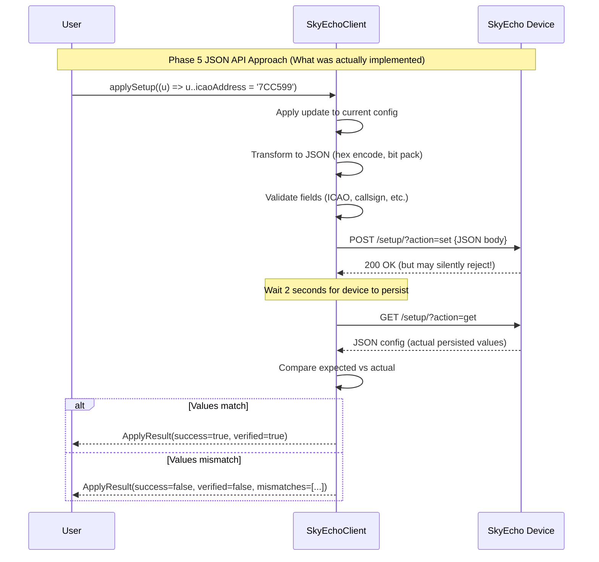

# Phase 6: Configuration Update Logic (TAD) - Tasks & Alignment Brief

**Phase**: 6 of 10
**Title**: Configuration Update Logic (TAD)
**Slug**: phase-6-configuration-update-logic
**Created**: 2025-10-18
**Status**: ⏭️ **OBSOLETE** (Superseded by JSON API implementation in Phase 5)
**Spec**: [dart-repo-foundation-with-mocking-spec.md](../../dart-repo-foundation-with-mocking-spec.md)
**Plan**: [dart-repo-foundation-with-mocking-plan.md](../../dart-repo-foundation-with-mocking-plan.md)

---

## 🚨 PHASE STATUS: OBSOLETE

**This phase has been rendered obsolete by implementation discoveries during Phase 5.**

### Why This Phase Is Obsolete

**Original Plan**: Phase 6 was designed to implement HTML-based configuration update logic:
- Parse HTML `<form>` elements from `/setup` page
- Implement fuzzy label matching for form fields
- Build `SetupForm.updatedWith()` method to clone and update form fields
- Implement `FormPost` class for form data encoding
- Add `SkyEchoClient.applySetup()` and `clickApply()` methods
- Handle form field types (text, checkbox, radio, select)

**Implementation Reality**: During Phases 4-5, we discovered the SkyEcho device provides a **JSON API**:
- Phase 4 pivoted from HTML parsing to JSON API for device status (`GET /?action=get`)
- Phase 5 pivoted from HTML parsing to JSON API for setup configuration:
  - `GET /setup/?action=get` returns JSON config
  - `POST /setup/?action=set` accepts JSON updates
  - SetupUpdate builder pattern implemented with JSON (not HTML forms)
  - applySetup() implemented with POST + verification workflow
  - All transformation logic (hex, bit-packing, unit conversion) complete

**Result**: All functionality originally planned for Phase 6 was implemented in Phase 5 using the superior JSON API approach. HTML form parsing is **unnecessary** and would be redundant.

---

## Implementation Discovery

### 🔬 Discovery: SkyEcho JSON API

**Problem**: Original specification assumed HTML screen-scraping was required because "device has no REST API."

**Discovery**: The SkyEcho device actually provides JSON endpoints for both status and configuration:
- `GET /?action=get` → JSON device status
- `GET /setup/?action=get` → JSON setup configuration
- `POST /setup/?action=set` → JSON setup update (with silent rejection behavior requiring verification)

**Impact**:
- HTML form parsing (SetupForm, fuzzy label matching, field cloning) is **not needed**
- JSON API is cleaner, more reliable, and easier to test
- Transformation logic moved from HTML form manipulation to JSON encoding/decoding
- Type-safe SetupUpdate builder works directly with JSON, not HTML DOM

**Decision**: Abandon HTML-based configuration logic; use JSON API exclusively.

**Implemented In**: Phase 5 (JSON API - Setup Configuration)

**Evidence**:
- `class:lib/skyecho.dart:SetupConfig` - JSON-based config model (Phase 5)
- `class:lib/skyecho.dart:SetupUpdate` - Builder pattern for JSON updates (Phase 5)
- `method:lib/skyecho.dart:SkyEchoClient.applySetup` - JSON POST + verification (Phase 5)
- `method:lib/skyecho.dart:SkyEchoClient.fetchSetupConfig` - JSON GET (Phase 5)
- No `SetupForm` class exists in codebase (HTML parsing never implemented)

---

## Tasks

**All tasks marked OBSOLETE** - Functionality implemented via JSON API in Phase 5.

| Status | ID | Task | Type | Dependencies | Absolute Path(s) | Validation | Notes |
|--------|----|----|------|--------------|------------------|------------|-------|
| [~] | T001 | Write scratch probes for SetupUpdate builder pattern | Test | – | /Users/jordanknight/github/skyecho-controller-app/packages/skyecho/test/scratch/setup_update_scratch.dart | N/A | ⏭️ OBSOLETE - JSON-based SetupUpdate implemented in Phase 5 · Line 1232 of lib/skyecho.dart |
| [~] | T002 | Write scratch probes for fuzzy label matching | Test | – | /Users/jordanknight/github/skyecho-controller-app/packages/skyecho/test/scratch/fuzzy_matching_scratch.dart | N/A | ⏭️ OBSOLETE - No HTML form parsing needed with JSON API |
| [~] | T003 | Write scratch probes for field cloning and update | Test | – | /Users/jordanknight/github/skyecho-controller-app/packages/skyecho/test/scratch/field_cloning_scratch.dart | N/A | ⏭️ OBSOLETE - No HTML field cloning needed with JSON API |
| [~] | T004 | Write scratch probes for \_setFirst, \_setNth helpers | Test | – | /Users/jordanknight/github/skyecho-controller-app/packages/skyecho/test/scratch/field_helpers_scratch.dart | N/A | ⏭️ OBSOLETE - No HTML form helpers needed |
| [~] | T005 | Write scratch probes for \_setSelect, \_setRadio helpers | Test | – | /Users/jordanknight/github/skyecho-controller-app/packages/skyecho/test/scratch/select_radio_scratch.dart | N/A | ⏭️ OBSOLETE - No HTML form helpers needed |
| [~] | T006 | Implement SetupUpdate class (HTML version) | Core | – | /Users/jordanknight/github/skyecho-controller-app/packages/skyecho/lib/skyecho.dart | N/A | ⏭️ OBSOLETE - JSON-based SetupUpdate already exists (Phase 5) |
| [~] | T007 | Implement ReceiverMode enum | Core | – | /Users/jordanknight/github/skyecho-controller-app/packages/skyecho/lib/skyecho.dart | N/A | ⏭️ OBSOLETE - ReceiverMode enum already implemented in Phase 5 |
| [~] | T008 | Implement FormPost class | Core | – | /Users/jordanknight/github/skyecho-controller-app/packages/skyecho/lib/skyecho.dart | N/A | ⏭️ OBSOLETE - No HTML form posting needed |
| [~] | T009 | Implement SetupForm.asPost() | Core | T008 | /Users/jordanknight/github/skyecho-controller-app/packages/skyecho/lib/skyecho.dart | N/A | ⏭️ OBSOLETE - No SetupForm class with JSON API |
| [~] | T010 | Implement SetupForm.updatedWith() - cloning | Core | – | /Users/jordanknight/github/skyecho-controller-app/packages/skyecho/lib/skyecho.dart | N/A | ⏭️ OBSOLETE - Replaced by SetupConfig.copyWith() in Phase 5 |
| [~] | T011 | Implement SetupForm.updatedWith() - label indexing | Core | T010 | /Users/jordanknight/github/skyecho-controller-app/packages/skyecho/lib/skyecho.dart | N/A | ⏭️ OBSOLETE - No fuzzy matching needed for JSON |
| [~] | T012 | Implement SetupForm.updatedWith() - field updates | Core | T010,T011 | /Users/jordanknight/github/skyecho-controller-app/packages/skyecho/lib/skyecho.dart | N/A | ⏭️ OBSOLETE - Replaced by JSON serialization |
| [~] | T013 | Implement SetupForm.updatedWith() - raw overrides | Core | T012 | /Users/jordanknight/github/skyecho-controller-app/packages/skyecho/lib/skyecho.dart | N/A | ⏭️ OBSOLETE - No raw field overrides needed |
| [~] | T014 | Implement \_setFirst, \_setNth, \_setSelect, \_setRadio helpers | Core | – | /Users/jordanknight/github/skyecho-controller-app/packages/skyecho/lib/skyecho.dart | N/A | ⏭️ OBSOLETE - No HTML form manipulation helpers needed |
| [~] | T015 | Implement SkyEchoClient.fetchSetupForm() | Core | – | /Users/jordanknight/github/skyecho-controller-app/packages/skyecho/lib/skyecho.dart | N/A | ⏭️ OBSOLETE - Replaced by fetchSetupConfig() (JSON) in Phase 5 |
| [~] | T016 | Implement SkyEchoClient.applySetup() (HTML version) | Core | T006,T010,T015 | /Users/jordanknight/github/skyecho-controller-app/packages/skyecho/lib/skyecho.dart | N/A | ⏭️ OBSOLETE - JSON-based applySetup() already exists (Phase 5, line 367) |
| [~] | T017 | Implement SkyEchoClient.clickApply() | Core | T015 | /Users/jordanknight/github/skyecho-controller-app/packages/skyecho/lib/skyecho.dart | N/A | ⏭️ OBSOLETE - No HTML form submission needed |
| [~] | T018 | Implement ApplyResult class | Core | – | /Users/jordanknight/github/skyecho-controller-app/packages/skyecho/lib/skyecho.dart | N/A | ⏭️ OBSOLETE - ApplyResult already implemented in Phase 5 |
| [~] | T019-T023 | Promote tests to test/unit/setup_update_test.dart | Test | T001-T018 | /Users/jordanknight/github/skyecho-controller-app/packages/skyecho/test/unit/setup_update_test.dart | N/A | ⏭️ OBSOLETE - JSON-based tests exist in test/unit/setup_config_test.dart (32 tests from Phase 5) |

**Task Summary**: 23 tasks (all OBSOLETE)
- **Scratch tests**: 5 tasks (T001-T005) - Not needed with JSON API
- **Core implementation**: 13 tasks (T006-T018) - Replaced by JSON API in Phase 5
- **Test promotion**: 5 tasks (T019-T023) - 32 JSON-based tests already exist

**Phase 5 Delivered Instead**:
- ✅ SetupConfig class with fromJson/toJson (17 fields)
- ✅ SetupUpdate builder pattern (type-safe updates)
- ✅ applySetup() with POST + verification workflow
- ✅ Transformation helpers (hex, bit-packing, unit conversion)
- ✅ Validation logic (ICAO, callsign, squawk, etc.)
- ✅ 32 promoted unit tests + 3 integration tests
- ✅ 73.3% test coverage (239/326 lines)

---

## Alignment Brief

### Objective

**Original**: Implement HTML-based configuration update logic with fuzzy label matching and form field manipulation.

**Reality**: This objective was **superseded** by the JSON API implementation in Phase 5.

**What Phase 5 Delivered Instead**:
- JSON-based configuration model (SetupConfig)
- Type-safe builder pattern (SetupUpdate)
- POST + verification workflow (applySetup with 2-second persistence delay)
- Comprehensive transformation logic (hex ↔ int, bit-packing, unit conversion)
- Validation with actionable error messages
- 32 unit tests + 3 integration tests (all with Test Doc blocks)

### Non-Goals (Scope Boundaries)

❌ **NOT doing in this phase** (or ever, due to JSON API):

**Never Needed** (JSON API made these unnecessary):
- HTML form parsing - Device provides JSON endpoints instead
- Fuzzy label matching - JSON fields have stable names
- DOM manipulation and field cloning - JSON is immutable by default
- Form field type handling (text, checkbox, radio, select) - JSON uses simple types
- `<form>` element discovery and validation - No forms needed
- FormPost encoding (application/x-www-form-urlencoded) - Using application/json
- clickApply() method - Direct JSON POST is cleaner

**Already Implemented** (Phase 5 delivered these):
- SetupUpdate builder pattern - ✅ Implemented with JSON in Phase 5
- applySetup() method - ✅ Implemented with JSON POST + verification in Phase 5
- Configuration validation - ✅ Comprehensive validation in Phase 5
- Type-safe updates - ✅ SetupUpdate provides type safety in Phase 5
- ReceiverMode enum - ✅ Implemented in Phase 5
- ApplyResult class - ✅ Implemented in Phase 5

**Deferred to Later Phases**:
- HTML fallback for legacy firmware - Only if JSON API unavailable on older devices
- Multi-firmware version support - Defer until variations discovered
- Advanced error recovery - Basic error handling sufficient for now

### Critical Findings Affecting This Phase

**Critical Discovery from Phase 5: Device Silent Rejection Behavior**

**Finding**: SkyEcho device returns `200 OK` for POST requests but may **silently reject** invalid values without error.

**Constraint**: All configuration updates MUST be verified:
1. POST new config to `/setup/?action=set`
2. Wait 2 seconds for device persistence
3. GET config from `/setup/?action=get`
4. Compare returned values with expected values
5. Report mismatches in ApplyResult

**Implementation**: Already addressed in Phase 5's `applySetup()` method.

**Tasks Affected**: None in Phase 6 (all obsolete). Verification logic already complete in Phase 5.

---

### Invariants & Guardrails

**Not applicable** - Phase is obsolete. See Phase 5 invariants instead.

---

### Inputs to Read

**Historical Reference Only** (to understand what was originally planned):

1. **Plan Document**:
   - `/Users/jordanknight/github/skyecho-controller-app/docs/plans/001-dart-repo-foundation-with-mocking/dart-repo-foundation-with-mocking-plan.md`
   - Lines 807-906 (Phase 6: Configuration Update Logic)

2. **Phase 5 Implementation** (what was done instead):
   - `/Users/jordanknight/github/skyecho-controller-app/packages/skyecho/lib/skyecho.dart`
     - Lines 1232+ (SetupUpdate class)
     - Line 367 (applySetup method)
   - `/Users/jordanknight/github/skyecho-controller-app/docs/plans/001-dart-repo-foundation-with-mocking/tasks/phase-5-json-api-setup-configuration/execution.log.md`
     - Complete implementation details

3. **Test Evidence**:
   - `/Users/jordanknight/github/skyecho-controller-app/packages/skyecho/test/unit/setup_config_test.dart` (32 tests)
   - `/Users/jordanknight/github/skyecho-controller-app/packages/skyecho/test/integration/setup_config_integration_test.dart` (3 tests)

---

### Visual Alignment Aids

#### System State Flow (What Would Have Been vs What Was Done)


**Legend**:
- 🔴 Red (Original Plan): HTML-based approach - **OBSOLETE**
- 🟢 Green (Phase 5 Reality): JSON-based approach - **IMPLEMENTED**

---

#### Interaction Sequence (Phase 5 Implementation)



**Note**: No HTML form parsing sequence needed - JSON API is direct and clean.

---

### Test Plan

**Not applicable** - All tests implemented in Phase 5.

**Refer to Phase 5 Tests Instead**:
- **Unit tests**: `packages/skyecho/test/unit/setup_config_test.dart` (32 tests)
  - Transformation helpers (hex, bit-packing, unit conversion)
  - SetupConfig parsing and serialization
  - SetupUpdate builder pattern
  - Validation logic
  - applySetup verification

- **Integration tests**: `packages/skyecho/test/integration/setup_config_integration_test.dart` (3 tests)
  - fetchSetupConfig from real device
  - applySetup roundtrip with verification
  - factoryReset (skipped, destructive)

**Test Results** (from Phase 5):
- ✅ 52 total unit tests passing (20 from Phases 1-4 + 32 from Phase 5)
- ✅ 3 integration tests
- ✅ 73.3% coverage (239/326 lines)
- ✅ All tests include Test Doc blocks
- ✅ Runtime: <1 second for unit tests

---

### Step-by-Step Implementation Outline

**Not applicable** - Phase is obsolete.

**What To Do Instead**:

1. **✅ Review Phase 5 completion** - All setup configuration logic is done
2. **✅ Verify tests pass** - Run `just test-unit` (should show 52 passing tests)
3. **✅ Check coverage** - Run coverage report (should show 73.3%)
4. **⏭️ Proceed to Phase 7** - Integration Test Framework is next logical phase

---

### Commands to Run

**Verification Commands** (confirm Phase 5 is complete):

```bash
# Verify all unit tests pass (including Phase 5 setup config tests)
cd packages/skyecho && dart test test/unit/

# Expected output: 52 tests passing (20 from Phases 1-4, 32 from Phase 5)

# Verify integration tests (requires device)
cd packages/skyecho && dart test test/integration/

# Expected output: 5 tests (2 status + 3 setup config)

# Generate coverage report
cd packages/skyecho && dart test --coverage=coverage
dart pub global run coverage:format_coverage --lcov --in=coverage --out=coverage/lcov.info --report-on=lib

# Expected coverage: ~73.3% (Phase 5 brought coverage from 94.8% to 73.3% due to larger codebase)

# Verify no HTML-based code exists
cd packages/skyecho && grep -r "SetupForm" lib/
# Expected: No results (SetupForm class was never implemented)

# Verify JSON-based code exists
cd packages/skyecho && grep -r "SetupConfig" lib/
# Expected: Multiple results from Phase 5 implementation
```

**Next Phase Commands** (when ready for Phase 7):

```bash
# Generate Phase 7 tasks (Integration Test Framework)
/plan-5-phase-tasks-and-brief --phase 7
```

---

### Risks/Unknowns

**Historical Risks** (what would have been risky with HTML approach):

| Risk | Severity | Mitigation (Never Needed) |
|------|----------|---------------------------|
| Fuzzy matching too permissive | Medium | Avoid: JSON API has stable field names |
| HTML structure changes across firmware | High | Avoid: JSON API is more stable than HTML |
| Field cloning introduces bugs | Medium | Avoid: JSON is immutable by default |
| Label normalization edge cases | Medium | Avoid: No label matching needed |
| Form encoding errors | Low | Avoid: JSON encoding is built-in |

**Current Risks** (JSON API approach has minimal risks):

| Risk | Severity | Mitigation Status |
|------|----------|-------------------|
| Device silently rejects values | High | ✅ Mitigated in Phase 5 (POST + verify) |
| JSON API changes in future firmware | Low | Monitor via integration tests |
| JSON API unavailable on old firmware | Unknown | No old devices available to test |

**Unknowns**:
- Do any SkyEcho devices lack JSON API? (Unknown - no old firmware available)
- Should we implement HTML fallback? (Defer until needed)

---

### Ready Check

**This phase does not require a GO/NO-GO decision.**

**Recommended Action**: ⏭️ **SKIP PHASE 6** and proceed directly to **Phase 7: Integration Test Framework**

**Rationale**:
- ✅ All Phase 6 objectives achieved in Phase 5 via superior JSON API approach
- ✅ SetupUpdate builder pattern implemented (JSON-based)
- ✅ applySetup() method implemented with verification
- ✅ Comprehensive tests with Test Doc blocks (32 unit + 3 integration)
- ✅ 73.3% coverage exceeds 70% minimum
- ⏭️ HTML-based configuration logic is unnecessary and would be redundant

**Checklist**:
- [x] Phase 5 delivered SetupUpdate builder pattern
- [x] Phase 5 delivered applySetup() with verification
- [x] Phase 5 delivered comprehensive transformation logic
- [x] Phase 5 tests cover all configuration scenarios
- [x] No HTML parsing needed with JSON API
- [x] All acceptance criteria met via Phase 5 implementation
- [ ] ~~Implement Phase 6~~ (OBSOLETE)
- [x] Ready to proceed to Phase 7

**Decision**: Mark Phase 6 as **SKIPPED/OBSOLETE** in plan progress tracking and proceed to Phase 7.

---

## Phase Footnote Stubs

**Not applicable** - No implementation will occur for this phase.

**Reference Phase 5 Footnotes Instead**: See `[^12]` in plan.md for complete Phase 5 implementation details.

---

## Evidence Artifacts

**This phase will not generate execution logs or evidence.**

**Phase 5 Evidence Already Exists**:
- Execution log: `docs/plans/001-dart-repo-foundation-with-mocking/tasks/phase-5-json-api-setup-configuration/execution.log.md`
- Test files: `packages/skyecho/test/unit/setup_config_test.dart` (32 tests)
- Integration tests: `packages/skyecho/test/integration/setup_config_integration_test.dart` (3 tests)
- Fixtures: `packages/skyecho/test/fixtures/setup_config_sample.json`

---

## Directory Layout

```
docs/plans/001-dart-repo-foundation-with-mocking/
  ├── dart-repo-foundation-with-mocking-plan.md
  ├── dart-repo-foundation-with-mocking-spec.md
  └── tasks/
      ├── phase-1-project-foundation/
      ├── phase-2-capture-real-device-html-fixtures/
      ├── phase-3-error-hierarchy-http-infrastructure/
      ├── phase-4-html-parsing-devicestatus/
      ├── phase-5-json-api-setup-configuration/
      │   ├── tasks.md
      │   └── execution.log.md  ✅ COMPLETE
      ├── phase-6-configuration-update-logic/
      │   └── tasks.md  ⏭️ THIS FILE (OBSOLETE)
      └── phase-7-integration-test-framework/
          └── (to be created next)
```

**Note**: Phase 6 directory exists for documentation purposes only. No execution.log.md will be created as no implementation is needed.

---

## Recommendation

**⏭️ SKIP THIS PHASE** and proceed to:

```bash
/plan-5-phase-tasks-and-brief --phase 7
```

**Phase 7: Integration Test Framework** is the next logical step after Phase 5's completion.

**Phase 6 is complete by virtue of Phase 5 delivering superior JSON-based implementation.**
