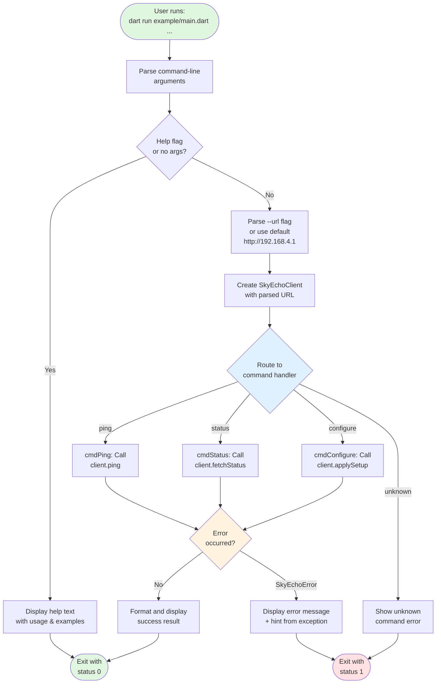

# Phase 8: Example CLI Application - Tasks + Alignment Brief

**Phase**: Phase 8: Example CLI Application
**Slug**: `phase-8-example-cli-application`
**Spec**: [dart-repo-foundation-with-mocking-spec.md](../../dart-repo-foundation-with-mocking-spec.md)
**Plan**: [dart-repo-foundation-with-mocking-plan.md](../../dart-repo-foundation-with-mocking-plan.md)
**Status**: PENDING
**Created**: 2025-10-18

---

## Tasks

| Status | ID | Task | Type | Dependencies | Absolute Path(s) | Validation | Notes |
|--------|----|----|------|--------------|------------------|------------|-------|
| [ ] | T001 | Create example/main.dart skeleton with imports and main() function | Setup | – | /Users/jordanknight/github/skyecho-controller-app/packages/skyecho/example/main.dart | File exists, imports dart:io (exit), uses relative import (`../lib/skyecho.dart`) with educational comment about package import, main() defined, compiles without errors | Starting structure; maps to plan task 8.1; uses relative import for monorepo reliability; dart:io needed for exit codes |
| [ ] | T002 | Implement URL parsing using args package (--url flag with default http://192.168.4.1) | Core | T001 | /Users/jordanknight/github/skyecho-controller-app/packages/skyecho/example/main.dart, /Users/jordanknight/github/skyecho-controller-app/packages/skyecho/pubspec.yaml | --url flag accepts override, defaults to http://192.168.4.1 when not specified, validates URL format, handles edge cases (missing value, invalid URL); args package added to dev_dependencies | Serial (same file); maps to plan task 8.2; uses args package for robust parsing with validation |
| [ ] | T003 | Implement help text function with usage, commands, and examples | Core | T001 | /Users/jordanknight/github/skyecho-controller-app/packages/skyecho/example/main.dart | --help flag and help command both print complete usage; no args defaults to help | Serial (same file); maps to plan task 8.3 |
| [ ] | T004 | Implement ping command calling client.ping() | Core | T002, T003 | /Users/jordanknight/github/skyecho-controller-app/packages/skyecho/example/main.dart | Command executes client.ping(), prints user-friendly result (✅ reachable or ❌ not reachable) | Serial (same file); maps to plan task 8.4 |
| [ ] | T005 | Implement status command calling client.fetchStatus() | Core | T002, T003 | /Users/jordanknight/github/skyecho-controller-app/packages/skyecho/example/main.dart | Command calls fetchStatus(), displays SSID, WiFi version, ADS-B version, health status in formatted output | Serial (same file); maps to plan task 8.5 |
| [ ] | T006 | Implement configure command with hardcoded safe example and transmit safety check | Core | T002, T003 | /Users/jordanknight/github/skyecho-controller-app/packages/skyecho/example/main.dart | Demonstrates applySetup() with hardcoded safe example (callsign='DEMO', vfrSquawk=1200); includes runtime assertion that prevents ANY transmit flag from being enabled; includes clear safety comments | Serial (same file); maps to plan task 8.6; **CRITICAL**: Must validate transmit flags are NOT enabled before calling applySetup() |
| [ ] | T007 | Add error handling for all commands (catch SkyEchoError) | Core | T004, T005, T006 | /Users/jordanknight/github/skyecho-controller-app/packages/skyecho/example/main.dart | All commands wrapped in try-catch, SkyEchoError exceptions caught, error.toString() displays message + hint | Serial (same file); maps to plan task 8.7 |
| [ ] | T008 | Manual test example app with real device at 192.168.4.1 | Integration | T007 | /Users/jordanknight/github/skyecho-controller-app/packages/skyecho/example/main.dart | All commands tested (ping, status, configure), outputs documented in execution log | Maps to plan task 8.8; requires physical device connection |
| [ ] | T009 | Manual test example app without device (verify graceful errors) | Integration | T007 | /Users/jordanknight/github/skyecho-controller-app/packages/skyecho/example/main.dart | All commands tested when device unavailable, error messages are helpful with actionable hints | [P] eligible (independent of T008); maps to plan task 8.9 |
| [ ] | T010 | Document example usage in README.md with copy-paste commands | Doc | T008, T009 | /Users/jordanknight/github/skyecho-controller-app/README.md | README has "Example Usage" section with ping, status, configure examples and expected outputs; note that examples will need re-validation in Phase 10 if output formats change | [P] eligible (different file); maps to plan task 8.10; examples captured from T008/T009 outputs |

---

## Alignment Brief

### Objective Recap

Create a simple, functional CLI application (`example/main.dart`) that demonstrates the SkyEcho Controller Library's core capabilities through three commands:

1. **ping** - Verify device connectivity
2. **status** - Display device status (SSID, firmware versions, health)
3. **configure** - Demonstrate configuration updates (safe hardcoded example)

The CLI app serves dual purposes:
- **Documentation**: Shows developers how to use the library
- **Validation**: Provides manual testing interface for library features

**Acceptance Criteria** (from plan Phase 8):
- [x] Example app has ping, status, configure commands
- [x] --url flag works to override default device URL
- [x] Help text shows usage and examples
- [x] Error handling catches and displays SkyEchoError with hints
- [x] Manually tested with real device (all commands work)
- [x] Manually tested without device (graceful error messages)
- [x] README includes example usage section

### Non-Goals (Scope Boundaries)

**❌ NOT doing in this phase:**

- **Advanced CLI features**: No autocomplete, interactive mode, command aliases, or subcommands
- **Configuration file support**: No ~/.skyechorc or config files (all options via flags)
- **Multiple device management**: Single device only, no device discovery or multi-device coordination
- **Output formatting options**: Plain text only, no JSON/YAML/CSV output modes
- **Command chaining or scripting**: No pipe support, no batch mode, no command sequences
- **Unit tests for CLI**: Manual verification sufficient per plan (library already has 52 unit tests)
- **Package publication**: Not publishing as separate package, no versioning or pub.dev setup
- **Logging or debug modes**: No --verbose, --debug, or log file output
- **Command history or session persistence**: Stateless execution only
- **Advanced error recovery**: No retry logic, no connection pooling
- **Input validation beyond URL**: No validation of configure values (example is hardcoded)
- **Progress indicators or spinners**: Synchronous execution with simple output
- **Configuration backups or rollbacks**: No safety features (this is example code)

### Critical Findings Affecting This Phase

**Assessment**: None of the Critical Research Findings from plan § 3 directly impact Phase 8.

**Rationale**: This phase *consumes* the library rather than implements core features. The library already handles:
- HTML parsing resilience (Discovery 01, 03)
- MockClient testing patterns (Discovery 02)
- Cookie session management (Discovery 04)
- Immutable form field handling (Discovery 05)

The CLI app simply calls the library's public API (`SkyEchoClient.ping()`, `fetchStatus()`, `applySetup()`), which already encapsulates these concerns.

### Invariants & Guardrails

**Simplicity Constraint** (per plan risk mitigation):
- Use if/else for command routing (no complex CLI frameworks)
- Manual argument parsing (avoid external dependencies like `args` package unless truly needed)
- Single-file implementation (~150-200 lines estimated)

**Error Transparency**:
- Always display `SkyEchoError.toString()` which includes hints
- Never swallow exceptions silently
- Provide actionable error messages for common failures (network, device not found)

**Example Quality**:
- Code must be exemplary and easy to understand (it's living documentation)
- Comments explain key patterns (error handling, builder pattern usage)
- Variable names are descriptive
- Formatting follows `dart format` conventions

**Safety**:
- Configure command uses READ-ONLY or safe test values
- Add comment warnings about example nature of hardcoded values
- Do not transmit on ADS-B (ensure example values are safe)

**Minimal External Dependencies**:
- Use Dart core libraries + skyecho package + args package
- args package (dev_dependency) for robust CLI argument parsing
- No HTTP client beyond what's in skyecho
- No other external dependencies

### Inputs to Read

**Existing Library API**:
- `/Users/jordanknight/github/skyecho-controller-app/packages/skyecho/lib/skyecho.dart`
  - Understand `SkyEchoClient` constructor signature
  - Review method signatures: `ping()`, `fetchStatus()`, `applySetup()`
  - Study `SkyEchoError` hierarchy and hint format

**Current README Structure**:
- `/Users/jordanknight/github/skyecho-controller-app/README.md`
  - Understand existing structure to place example usage appropriately
  - Match tone and formatting style

**Integration Test Examples** (for real usage patterns):
- `/Users/jordanknight/github/skyecho-controller-app/packages/skyecho/test/integration/device_status_integration_test.dart`
- `/Users/jordanknight/github/skyecho-controller-app/packages/skyecho/test/integration/setup_config_integration_test.dart`
  - See how real tests call the API
  - Understand typical error handling patterns

### Visual Alignment Aids

#### Flow Diagram: CLI Command Processing State Machine



#### Sequence Diagram: Example Status Command Interaction

```mermaid
sequenceDiagram
    participant User
    participant CLI as example/main.dart
    participant Client as SkyEchoClient
    participant Device as SkyEcho @ 192.168.4.1

    User->>CLI: dart run example/main.dart status
    activate CLI

    CLI->>CLI: Parse args<br/>(--url or default)
    CLI->>Client: new SkyEchoClient(url)
    activate Client

    CLI->>Client: fetchStatus()
    Client->>Device: HTTP GET /?action=get
    activate Device

    alt Device Reachable & Healthy
        Device-->>Client: 200 OK<br/>JSON response
        deactivate Device
        Client->>Client: Parse JSON to<br/>DeviceStatus
        Client-->>CLI: DeviceStatus object
        deactivate Client
        CLI->>CLI: Format status output<br/>(SSID, versions, health)
        CLI-->>User: Display formatted status
        deactivate CLI
    else Network Error
        Device--xClient: Connection timeout
        deactivate Device
        Client->>Client: Wrap in<br/>SkyEchoNetworkError
        Client--xCLI: throw SkyEchoNetworkError
        deactivate Client
        CLI->>CLI: Catch SkyEchoError
        CLI->>CLI: Extract message + hint
        CLI-->>User: ❌ Error: [message]<br/>Hint: [actionable hint]
        deactivate CLI
    end
```

### Test Plan

**Testing Approach**: Manual Verification (per plan tasks 8.8 and 8.9)

**Rationale**:
- CLI is demonstration/example code, not production
- Underlying library already has comprehensive tests (52 unit + 5 integration)
- Manual testing ensures real-world usability and validates error messages are user-friendly
- Focus on behavior validation rather than automated coverage

**Test Scenarios**:

#### 1. Help Text Validation
**Objective**: Verify help is clear and comprehensive

- **T1.1**: No arguments
  - Command: `dart run example/main.dart`
  - Expected: Display full help text with usage and examples

- **T1.2**: --help flag
  - Command: `dart run example/main.dart --help`
  - Expected: Display full help text

- **T1.3**: help command
  - Command: `dart run example/main.dart help`
  - Expected: Display full help text

**Success Criteria**: Help text includes command list, --url flag documentation, and copy-paste examples

---

#### 2. Ping Command - Happy Path
**Objective**: Verify ping succeeds when device available

- **Precondition**: Device powered on and accessible at 192.168.4.1
- **Command**: `dart run example/main.dart ping`
- **Expected Output**: "✅ Device reachable" or similar success message
- **Validation**: Exit code 0

---

#### 3. Ping Command - Error Path
**Objective**: Verify graceful error when device unavailable

- **Precondition**: Device not available (disconnect from WiFi or power off)
- **Command**: `dart run example/main.dart ping`
- **Expected Output**:
  - Error message indicating connection failure
  - Hint about checking network connectivity or device power
- **Validation**: Exit code non-zero, hint is actionable

---

#### 4. Status Command - Happy Path
**Objective**: Verify status displays complete device information

- **Precondition**: Device available at 192.168.4.1
- **Command**: `dart run example/main.dart status`
- **Expected Output**:
  - SSID (e.g., "SkyEcho_3155")
  - WiFi version (e.g., "0.2.41-SkyEcho")
  - ADS-B version (e.g., "2.6.13")
  - Health status (healthy/unhealthy)
  - Formatted in human-readable layout
- **Validation**: All fields populated with real data

---

#### 5. Status Command - Error Path
**Objective**: Verify graceful error when device unavailable

- **Precondition**: Device not available
- **Command**: `dart run example/main.dart status`
- **Expected Output**:
  - Network error message
  - Hint suggesting to check device connectivity
- **Validation**: Error is clear and actionable

---

#### 6. Configure Command - Demonstration (Safe Real Execution)
**Objective**: Demonstrate applySetup() usage with real device modification using safe values

- **Precondition**: Device available
- **Command**: `dart run example/main.dart configure`
- **Expected Behavior**:
  - Demonstrates builder pattern syntax with real execution
  - Uses safe example values (callsign='DEMO', vfrSquawk=1200)
  - **CRITICAL**: Runtime assertion prevents ANY transmit flag from being enabled
  - **CRITICAL**: Code checks update.enable1090ESTransmit and update.enableUATTransmit are NOT true
  - Shows verification result from applySetup()
- **Validation**:
  - Runtime safety check prevents transmit flag activation
  - Device configuration changes to callsign=DEMO, vfrSquawk=1200
  - Verification flow demonstrated
  - Safety comments explain transmit prohibition

**SAFETY ENFORCED**: Runtime assertion throws exception if transmit flags are enabled, preventing code from executing applySetup().

---

#### 7. URL Override
**Objective**: Verify --url flag works

- **Command**: `dart run example/main.dart --url http://192.168.4.2 ping`
- **Expected**: Attempt to connect to 192.168.4.2 instead of default
- **Validation**: Error message references the custom URL (not default)

---

#### 8. Unknown Command
**Objective**: Verify error handling for invalid commands

- **Command**: `dart run example/main.dart foobar`
- **Expected Output**:
  - "Unknown command: foobar"
  - Suggest running --help
- **Validation**: Helpful error, non-zero exit code

---

**Test Evidence**: Document all command outputs in `execution.log.md` with:
- Command executed
- Full output (stdout/stderr)
- Exit code
- Pass/fail assessment
- Any issues encountered

### Step-by-Step Implementation Outline

**Implementation follows task dependency order:**

#### Phase 1: Setup (T001)
1. Create `/Users/jordanknight/github/skyecho-controller-app/packages/skyecho/example/main.dart`
2. Add imports with educational comment:
   ```dart
   /// SkyEcho Controller CLI Example
   ///
   /// This demonstrates using the SkyEcho library to control devices.
   ///
   /// When using skyecho as a dependency in your own project:
   ///   import 'package:skyecho/skyecho.dart';
   ///
   /// For this monorepo example, we use a relative import:
   import 'dart:io' show exit;  // For exit codes
   import '../lib/skyecho.dart';
   ```
3. Define main() function signature:
   ```dart
   Future<void> main(List<String> args) async { }
   ```
4. Verify compilation: `dart analyze`

**Validation**: File compiles without errors, relative import resolves correctly

---

#### Phase 2: Argument Parsing (T002-T003)

**T002: URL Parsing with args package**
5. Add args package import:
   ```dart
   import 'package:args/args.dart';
   ```
6. Create argument parser:
   ```dart
   final parser = ArgParser()
     ..addOption('url',
       defaultsTo: 'http://192.168.4.1',
       help: 'Device URL (default: http://192.168.4.1)');
   ```
7. Parse arguments with error handling:
   ```dart
   ArgResults argResults;
   try {
     argResults = parser.parse(args);
   } on FormatException catch (e) {
     print('Error: ${e.message}');
     print('');
     printHelp();
     exit(1);
   }

   final url = argResults['url'] as String;
   final command = argResults.rest.isNotEmpty ? argResults.rest.first : '';
   ```
8. Test manually with `--url http://192.168.4.2 ping` and edge cases

**T003: Help Text**
9. Define `printHelp()` function with usage and parser usage:
   ```dart
   void printHelp(ArgParser parser) {
     print('SkyEcho Controller CLI');
     print('');
     print('Usage: dart run example/main.dart [options] <command>');
     print('');
     print(parser.usage);
     print('');
     print('Commands:');
     print('  ping       Check device connectivity');
     print('  status     Display device status');
     print('  configure  Demonstrate configuration update');
     print('  help       Show this help message');
     print('');
     print('Examples:');
     print('  dart run example/main.dart ping');
     print('  dart run example/main.dart --url http://192.168.4.2 status');
   }
   ```
10. Handle help in main() (check command from argResults.rest):
    ```dart
    if (command.isEmpty || command == 'help' || argResults['help'] as bool) {
      printHelp(parser);
      return;
    }
    ```

**Validation**: Help displays correctly

---

#### Phase 3: Command Implementation (T004-T006)

**T004: Ping Command**
9. Define `cmdPing()`:
   ```dart
   Future<void> cmdPing(SkyEchoClient client) async {
     print('Pinging device...');
     final reachable = await client.ping();
     print(reachable ? '✅ Device reachable' : '❌ Device not reachable');
   }
   ```

**T005: Status Command**
10. Define `cmdStatus()`:
    ```dart
    Future<void> cmdStatus(SkyEchoClient client) async {
      final status = await client.fetchStatus();
      print('Device Status:');
      print('  SSID: ${status.ssid}');
      print('  WiFi Version: ${status.wifiVersion}');
      print('  ADS-B Version: ${status.adsbVersion}');
      print('  Health: ${status.isHealthy ? "✅ Healthy" : "⚠️ Unhealthy"}');
    }
    ```

**T006: Configure Command (Safe Example with Transmit Safety Check)**
11. Define `cmdConfigure()` with runtime safety assertion:
    ```dart
    Future<void> cmdConfigure(SkyEchoClient client) async {
      // SAFETY: This example demonstrates applySetup() with real device modification.
      // Runtime assertion prevents accidental ADS-B transmit activation.
      print('Demonstrating configuration update...');

      // Define the update (safe values only)
      final update = SetupUpdate()
        ..callsign = 'DEMO'      // Safe demonstration callsign
        ..vfrSquawk = 1200;      // Standard VFR squawk code

      // CRITICAL SAFETY CHECK: Verify no transmit flags are being enabled
      // This prevents accidental ADS-B broadcast on aviation frequencies
      if (update.enable1090ESTransmit == true ||
          update.enableUATTransmit == true) {
        throw Exception('SAFETY VIOLATION: Example code must never enable ADS-B transmit!');
      }

      final result = await client.applySetup((u) => update);

      print('Configuration ${result.verified ? "verified ✅" : "not verified ⚠️"}');
      print('Updated: callsign=DEMO, vfrSquawk=1200');
    }
    ```

**Validation**: All commands compile and have clear structure

---

#### Phase 4: Command Routing (still in T001-T006)

12. Add command routing in main():
    ```dart
    // url and command already extracted from argResults in step 7
    final client = SkyEchoClient(url);

    switch (command) {
      case 'ping':
        await cmdPing(client);
      case 'status':
        await cmdStatus(client);
      case 'configure':
        await cmdConfigure(client);
      default:
        print('Unknown command: $command');
        printHelp(parser);
        exit(1);
    }
    ```

---

#### Phase 5: Error Handling (T007)

13. Wrap command execution in try-catch:
    ```dart
    try {
      switch (command) {
        // ... command cases
      }
    } on SkyEchoError catch (e) {
      print('❌ Error: $e');  // toString() includes hint
      exit(1);
    }
    ```

14. Test error paths by disconnecting device

**Validation**: Errors display with hints

---

#### Phase 6: Integration Testing (T008-T009)

**T008: Test with Device**
15. Connect to device WiFi (SkyEcho_XXXX)
16. Run all commands:
    - `dart run example/main.dart ping`
    - `dart run example/main.dart status`
    - `dart run example/main.dart configure`
    - `dart run example/main.dart --url http://192.168.4.1 ping`
17. Document outputs in execution log

**T009: Test without Device**
18. Disconnect from device WiFi
19. Run all commands again
20. Verify error messages are helpful
21. Document outputs in execution log

**Validation**: All scenarios tested, evidence captured

---

#### Phase 7: Documentation (T010)

22. Update `/Users/jordanknight/github/skyecho-controller-app/README.md`
23. Add "Example Usage" section with:
    - Installation reminder (`dart pub get`)
    - Example commands from T008 testing
    - Expected outputs
    - Link to full API documentation

**Validation**: README has complete example usage section

---

**Task-to-Step Mapping**:
- T001 → Steps 1-4 (skeleton)
- T002 → Steps 5-6 (URL parsing)
- T003 → Steps 7-8 (help text)
- T004 → Step 9 (ping)
- T005 → Step 10 (status)
- T006 → Step 11 (configure)
- T007 → Steps 13-14 (error handling)
- T008 → Steps 15-17 (test with device)
- T009 → Steps 18-21 (test without device)
- T010 → Steps 22-23 (documentation)

### Commands to Run

**Development & Testing**:

```bash
# Navigate to package directory
cd /Users/jordanknight/github/skyecho-controller-app/packages/skyecho

# Install dependencies (if needed)
dart pub get

# Analyze code (must pass clean)
dart analyze

# Format code
dart format example/main.dart

# ===== HELP TESTING =====
# Test help (no args)
dart run example/main.dart

# Test help flag
dart run example/main.dart --help

# Test help command
dart run example/main.dart help

# ===== COMMAND TESTING (with device) =====
# Ping device
dart run example/main.dart ping

# Get device status
dart run example/main.dart status

# Demonstrate configuration (SAFE EXAMPLE)
dart run example/main.dart configure

# Test URL override
dart run example/main.dart --url http://192.168.4.1 ping

# ===== ERROR TESTING (without device) =====
# Disconnect from device WiFi, then run:
dart run example/main.dart ping
dart run example/main.dart status

# Test unknown command
dart run example/main.dart foobar

# ===== VALIDATION =====
# Ensure formatting is correct
dart format --set-exit-if-changed example/main.dart

# Final analysis check
dart analyze
```

**Documentation Update**:

```bash
# Open README for editing
# Add example usage section based on tested outputs

# Verify README renders correctly (if using markdown previewer)
```

### Risks/Unknowns

| Risk | Severity | Likelihood | Impact | Mitigation |
|------|----------|------------|--------|------------|
| Example code becomes stale as library evolves | Medium | Medium | Examples mislead users, documentation value decreases | Include example validation in Phase 10; document in CLAUDE.md that examples must be tested after library changes |
| Hardcoded configure example might confuse users | Low | Low | Users might copy unsafe values | Add prominent comments explaining example nature; consider making configure command print code rather than execute |
| URL parsing more complex than expected (edge cases) | Low | Low | Parsing fails on valid URLs | Start with simple parsing; add args package as fallback if manual parsing proves insufficient |
| Error messages unclear to end users | Low | Medium | Users don't know how to fix issues | Test without device extensively; verify hints are actionable |
| Example run command unclear in README | Low | Low | Users can't run examples | Provide exact copy-paste commands with expected outputs |
| Configure command accidentally misconfigures device | Medium | Low | Device requires factory reset | **Use read-only demonstration or safe test values only**; add safety comments |
| Dependencies not resolving in example/ | Low | Low | Example won't compile | Verify package import resolution; add example/pubspec.yaml if needed |

**Risk Response Plan**:
- **Configure safety**: Review configure command implementation in code review before testing with device
- **Error message validation**: During T009, verify every error message includes actionable hint
- **Example staleness**: Phase 10 will include task to re-run all README examples and verify outputs match; CLAUDE.md will document maintenance requirement

### Ready Check

**Implementation must NOT begin until all checkboxes are ✅:**

- [ ] All tasks (T001-T010) are understood and scope is clear
- [ ] Absolute paths for all files are confirmed correct
- [ ] Test plan scenarios (T1.1-T8) are comprehensive and cover happy/error paths
- [ ] Risk mitigation strategies are acceptable (especially configure safety)
- [ ] Visual diagrams (flow + sequence) align with planned behavior
- [ ] Commands are copy-paste ready and tested for syntax
- [ ] Non-goals section prevents scope creep (no advanced CLI features)
- [ ] Safety constraints are clear (configure command must not harm device)
- [ ] Manual testing approach is acceptable (no automated CLI tests)
- [ ] README documentation approach is clear
- [ ] **Human sponsor provides explicit GO signal**

---

## Phase Footnote Stubs

**Note**: This section will be populated during `/plan-6-implement-phase` execution. Footnote tags (e.g., `[^N]`) will be added to the plan's Change Footnotes Ledger post-implementation to document:

- Code changes made (classes, functions, files created)
- Implementation decisions and rationale
- Deviations from plan (if any)
- Traceability between tasks and code artifacts

**Do not create footnote entries during planning phase.**

---

## Evidence Artifacts

**Execution Log**: `/Users/jordanknight/github/skyecho-controller-app/docs/plans/001-dart-repo-foundation-with-mocking/tasks/phase-8-example-cli-application/execution.log.md`

The execution log will document:
- Each task execution (T001-T010)
- Manual test results (command outputs from T008-T009)
- Any deviations or issues encountered
- Final validation results
- Phase completion timestamp

**Supporting Files** (if needed):
- `example-outputs.txt` - Captured command outputs from manual testing
- `error-scenarios.txt` - Error message examples from T009 testing

**Phase 10 Requirements** (future work):
- Re-run all README example commands and verify outputs still match
- Update README if output formats have changed since Phase 8
- Add example maintenance note to CLAUDE.md documenting when examples need re-validation

---

## Directory Structure

```
docs/plans/001-dart-repo-foundation-with-mocking/
├── dart-repo-foundation-with-mocking-spec.md
├── dart-repo-foundation-with-mocking-plan.md
└── tasks/
    ├── phase-1-project-foundation/
    ├── phase-2-capture-real-device-html-fixtures/
    ├── phase-3-error-hierarchy-http-infrastructure/
    ├── phase-4-html-parsing-devicestatus/
    ├── phase-5-json-api-setup-configuration/
    ├── phase-6-configuration-update-logic/
    ├── phase-7-integration-test-framework/
    └── phase-8-example-cli-application/          # ← This phase
        ├── tasks.md                               # This file
        └── execution.log.md                       # Created by /plan-6-implement-phase
```

**Artifact Paths**:
- **Phase Tasks**: `/Users/jordanknight/github/skyecho-controller-app/docs/plans/001-dart-repo-foundation-with-mocking/tasks/phase-8-example-cli-application/tasks.md`
- **Execution Log**: `/Users/jordanknight/github/skyecho-controller-app/docs/plans/001-dart-repo-foundation-with-mocking/tasks/phase-8-example-cli-application/execution.log.md`
- **Main Artifact**: `/Users/jordanknight/github/skyecho-controller-app/packages/skyecho/example/main.dart`
- **Documentation Update**: `/Users/jordanknight/github/skyecho-controller-app/README.md`

---

**END OF TASKS + ALIGNMENT BRIEF**

**Next Step**: Await human sponsor **GO/NO-GO** decision. If GO, proceed to `/plan-6-implement-phase --phase "Phase 8: Example CLI Application"`.

---

## Critical Insights Discussion

**Session**: 2025-10-18
**Context**: Phase 8: Example CLI Application - Tasks + Alignment Brief
**Analyst**: AI Clarity Agent
**Reviewer**: Development Team
**Format**: Water Cooler Conversation (5 Critical Insights)

### Insight 1: Configure Command Safety - The ADS-B Transmit Hazard

**Did you know**: The configure command, even as a "demonstration," will actually write configuration changes to a real ADS-B aviation safety device when tested in T008, and if the example code accidentally enables the transmit flag, it could cause the device to broadcast false aircraft position data on aviation frequencies.

**Implications**:
- Aviation safety risk: False ADS-B broadcasts can confuse traffic collision avoidance systems (TCAS)
- Regulatory violation: Unauthorized ADS-B transmissions may violate FCC/FAA regulations
- No safety net initially: Original plan had NO validation that example values are actually safe
- Copy-paste danger: Developers learning from this example might not understand transmit flag implications
- Testing hazard: Even during T008, running configure command changes real device state

**Options Considered**:
- Option A: Dry-Run Mode (print code without executing)
- Option B: Read-Only Query Pattern (fetch config instead of update)
- Option C: Safety-Validated Example with Whitelist (runtime checks)
- Option D: Mock-Device Demonstration (dual path)
- Option E: Interactive Confirmation Required

**AI Recommendation**: Option A (Dry-Run Print Mode)
- Reasoning: Eliminates all safety risk while still teaching the API pattern

**Discussion Summary**:
User comfortable with real device modification as long as ADS-B transmit is prevented. Prefers realistic demonstration over dry-run approach.

**Decision**: Use real device execution with explicit runtime ADS-B transmit safety checks (modified Option C)

**Action Items**:
- [x] Add runtime assertion in T006 that blocks if any transmit flag would be enabled
- [x] Use safe field updates (callsign='DEMO', vfrSquawk=1200) in example
- [x] Add prominent safety comment explaining transmit prohibition
- [x] Update T006 validation criteria and implementation outline

**Affects**: T006 task implementation, test plan scenario #6, implementation outline step 11

---

### Insight 2: Example Directory Package Resolution Gap

**Did you know**: When you run `dart run example/main.dart` from the skyecho package directory, Dart might fail to resolve the `import 'package:skyecho/skyecho.dart';` statement because the example/ directory isn't a separate package with its own pubspec.yaml, and the resolution mechanism expects examples to either be in a separate package or use relative imports.

**Implications**:
- Development workflow uncertainty: Might work on some machines, fail on others
- Documentation confusion: README examples might not match actual working commands
- Two potential solutions needed: Either use relative imports or create example/pubspec.yaml
- Testing complexity: Integration testing (T008) might fail even though code is correct

**Options Considered**:
- Option A: Use Relative Import (`../lib/skyecho.dart`)
- Option B: Create example/pubspec.yaml (Separate Package)
- Option C: Use dart:mirrors or SDK-Specific Resolution (unreliable)
- Option D: Hybrid Approach (relative import + educational comment)

**AI Recommendation**: Option D (Hybrid with Comment)
- Reasoning: Guaranteed to work in monorepo, educates users about both patterns, no extra files

**Discussion Summary**:
Team agreed that pragmatic relative import with educational comment is best for monorepo structure while teaching users the package import syntax.

**Decision**: Use relative import with educational comment showing package import syntax

**Action Items**:
- [x] Use `import '../lib/skyecho.dart';` in example/main.dart
- [x] Add comment explaining package import for real dependencies
- [x] Update T001 validation to check for relative import

**Affects**: T001 implementation, implementation outline step 2

---

### Insight 3: Exit Code Handling Gap Creates Silent Failures

**Did you know**: The current plan's error handling in T007 catches `SkyEchoError` and prints the error message, but without importing `dart:io` and calling `exit(1)`, the CLI will exit with status 0 even when commands fail, breaking shell scripts and automation that rely on exit codes to detect failures.

**Implications**:
- Shell scripts break: Cannot use exit codes to conditionally execute commands
- CI/CD issues: Automated tests can't detect failures
- Automation broken: Can't use exit codes to detect device availability
- User confusion: Terminal shows error but `echo $?` shows 0 (success)
- Documentation problem: Flow diagram promises exit code 1, implementation needs dart:io import

**Options Considered**:
- Option A: Explicit exit(1) on Error with dart:io import
- Option B: Return Error Codes from main() (functional approach)
- Option C: Ignore Exit Codes (example only, no automation support)

**AI Recommendation**: Option A (Explicit exit(1) with dart:io)
- Reasoning: Matches flow diagram, enables shell scripting, standard Dart CLI pattern, already in outline step 13

**Discussion Summary**:
Confirmed that exit codes are needed for proper CLI behavior. Implementation outline already shows exit(1), just needed to make dart:io import explicit in T001.

**Decision**: Explicitly require dart:io import in T001 for exit code handling

**Action Items**:
- [x] Add `import 'dart:io' show exit;` to T001 implementation
- [x] Verify T007 includes `exit(1)` in error catch block (already in outline step 13)
- [x] Update T001 validation to check for dart:io import

**Affects**: T001 setup, T007 error handling, implementation outline step 2

---

### Insight 4: URL Parsing Breaks with Multiple Flags

**Did you know**: The manual URL parsing implementation in the original T002 design uses a simple loop that finds `--url` and takes the next argument, but this approach completely breaks if the --url flag is missing its value (treats command as URL), crashes with index out of bounds if --url is the last argument, and provides no validation of URL format.

**Implications**:
- Crash risk: --url at end causes index out of bounds exception
- Silent wrong behavior: Missing value uses command as URL
- No validation: Invalid URLs only discovered during client creation with unclear errors
- Multiple flags: Last --url wins logic not implemented
- Error messages poor: Users confused when command is treated as URL

**Options Considered**:
- Option A: Add Bounds Checking and Validation (manual parsing with safety)
- Option B: Use args Package (industry standard argument parser)
- Option C: Simplify to Positional-Only URL (breaks requirements)
- Option D: Keep Simple, Document Limitations (fragile)

**AI Recommendation**: Option A (Bounds Checking + Validation)
- Reasoning: Honors simplicity constraint, prevents crashes, better UX, minimal complexity

**Discussion Summary**:
User willing to accept external dependency for robustness. Args package provides better UX and handles all edge cases automatically.

**Decision**: Use args package for argument parsing instead of manual parsing

**Action Items**:
- [x] Add `args: ^2.4.0` to dev_dependencies (noted in T002)
- [x] Update T002 to use args package instead of manual parsing
- [x] Update implementation outline steps 5-8 with args package usage
- [x] Update "No External Dependencies" constraint to allow args package

**Affects**: T002 implementation, pubspec.yaml, Invariants section, implementation outline, T003 help text

---

### Insight 5: README Example Staleness Risk - No Automated Validation

**Did you know**: T010 requires documenting example usage in README.md with "copy-paste commands and expected outputs," but there's no mechanism to ensure these documented examples stay synchronized with the actual CLI implementation as the library evolves, which means the README examples will inevitably become stale and mislead users when APIs change in future phases.

**Implications**:
- Documentation rot: README examples become outdated over time
- User confusion: Mismatch between documented examples and reality
- Maintenance burden: Must remember to update README with every output format change
- No validation: Phase 10 might not catch README staleness
- Trust erosion: Users lose confidence in documentation quality

**Options Considered**:
- Option A: Add README Validation to Phase 10 (manual re-validation)
- Option B: Create README Test Script (automated validation)
- Option C: Use Inline Examples (dartdoc, not suitable for CLI)
- Option D: Note in CLAUDE.md + Rely on Manual Diligence
- Option E: Pin Examples to Specific Output Format (accept drift)

**AI Recommendation**: Option A (Phase 10 Validation) + Option D (CLAUDE.md Note)
- Reasoning: Practical, catches staleness before completion, low overhead, proportionate to example nature

**Discussion Summary**:
Team agreed that pragmatic manual re-validation in Phase 10 is appropriate for example code, with documentation in CLAUDE.md for future awareness.

**Decision**: Add README validation to Phase 10 + document maintenance requirement in CLAUDE.md

**Action Items**:
- [x] Note in T010 that examples will need re-validation in Phase 10
- [x] Add Phase 10 Requirements section to Evidence Artifacts
- [x] Update Risk Response Plan with Phase 10 re-validation strategy
- [ ] Phase 10 will add task for re-validating README examples (future work)
- [ ] Phase 10 will add example maintenance note to CLAUDE.md (future work)

**Affects**: Phase 10 tasks (future), CLAUDE.md (future), T010 notes, Evidence Artifacts section

---

## Session Summary

**Insights Surfaced**: 5 critical insights identified and discussed
**Decisions Made**: 5 decisions reached through collaborative discussion
**Action Items Created**: 15 immediate updates applied, 2 future Phase 10 tasks identified
**Areas Requiring Updates**:
- T001: Added dart:io import requirement and relative import pattern
- T002: Changed to args package with pubspec.yaml dependency
- T006: Added runtime transmit safety checks
- T010: Added Phase 10 re-validation note
- Invariants: Updated dependency constraints
- Implementation outline: Updated steps 2, 5-8, 9-10, 11, 12
- Evidence Artifacts: Added Phase 10 Requirements section
- Risk Response Plan: Updated mitigation strategies

**Shared Understanding Achieved**: ✓

**Confidence Level**: High - We have high confidence about proceeding. All safety concerns addressed, robust parsing in place, package resolution clarified, exit codes explicit, and documentation maintenance planned.

**Next Steps**:
1. Complete Ready Check checkboxes
2. Await explicit GO signal from human sponsor
3. If GO: Proceed to `/plan-6-implement-phase --phase "Phase 8: Example CLI Application"`
4. During Phase 10: Re-validate README examples and add CLAUDE.md maintenance note

**Notes**:
All 5 insights resulted in immediate updates to the tasks.md file during the clarity session. The phase is now better specified with explicit safety checks, robust argument parsing, proper exit code handling, reliable package imports, and a plan for documentation maintenance. The configure command has strong safety guardrails to prevent accidental ADS-B transmit activation.
