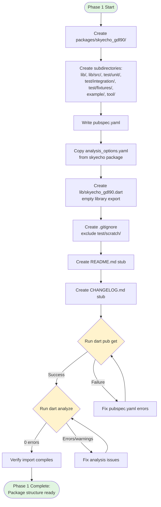
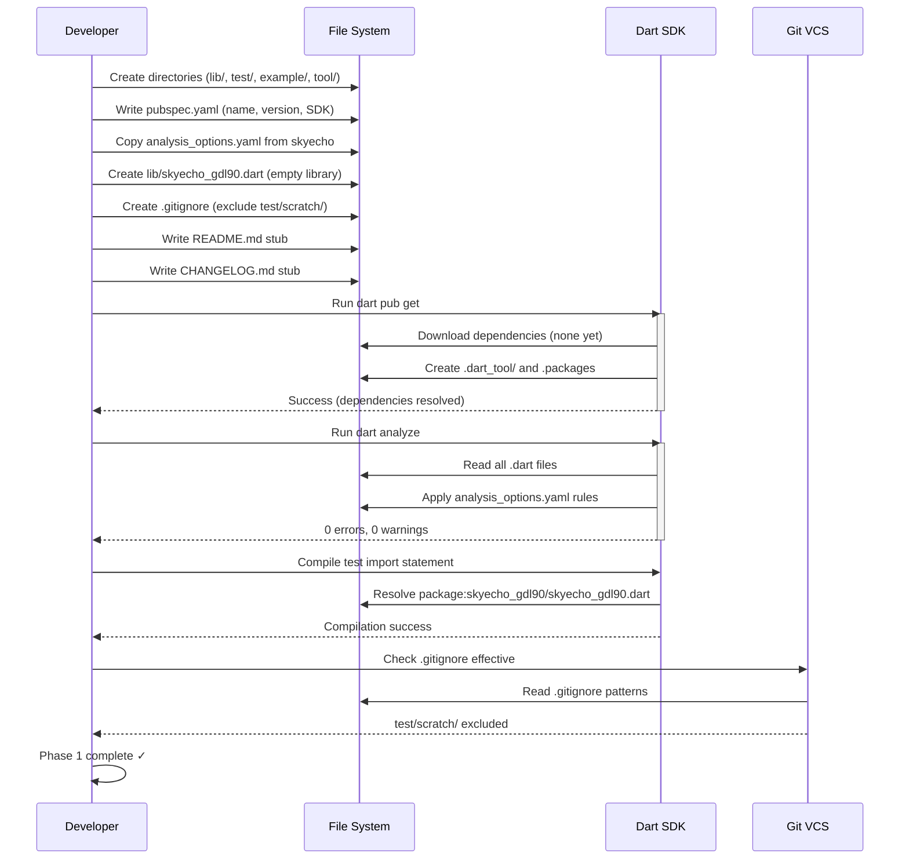

# Phase 1: Project Setup & Package Structure - Tasks & Alignment Brief

**Phase**: 1 of 12
**Slug**: `phase-1-project-setup`
**Created**: 2025-10-18
**Plan**: [gdl90-receiver-parser-plan.md](../../gdl90-receiver-parser-plan.md)
**Spec**: [gdl90-receiver-parser-spec.md](../../gdl90-receiver-parser-spec.md)

---

## Tasks

| Status | ID | Task | Type | Dependencies | Absolute Path(s) | Validation | Notes |
|--------|-----|------|------|--------------|------------------|------------|-------|
| [ ] | T001 | Create root package directory | Setup | – | /Users/jordanknight/github/skyecho-controller-app/packages/skyecho_gdl90/ | Directory exists and is accessible | Foundation for all subsequent tasks |
| [ ] | T002 | Create lib/ source directory | Setup | T001 | /Users/jordanknight/github/skyecho-controller-app/packages/skyecho_gdl90/lib/ | Directory exists | Will contain parser implementation |
| [ ] | T003 | Create lib/src/ internal sources directory | Setup | T002 | /Users/jordanknight/github/skyecho-controller-app/packages/skyecho_gdl90/lib/src/ | Directory exists | Internal implementation (not exported directly) |
| [ ] | T004 | Create test/unit/ directory for unit tests | Setup | T001 | /Users/jordanknight/github/skyecho-controller-app/packages/skyecho_gdl90/test/unit/ | Directory exists | TDD unit tests (fast, offline) |
| [ ] | T005 | Create test/integration/ directory for integration tests | Setup | T001 | /Users/jordanknight/github/skyecho-controller-app/packages/skyecho_gdl90/test/integration/ | Directory exists | Integration tests (may require device) |
| [ ] | T006 | Create test/fixtures/ directory for binary test data | Setup | T001 | /Users/jordanknight/github/skyecho-controller-app/packages/skyecho_gdl90/test/fixtures/ | Directory exists | Captured GDL90 binary fixtures |
| [ ] | T007 | Create example/ directory for demonstration code | Setup | T001 | /Users/jordanknight/github/skyecho-controller-app/packages/skyecho_gdl90/example/ | Directory exists | CLI listener demo (Phase 10) |
| [ ] | T008 | Create tool/ directory for utilities | Setup | T001 | /Users/jordanknight/github/skyecho-controller-app/packages/skyecho_gdl90/tool/ | Directory exists | Capture/playback utilities (Phase 9-10) |
| [ ] | T009 | Write pubspec.yaml with package metadata | Core | T001 | /Users/jordanknight/github/skyecho-controller-app/packages/skyecho_gdl90/pubspec.yaml | Valid YAML, dart pub get succeeds | Plan task 1.2; Add test package to dev_dependencies |
| [ ] | T010 | Copy and audit analysis_options.yaml from skyecho package | Setup | T001 | /Users/jordanknight/github/skyecho-controller-app/packages/skyecho_gdl90/analysis_options.yaml, /Users/jordanknight/github/skyecho-controller-app/packages/skyecho/analysis_options.yaml | File exists, rules customized for binary parsing, dart analyze runs without errors | Plan task 1.3; Copy then audit for binary parsing patterns (15min) |
| [ ] | T011 | Create lib/skyecho_gdl90.dart main library export | Core | T002 | /Users/jordanknight/github/skyecho-controller-app/packages/skyecho_gdl90/lib/skyecho_gdl90.dart | File compiles, exports library statement | Plan task 1.4; Exports hello.dart for validation |
| [ ] | T011a | Create lib/src/hello.dart validation function | Core | T003 | /Users/jordanknight/github/skyecho-controller-app/packages/skyecho_gdl90/lib/src/hello.dart | Function exists, returns validation string | Trivial code to validate infrastructure; removed in Phase 2 |
| [ ] | T011b | Create test/unit/hello_test.dart validation test | Core | T004, T011a | /Users/jordanknight/github/skyecho-controller-app/packages/skyecho_gdl90/test/unit/hello_test.dart | Test passes, proves package resolution works | First test validates infrastructure; removed in Phase 2 |
| [ ] | T012 | Create .gitignore with broad scratch patterns | Setup | T001 | /Users/jordanknight/github/skyecho-controller-app/packages/skyecho_gdl90/.gitignore | Scratch code excluded from git (any location) | Plan task 1.5; Broader patterns catch scratch_* files anywhere |
| [ ] | T013 | Create README.md stub with package name | Doc | T001 | /Users/jordanknight/github/skyecho-controller-app/packages/skyecho_gdl90/README.md | File exists with package name and placeholder | Plan task 1.6; Completed in Phase 11 |
| [ ] | T014 | Create CHANGELOG.md stub | Doc | T001 | /Users/jordanknight/github/skyecho-controller-app/packages/skyecho_gdl90/CHANGELOG.md | File exists with version 0.1.0 header | Standard Dart package convention |
| [ ] | T015 | Run dart pub get to validate package | Integration | T009 | /Users/jordanknight/github/skyecho-controller-app/packages/skyecho_gdl90/ | Command succeeds, .dart_tool/ created | Plan task 1.7; Verify dependencies resolve |
| [ ] | T016 | Run dart analyze to verify no errors | Integration | T010, T011, T015 | /Users/jordanknight/github/skyecho-controller-app/packages/skyecho_gdl90/ | 0 errors, 0 warnings reported | Plan task 1.8; Validates with real code |
| [ ] | T017 | Run dart test to verify infrastructure works | Integration | T011b, T015 | /Users/jordanknight/github/skyecho-controller-app/packages/skyecho_gdl90/ | Test passes, proves package/import/export chain | Real validation with passing test |
| [ ] | T018 | Document package structure in README stub | Doc | T013 | /Users/jordanknight/github/skyecho-controller-app/packages/skyecho_gdl90/README.md | Structure section added | Aid future contributors |

---

## Alignment Brief

### Objective

Establish the foundational package structure for `skyecho_gdl90` following Dart/pub.dev conventions and monorepo patterns from Plan 001. This phase creates the scaffolding for all subsequent implementation phases but does **not** implement any GDL90 parsing logic.

**Behavior Checklist** (from Plan Acceptance Criteria):
- [ ] Package directory structure matches `packages/skyecho/` conventions
- [ ] `dart pub get` succeeds without errors
- [ ] `dart analyze` runs clean (0 errors, 0 warnings)
- [ ] Test directories created and empty (no test files yet)
- [ ] Can import package with `import 'package:skyecho_gdl90/skyecho_gdl90.dart';` (even though library is empty)

---

### Non-Goals (Scope Boundaries)

❌ **NOT doing in this phase**:

1. **Any GDL90 parsing implementation** - No CRC, framing, or message parsing code. Those come in Phases 2-7.
2. **Production test files** - Only trivial validation test (`hello_test.dart`) to prove infrastructure. Real tests start in Phase 2 (CRC tests).
3. **Multiple dependencies** - Only `test` package in `dev_dependencies` for validation test. No other dependencies.
4. **Example code** - `example/` directory created but remains empty until Phase 10.
5. **Tool utilities** - `tool/` directory created but no capture/playback scripts until Phases 9-10.
6. **Full README documentation** - Only stub with package name. Full documentation in Phase 11.
7. **CI/CD configuration** - No GitHub Actions, CI scripts, or coverage setup. Package structure only.
8. **Git repository initialization** - Assume parent monorepo already initialized. No new `.git/` directory.
9. **Version pinning of dev_dependencies** - Will add when `test:` package is needed in Phase 2.

---

### Critical Findings Affecting This Phase

**None directly impact Phase 1.**

Phase 1 is foundational setup with no parsing logic. Critical Discoveries 01-05 from the plan affect later phases:
- **Discovery 01** (CRC-16-CCITT) → Phase 2
- **Discovery 02** (Framing/Escaping) → Phase 3
- **Discovery 03** (Lat/Lon Semicircles) → Phase 6
- **Discovery 04** (Single Message Model) → Phase 4
- **Discovery 05** (Wrapper Pattern) → Phase 4

This phase establishes the directory structure where those implementations will live.

---

### Invariants & Guardrails

**Package Conventions**:
- Follow `packages/skyecho/` structure exactly (monorepo consistency)
- Use Dart package naming: lowercase with underscores (`skyecho_gdl90`)
- Pub.dev compatible structure (even if not published initially)

**Dart SDK Constraints**:
- SDK: `>=3.0.0 <4.0.0` (modern Dart, stable features)
- No Flutter dependencies (pure Dart library)
- Platform: VM, iOS, Android, desktop (exclude web initially)

**Quality Gates**:
- `dart analyze` must pass with 0 errors, 0 warnings
- `dart pub get` must succeed
- All files follow Dart style guide (validated by `analysis_options.yaml`)

**Security**:
- No secrets, API keys, or credentials in package (open source library)
- `.gitignore` prevents accidental commit of scratch tests

---

### Inputs to Read

**Reference Package Structure** (from Plan 001):
- `/Users/jordanknight/github/skyecho-controller-app/packages/skyecho/pubspec.yaml` - Copy SDK constraints, metadata format
- `/Users/jordanknight/github/skyecho-controller-app/packages/skyecho/analysis_options.yaml` - Copy linting rules exactly
- `/Users/jordanknight/github/skyecho-controller-app/packages/skyecho/.gitignore` - Review patterns (if exists)

**Project Documentation**:
- `/Users/jordanknight/github/skyecho-controller-app/docs/plans/002-gdl90-receiver-parser/gdl90-receiver-parser-spec.md` - Package summary for README
- `/Users/jordanknight/github/skyecho-controller-app/docs/rules-idioms-architecture/idioms.md` - Dart idioms to follow

**Dart Package Conventions**:
- Pub.dev package layout guidelines (standard Dart structure)
- Effective Dart style guide (naming, file organization)

---

### Visual Alignment Aids

#### Flow Diagram: Package Structure Setup



#### Sequence Diagram: Package Validation Workflow



---

### Test Plan

**Approach**: Lightweight testing for Phase 1 (setup phase, no parsing logic)

**TDD Not Applicable**: This is infrastructure setup. No unit tests written in Phase 1. TDD begins in Phase 2 with CRC tests.

**Validation Method**: Integration checks only
- Run `dart pub get` (must succeed)
- Run `dart analyze` (must return 0 errors, 0 warnings)
- Verify import statement compiles
- Check directories exist

**No Test Files Created**:
- `test/unit/` - Created but empty
- `test/integration/` - Created but empty
- `test/fixtures/` - Created but empty

**Future Phases**:
- Phase 2: First test files (`test/unit/crc_test.dart`)
- Phase 12: Integration tests (`test/integration/device_smoke_test.dart`)

---

### Step-by-Step Implementation Outline

**Mapped 1:1 to tasks T001-T018**:

1. **T001-T008: Directory Structure**
   - Create root package directory
   - Create all required subdirectories (lib/, lib/src/, test/unit/, test/integration/, test/fixtures/, example/, tool/)

2. **T009: pubspec.yaml**
   ```yaml
   name: skyecho_gdl90
   description: Pure-Dart library for receiving and parsing GDL90 aviation data streams
   version: 0.1.0
   repository: https://github.com/jordanknight/skyecho-controller-app

   environment:
     sdk: '>=3.0.0 <4.0.0'

   # No runtime dependencies
   dependencies:

   dev_dependencies:
     test: ^1.24.0  # For validation test in Phase 1
   ```

3. **T010: analysis_options.yaml** (Copy and Audit)
   - Copy from `packages/skyecho/analysis_options.yaml` as baseline
   - Audit rules for binary parsing appropriateness (~15 minutes):
     - Enable `prefer_int_literals: true` (for 0x7E, 0x7D flag bytes)
     - Enable strict type checking for Uint8List operations
     - Document GDL90-specific overrides with comments
   - Ensures monorepo style consistency with domain customization

4. **T011: lib/skyecho_gdl90.dart**
   ```dart
   /// Pure-Dart library for receiving and parsing GDL90 aviation data streams.
   library skyecho_gdl90;

   // Temporary validation export (removed in Phase 2)
   export 'src/hello.dart';

   // Future exports (added in Phases 2-8):
   // export 'src/crc.dart';
   // export 'src/framer.dart';
   // export 'src/parser.dart';
   // export 'src/models/gdl90_message.dart';
   // export 'src/models/gdl90_event.dart';
   // export 'src/stream/gdl90_stream.dart';
   ```

4a. **T011a: lib/src/hello.dart** (Validation Function)
   ```dart
   /// Temporary validation function to prove package infrastructure works.
   ///
   /// **DELETION NOTE**: This file will be deleted at the start of Phase 2.
   /// See Phase 2 tasks.md "Pre-Phase 2 Cleanup" section for removal checklist.
   String hello() => 'GDL90 parser ready';
   ```

4b. **T011b: test/unit/hello_test.dart** (Validation Test)
   ```dart
   import 'package:skyecho_gdl90/skyecho_gdl90.dart';
   import 'package:test/test.dart';

   void main() {
     test('package_structure_validation', () {
       // Purpose: Validates package resolution, exports, imports, linter
       // This test proves the Phase 1 infrastructure actually works
       //
       // **DELETION NOTE**: This file will be deleted at the start of Phase 2.
       // See Phase 2 tasks.md "Pre-Phase 2 Cleanup" section for removal checklist.
       expect(hello(), equals('GDL90 parser ready'));
     });
   }
   ```

5. **T012: .gitignore** (Broad Scratch Patterns)
   ```
   # Dart SDK
   .dart_tool/
   .packages
   build/
   pubspec.lock

   # Coverage
   coverage/

   # Scratch/temporary code (not committed - promote to test/unit/ when ready)
   # Convention: Use test/scratch/ directory OR scratch_* prefix for experiments
   **/scratch/
   **/scratch_*
   **/*_scratch.*

   # IDE
   .idea/
   .vscode/
   *.iml
   ```

6. **T013: README.md stub** (with Scratch Convention)
   ```markdown
   # skyecho_gdl90

   Pure-Dart library for receiving and parsing GDL90 aviation data streams from SkyEcho and other ADS-B devices.

   **Status**: Work in progress (Phase 1 - project setup)

   ## Installation

   Coming soon.

   ## Usage

   Coming soon.

   ## Development

   ### Scratch Testing Convention

   **Temporary experiments** should use either:
   1. `test/scratch/` directory (gitignored), OR
   2. `scratch_*.dart` filename prefix (gitignored)

   **Promote to** `test/unit/` when test adds durable value.

   `.gitignore` patterns ensure scratch code never commits accidentally.

   ## Documentation

   See [docs/how/skyecho-gdl90/](../../docs/how/skyecho-gdl90/) (to be created in Phase 11).
   ```

7. **T014: CHANGELOG.md stub**
   ```markdown
   # Changelog

   ## 0.1.0 (Unreleased)

   - Initial package structure
   - Phase 1: Project setup and scaffolding
   ```

8. **T015-T017: Validation**
   - Run `dart pub get` in package directory (resolves `test` dependency)
   - Run `dart analyze` (expect 0 errors, 0 warnings on real code)
   - Run `dart test` (validation test passes, proves infrastructure works)

9. **T018: Document structure in README**
   - Add directory structure section to README stub

---

### Commands to Run

**Environment Setup** (from package root: `/Users/jordanknight/github/skyecho-controller-app/packages/skyecho_gdl90/`):

```bash
# Verify Dart SDK installed
dart --version
# Expected: Dart SDK version 3.x.x or higher

# Install dependencies (none yet, but validates pubspec)
dart pub get
# Expected: "Got dependencies!"

# Run static analysis
dart analyze
# Expected: "No issues found!"

# Verify no formatter issues (optional)
dart format --output=none --set-exit-if-changed .
# Expected: Exit code 0 (no changes needed)
```

**Validation Commands**:

```bash
# Check directory structure
ls -la
# Expected: lib/, test/, example/, tool/, pubspec.yaml, analysis_options.yaml, README.md

# Verify test directories
ls test/
# Expected: unit/, integration/, fixtures/

# Verify library export file
cat lib/skyecho_gdl90.dart
# Expected: library skyecho_gdl90; (and comments)

# Verify .gitignore works
git status
# Expected: test/scratch/ not listed if created

# Test import compilation (create temp test file)
echo "import 'package:skyecho_gdl90/skyecho_gdl90.dart';" > /tmp/test_import.dart
dart analyze /tmp/test_import.dart
# Expected: No issues
rm /tmp/test_import.dart
```

---

### Risks/Unknowns

| Risk | Severity | Likelihood | Mitigation |
|------|----------|------------|------------|
| **Dart SDK version mismatch** | Medium | Low | Pin SDK to `>=3.0.0 <4.0.0`, document in README |
| **Monorepo path issues** | Low | Low | Follow Plan 001 structure exactly; verify with skyecho package |
| **analysis_options.yaml conflicts** | Low | Low | Copy from skyecho package verbatim; test with dart analyze |
| **Accidental commit of scratch tests** | Low | Medium | .gitignore test/scratch/ from start; verify with git status |
| **Package naming conflicts** | Low | Very Low | Search pub.dev for `skyecho_gdl90` before publishing (future) |

**Mitigation Steps**:
1. Verify Dart SDK >=3.0.0 before starting (run `dart --version`)
2. Copy `analysis_options.yaml` exactly from `packages/skyecho/`
3. Run `dart analyze` after every file creation
4. Test `.gitignore` effectiveness with `git status`

---

### Ready Check

**Pre-Implementation Checklist**:

- [ ] Dart SDK >=3.0.0 installed and accessible
- [ ] Monorepo root directory confirmed: `/Users/jordanknight/github/skyecho-controller-app/`
- [ ] `packages/skyecho/` exists as reference for structure
- [ ] `packages/skyecho/analysis_options.yaml` readable (to copy)
- [ ] Plan and spec reviewed and understood
- [ ] Directory paths confirmed (absolute paths validated)

**Post-Implementation Checklist** (will be verified during execution):

- [ ] All directories created (lib/, lib/src/, test/unit/, test/integration/, test/fixtures/, example/, tool/)
- [ ] pubspec.yaml written with correct name, version, SDK constraint
- [ ] analysis_options.yaml copied from skyecho package
- [ ] lib/skyecho_gdl90.dart created (empty library export)
- [ ] .gitignore created with test/scratch/ exclusion
- [ ] README.md stub written
- [ ] CHANGELOG.md stub written
- [ ] `dart pub get` succeeds
- [ ] `dart analyze` returns 0 errors, 0 warnings
- [ ] Package import compiles: `import 'package:skyecho_gdl90/skyecho_gdl90.dart';`

---

## Phase Footnote Stubs

**NOTE**: Footnotes will be added during implementation (plan-6). This section is a placeholder.

Footnote ledger entries will be added to the main plan document (`gdl90-receiver-parser-plan.md`) after Phase 1 execution, documenting any deviations, discoveries, or implementation notes.

**Format** (for reference):
```
[^1]: <what-changed> | <why> | <files-affected> | <tests-added>
```

---

## Evidence Artifacts

**Execution Log**:
- ✅ Created: `/Users/jordanknight/github/skyecho-controller-app/docs/plans/002-gdl90-receiver-parser/tasks/phase-1-project-setup/execution.log.md`
- Documents: task completion timestamps, command outputs, validation results, deviations from plan

**Package Created**:
- ✅ Package directory: `/Users/jordanknight/github/skyecho-controller-app/packages/skyecho_gdl90/`
- ✅ All quality gates passed: `dart pub get`, `dart analyze` (0 errors), `dart test` (1/1 passed)

**Supporting Files**:
- See execution.log.md for complete file listing and unified diffs

**Phase 2 Handoff Notes**:
- **Pre-Phase 2 Cleanup Required**: Validation artifacts (hello.dart, hello_test.dart) must be removed before starting CRC tests
- Phase 2 tasks.md should include "Pre-Phase 2 Cleanup" section with 4-step checklist:
  1. Delete `lib/src/hello.dart`
  2. Delete `test/unit/hello_test.dart`
  3. Remove `export 'src/hello.dart';` from `lib/skyecho_gdl90.dart`
  4. Run `dart analyze` to verify clean state (0 errors)
  5. Commit: "chore: Remove Phase 1 validation artifacts"

**Directory Layout** (after Phase 1 execution):
```
/Users/jordanknight/github/skyecho-controller-app/docs/plans/002-gdl90-receiver-parser/
├── gdl90-receiver-parser-spec.md
├── gdl90-receiver-parser-plan.md
└── tasks/
    └── phase-1-project-setup/
        ├── tasks.md                    # This file
        └── execution.log.md            # Created by plan-6
```

**Package Directory Layout** (after Phase 1 execution):
```
/Users/jordanknight/github/skyecho-controller-app/packages/skyecho_gdl90/
├── lib/
│   ├── skyecho_gdl90.dart              # Main library export (empty)
│   └── src/                            # Internal sources (empty)
├── test/
│   ├── unit/                           # Unit tests (empty)
│   ├── integration/                    # Integration tests (empty)
│   └── fixtures/                       # Binary test data (empty)
├── example/                            # Example code (empty)
├── tool/                               # Utilities (empty)
├── pubspec.yaml                        # Package metadata
├── analysis_options.yaml               # Linting rules
├── .gitignore                          # Git exclusions
├── README.md                           # Package documentation stub
└── CHANGELOG.md                        # Version history stub
```

---

## Critical Insights Discussion

**Session**: 2025-10-19
**Context**: Phase 1 Project Setup & Package Structure - Tasks Document Review
**Analyst**: AI Clarity Agent
**Reviewer**: Development Team
**Format**: Water Cooler Conversation (5 Critical Insights)

### Insight 1: Monorepo Pattern Commitment

**Did you know**: By placing `packages/skyecho_gdl90/` alongside `packages/skyecho/`, you're making a long-term architectural commitment affecting Flutter app integration, versioning strategy, and future package extraction feasibility.

**Implications**:
- Flutter app must use path dependencies (not pub.dev) for both packages
- Shared Git history forever - extracting GDL90 to separate repo later requires Git filter-branch
- Cross-package refactoring is easier (atomic commits), but changes ripple more
- Pub.dev publishing is optional - packages can live as path dependencies indefinitely

**Options Considered**:
- Option A: Proceed with Monorepo (Current Plan) - Simple, easy cross-package refactoring
- Option B: Separate Repository with Git Submodules - Clean separation, complex workflow
- Option C: Separate Repository with Pub.dev Dependency - Maximum separation, versioning overhead
- Option D: Monorepo + Documented Extraction Procedure - Fast development, future optionality

**AI Recommendation**: Option D (Monorepo with Extraction Documentation)
- Reasoning: Matches current velocity, preserves future optionality if GDL90 proves valuable to aviation community

**Discussion Summary**:
User confirmed packages are tightly coupled to SkyEcho project with no intention to publish independently.

**Decision**: Proceed with monorepo pattern (Option A) - packages remain tightly coupled

**Action Items**:
- None - proceed with `packages/skyecho_gdl90/` as planned

**Affects**: Phase 1 package structure (no changes needed)

---

### Insight 2: The Empty Package Validation Trap

**Did you know**: Running `dart analyze` on an empty package passes with "No issues found!" but this success is meaningless - you haven't validated linter rules, package resolution, or directory structure actually work.

**Implications**:
- False sense of security after Phase 1 completion
- Critical configuration errors (analysis_options.yaml typos, pubspec.yaml issues) deferred to Phase 2
- First real validation happens when writing CRC tests, potentially interrupting TDD flow
- Package name resolution could fail when adding dependency from another package

**Options Considered**:
- Option A: Add Trivial Code to Phase 1 for Real Validation - Proves infrastructure works, minimal overhead
- Option B: Accept Empty Package Risk, Validate in Phase 2 - Current plan, deferred validation
- Option C: Enhanced Validation Script - Checks common gotchas without code
- Option D: Manual Configuration Review Checklist - Human review, not enforced

**AI Recommendation**: Option A (Add Trivial Code for Real Validation)
- Reasoning: Proves package resolution, exports, imports, linter actually work before Phase 2 TDD begins; only 10 minutes overhead

**Discussion Summary**:
User agreed to add trivial validation code (hello.dart + hello_test.dart) to prove infrastructure.

**Decision**: Add trivial validation function and test to Phase 1

**Action Items**:
- [x] Add `lib/src/hello.dart` with validation function (Task T011a)
- [x] Export from `lib/skyecho_gdl90.dart` (Task T011 updated)
- [x] Add `test/unit/hello_test.dart` with simple test (Task T011b)
- [x] Add `test` package to `dev_dependencies` in pubspec.yaml (Task T009 updated)

**Affects**: Tasks T009, T011, T016, T017; Non-goals section; Step-by-step implementation

---

### Insight 3: The `analysis_options.yaml` Copy Trap

**Did you know**: Copying `analysis_options.yaml` from `packages/skyecho/` (HTTP screen-scraping code) to `packages/skyecho_gdl90/` (binary protocol parsing) might inherit linter rules inappropriate for bitwise operations and strict integer handling.

**Implications**:
- False positives: Linter complains about valid bitwise code patterns
- False negatives: Missing warnings about integer overflow in semicircle conversion
- Maintenance coupling: When skyecho's rules change, GDL90 inherits them automatically
- Developer confusion: "Why is the linter complaining about this valid bit shift?"

**Options Considered**:
- Option A: Copy and Audit (Recommended for Monorepo) - Shares baseline style, customizes for binary parsing
- Option B: Copy Verbatim (Current Plan) - Zero effort, potential mismatch
- Option C: Start from Dart Pedantic/Effective Dart Baseline - Clean slate, might diverge from monorepo style
- Option D: Create Shared Monorepo `analysis_options.yaml` - Single source of truth, requires refactoring skyecho

**AI Recommendation**: Option A (Copy and Audit)
- Reasoning: Maintains monorepo style consistency while customizing for binary protocol domain; 15-minute audit prevents future frustration

**Discussion Summary**:
User agreed to audit analysis_options.yaml for binary parsing appropriateness.

**Decision**: Copy and audit `analysis_options.yaml` for binary parsing (15 minutes)

**Action Items**:
- [x] Update Task T010 to include audit step
- [x] Document audit checklist (prefer_int_literals: true, strict type checking)
- [x] Add GDL90-specific overrides with comments

**Affects**: Task T010; Step-by-step implementation section

---

### Insight 4: The Phase 2 Deletion Cascade

**Did you know**: When deleting validation artifacts (hello.dart, hello_test.dart) at the start of Phase 2, you must also update **four other places** or Phase 2 fails immediately with "Target of URI doesn't exist" errors.

**Implications**:
- Manual 4-step checklist required (delete 2 files, remove export, verify analyze)
- Error-prone: Easy to delete files but forget to update lib/skyecho_gdl90.dart export
- Interrupts TDD flow: Phase 2 should start with "write failing CRC test", not "debug broken package"
- Git history noise: Commit adds validation code, commit removes it

**Options Considered**:
- Option A: Add Deletion Checklist to Phase 2 Tasks - Clear instructions, minimal Phase 1 effort
- Option B: Create Cleanup Script - One command, no mistakes
- Option C: Skip Validation Code, Keep Empty Package - No cleanup needed, loses Insight #2 benefits
- Option D: Keep Validation Code Until Phase 11 - No mid-project cleanup, dead code for 10 phases
- Option E: Use Comment Instead of Deletion - Easy to reverse, anti-pattern

**AI Recommendation**: Option A (Add Deletion Checklist to Phase 2 Tasks)
- Reasoning: Maintains clean code, documents process, minimal overhead (5min to add checklist, 2min to execute)

**Discussion Summary**:
User agreed to add deletion checklist to Phase 2 tasks for clean transition.

**Decision**: Add "Pre-Phase 2 Cleanup" section to Phase 2 tasks.md

**Action Items**:
- [x] Add deletion notes to hello.dart and hello_test.dart code examples
- [x] Add "Phase 2 Handoff Notes" section with 4-step cleanup checklist

**Affects**: Phase 2 tasks document (to be created); Phase 1 code examples and handoff notes

---

### Insight 5: The Silent Git Ignore Configuration Risk

**Did you know**: The `.gitignore` pattern `test/scratch/` only excludes the directory if exactly named `scratch` one level under `test`, meaning `test/unit/scratch_crc.dart` or `test/scratch_integration/` will be **committed to Git** even though they're clearly temporary.

**Implications**:
- Narrow scope: Only `test/scratch/` directory ignored, not scratch files elsewhere
- False security: You think scratch code is safe, but it's not
- Git history pollution: Temporary experiments accidentally committed
- Potential secrets leak: Debug code with hardcoded IPs, credentials gets exposed

**Options Considered**:
- Option A: Broader Gitignore Patterns (Recommended) - Catches scratch code anywhere, future-proof
- Option B: Strict Directory Convention (Current Plan) - Simple, relies on discipline
- Option C: Pre-Commit Hook - Automated enforcement, can be bypassed
- Option D: Workspace-Level Gitignore - Personal patterns, not shared across team
- Option E: Combination (A + Documentation) - Belt-and-suspenders approach

**AI Recommendation**: Option E (Broader Patterns + Documentation)
- Reasoning: Prevents accidents with broad patterns, documents "scratch_ prefix" convention for team alignment

**Discussion Summary**:
User agreed to use broader gitignore patterns and document the scratch file convention.

**Decision**: Use broader gitignore patterns (`**/scratch/`, `**/scratch_*`, `**/*_scratch.*`) + document convention

**Action Items**:
- [x] Update Task T012 with broader .gitignore patterns
- [x] Add "Development > Scratch Testing Convention" section to README stub (Task T013)
- [x] Document both test/scratch/ directory and scratch_* prefix options

**Affects**: Task T012 (.gitignore), Task T013 (README)

---

## Session Summary

**Insights Surfaced**: 5 critical insights identified and discussed
**Decisions Made**: 5 decisions reached through collaborative discussion
**Action Items Created**: 11 task updates applied immediately during session
**Areas Requiring Updates**:
- Tasks table: T009, T010, T011 (split into T011/T011a/T011b), T012, T013, T016, T017
- Non-goals section: Updated to reflect validation test inclusion
- Step-by-step implementation: Updated pubspec.yaml, analysis_options.yaml, code examples
- Phase 2 handoff: Added cleanup checklist for validation artifacts

**Shared Understanding Achieved**: ✓

**Confidence Level**: High - All configuration risks identified and mitigated

**Next Steps**:
All insights incorporated into Phase 1 tasks. Ready for GO/NO-GO decision.

**Notes**:
All updates applied immediately during discussion (not deferred to end). Phase 1 tasks document now reflects all 5 decisions with updated task descriptions, code examples, and documentation.

---

**STOP**: Do not proceed to implementation. Await explicit **GO/NO-GO** decision.

**Next Step** (after approval): Run `/plan-6-implement-phase --phase "Phase 1: Project Setup & Package Structure"`
