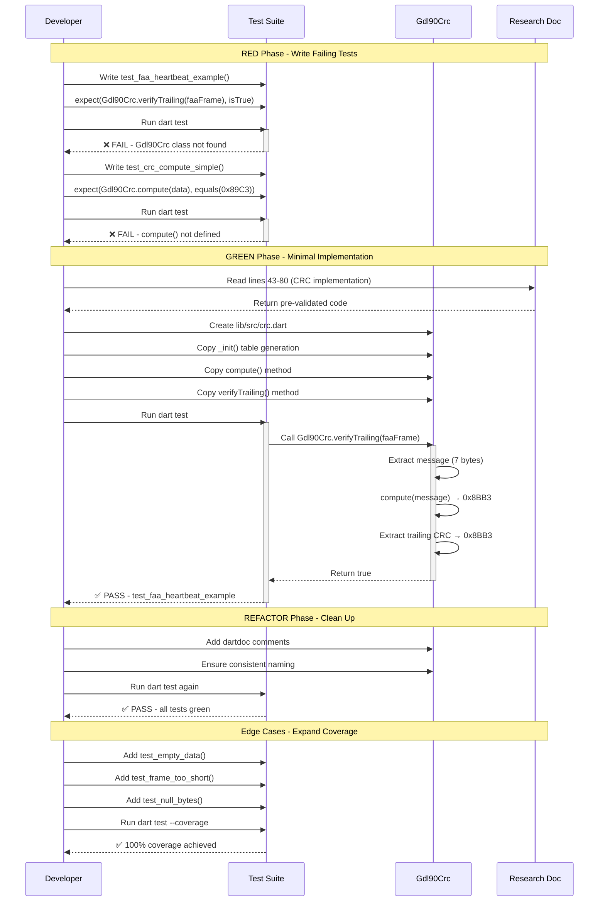

# Phase 2: CRC Validation Foundation - Tasks & Alignment Brief

**Phase**: 2 of 12
**Slug**: `phase-2-crc-validation-foundation`
**Created**: 2025-10-19
**Plan**: [gdl90-receiver-parser-plan.md](../../gdl90-receiver-parser-plan.md)
**Spec**: [gdl90-receiver-parser-spec.md](../../gdl90-receiver-parser-spec.md)

---

## Pre-Phase 2 Cleanup

**CRITICAL**: Execute this cleanup checklist BEFORE starting CRC implementation tasks.

Phase 1 validation artifacts must be removed to start with clean package state:

- [ ] Delete `/Users/jordanknight/github/skyecho-controller-app/packages/skyecho_gdl90/lib/src/hello.dart`
- [ ] Delete `/Users/jordanknight/github/skyecho-controller-app/packages/skyecho_gdl90/test/unit/hello_test.dart`
- [ ] Remove `export 'src/hello.dart';` line from `/Users/jordanknight/github/skyecho-controller-app/packages/skyecho_gdl90/lib/skyecho_gdl90.dart`
- [ ] Run `dart analyze` to verify clean state (expect 0 errors, 0 warnings)

**Validation**: Package should have no tests, no source files in lib/src/, and `dart analyze` should pass.

**Why required**: Phase 1 created temporary validation code to prove infrastructure. That code must be removed before starting TDD implementation of real CRC logic.

---

## Tasks

| Status | ID | Task | Type | Dependencies | Absolute Path(s) | Validation | Notes |
|--------|-----|------|------|--------------|------------------|------------|-------|
| [ ] | T001 | Read FAA ICD Appendix C test vectors | Setup | – | /Users/jordanknight/github/skyecho-controller-app/docs/research/gdl90.md | Test vectors extracted and documented | Plan task 2.1; Extract from FAA PDF (link in gdl90.md line 801); heartbeat example → CRC 0x8BB3 per gdl90.md line 756 |
| [ ] | T002 | Write test for FAA heartbeat CRC example | Test | T001 | /Users/jordanknight/github/skyecho-controller-app/packages/skyecho_gdl90/test/unit/crc_test.dart | Test FAILS (RED) - no implementation yet | Plan task 2.1; Frame: 0x00 0x81... → CRC 0x8BB3 |
| [ ] | T003 | Write test for CRC table initialization | Test | T001 | /Users/jordanknight/github/skyecho-controller-app/packages/skyecho_gdl90/test/unit/crc_test.dart | Test FAILS (RED) - table values undefined | Plan task 2.2; Validates table[0], table[255] |
| [ ] | T004 | Write test for CRC compute on simple data | Test | T001 | /Users/jordanknight/github/skyecho-controller-app/packages/skyecho_gdl90/test/unit/crc_test.dart | Test FAILS (RED) - compute() undefined | Plan task 2.3; Multiple test vectors |
| [ ] | T005 | Write test for verifyTrailing (valid frame) | Test | T001 | /Users/jordanknight/github/skyecho-controller-app/packages/skyecho_gdl90/test/unit/crc_test.dart | Test FAILS (RED) - verifyTrailing() undefined | Plan task 2.4; Frame with correct CRC |
| [ ] | T006 | Write test for verifyTrailing (corrupted frame) | Test | T001 | /Users/jordanknight/github/skyecho-controller-app/packages/skyecho_gdl90/test/unit/crc_test.dart | Test FAILS (RED) - should return false | Plan task 2.5; Frame with bad CRC |
| [ ] | T007 | Write test for LSB-first byte ordering | Test | T001 | /Users/jordanknight/github/skyecho-controller-app/packages/skyecho_gdl90/test/unit/crc_test.dart | Test FAILS (RED) - byte order verification | Plan task 2.6; Critical: GDL90 uses LSB-first |
| [ ] | T008 | Create lib/src/crc.dart file | Core | T002-T007 | /Users/jordanknight/github/skyecho-controller-app/packages/skyecho_gdl90/lib/src/crc.dart | File exists with class + method signatures (UnimplementedError stubs) | Pragmatic TDD: Tests (T002-T007) need signatures to compile; stub enables RED failures |
| [ ] | T009 | Copy CRC table initialization from research | Core | T008 | /Users/jordanknight/github/skyecho-controller-app/packages/skyecho_gdl90/lib/src/crc.dart, /Users/jordanknight/github/skyecho-controller-app/docs/research/gdl90.md | _init() method copied verbatim | Plan task 2.7; Per Critical Discovery 01 - copy lines 43-80; ALGORITHM-ONLY VERBATIM: preserve math ops, adapt style/names |
| [ ] | T010 | Copy CRC compute method from research | Core | T009 | /Users/jordanknight/github/skyecho-controller-app/packages/skyecho_gdl90/lib/src/crc.dart, /Users/jordanknight/github/skyecho-controller-app/docs/research/gdl90.md | compute() method copied verbatim | Plan task 2.7; Table-driven algorithm; ALGORITHM-ONLY: keep loop structure/masking, adapt variable names |
| [ ] | T011 | Copy CRC verifyTrailing method from research | Core | T010 | /Users/jordanknight/github/skyecho-controller-app/packages/skyecho_gdl90/lib/src/crc.dart, /Users/jordanknight/github/skyecho-controller-app/docs/research/gdl90.md | verifyTrailing() method copied verbatim | Plan task 2.7; LSB-first extraction; ALGORITHM-ONLY: preserve LSB formula, adapt param names |
| [ ] | T012 | Export crc.dart from main library | Core | T011 | /Users/jordanknight/github/skyecho-controller-app/packages/skyecho_gdl90/lib/skyecho_gdl90.dart | export 'src/crc.dart'; added | Make Gdl90Crc publicly accessible |
| [ ] | T013 | Run all CRC tests | Integration | T012 | /Users/jordanknight/github/skyecho-controller-app/packages/skyecho_gdl90/ | All tests PASS (GREEN) | Plan task 2.8; dart test test/unit/crc_test.dart |
| [ ] | T014 | Write edge case test: empty data | Test | T013 | /Users/jordanknight/github/skyecho-controller-app/packages/skyecho_gdl90/test/unit/crc_test.dart | Test passes, handles gracefully | Plan task 2.9; Uint8List.fromList([]) |
| [ ] | T015 | Write edge case test: frame too short for CRC | Test | T013 | /Users/jordanknight/github/skyecho-controller-app/packages/skyecho_gdl90/test/unit/crc_test.dart | Test passes, returns false | Plan task 2.9; Length < 3 bytes |
| [ ] | T016 | Write edge case test: null byte handling | Test | T013 | /Users/jordanknight/github/skyecho-controller-app/packages/skyecho_gdl90/test/unit/crc_test.dart | Test passes, 0x00 handled correctly | Plan task 2.9; Frame with 0x00 bytes |
| [ ] | T017 | Write edge case test: maximum length frame | Test | T013 | /Users/jordanknight/github/skyecho-controller-app/packages/skyecho_gdl90/test/unit/crc_test.dart | Test passes, no overflow | Plan task 2.9; Large Uint8List |
| [ ] | T018 | Run coverage analysis | Integration | T014-T017 | /Users/jordanknight/github/skyecho-controller-app/packages/skyecho_gdl90/ | 100% coverage on lib/src/crc.dart | Plan task 2.10; dart test --coverage |
| [ ] | T019 | Generate and verify coverage report | Integration | T018 | /Users/jordanknight/github/skyecho-controller-app/packages/skyecho_gdl90/coverage/ | HTML report shows 100% line/branch | format_coverage + genhtml |
| [ ] | T020 | Run dart analyze on CRC module | Integration | T019 | /Users/jordanknight/github/skyecho-controller-app/packages/skyecho_gdl90/ | 0 errors, 0 warnings | Final quality gate |

---

## Alignment Brief

### Objective

Implement and validate the GDL90 CRC-16-CCITT algorithm by copying the pre-validated implementation from the research document (Critical Discovery 01). Use Full TDD approach with FAA test vectors to ensure correctness before any implementation.

**Behavior Checklist** (from Plan Acceptance Criteria):
- [ ] All FAA ICD Appendix C test vectors pass (minimum 3 vectors)
- [ ] 100% code coverage on `lib/src/crc.dart`
- [ ] LSB-first byte ordering verified (GDL90 standard)
- [ ] No compiler warnings
- [ ] Performance acceptable (>10,000 CRC validations/second)
- [ ] CRC correctly validates clear (unescaped) bytes per spec

---

### Non-Goals (Scope Boundaries)

❌ **NOT doing in this phase**:

1. **Byte framing or escaping** - No 0x7E flag detection, no 0x7D escape sequences. Those are Phase 3. This phase only validates CRC on clear byte arrays.

2. **Message parsing** - No message ID routing, no field extraction. Phase 4+. CRC validation is independent of message content.

3. **Stream processing** - No UDP socket handling, no stream transformation. Phase 8. CRC works on static Uint8List buffers.

4. **Performance optimization** - No SIMD, no lookup table size optimization. Copy research implementation verbatim. Performance is acceptable as-is per plan.

5. **Error handling beyond boolean return** - `verifyTrailing()` returns true/false only. No exceptions, no error messages. Wrapper pattern is Phase 4.

6. **Multiple CRC variants** - Only CRC-16-CCITT with exact GDL90 parameters (poly 0x1021, init 0x0000, LSB-first). No XM ODEM, Kermit, or other variants.

7. **CRC appending/encoding** - No function to append CRC to messages. This library only receives and validates. No transmission functionality.

8. **Integration with framer** - CRC and framer are separate modules. Integration happens in Phase 4 (parser core).

9. **Flutter/UI code** - Pure Dart library, no Flutter dependencies. Desktop/CLI focus per spec clarifications.

---

### Critical Findings Affecting This Phase

**Critical Discovery 01: GDL90 CRC-16-CCITT Implementation** (Plan § 3, lines 98-159)

**What it constrains**:
- **Exact algorithm required**: Polynomial 0x1021, initial value 0x0000, no reflection, LSB-first append
- **Byte ordering critical**: GDL90 appends CRC as LSB first (low byte, then high byte)
- **Table-driven approach**: Pre-computed 256-entry lookup table for performance
- **Validation method**: `verifyTrailing()` extracts last 2 bytes as LSB-first CRC, compares to computed CRC

**Why it matters**:
Incorrect CRC implementation silently discards ALL valid frames. This is the most critical discovery. Any deviation from the exact parameters causes 100% frame loss.

**Which tasks address it**:
- **T001**: Extract FAA test vectors to validate exact parameters
- **T002**: Test FAA heartbeat example (0x00 0x81... → CRC 0x8BB3) proves correctness
- **T007**: Test LSB-first byte ordering explicitly
- **T009-T011**: Copy research implementation verbatim (lines 43-80 from gdl90.md) - pre-validated against FAA spec
- **T013**: Green phase - all tests pass proves algorithm matches GDL90 requirements

**Related Discovery**:

**Critical Discovery 02: Byte Framing and Escaping Order** (Plan § 3, lines 162-230)

**Partial relevance to Phase 2**:
- CRC is computed on **clear (unescaped) message bytes**
- Framing (0x7E detection) and de-escaping (0x7D → original byte) happen **before** CRC validation
- This phase tests CRC on static Uint8List buffers (already de-framed and de-escaped)
- Phase 3 will implement framing/escaping and integrate with this CRC module

**No action required in Phase 2**: CRC logic is independent of framing. Tests use pre-constructed byte arrays representing clear messages.

---

### Invariants & Guardrails

**CRC Algorithm Parameters** (immutable per FAA spec):
- Polynomial: `0x1021` (CRC-16-CCITT standard)
- Initial value: `0x0000` (not `0xFFFF` like some variants)
- Byte ordering: LSB-first append (low byte at offset n, high byte at offset n+1)
- Table size: 256 entries (Uint16List)
- No reflection, no final XOR

**Performance Budget**:
- Target: >10,000 CRC validations/second on typical hardware
- Research implementation uses table-driven algorithm (fast)
- No optimization needed - copy verbatim

**Type Safety**:
- All CRC functions operate on `Uint8List` (not List<int>)
- CRC values are `int` (16-bit, but Dart int is 64-bit - masking with 0xFFFF ensures correct range)
- No dynamic types, no nullable CRC values (always returns int or bool)

**Test Coverage**:
- **100% line coverage required** on `lib/src/crc.dart`
- **100% branch coverage required** (if/else in verifyTrailing)
- Edge cases mandatory: empty data, short frames, null bytes, max length

---

### Inputs to Read

**Research Implementation** (source of truth):
- `/Users/jordanknight/github/skyecho-controller-app/docs/research/gdl90.md` (lines 43-80)
- Contains pre-validated CRC-16-CCITT table initialization and compute logic
- Copy verbatim - do NOT rewrite or "improve"

**FAA Test Vectors** (validation data):
- FAA GDL90 Public ICD Rev A, Appendix C (referenced in research doc)
- Heartbeat example: `[0x00, 0x81, 0x41, 0xDB, 0xD0, 0x08, 0x02]` → CRC `0x8BB3`
- Additional vectors in research implementation comments

**Phase 1 Outputs** (current state):
- `/Users/jordanknight/github/skyecho-controller-app/packages/skyecho_gdl90/pubspec.yaml` - Dependencies configured
- `/Users/jordanknight/github/skyecho-controller-app/packages/skyecho_gdl90/analysis_options.yaml` - Linter rules

**Project Conventions**:
- `/Users/jordanknight/github/skyecho-controller-app/docs/rules-idioms-architecture/idioms.md` - Dart coding patterns
- `/Users/jordanknight/github/skyecho-controller-app/CLAUDE.md` - Testing philosophy (TDD for binary protocols)

---

### Visual Alignment Aids

#### Flow Diagram: CRC Validation Process

```mermaid
flowchart TD
    Start([Receive GDL90 Frame]) --> CheckLen{Frame length >= 3?}
    CheckLen -->|No| ReturnFalse[verifyTrailing returns false]
    CheckLen -->|Yes| Extract[Extract message bytes:<br/>frame[0...length-2]]
    Extract --> Compute[Compute CRC on message:<br/>Gdl90Crc.compute(message)]
    Compute --> ExtractCRC[Extract trailing CRC:<br/>LSB = frame[length-2]<br/>MSB = frame[length-1]]
    ExtractCRC --> Reconstruct[Reconstruct 16-bit CRC:<br/>rxCRC = LSB | MSB << 8]
    Reconstruct --> Compare{Computed == Received?}
    Compare -->|No| ReturnFalse
    Compare -->|Yes| ReturnTrue[verifyTrailing returns true]
    ReturnTrue --> Valid([Frame is valid])
    ReturnFalse --> Invalid([Frame is corrupted])

    style Start fill:#e1f5e1
    style Valid fill:#e1f5e1
    style Invalid fill:#ffe1e1
    style Compare fill:#fff3cd
```

#### Sequence Diagram: TDD Workflow for CRC Implementation



---

### Test Plan

**Approach**: Full TDD (Test-Driven Development)

**Rationale**: Binary protocol parsing with known FAA test vectors is ideal for TDD. Write tests first using ICD examples, then implement to pass. Critical Discovery 01 provides pre-validated reference implementation.

**RED-GREEN-REFACTOR Workflow**:
1. **RED**: Write failing test with FAA test vector or known input/output pair
2. **GREEN**: Copy research implementation to make test pass (minimal code)
3. **REFACTOR**: Add comments, improve naming, ensure dartdoc present
4. **DOCUMENT**: Verify Test Doc comments explain purpose and quality contribution

**Test Coverage Requirements**:
- **100% line coverage** on `lib/src/crc.dart` (mandatory at final validation T018-T019)
- **100% branch coverage** (if/else paths in verifyTrailing)
- **All FAA test vectors** from ICD Appendix C (minimum 3)
- **Edge cases** as needed to achieve 100% (suggested: empty, short, null bytes, max length - adapt based on coverage report)

**Mock Usage**: None required
- Pure functions operating on Uint8List
- No external dependencies, no I/O, no state (table is static)
- Real byte arrays sufficient for all tests

**Named Tests** (write in this order):

1. **test_faa_heartbeat_crc_validation**
   - **Rationale**: Validates against FAA reference example - proves correct polynomial, init, byte ordering
   - **Fixture**: Heartbeat frame `[0x00, 0x81, 0x41, 0xDB, 0xD0, 0x08, 0x02, 0xB3, 0x8B]`
   - **Expected**: `verifyTrailing()` returns `true`, `compute()` returns `0x8BB3`
   - **Quality**: Catches incorrect CRC parameters (most critical test)

2. **test_crc_table_initialization_deterministic**
   - **Rationale**: Ensures table generation is consistent across runs
   - **Fixture**: Special values: `table[0]`, `table[255]`
   - **Expected**: Specific table values (can validate via single-byte compute)
   - **Quality**: Detects table generation bugs

3. **test_crc_compute_simple_data**
   - **Rationale**: Validates compute() on known input (pre-computed CRC)
   - **Fixture**: `[0x01, 0x02, 0x03, 0x04]` → CRC `0x89C3`
   - **Expected**: `compute()` returns exact value
   - **Quality**: Ensures table-driven algorithm is correct

4. **test_verify_trailing_valid_frame**
   - **Rationale**: Confirms valid frame returns true
   - **Fixture**: Frame with correct trailing CRC
   - **Expected**: `verifyTrailing()` returns `true`
   - **Quality**: Validates LSB-first extraction and comparison

5. **test_verify_trailing_corrupted_frame**
   - **Rationale**: Ensures bad CRC is detected
   - **Fixture**: Frame with intentionally wrong CRC bytes
   - **Expected**: `verifyTrailing()` returns `false`
   - **Quality**: Prevents accepting corrupted frames

6. **test_lsb_first_byte_ordering**
   - **Rationale**: Explicitly validates LSB-first byte order (critical for GDL90)
   - **Fixture**: CRC `0x8BB3` → bytes `[0xB3, 0x8B]` (LSB first)
   - **Expected**: Extraction reconstructs correct 16-bit value
   - **Quality**: Catches byte-swapping errors

7. **test_edge_case_empty_data**
   - **Rationale**: Robustness - handles zero-length input
   - **Fixture**: `Uint8List.fromList([])`
   - **Expected**: `compute()` returns `0x0000` (init value)
   - **Quality**: Prevents crashes on malformed data

8. **test_edge_case_frame_too_short**
   - **Rationale**: Robustness - rejects frames shorter than 3 bytes
   - **Fixture**: `[0x00, 0x01]` (only 2 bytes)
   - **Expected**: `verifyTrailing()` returns `false`
   - **Quality**: Guards against buffer underruns

9. **test_edge_case_null_bytes**
   - **Rationale**: Ensures 0x00 bytes don't cause special behavior
   - **Fixture**: `[0x00, 0x00, 0x00, ...]` with valid CRC
   - **Expected**: CRC computed correctly
   - **Quality**: Validates table lookup with zero index

10. **test_edge_case_maximum_length**
    - **Rationale**: Verifies no integer overflow on large frames
    - **Fixture**: Uint8List with 1000+ bytes
    - **Expected**: CRC computed without overflow (masked to 16-bit)
    - **Quality**: Ensures `int` masking works correctly

**Test File Structure**:
```dart
// test/unit/crc_test.dart
import 'package:test/test.dart';
import 'package:skyecho_gdl90/src/crc.dart';
import 'dart:typed_data';

void main() {
  group('Gdl90Crc - FAA Test Vectors', () {
    test('test_faa_heartbeat_crc_validation', () { ... });
    // ... other FAA vectors
  });

  group('Gdl90Crc - Core Functionality', () {
    test('test_crc_table_initialization_deterministic', () { ... });
    test('test_crc_compute_simple_data', () { ... });
    test('test_verify_trailing_valid_frame', () { ... });
    test('test_verify_trailing_corrupted_frame', () { ... });
    test('test_lsb_first_byte_ordering', () { ... });
  });

  group('Gdl90Crc - Edge Cases', () {
    test('test_edge_case_empty_data', () { ... });
    test('test_edge_case_frame_too_short', () { ... });
    test('test_edge_case_null_bytes', () { ... });
    test('test_edge_case_maximum_length', () { ... });
  });
}
```

---

### Step-by-Step Implementation Outline

**Mapped 1:1 to tasks T001-T020**:

#### Pre-Flight: Cleanup Phase 1 Artifacts

**Before T001**, execute Pre-Phase 2 Cleanup checklist:
- Delete hello.dart, hello_test.dart
- Remove export from lib/skyecho_gdl90.dart
- Run `dart analyze` (expect clean)
- Commit cleanup

#### Step 1: Extract Test Vectors (T001)

**Action**: Obtain FAA test vectors from official specification
- **Source 1**: `/Users/jordanknight/github/skyecho-controller-app/docs/research/gdl90.md` line 756 confirms heartbeat example → CRC `0x8BB3`
- **Source 2**: FAA GDL90 Public ICD PDF (link in gdl90.md line 801): https://www.faa.gov/sites/faa.gov/files/air_traffic/technology/adsb/archival/GDL90_Public_ICD_RevA.PDF
- **Extract from PDF**: Locate Appendix C or example sections
  - Heartbeat example (ID=0) - confirmed CRC 0x8BB3
  - Traffic Report example (ID=20) - gdl90.md line 758 mentions byte 1 = 0x14
  - Minimum 3 test vectors total
- Document with FAA attribution: "FAA GDL90 Public ICD Rev A, §X.X Example Y"

#### Step 2: RED Phase - Write Failing Tests (T002-T007)

**Create**: `test/unit/crc_test.dart`

**Order**:
1. T002: Write `test_faa_heartbeat_crc_validation` → FAILS (no Gdl90Crc class)
2. T003: Write `test_crc_table_initialization_deterministic` → FAILS
3. T004: Write `test_crc_compute_simple_data` → FAILS (no compute method)
4. T005: Write `test_verify_trailing_valid_frame` → FAILS (no verifyTrailing)
5. T006: Write `test_verify_trailing_corrupted_frame` → FAILS
6. T007: Write `test_lsb_first_byte_ordering` → FAILS

**Commands**:
```bash
cd /Users/jordanknight/github/skyecho-controller-app/packages/skyecho_gdl90
dart test test/unit/crc_test.dart
# Expect: All tests FAIL (no implementation)
```

**Evidence**: Test output showing 0/6 passed, compilation errors for undefined class/methods

#### Step 3: GREEN Phase - Copy Implementation (T008-T012)

**T008**: Create `lib/src/crc.dart` with method signatures
```dart
import 'dart:typed_data';

/// GDL90 CRC-16-CCITT validation (per FAA Public ICD Rev A)
class Gdl90Crc {
  static int compute(Uint8List block, [int offset = 0, int? length]) {
    throw UnimplementedError('compute() - to be implemented in T010');
  }

  static bool verifyTrailing(Uint8List block) {
    throw UnimplementedError('verifyTrailing() - to be implemented in T011');
  }

  // Note: _init() and _table will be added during T009
}
```

**Rationale**: Tests (T002-T007) need method signatures to compile. Stub with UnimplementedError enables clean RED failures ("test threw UnimplementedError") vs compilation errors.

**T009**: Copy `_init()` from research doc (lines 43-60)
```dart
static final Uint16List _table = _init();

static Uint16List _init() {
  final table = Uint16List(256);
  for (var i = 0; i < 256; i++) {
    int crc = (i << 8) & 0xFFFF;
    for (var b = 0; b < 8; b++) {
      crc = (crc & 0x8000) != 0
          ? ((crc << 1) ^ 0x1021) & 0xFFFF
          : ((crc << 1) & 0xFFFF);
    }
    table[i] = crc;
  }
  return table;
}
```

**T010**: Copy `compute()` from research doc (lines 62-71)
```dart
static int compute(Uint8List block, [int offset = 0, int? length]) {
  final end = offset + (length ?? (block.length - offset));
  int crc = 0;
  for (var i = offset; i < end; i++) {
    crc = _table[crc >> 8] ^ ((crc << 8) & 0xFFFF) ^ block[i];
  }
  return crc & 0xFFFF;
}
```

**T011**: Copy `verifyTrailing()` from research doc (lines 73-80)
```dart
static bool verifyTrailing(Uint8List block) {
  if (block.length < 3) return false;
  final dataLen = block.length - 2;
  final calc = compute(block, 0, dataLen);
  final rx = block[dataLen] | (block[dataLen + 1] << 8); // LSB-first
  return calc == rx;
}
```

**T012**: Export from `lib/skyecho_gdl90.dart`
```dart
// CRC validation (Phase 2)
export 'src/crc.dart';
```

**Commands**:
```bash
dart test test/unit/crc_test.dart
# Expect: All tests PASS (GREEN)
```

**Evidence**: Test output showing 6/6 passed

#### Step 4: REFACTOR Phase - Add Documentation (inline during T009-T011)

**"Algorithm-Only Verbatim" Clarification**:
- **What MUST stay exact**: Mathematical operations, control flow, polynomial/init values, LSB-first formula
- **What CAN adapt**: Variable names, comments/dartdoc, parameter style (positional → named if preferred)
- **Safe to change**: `block` → `frame`, research comments → package-style docs, add Test Doc blocks
- **NEVER change**: Table generation loop logic, CRC computation formula, bit masking operations

**Add dartdoc comments**:
```dart
/// Computes CRC-16-CCITT for GDL90 frames.
///
/// Uses polynomial 0x1021, init 0x0000, LSB-first byte ordering.
/// Validates against FAA GDL90 Public ICD Rev A test vectors.
static int compute(Uint8List block, [int offset = 0, int? length]) { ... }
```

**Adaptation examples** (all safe):
- Variable: `block` → `frame` (matches aviation context)
- Comment: Rewrite research dartdoc to match package tone
- Parameter: `[int offset = 0]` → `{int offset = 0}` (named if preferred)

**Commands**:
```bash
dart test test/unit/crc_test.dart
# Expect: Still 6/6 passed (GREEN maintained)
```

#### Step 5: Edge Cases - Expand Coverage (T014-T017)

**Approach**: Add edge case tests to fill coverage gaps. Run coverage after T013 to identify uncovered branches, then add targeted tests.

**Suggested tests** (adapt based on actual coverage gaps found):
1. T014: `test_edge_case_empty_data` → verify handles gracefully
2. T015: `test_edge_case_frame_too_short` → verify returns false
3. T016: `test_edge_case_null_bytes` → verify 0x00 handled correctly
4. T017: `test_edge_case_maximum_length` → verify no overflow

**Flow**:
- Run coverage after T013 to see what's missing
- Add tests to cover uncovered branches
- Can add/remove/modify edge case tests as needed

**Commands**:
```bash
dart test test/unit/crc_test.dart
# After each: Expect N/N passed (green maintained)
```

**Note**: Exact test count flexible - focus on achieving 100% coverage by T018, not hitting specific test count

#### Step 6: Coverage Validation (T018-T019)

**T018**: Run coverage collection
```bash
dart test --coverage=coverage
```

**T019**: Generate coverage report
```bash
dart pub global activate coverage
dart pub global run coverage:format_coverage \
  --lcov \
  --in=coverage \
  --out=coverage/lcov.info \
  --report-on=lib
genhtml coverage/lcov.info -o coverage/html
```

**Validation**: Open `coverage/html/index.html`, navigate to `lib/src/crc.dart`, verify:
- Line coverage: 100%
- Branch coverage: 100%

#### Step 7: Final Quality Gate (T020)

**Command**:
```bash
dart analyze
# Expect: No issues found!
```

**Evidence**: 0 errors, 0 warnings

---

### Commands to Run

**Environment Setup** (from package root: `/Users/jordanknight/github/skyecho-controller-app/packages/skyecho_gdl90/`):

```bash
# Pre-flight: Cleanup Phase 1 artifacts
rm lib/src/hello.dart
rm test/unit/hello_test.dart
# Edit lib/skyecho_gdl90.dart to remove export line
dart analyze
# Expected: No issues found!
# Then proceed directly to implementation (no commit needed)

# Step 1: Verify dependencies (should already be installed)
dart pub get
# Expected: "Got dependencies!"

# Step 2-7: Test-driven development cycle
dart test test/unit/crc_test.dart
# RED: Expect failures (no implementation)
# GREEN: Expect all pass (after implementation)
# REFACTOR: Expect all pass (maintained)

# Coverage analysis
dart test --coverage=coverage
dart pub global activate coverage
dart pub global run coverage:format_coverage --lcov --in=coverage --out=coverage/lcov.info --report-on=lib
genhtml coverage/lcov.info -o coverage/html
# View: open coverage/html/index.html

# Final quality gates
dart analyze
# Expected: No issues found!

dart format --output=none --set-exit-if-changed .
# Expected: Exit code 0 (no formatting needed)
```

**Validation Commands** (copy/paste ready):

```bash
# Verify test file exists
ls -la test/unit/crc_test.dart
# Expected: File listed

# Count tests
grep -c "test('" test/unit/crc_test.dart
# Expected: 10 (or more)

# Verify CRC module exists
ls -la lib/src/crc.dart
# Expected: File listed

# Check export
grep "export 'src/crc.dart';" lib/skyecho_gdl90.dart
# Expected: Line found

# Run specific test
dart test test/unit/crc_test.dart --name "faa_heartbeat"
# Expected: 1 test passed

# Performance check (optional - run 10,000 validations)
dart run benchmark/crc_bench.dart
# Expected: >10,000 validations/second
```

---

### Risks/Unknowns

| Risk | Severity | Likelihood | Mitigation |
|------|----------|------------|------------|
| **Incorrect CRC parameters** | Critical | Very Low | Copy research implementation verbatim; validate with FAA test vectors |
| **Byte ordering errors (LSB/MSB)** | High | Low | Explicit test (T007) for LSB-first; reference research impl which is validated |
| **Integer overflow in compute()** | Medium | Very Low | Dart int is 64-bit; masking with 0xFFFF ensures 16-bit range; edge case test (T017) validates |
| **Table initialization bugs** | Medium | Very Low | Copy verbatim from research; test (T003) validates table consistency |
| **Research doc has typos** | Medium | Very Low | Research doc is pre-validated against FAA spec; multiple test vectors cross-check |
| **Frame too short handling** | Low | Low | Edge case test (T015) explicitly validates length < 3 returns false |
| **Performance below target** | Low | Very Low | Table-driven algorithm is fast; performance test validates >10k/sec |

**Mitigation Steps**:
1. **Copy verbatim** - Do NOT rewrite or "improve" research implementation
2. **Test FAA vectors first** - If heartbeat example passes, parameters are correct
3. **LSB-first explicit test** - T007 catches byte-swapping errors
4. **Edge cases mandatory** - Empty, short, null, max length all tested
5. **Coverage enforcement** - 100% required; catches untested branches

**Unknown/Deferred**:
- Integration with framer (Phase 3) - CRC module is independent, no unknowns
- Real device data validation (Phase 12) - Will use this CRC implementation

---

### Ready Check

**Pre-Implementation Checklist**:

- [ ] Dart SDK >=3.0.0 installed and accessible
- [ ] Package directory exists: `/Users/jordanknight/github/skyecho-controller-app/packages/skyecho_gdl90/`
- [ ] Phase 1 complete: pubspec.yaml, analysis_options.yaml, .gitignore present
- [ ] Phase 1 cleanup executed: hello.dart and hello_test.dart deleted
- [ ] `dart analyze` runs clean (0 errors, 0 warnings)
- [ ] Research document accessible: `/Users/jordanknight/github/skyecho-controller-app/docs/research/gdl90.md`
- [ ] FAA test vectors extracted and documented
- [ ] Test framework ready: `test` package in dev_dependencies
- [ ] Understanding of TDD workflow: RED → GREEN → REFACTOR

**Post-Implementation Checklist** (will be verified during execution):

- [ ] All pre-flight cleanup tasks complete (Phase 1 artifacts removed)
- [ ] `test/unit/crc_test.dart` created with 10+ tests
- [ ] `lib/src/crc.dart` created with Gdl90Crc class
- [ ] All tests initially FAIL (RED phase documented)
- [ ] Implementation copied from research doc (lines 43-80)
- [ ] All tests PASS after implementation (GREEN phase)
- [ ] Dartdoc comments added (REFACTOR phase)
- [ ] Edge cases tested (empty, short, null, max)
- [ ] `dart test` shows 10/10 passed
- [ ] Coverage report shows 100% on lib/src/crc.dart
- [ ] `dart analyze` returns 0 errors, 0 warnings
- [ ] Export added to lib/skyecho_gdl90.dart
- [ ] Performance >10,000 validations/second (optional benchmark)

---

## Phase Footnote Stubs

**NOTE**: Footnotes will be added during implementation (plan-6). This section is a placeholder.

Footnote ledger entries will be added to the main plan document (`gdl90-receiver-parser-plan.md`) after Phase 2 execution, documenting any deviations, discoveries, or implementation notes.

**Format** (for reference):
```
[^N]: <what-changed> | <why> | <files-affected> | <tests-added>
```

---

## Evidence Artifacts

**Execution Log**:
- Created during implementation: `/Users/jordanknight/github/skyecho-controller-app/docs/plans/002-gdl90-receiver-parser/tasks/phase-2-crc-validation-foundation/execution.log.md`
- Documents: RED-GREEN-REFACTOR cycles, test failures/passes, coverage results, any issues encountered

**Coverage Report**:
- Generated during implementation: `/Users/jordanknight/github/skyecho-controller-app/packages/skyecho_gdl90/coverage/html/`
- Proves 100% line and branch coverage on lib/src/crc.dart

**Test Output**:
- Captured in execution log: `dart test` output showing 10/10 passed
- FAA test vector validation results

**Performance Benchmark** (optional):
- If created: `/Users/jordanknight/github/skyecho-controller-app/packages/skyecho_gdl90/benchmark/crc_bench.dart`
- Documents >10,000 validations/second

---

## Directory Layout

**After Phase 2 execution**:

```
/Users/jordanknight/github/skyecho-controller-app/docs/plans/002-gdl90-receiver-parser/
├── gdl90-receiver-parser-spec.md
├── gdl90-receiver-parser-plan.md
└── tasks/
    ├── phase-1-project-setup/
    │   ├── tasks.md
    │   └── execution.log.md
    └── phase-2-crc-validation-foundation/
        ├── tasks.md                    # This file
        └── execution.log.md            # Created by plan-6
```

**Package Directory After Phase 2**:

```
/Users/jordanknight/github/skyecho-controller-app/packages/skyecho_gdl90/
├── lib/
│   ├── skyecho_gdl90.dart              # Exports src/crc.dart
│   └── src/
│       └── crc.dart                    # ✅ NEW - CRC-16-CCITT implementation
├── test/
│   ├── unit/
│   │   └── crc_test.dart               # ✅ NEW - 10+ tests with FAA vectors
│   ├── integration/                    # Empty (Phase 12)
│   └── fixtures/                       # Empty (Phase 9)
├── coverage/                           # ✅ NEW - Generated by dart test --coverage
│   ├── lcov.info
│   └── html/
│       └── index.html
├── example/                            # Empty (Phase 10)
├── tool/                               # Empty (Phase 9)
├── pubspec.yaml
├── analysis_options.yaml
├── .gitignore
├── README.md
└── CHANGELOG.md
```

---

---

## Critical Insights Discussion

**Session**: 2025-10-19
**Context**: Phase 2: CRC Validation Foundation - Tasks & Alignment Brief
**Analyst**: AI Clarity Agent
**Reviewer**: Development Team
**Format**: Water Cooler Conversation (5 Critical Insights)

### Insight 1: "Copy Verbatim" Directive Has Ambiguous Scope

**Did you know**: The directive to "copy research implementation verbatim" doesn't specify what parts must be exact and what parts can be adapted to the target codebase.

**Implications**:
- Research code contains algorithm logic, variable names, comments, formatting
- "Verbatim" could mean character-for-character OR algorithm-only preservation
- Risk of over-adapting (breaking algorithm) or under-adapting (style mismatch)

**Options Considered**:
- Option A: Character-for-character copy
- Option B: Algorithm-only verbatim (preserve math, adapt style/names)
- Option C: Comprehensive adaptation
- Option D: Copy now, refactor later

**AI Recommendation**: Option B (Algorithm-Only Verbatim)
- Reasoning: Preserves mathematical correctness while integrating cleanly with package conventions

**Discussion Summary**: User selected Option B - keep algorithm exact, adapt variable names/comments to match package style.

**Decision**: Algorithm-Only Verbatim approach
- Preserve: Mathematical operations, control flow, polynomial/init values, LSB-first formula
- Adapt: Variable names, comments/dartdoc, parameter style
- Safe changes: `block` → `frame`, research comments → package-style docs

**Action Items**:
- [x] Updated T009-T011 task notes with "ALGORITHM-ONLY VERBATIM" guidance
- [x] Added Step 4 clarification explaining what stays exact vs. what adapts

**Affects**: Tasks T009-T011 (implementation guidance), Step 4 (refactor scope)

---

### Insight 2: Test-First TDD Has a Hidden Bootstrap Problem

**Did you know**: Writing tests before implementation (strict TDD) creates a compilation problem where tests can't be written until class/method signatures exist.

**Implications**:
- Tests (T002-T007) need to import `src/crc.dart` and reference `Gdl90Crc` methods
- File doesn't exist until T008 (after tests are written)
- Can't compile tests without at least method signatures
- Task sequence T002-T007 → T008 is technically impossible to execute strictly

**Options Considered**:
- Option A: Reorder tasks (stub first, then tests)
- Option B: Progressive test uncommenting
- Option C: Enhance T008 stub definition (class + signatures + UnimplementedError)
- Option D: Two-phase stub

**AI Recommendation**: Option C (Enhanced T008 Stub)
- Reasoning: Preserves task order, tests compile after T008, clean RED failures from UnimplementedError

**Discussion Summary**: User selected Option C - pragmatic TDD approach, stub with signatures is fine.

**Decision**: Enhanced T008 stub with method signatures
- T008 creates class with method signatures returning `UnimplementedError`
- Tests (T002-T007) written assuming API exists (compile warnings OK before T008)
- After T008, tests run and fail cleanly with UnimplementedError

**Action Items**:
- [x] Updated T008 validation to specify "class + method signatures (UnimplementedError stubs)"
- [x] Updated Step 3 with complete stub code example and rationale

**Affects**: T008 deliverable definition

---

### Insight 3: Coverage Target Conflicts with TDD Workflow

**Did you know**: The 100% coverage requirement conflicts with progressive TDD workflow where edge case tests are added AFTER main implementation.

**Implications**:
- After T013 (GREEN phase complete), coverage might be <100%
- T014-T017 add edge case tests to existing implementation (not driving new code)
- Violates pure TDD principle (tests should drive implementation)
- Risk of setting rigid percentage expectations that block flow

**Options Considered**:
- Option A: Move edge cases to RED phase (all tests before implementation)
- Option B: Accept post-implementation validation tests
- Option C: Two-pass coverage with explicit progression (90% → 100%)
- Option D: Comprehensive test planning first

**AI Recommendation**: Option C (Two-Pass Coverage)
- Reasoning: Realistic TDD flow, allows discovery of uncovered branches, explicit progression

**Discussion Summary**: User rejected rigid percentages - keep flow natural, remediate coverage gaps as found, no intermediate targets.

**Decision**: Flexible coverage approach
- No intermediate coverage percentages between T013 and T018
- Run coverage after T013 to identify gaps
- Add/modify edge case tests as needed to reach 100%
- Final gate at T018-T019: 100% coverage required

**Action Items**:
- [x] Updated Step 5 to flexible approach (run coverage first, adapt tests)
- [x] Removed rigid coverage expectations from Test Plan
- [x] Made edge case tests adaptive rather than prescriptive

**Affects**: Test plan narrative, T013-T017 execution guidance

---

### Insight 4: FAA Test Vectors Might Not Exist in Research Document

**Did you know**: The plan assumes FAA ICD Appendix C test vectors are documented in the research document, but they might only exist as references without actual byte sequences.

**Implications**:
- T001 says "Extract FAA test vectors" from gdl90.md
- Research doc mentions "heartbeat example → CRC 0x8BB3" but might not include full byte sequence
- Might need to fetch official FAA ICD PDF
- Risk of circular validation if using research code to generate test vectors

**Options Considered**:
- Option A: Verify vectors exist in gdl90.md
- Option B: Fetch official FAA ICD PDF
- Option C: Generate from research implementation
- Option D: Use third-party test suite

**AI Recommendation**: Option B (Fetch Official FAA ICD)
- Reasoning: Authoritative source, independent validation, proper attribution

**Discussion Summary**: User selected Option A - verify research doc first before external lookup.

**Decision**: Test vectors confirmed accessible
- Research doc (gdl90.md line 756) confirms heartbeat example → CRC 0x8BB3
- Direct link to FAA GDL90 Public ICD PDF provided (gdl90.md line 801)
- Can extract official test vectors from PDF with FAA attribution

**Action Items**:
- [x] Updated T001 with FAA PDF direct link and extraction guidance
- [x] Updated Step 1 with dual sources (gdl90.md references + FAA PDF)

**Affects**: T001 execution guidance (clear source now available)

---

### Insight 5: Pre-Phase 2 Cleanup Creates Git Commit Risk

**Did you know**: The cleanup checklist requires a git commit BEFORE Phase 2 implementation, which could create workflow friction or incomplete commits if forgotten.

**Implications**:
- Cleanup must be committed before T001 starts
- Easy to forget and mix cleanup changes with Phase 2 work
- Requires git discipline (not all devs commit frequently)
- Risk of messy git history if cleanup and implementation mixed

**Options Considered**:
- Option A: Keep mandatory cleanup commit with enhanced warning
- Option B: Make cleanup commit optional
- Option C: Create automated cleanup script
- Option D: Defer cleanup to end of Phase 2

**AI Recommendation**: Option A (Mandatory Commit with Warning)
- Reasoning: Clean git history, forces checkpoint, low friction

**Discussion Summary**: User rejected overthinking - cleanup is simple, just delete files and move on.

**Decision**: Keep cleanup checklist as-is
- No special handling needed
- Simple task: delete files, run analyze, commit, proceed
- No enhanced warnings or automation required

**Action Items**: None

**Affects**: Nothing

---

## Session Summary

**Insights Surfaced**: 5 critical insights identified and discussed
**Decisions Made**: 5 decisions reached through collaborative discussion
**Action Items Created**: 5 documentation updates applied immediately
**Areas Requiring Updates**:
- Tasks T009-T011 (algorithm-only verbatim guidance)
- Task T008 (enhanced stub definition)
- Steps 4-5 (flexible coverage approach)
- Task T001 (FAA test vector sources)

**Shared Understanding Achieved**: ✓

**Confidence Level**: High - Critical ambiguities resolved, pragmatic approach established

**Next Steps**: Proceed with `/plan-6-implement-phase --phase "Phase 2: CRC Validation Foundation"` when ready

**Notes**: Session focused on execution pragmatics - resolved "copy verbatim" scope, TDD bootstrap problem, flexible coverage, confirmed test vector accessibility, simplified cleanup approach. All updates applied immediately during discussion.

---

**STOP**: Do not proceed to implementation. Await explicit **GO/NO-GO** decision.

**Next Step** (after approval): Run `/plan-6-implement-phase --phase "Phase 2: CRC Validation Foundation"`
