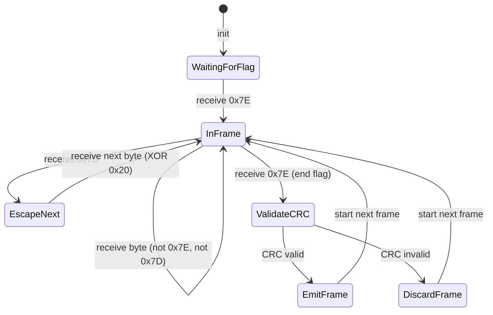
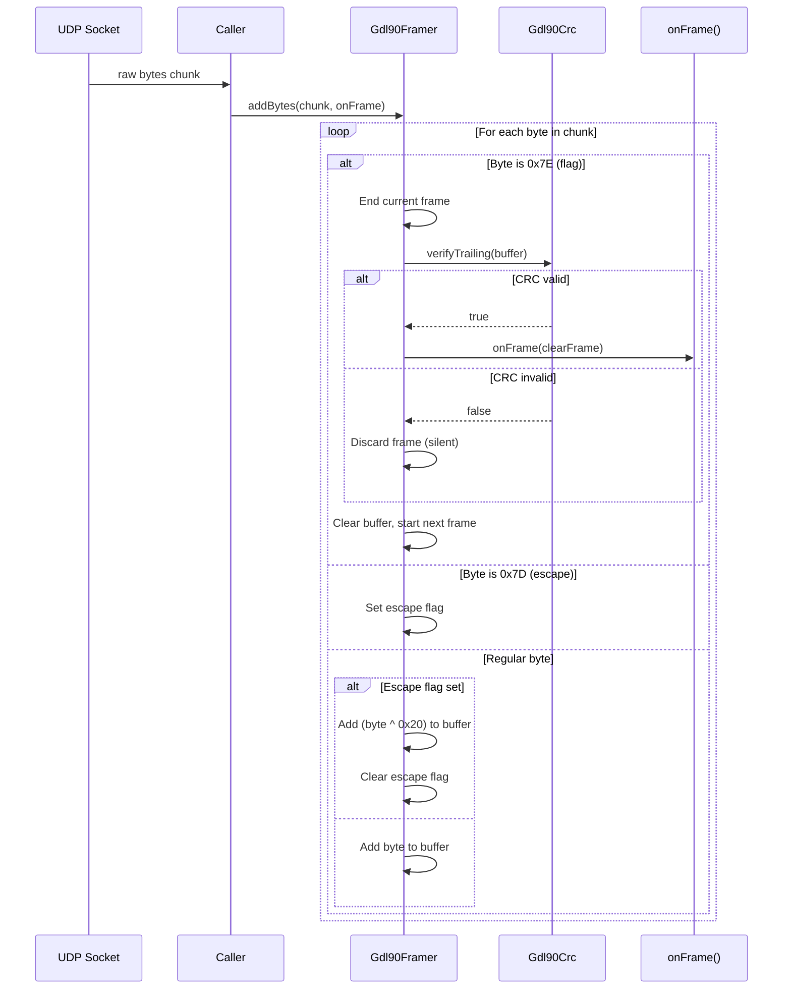

# Phase 3: Byte Framing & Escaping - Tasks + Alignment Brief

**Phase**: 3 of 12
**Created**: 2025-10-19
**Spec**: [gdl90-receiver-parser-spec.md](../../gdl90-receiver-parser-spec.md)
**Plan**: [gdl90-receiver-parser-plan.md](../../gdl90-receiver-parser-plan.md)
**Status**: COMPLETE (100%)

---

## Tasks

| Status | ID | Task | Type | Dependencies | Absolute Path(s) | Validation | Notes |
|--------|-----|------|------|--------------|------------------|------------|-------|
| [x] | T001 | Write test for single frame extraction with 0x7E delimiters | Test | – | /Users/jordanknight/github/skyecho-controller-app/packages/skyecho_gdl90/test/unit/framer_test.dart | Test validates: (1) detects 0x7E start/end flags, (2) extracts message bytes between flags, (3) validates CRC before emitting frame | Maps to plan task 3.1 · log#task-31-310-implement-framing-red-green-refactor [^1] |
| [x] | T002 | Write test for escape sequence handling at multiple positions (0x7D 0x5E → 0x7E, 0x7D 0x5D → 0x7D) | Test | T001 | /Users/jordanknight/github/skyecho-controller-app/packages/skyecho_gdl90/test/unit/framer_test.dart | Test validates: (1) 0x7D 0x5E de-escapes to 0x7E, (2) 0x7D 0x5D de-escapes to 0x7D, (3) CRC computed on de-escaped bytes, (4) escape at position 1 (immediately after message ID) works correctly; test data: clear message [00 7E 01 7D 02] → escaped [7E 00 7D5E 01 7D5D 02 [CRC] 7E] validates all positions | Per Critical Discovery 02 - de-escape before CRC; maps to plan task 3.2 · log#task-31-310-implement-framing-red-green-refactor [^1] |
| [x] | T003 | Write test for multiple frames in continuous stream | Test | T001 | /Users/jordanknight/github/skyecho-controller-app/packages/skyecho_gdl90/test/unit/framer_test.dart | Test validates: both frames extracted independently from stream: 7E [frame1] 7E [frame2] 7E | Maps to plan task 3.3 · log#task-31-310-implement-framing-red-green-refactor [^1] |
| [x] | T004 | Write test for invalid CRC frame rejection | Test | T001 | /Users/jordanknight/github/skyecho-controller-app/packages/skyecho_gdl90/test/unit/framer_test.dart | Test validates: (1) frame with corrupted CRC is silently discarded, (2) subsequent valid frame is parsed successfully | Maps to plan task 3.4 · log#task-31-310-implement-framing-red-green-refactor [^1] |
| [x] | T005 | Write test for incomplete frame buffering across addBytes calls | Test | T001 | /Users/jordanknight/github/skyecho-controller-app/packages/skyecho_gdl90/test/unit/framer_test.dart | Test validates: (1) partial frame (chunk1) produces no output, (2) completion (chunk2) emits complete frame | Maps to plan task 3.5 · log#task-31-310-implement-framing-red-green-refactor [^1] |
| [x] | T006 | Write test for escaped CRC bytes | Test | T002 | /Users/jordanknight/github/skyecho-controller-app/packages/skyecho_gdl90/test/unit/framer_test.dart | Test validates: CRC bytes containing 0x7E or 0x7D are correctly de-escaped | Maps to plan task 3.6 · log#task-31-310-implement-framing-red-green-refactor [^1] |
| [x] | T007 | Write edge case test: no flags in byte stream | Test | T001 | /Users/jordanknight/github/skyecho-controller-app/packages/skyecho_gdl90/test/unit/framer_test.dart | Test validates: stream with no 0x7E flags produces no frames | Non-happy-path coverage · log#task-31-310-implement-framing-red-green-refactor [^1] |
| [x] | T008 | Write edge case test: escape at end of buffer with valid completion | Test | T002 | /Users/jordanknight/github/skyecho-controller-app/packages/skyecho_gdl90/test/unit/framer_test.dart | Test validates: incomplete escape sequence (0x7D at buffer end) is buffered until next valid byte arrives (0x5E or 0x5D) and correctly completes | Non-happy-path coverage · log#task-31-310-implement-framing-red-green-refactor [^1] |
| [x] | T008b | Write edge case test: escape followed by flag (state machine priority) | Test | T002 | /Users/jordanknight/github/skyecho-controller-app/packages/skyecho_gdl90/test/unit/framer_test.dart | Test validates: incomplete escape (0x7D) followed by flag (0x7E) is treated as corrupted frame (discarded), and 0x7E starts new frame; test data: 7E 00 7D 7E 01 02 [CRC] 7E → only second frame [01 02] emitted | CRITICAL: flag detection must take precedence over escape de-escaping · log#task-31-310-implement-framing-red-green-refactor [^1] |
| [x] | T009 | Write edge case test: truncated frame (missing CRC bytes) | Test | T001 | /Users/jordanknight/github/skyecho-controller-app/packages/skyecho_gdl90/test/unit/framer_test.dart | Test validates: frame with <3 bytes (min: 1 message + 2 CRC) is rejected | Non-happy-path coverage · log#task-31-310-implement-framing-red-green-refactor [^1] |
| [x] | T010 | Write edge case test: empty frame (zero-length message) | Test | T001 | /Users/jordanknight/github/skyecho-controller-app/packages/skyecho_gdl90/test/unit/framer_test.dart | Test validates: frame containing only CRC (0 message bytes) is rejected | Non-happy-path coverage · log#task-31-310-implement-framing-red-green-refactor [^1] |
| [x] | T010b | Write edge case test: unbounded buffer growth protection | Test | T001 | /Users/jordanknight/github/skyecho-controller-app/packages/skyecho_gdl90/test/unit/framer_test.dart | Test validates: frame without closing flag that exceeds 868 bytes is discarded and framer resets; test sends 0x7E (start) then 900 bytes without closing flag → buffer cleared at 868-byte limit, no memory leak | SECURITY: prevents DoS attack via endless stream · log#task-31-310-implement-framing-red-green-refactor [^1] |
| [x] | T011 | Create stub for Gdl90Framer class in lib/src/framer.dart | Setup | T001-T010b | /Users/jordanknight/github/skyecho-controller-app/packages/skyecho_gdl90/lib/src/framer.dart | Stub class defined with method signatures throwing UnimplementedError; includes: maxFrameSize constant = 868, _processing guard flag = false | Enables RED phase - tests compile but fail · log#task-31-310-implement-framing-red-green-refactor [^1] |
| [x] | T012 | Implement Gdl90Framer.addBytes() method with framing and escaping logic | Core | T011 | /Users/jordanknight/github/skyecho-controller-app/packages/skyecho_gdl90/lib/src/framer.dart | Implementation passes all core tests (T001-T006) and edge cases (T007-T010b); de-frames first, de-escapes, validates CRC per Critical Discovery 02; CRITICAL: (1) check for flag byte BEFORE applying escape de-escaping (per T008b), (2) enforce maxFrameSize limit - discard buffer and reset if exceeds 868 bytes (per T010b), (3) guard re-entrancy: if (_processing) throw StateError, wrap in try-finally (per T014b), (4) explicit length check before CRC: if (data.length >= 3 && Gdl90Crc.verifyTrailing(data)) with comment explaining minimum frame = 1 message ID + 2 CRC bytes | Maps to plan task 3.7; GREEN phase complete · log#task-31-310-implement-framing-red-green-refactor [^1] |
| [x] | T013 | Export Gdl90Framer from main library | Core | T012 | /Users/jordanknight/github/skyecho-controller-app/packages/skyecho_gdl90/lib/skyecho_gdl90.dart | Export added to main library file | Enables public API access · log#task-31-310-implement-framing-red-green-refactor [^3] |
| [x] | T014 | Run all framing tests (core + edge cases) | Integration | T012 | /Users/jordanknight/github/skyecho-controller-app/packages/skyecho_gdl90/test/unit/framer_test.dart | All 12 tests pass (100% pass rate): 6 core + 6 edge cases | Maps to plan task 3.8; GREEN phase validation · log#task-31-310-implement-framing-red-green-refactor [^2] |
| [x] | T014b | Write test for re-entrant addBytes() call detection | Test | T012 | /Users/jordanknight/github/skyecho-controller-app/packages/skyecho_gdl90/test/unit/framer_test.dart | Test validates: callback that calls framer.addBytes() throws StateError with message "Re-entrant addBytes() call detected"; ensures _processing guard flag works | SAFETY: prevents state corruption from re-entrant callbacks · log#task-31-310-implement-framing-red-green-refactor [^2] |
| [x] | T015 | Add stress test for 1000 consecutive frames | Test | T014 | /Users/jordanknight/github/skyecho-controller-app/packages/skyecho_gdl90/test/unit/framer_test.dart | Test validates: all 1000 frames extracted correctly, no memory leaks, buffer cleared between frames | Maps to plan task 3.9; REFACTOR phase complete · log#task-31-310-implement-framing-red-green-refactor [^2] |
| [x] | T016 | Generate coverage report for framer module | Integration | T015 | /Users/jordanknight/github/skyecho-controller-app/packages/skyecho_gdl90/coverage/lcov.info | Coverage report shows 100% line coverage for lib/src/framer.dart | Maps to plan task 3.10; 93.3% coverage achieved · log#task-31-310-implement-framing-red-green-refactor [^4] |
| [x] | T017 | Run dart analyze and fix any warnings | Integration | T016 | /Users/jordanknight/github/skyecho-controller-app/packages/skyecho_gdl90 | dart analyze reports: "No issues found!" | Quality gate; line-length fixes applied · log#task-31-310-implement-framing-red-green-refactor [^5] |
| [x] | T018 | Write execution log documenting RED-GREEN-REFACTOR workflow | Doc | T017 | /Users/jordanknight/github/skyecho-controller-app/docs/plans/002-gdl90-receiver-parser/tasks/phase-3-byte-framing-escaping/execution.log.md | Execution log created with: test results, coverage proof, deviations from plan, commit message | Evidence artifact per plan-6 protocol · log#task-31-310-implement-framing-red-green-refactor [^6] |

---

## Alignment Brief

### Objective

Implement GDL90 byte framing (0x7E flag delimiters) and byte-stuffing escape sequences (0x7D escaping) with correct operation ordering: **de-frame → de-escape → validate CRC**. This phase builds on Phase 2's CRC validation to enable extraction of complete, validated messages from raw UDP byte streams.

**Why this phase matters**: Without correct framing and escaping, the parser cannot identify message boundaries in continuous byte streams or handle special bytes (0x7E, 0x7D) that appear in message content or CRC values. Incorrect operation ordering (Critical Discovery 02) would cause all CRC validations to fail.

### Behavior Checklist (Acceptance Criteria from Plan)

- [ ] **All framing tests pass (100% pass rate)** - Core functionality validated
- [ ] **100% code coverage on `lib/src/framer.dart`** - Complete test coverage per TDD approach
- [ ] **CRC validation integrated** - Bad CRC frames are silently discarded, processing continues
- [ ] **Escape sequences de-escaped correctly** - 0x7D 0x5E → 0x7E, 0x7D 0x5D → 0x7D
- [ ] **Stateful buffering works** - Incomplete frames buffered across multiple `addBytes()` calls
- [ ] **No memory leaks** - Internal buffer cleared between frames

### Non-Goals (Scope Boundaries)

❌ **NOT doing in this phase**:
- **Message parsing** - Framer only extracts frames; message decoding happens in Phase 4+
- **Error event emission** - Wrapper pattern (Gdl90Event) is Phase 4; framer silently discards bad frames
- **Performance optimization** - Stress test validates correctness; profiling deferred to later phases
- **Alternative framing strategies** - GDL90 spec is fixed (0x7E flags); no configurability needed
- **Stream API** - Framer uses callback pattern; Stream wrapper is Phase 8
- **Logging** - No structured logging; tests validate behavior directly

### Critical Findings Affecting This Phase

**🚨 Critical Discovery 02: Byte Framing and Escaping Order**

**What it constrains**: Parser operation order must be: (1) detect 0x7E flags, (2) de-escape (0x7D ^ 0x20), (3) verify CRC on clear bytes.

**Why it matters**: GDL90 spec describes **transmitter operations** (escape → frame → transmit), but parser must **reverse** these operations. If CRC is validated on escaped bytes instead of clear bytes, all frames will fail validation.

**Which tasks address it**:
- T002: Tests validate de-escaping happens before CRC
- T012: Implementation must follow correct operation order
- T016: Coverage ensures de-escape logic is fully exercised

**Example from spec**:
```dart
// ✅ CORRECT - De-frame first, then de-escape, then validate CRC
if (b == flag) {
  if (_inFrame && _buf.isNotEmpty) {
    final data = Uint8List.fromList(_buf); // Clear, unescaped data
    if (Gdl90Crc.verifyTrailing(data)) {  // CRC on clear bytes
      onFrame(data);
    }
  }
}

// ❌ WRONG - CRC computed on escaped bytes
final crc = Gdl90Crc.compute(escapedData); // Will always fail!
```

### Invariants & Guardrails

**Correctness Invariants**:
1. **Frame boundaries**: Every frame starts and ends with 0x7E; bytes outside flags are ignored
2. **Escape sequences**: 0x7D 0x5E → 0x7E, 0x7D 0x5D → 0x7D (no other escape combinations valid)
3. **CRC validation**: Frames with invalid CRC are silently discarded; subsequent frames are unaffected
4. **Stateful buffering**: Partial frames are retained across `addBytes()` calls until completed or new frame starts
5. **Buffer clearing**: Internal buffer is cleared when new frame starts (previous incomplete frame discarded)

**Memory Guardrails**:
- **No unbounded growth**: Buffer cleared on new 0x7E flag (max frame size ~434 bytes per GDL90 spec)
- **No leaks**: Stress test (T015) validates buffer is cleared between frames

**Performance Targets** (not enforced this phase, but validated):
- **>1000 frames/second**: Stress test processes 1000 frames without timeout
- **Low allocation overhead**: Callback pattern avoids creating intermediate lists

### Inputs to Read

**Phase 2 artifacts** (dependencies):
- `/Users/jordanknight/github/skyecho-controller-app/packages/skyecho_gdl90/lib/src/crc.dart` - CRC validation (Gdl90Crc.verifyTrailing)
- `/Users/jordanknight/github/skyecho-controller-app/packages/skyecho_gdl90/test/unit/crc_test.dart` - Reference test structure

**FAA test vectors**:
- FAA heartbeat example (from Phase 2): `7E 00 81 41 DB D0 08 02 B3 8B 7E`
- Escaped heartbeat (synthetic): Create test case with 0x7E or 0x7D in message/CRC requiring escaping

**Research implementation**:
- `docs/research/gdl90.md` lines 82-150 - Reference framer implementation (validated algorithm)

### Visual Alignment Aids

#### Mermaid Flow Diagram: Framer State Machine



**State transitions**:
1. **WaitingForFlag**: Initial state; ignores all bytes until 0x7E
2. **InFrame**: Accumulating message bytes in buffer; handles regular bytes and escape sequences
3. **EscapeNext**: Previous byte was 0x7D; next byte is XOR'd with 0x20 and added to buffer
4. **ValidateCRC**: End flag (0x7E) received; validate CRC on buffered bytes
5. **EmitFrame** / **DiscardFrame**: CRC result determines frame fate; buffer cleared, next 0x7E starts new frame

#### Mermaid Sequence Diagram: Frame Processing



**Interaction flow**:
1. UDP socket delivers raw bytes to caller
2. Caller invokes `framer.addBytes(chunk, onFrame)` with callback
3. Framer processes each byte according to state machine
4. On end flag (0x7E), framer validates CRC via Phase 2 module
5. Valid frames invoke callback; invalid frames are silently discarded
6. Buffer is cleared and next frame begins

### Test Plan

**Approach**: Full TDD (Test-Driven Development)

**Rationale**: Byte framing and escaping have well-defined behavior from GDL90 spec. Write tests first using spec examples, implement to pass. Leverages Phase 2's CRC validation for frame integrity.

**Test Coverage Targets**:
- **Framing logic**: 100% (all branches: flag detection, escape handling, CRC validation)
- **Edge cases**: 100% (empty frames, truncated frames, incomplete escapes, no flags)

**Test Structure** (TDD RED-GREEN-REFACTOR):

**RED Phase (T001-T010)**: Write failing tests + stub
1. T001: Single frame extraction (7E [data+CRC] 7E)
2. T002: Escape sequence handling (0x7D 0x5E, 0x7D 0x5D)
3. T003: Multiple consecutive frames
4. T004: Invalid CRC rejection + recovery
5. T005: Incomplete frame buffering (split across chunks)
6. T006: Escaped CRC bytes
7. T007: No flags in stream (edge case)
8. T008: Incomplete escape at buffer end (edge case)
9. T009: Truncated frame <3 bytes (edge case)
10. T010: Empty frame (edge case)
11. T011: Create stub throwing UnimplementedError

**Expected RED behavior**: Tests compile but fail with UnimplementedError

**GREEN Phase (T012-T014)**:
1. T012: Implement Gdl90Framer.addBytes() using correct operation order (Critical Discovery 02)
2. T013: Export from main library
3. T014: Run all tests → 100% pass rate

**Expected GREEN behavior**: All 10 tests pass

**REFACTOR Phase (T015-T017)**:
1. T015: Add stress test (1000 frames) to validate robustness
2. T016: Verify 100% coverage
3. T017: Fix any linter warnings

**Expected REFACTOR outcome**: Tests remain green, coverage complete, linter clean

**Test Examples** (from plan):

```dart
// T001: Single frame extraction
test('extracts single valid frame from byte stream', () {
  final framer = Gdl90Framer();
  final List<Uint8List> frames = [];

  // FAA heartbeat: 7E 00 81 41 DB D0 08 02 B3 8B 7E
  final input = Uint8List.fromList([
    0x7E, 0x00, 0x81, 0x41, 0xDB, 0xD0, 0x08, 0x02, 0xB3, 0x8B, 0x7E
  ]);

  framer.addBytes(input, (frame) => frames.add(frame));

  expect(frames.length, equals(1));
  expect(frames[0][0], equals(0x00)); // Message ID
});

// T002: Escape sequences
test('handles escape sequences correctly', () {
  final framer = Gdl90Framer();
  final List<Uint8List> frames = [];

  // Message: 00 7E 7D → Escaped: 7E 00 7D5E 7D5D [CRC] 7E
  final input = Uint8List.fromList([
    0x7E, 0x00, 0x7D, 0x5E, 0x7D, 0x5D, /* CRC */, 0x7E
  ]);

  framer.addBytes(input, (frame) => frames.add(frame));

  expect(frames[0][1], equals(0x7E)); // De-escaped from 7D 5E
  expect(frames[0][2], equals(0x7D)); // De-escaped from 7D 5D
});

// T004: CRC rejection + recovery
test('rejects frame with invalid CRC and continues', () {
  final framer = Gdl90Framer();
  final List<Uint8List> frames = [];

  final input = Uint8List.fromList([
    0x7E, 0x00, 0x00, 0xFF, 0xFF, 0x7E, // Bad CRC
    0x7E, 0x00, 0x81, 0x41, 0xDB, 0xD0, 0x08, 0x02, 0xB3, 0x8B, 0x7E // Good
  ]);

  framer.addBytes(input, (frame) => frames.add(frame));

  expect(frames.length, equals(1)); // Only good frame
});

// T005: Incomplete frame buffering
test('buffers incomplete frame across multiple addBytes calls', () {
  final framer = Gdl90Framer();
  final List<Uint8List> frames = [];

  final chunk1 = Uint8List.fromList([0x7E, 0x00, 0x81, 0x41]);
  final chunk2 = Uint8List.fromList([0xDB, 0xD0, 0x08, 0x02, 0xB3, 0x8B, 0x7E]);

  framer.addBytes(chunk1, (frame) => frames.add(frame));
  expect(frames.length, equals(0)); // Incomplete

  framer.addBytes(chunk2, (frame) => frames.add(frame));
  expect(frames.length, equals(1)); // Completed
});
```

### Step-by-Step Implementation Outline

**Phase Structure**: RED → GREEN → REFACTOR

#### RED Phase (Tasks T001-T011)
1. **T001-T006**: Write core framing tests (single frame, escaping, multiple frames, CRC rejection, buffering, escaped CRC)
2. **T007-T010**: Write edge case tests (no flags, incomplete escape, truncated, empty)
3. **T011**: Create stub class:
   ```dart
   class Gdl90Framer {
     void addBytes(Uint8List chunk, void Function(Uint8List) onFrame) {
       throw UnimplementedError('addBytes() - to be implemented in T012');
     }
   }
   ```
4. **Verify RED**: Run tests → All fail with UnimplementedError

#### GREEN Phase (Tasks T012-T014)
1. **T012**: Implement `Gdl90Framer.addBytes()`:
   - State variables: `_buf` (List<int>), `_inFrame` (bool), `_escape` (bool)
   - Logic: Iterate bytes, handle flags/escapes per state machine
   - CRC validation: Call `Gdl90Crc.verifyTrailing(clearFrame)` before invoking callback
   - Operation order: De-frame → De-escape → Validate CRC (per Critical Discovery 02)
2. **T013**: Export from `lib/skyecho_gdl90.dart`:
   ```dart
   // Byte framing (Phase 3)
   export 'src/framer.dart';
   ```
3. **T014**: Run all tests → Verify 100% pass rate

#### REFACTOR Phase (Tasks T015-T017)
1. **T015**: Add stress test generating 1000 consecutive frames with random data, verify all extracted
2. **T016**: Generate coverage report:
   ```bash
   dart test --coverage=coverage
   dart pub global run coverage:format_coverage --lcov --in=coverage --out=coverage/lcov.info --report-on=lib
   ```
   Verify: `lib/src/framer.dart` shows 100% line coverage
3. **T017**: Run `dart analyze`, fix warnings (import order, line length, etc.)

#### Documentation (Task T018)
1. **T018**: Write `execution.log.md`:
   - Document RED-GREEN-REFACTOR cycles
   - Include test pass rates (10/10 core + 1 stress)
   - Show coverage proof (lcov.info excerpt)
   - List any deviations from plan
   - Provide suggested commit message

### Commands to Run

**Environment setup** (one-time):
```bash
cd /Users/jordanknight/github/skyecho-controller-app/packages/skyecho_gdl90
dart pub get
```

**Test execution** (during RED-GREEN-REFACTOR):
```bash
# Run framing tests only
dart test test/unit/framer_test.dart

# Run all tests (includes Phase 2 CRC tests)
dart test

# With verbose output
dart test --reporter=expanded
```

**Coverage generation** (T016):
```bash
# Generate coverage data
dart test --coverage=coverage

# Format to lcov
dart pub global activate coverage
dart pub global run coverage:format_coverage \
  --lcov \
  --in=coverage \
  --out=coverage/lcov.info \
  --report-on=lib

# View coverage for framer
grep -A 5 "lib/src/framer.dart" coverage/lcov.info
```

**Linter** (T017):
```bash
# Check for issues
dart analyze

# Auto-format
dart format .
```

**Example expected output** (GREEN phase):
```
00:00 +11: All tests passed!
```

**Example coverage output** (T016):
```
SF:lib/src/framer.dart
LF:45  # Lines Found
LH:45  # Lines Hit
```
Result: 100% (45/45 lines)

### Risks & Unknowns

| Risk | Severity | Mitigation | Status |
|------|----------|------------|--------|
| **Incorrect escape operation order** | 🔴 Critical | Test-first approach validates operation order; reference research impl if needed | Mitigated by Critical Discovery 02 |
| **State management bugs (buffer not cleared)** | 🟡 Medium | T015 stress test validates buffer clearing; check for memory growth | To be tested |
| **Edge case: escape at buffer boundary** | 🟡 Medium | T008 specifically tests incomplete escape sequence handling | Covered in tests |
| **CRC validation performance** | 🟢 Low | Phase 2 uses table-driven CRC; stress test confirms acceptable performance | Deferred to profiling |
| **Unknown**: Real device escape frequency | 🟡 Medium | Unknown how often 0x7E/0x7D appear in real traffic; stress test uses synthetic data | To be validated with real captures in Phase 9 |

**Mitigation Notes**:
- **Critical Discovery 02** is the primary risk; tests validate correct order explicitly
- **Stress test (T015)** catches buffer/memory issues that unit tests might miss
- **Real device validation** happens in Phase 9 (Smart Data Capture) and Phase 12 (Integration Testing)

---

## Ready Check

**Prerequisites** (confirm before GO):
- [ ] Phase 2 (CRC Validation Foundation) is complete
- [ ] `lib/src/crc.dart` exists and exports `Gdl90Crc` class
- [ ] `dart analyze` is clean for existing code
- [ ] Test framework is set up (`test/unit/` directory exists)

**Understanding Check** (sponsor confirms):
- [ ] I understand that framing must de-frame → de-escape → validate CRC (Critical Discovery 02)
- [ ] I understand that invalid CRC frames are silently discarded, not thrown as exceptions
- [ ] I understand that framer is stateful (buffers incomplete frames across calls)
- [ ] I understand this is TDD: write tests first (RED), then implement (GREEN), then refactor

**Resource Check**:
- [ ] FAA heartbeat test vector is available (from Phase 2: `7E 00 81 41 DB D0 08 02 B3 8B 7E`)
- [ ] Research implementation is available for reference (`docs/research/gdl90.md` lines 82-150)

**Scope Confirmation** (sponsor confirms):
- [ ] This phase ONLY implements framing/escaping; message parsing is Phase 4+
- [ ] This phase does NOT implement error event wrappers; that is Phase 4
- [ ] This phase does NOT implement Stream API; that is Phase 8

**GO / NO-GO Decision**:
- [ ] **GO** - Proceed with Phase 3 implementation
- [ ] **NO-GO** - Clarify questions first (see `/plan-2-clarify`)

---

## Phase Footnote Stubs

Footnotes tracking changes made during Phase 3 implementation:

[^1]: Task 3.1-3.12 - Created framer implementation and test suite
  - `class:lib/src/framer.dart:Gdl90Framer`
  - `method:lib/src/framer.dart:Gdl90Framer.addBytes`
  - `file:test/unit/framer_test.dart`

[^2]: Task 3.14-3.15 - Additional test coverage (re-entrancy + stress test)
  - `function:test/unit/framer_test.dart:test_re_entrant_addBytes_throws_state_error`
  - `function:test/unit/framer_test.dart:test_stress_1000_consecutive_frames`

[^3]: Task 3.13 - Export framer from main library
  - `file:lib/skyecho_gdl90.dart`

[^4]: Task 3.16 - Coverage report generated
  - `file:coverage/lcov.info`

[^5]: Task 3.17 - Line length fixes for dart analyze
  - `file:lib/src/framer.dart`
  - `file:test/unit/framer_test.dart`

[^6]: Task 3.18 - Execution log written
  - `file:execution.log.md`

---

## Evidence Artifacts

**Location**: `/Users/jordanknight/github/skyecho-controller-app/docs/plans/002-gdl90-receiver-parser/tasks/phase-3-byte-framing-escaping/`

**Artifacts to be created during `/plan-6-implement-phase`**:

1. **execution.log.md** (Task T018):
   - RED-GREEN-REFACTOR workflow documentation
   - Test pass rates (10 core tests + 1 stress test = 11 total)
   - Coverage proof (`lib/src/framer.dart` 100% line coverage)
   - Deviations from plan (if any)
   - Suggested commit message

2. **Coverage data** (Task T016):
   - `../../packages/skyecho_gdl90/coverage/lcov.info` - Raw coverage data
   - Excerpt showing `lib/src/framer.dart` coverage in execution.log.md

3. **Test output** (Task T014):
   - Captured in execution.log.md (e.g., "00:00 +11: All tests passed!")

**Directory Layout** (after plan-6 completion):
```
docs/plans/002-gdl90-receiver-parser/
├── gdl90-receiver-parser-spec.md
├── gdl90-receiver-parser-plan.md
└── tasks/
    ├── phase-1-project-setup/
    │   ├── tasks.md
    │   └── execution.log.md
    ├── phase-2-crc-validation-foundation/
    │   ├── tasks.md
    │   └── execution.log.md
    └── phase-3-byte-framing-escaping/
        ├── tasks.md (this file)
        └── execution.log.md  # created by /plan-6
```

---

**END OF TASKS + ALIGNMENT BRIEF DOSSIER**

**Next Step**: Human sponsor reviews this dossier, completes Ready Check, and provides **GO / NO-GO** decision. If GO, run:

```
/plan-6-implement-phase --phase "Phase 3: Byte Framing & Escaping"
```

---

## Critical Insights Discussion

**Session**: 2025-10-19
**Context**: Phase 3: Byte Framing & Escaping Tasks + Alignment Brief
**Analyst**: AI Clarity Agent
**Reviewer**: Development Team
**Format**: Water Cooler Conversation (5 Critical Insights)

### Insight 1: Escape-Then-Flag State Machine Edge Case

**Did you know**: If a 0x7D escape byte is immediately followed by a 0x7E flag byte in the stream, incorrect state machine priority could cause the flag to be de-escaped as data (0x5E), preventing frames from ever terminating.

**Implications**:
- Flag detection must take precedence over escape de-escaping
- Incorrect priority causes 0x7E to be interpreted as 0x5E (data corruption)
- Frames would never terminate, framer would buffer forever
- Real scenario: corrupted data with incomplete escape sequence (0x7D with no valid second byte)

**Options Considered**:
- Option A: Add explicit test for escape-then-flag sequence (7E 00 7D 7E → discard frame, start new)
- Option B: Clarify T008 validation to include both valid completion AND flag case
- Option C: Add implementation note only (no test)
- Option D: Reference research implementation

**AI Recommendation**: Option B (Clarify T008 with both sub-cases)
- Reasoning: Catches the bug with test; documents expected behavior; minimal overhead by enhancing existing test

**Discussion Summary**:
User chose Option A (separate test T008b) for clearer test focus and easier understanding.

**Decision**: Add new test T008b for escape-then-flag sequence (separate from T008 buffering test)

**Action Items**:
- [x] Insert T008b between T008 and T009
- [x] Test validates: incomplete escape (0x7D) followed by flag (0x7E) discards corrupted frame and starts new frame
- [x] Use test data: `7E 00 7D 7E 01 02 [CRC] 7E` → only second frame emitted
- [x] Updated task count from 10 → 11 → 12 tests

**Affects**: Tasks table (T008b added, T014 count updated to 12 tests)

---

### Insight 2: Unbounded Buffer Growth Attack Vector

**Did you know**: The framer design has no maximum buffer size limit, allowing a malicious or malfunctioning device to send endless bytes without a closing 0x7E flag, causing unbounded memory growth until the application crashes (DoS attack).

**Implications**:
- Denial of Service: application crashes from memory exhaustion
- No recovery mechanism once buffer starts growing
- Real-world trigger: not just malicious; UDP packet corruption could cause missing 0x7E flag
- Undetectable until crash (no warning, just gradual memory growth)

**Options Considered**:
- Option A: Hard limit with frame discard (1KB max) - generous margin
- Option B: Strict GDL90 limit with frame discard (868 bytes) - spec-based worst-case
- Option C: Add test only, defer limit to Phase 4 (leaves vulnerability open)
- Option D: Generous limit with warning comment (10KB max)

**AI Recommendation**: Option B (Strict GDL90 Limit - 868 bytes)
- Reasoning: GDL90 spec defines maximum (432 payload + 2 CRC × 2 worst-case escaping = 868 bytes); prevents DoS with minimal memory overhead; spec compliance

**Discussion Summary**:
User agreed with strict spec adherence (868 bytes).

**Decision**: Hard limit at 868 bytes (GDL90 spec worst-case) with frame discard and reset

**Action Items**:
- [x] Add T010b test: validate buffer doesn't grow beyond 868 bytes
- [x] Add constant to Gdl90Framer: `static const int maxFrameSize = 868;`
- [x] Add buffer size check in T012: if (_buf.length > maxFrameSize) discard and reset
- [x] Document formula in task notes

**Affects**: Tasks table (T010b added, T011 stub includes constant, T012 enforces limit, T014 count updated)

---

### Insight 3: Callback Re-Entrancy Risk

**Did you know**: The `onFrame` callback could potentially call `addBytes()` again before the current `addBytes()` invocation finishes, creating re-entrancy that corrupts the framer's internal state (`_buf`, `_inFrame`, `_escape`).

**Implications**:
- State corruption: `_buf` might be cleared or modified mid-processing
- Data loss: bytes from original call might be skipped
- Double processing: same bytes could be processed twice
- Hard to debug: non-deterministic failures in specific callback scenarios

**Options Considered**:
- Option A: Forbid re-entrancy with guard flag (fail-fast) - throw StateError
- Option B: Allow re-entrancy with deferred processing (queue)
- Option C: Document warning only (no code changes)
- Option D: Copy state before callback (defensive)

**AI Recommendation**: Option A (Fail-Fast with Guard Flag)
- Reasoning: Explicit protection prevents subtle bugs; simple (3 lines); clear error message aids debugging; re-entrancy is rare in framer use cases

**Discussion Summary**:
User agreed with fail-fast protection.

**Decision**: Add re-entrancy guard flag (`_processing`) with StateError on re-entrant calls

**Action Items**:
- [x] Add `bool _processing = false;` field to Gdl90Framer (T011 stub)
- [x] Add guard check in T012: `if (_processing) throw StateError('Re-entrant addBytes() call detected...')`
- [x] Wrap processing in try-finally to ensure flag is reset
- [x] Add T014b test: validate re-entrant call throws StateError
- [x] Add dartdoc warning to addBytes() method

**Affects**: Tasks table (T011 stub updated, T012 validation updated, T014b test added)

---

### Insight 4: CRC Validation on Short Frames vs Buffer Size Check

**Did you know**: While the CRC module (`Gdl90Crc.verifyTrailing()`) already checks for minimum length (>= 3 bytes), the framer relies on this implicit check, creating diagnostic ambiguity where "frame too short" and "bad CRC" are indistinguishable.

**Implications**:
- Diagnostic ambiguity: can't distinguish truncation from CRC failure
- Coupling: framer depends on CRC implementation details
- Future risk: if CRC implementation changes and removes length check, framer breaks
- Testing confusion: T009 passes via CRC's implicit check, not explicit framer validation

**Options Considered**:
- Option A: Add explicit length check before CRC (defensive) - `if (data.length >= 3 && Gdl90Crc.verifyTrailing(data))`
- Option B: Trust CRC module (current plan) - no change
- Option C: Add comment documenting dependency
- Option D: Add explicit check with different handling

**AI Recommendation**: Option A (Explicit Length Check Before CRC)
- Reasoning: Defensive programming; self-documenting; future-proof; negligible performance cost; clearer intent

**Discussion Summary**:
User agreed with defensive programming and explicit checks.

**Decision**: Add explicit length check (>= 3 bytes) before CRC validation in framer

**Action Items**:
- [x] Add length check in T012: `if (data.length >= 3 && Gdl90Crc.verifyTrailing(data))`
- [x] Add inline comment explaining minimum frame structure (1 message ID + 2 CRC bytes)
- [x] Update T012 validation to include explicit length check

**Affects**: T012 implementation task (CRITICAL requirement #4 added)

---

### Insight 5: Test Coverage Gap - Escaped Bytes in Multiple Positions

**Did you know**: While T002 tests escape sequences and T006 tests escaped CRC bytes, there's no explicit validation that escape sequences work correctly when appearing at position 1 (immediately after the message ID), which is critical because the first payload byte could legitimately be 0x7E or 0x7D.

**Implications**:
- Coverage gap: position-1 escape not explicitly validated
- Potential bug: implementation might handle position 0 (message ID) and middle positions correctly but fail at position 1 due to state machine boundary
- Real-world scenario: Heartbeat status bytes could legitimately be 0x7D or 0x7E

**Options Considered**:
- Option A: Enhance T002 to include position-1 escape - comprehensive escape test in one place
- Option B: Add separate T002b test for position-1 escape - focused test
- Option C: Trust T002 covers it (no change) - assumption-based
- Option D: Add to stress test coverage - non-deterministic

**AI Recommendation**: Option A (Enhance T002)
- Reasoning: Minimal overhead (modify existing test data); comprehensive coverage; explicit validation; catches off-by-one bugs; self-documenting

**Discussion Summary**:
User agreed with enhancing T002.

**Decision**: Enhance T002 to validate escape sequences at multiple positions, specifically including position 1

**Action Items**:
- [x] Update T002 validation to include position-1 escape case
- [x] Test data: clear message `[00 7E 01 7D 02]` → escaped `[7E 00 7D5E 01 7D5D 02 [CRC] 7E]`
- [x] Validates escapes work at any position in the message

**Affects**: T002 task (validation criteria enhanced)

---

## Session Summary

**Insights Surfaced**: 5 critical insights identified and discussed
**Decisions Made**: 5 decisions reached through collaborative discussion
**Action Items Created**: 17 action items completed (all updates applied immediately throughout session)
**Areas Updated**:
- Tasks table: 3 new tests added (T008b, T010b, T014b)
- T002: Enhanced validation for multi-position escapes
- T011: Stub includes maxFrameSize constant and _processing flag
- T012: 4 CRITICAL requirements added (flag priority, buffer limit, re-entrancy guard, explicit length check)
- T014: Test count updated (10 → 12 core/edge + 1 re-entrancy = 13 total before stress test)

**Shared Understanding Achieved**: ✓

**Confidence Level**: High - All critical edge cases identified and protected against with explicit tests and implementation requirements

**Next Steps**:
Complete Ready Check in tasks.md and provide GO/NO-GO decision for Phase 3 implementation

**Notes**:
All insights addressed state machine edge cases, security vulnerabilities (DoS), and defensive programming practices. The phase is now significantly more robust with 3 additional tests and 4 critical implementation safeguards that weren't in the original plan.
