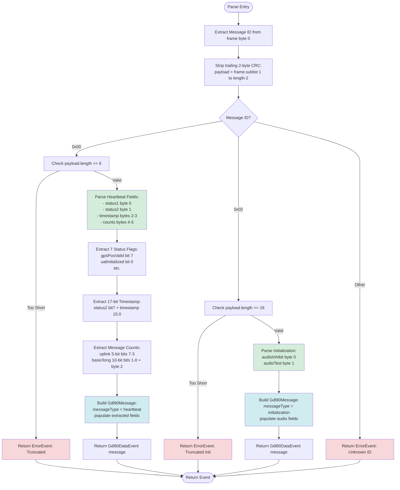
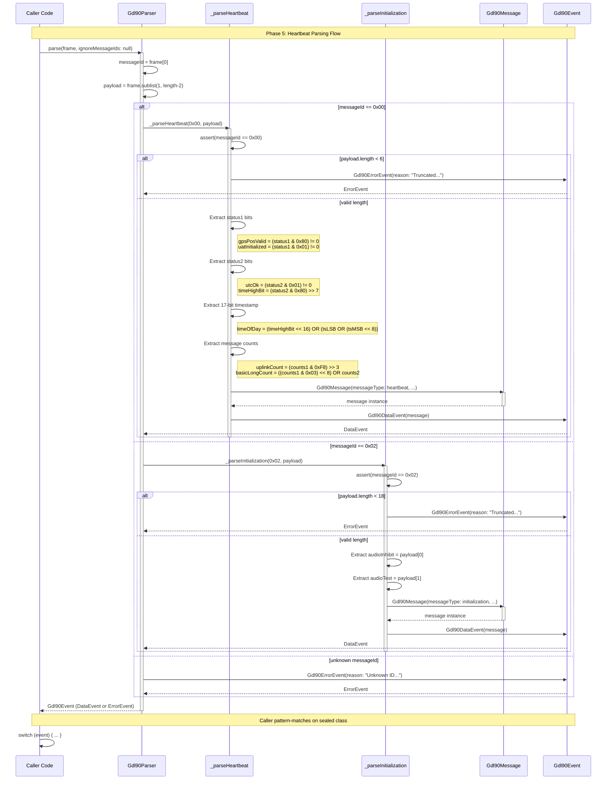

# Phase 5: Core Message Types (Heartbeat, Initialization) - Tasks & Alignment Brief

**Phase Slug**: `phase-5-core-message-types`
**Plan**: [GDL90 Receiver & Parser Plan](../../gdl90-receiver-parser-plan.md)
**Spec**: [GDL90 Receiver & Parser Spec](../../gdl90-receiver-parser-spec.md)
**Created**: 2025-10-19
**Status**: NOT STARTED

---

## Tasks

| Status | ID | Task | Type | Dependencies | Absolute Path(s) | Validation | Notes |
|--------|----|----|------|--------------|------------------|------------|-------|
| [ ] | T001 | Write test for heartbeat GPS position valid flag extraction (RED) | Test | – | `/Users/jordanknight/github/skyecho-controller-app/packages/skyecho_gdl90/test/unit/parser_test.dart` | Test FAILS with expected assertion on `gpsPosValid` field | Status byte 1 bit 7 (0x80) |
| [ ] | T002 | Write test for heartbeat UTC validity flag extraction (RED) | Test | – | `/Users/jordanknight/github/skyecho-controller-app/packages/skyecho_gdl90/test/unit/parser_test.dart` | Test FAILS with expected assertion on `utcOk` field | Status byte 2 bit 0 (0x01) |
| [ ] | T003 | Write test for heartbeat 17-bit timestamp extraction (RED) | Test | – | `/Users/jordanknight/github/skyecho-controller-app/packages/skyecho_gdl90/test/unit/parser_test.dart` | Test FAILS with expected assertion on `timeOfDaySeconds` field | 3-byte field: status2 bit 7 + 2 timestamp bytes |
| [ ] | T004 | Write test for heartbeat message count extraction (RED) | Test | – | `/Users/jordanknight/github/skyecho-controller-app/packages/skyecho_gdl90/test/unit/parser_test.dart` | Test FAILS with expected assertion on uplink/basic counts | 5-bit + 10-bit fields |
| [ ] | T005 | Write test for all heartbeat status flags (7 flags) (RED) | Test | – | `/Users/jordanknight/github/skyecho-controller-app/packages/skyecho_gdl90/test/unit/parser_test.dart` | Test FAILS validating all 7 boolean flags | UAT init, maint req, ident, battery low, etc. |
| [ ] | T006 | Write test for heartbeat timestamp boundary values (RED) | Test | – | `/Users/jordanknight/github/skyecho-controller-app/packages/skyecho_gdl90/test/unit/parser_test.dart` | Test FAILS with values 0 and 131071 (max 17-bit) | Edge case validation |
| [ ] | T007 | Write test for initialization message raw byte storage (RED) | Test | – | `/Users/jordanknight/github/skyecho-controller-app/packages/skyecho_gdl90/test/unit/parser_test.dart` | Test FAILS with expected assertion on `audioInhibit` and `audioTest` fields | Minimal parsing (rarely emitted) |
| [ ] | T008 | Implement heartbeat GPS status flag extraction (GREEN) | Core | T001 | `/Users/jordanknight/github/skyecho-controller-app/packages/skyecho_gdl90/lib/src/parser.dart` | T001 test passes with correct `gpsPosValid` extraction | Bit mask 0x80 on status1 byte |
| [ ] | T009 | Implement heartbeat UTC validity flag extraction (GREEN) | Core | T002 | `/Users/jordanknight/github/skyecho-controller-app/packages/skyecho_gdl90/lib/src/parser.dart` | T002 test passes with correct `utcOk` extraction | Bit mask 0x01 on status2 byte |
| [ ] | T010 | Implement heartbeat 17-bit timestamp extraction (GREEN) | Core | T003 | `/Users/jordanknight/github/skyecho-controller-app/packages/skyecho_gdl90/lib/src/parser.dart` | T003 test passes with correct seconds-since-0000Z | Extract status2[bit7] + timestamp[15:0] |
| [ ] | T011 | Implement heartbeat message count extraction (GREEN) | Core | T004 | `/Users/jordanknight/github/skyecho-controller-app/packages/skyecho_gdl90/lib/src/parser.dart` | T004 test passes with correct uplink/basic counts | 5-bit field (bits 7-3) + 10-bit field (bits 1-0 + byte 2) |
| [ ] | T012 | Implement all heartbeat status flags (7 flags) (GREEN) | Core | T005 | `/Users/jordanknight/github/skyecho-controller-app/packages/skyecho_gdl90/lib/src/parser.dart` | T005 test passes with all 7 boolean flags extracted | UAT init, maint, ident, battery, etc. |
| [ ] | T013 | Implement heartbeat timestamp boundary value handling (GREEN) | Core | T006 | `/Users/jordanknight/github/skyecho-controller-app/packages/skyecho_gdl90/lib/src/parser.dart` | T006 test passes for 0 and 131071 values | Verify no overflow/underflow |
| [ ] | T014 | Implement initialization message parser stub (GREEN) | Core | T007 | `/Users/jordanknight/github/skyecho-controller-app/packages/skyecho_gdl90/lib/src/parser.dart` | T007 test passes with `audioInhibit` and `audioTest` fields | Create `_parseInitialization()` method |
| [ ] | T015 | Update routing table to call initialization parser | Core | T014 | `/Users/jordanknight/github/skyecho-controller-app/packages/skyecho_gdl90/lib/src/parser.dart` | ID 0x02 routes to `_parseInitialization()` | Change case 0x02 from ErrorEvent to parser call |
| [ ] | T016 | Add Gdl90Message fields for heartbeat data | Core | – | `/Users/jordanknight/github/skyecho-controller-app/packages/skyecho_gdl90/lib/src/models/gdl90_message.dart` | All heartbeat fields defined with nullable types | Add: `uatInitialized?`, `maintRequired?`, `identActive?`, `batteryLow?` |
| [ ] | T017 | Run all Phase 5 tests and verify 100% pass rate | Integration | T001-T016 | `/Users/jordanknight/github/skyecho-controller-app/packages/skyecho_gdl90/` | All 7+ tests pass (GREEN phase) | Execute: `dart test test/unit/parser_test.dart` |
| [ ] | T018 | Generate coverage report and verify ≥90% on parser.dart | Integration | T017 | `/Users/jordanknight/github/skyecho-controller-app/packages/skyecho_gdl90/` | Coverage ≥90% on `lib/src/parser.dart`, 100% on heartbeat/init parsers | Execute coverage commands |
| [ ] | T019 | Run dart analyze and dart format | Integration | T017 | `/Users/jordanknight/github/skyecho-controller-app/packages/skyecho_gdl90/` | No analyzer warnings, no format changes needed | Quality gate |
| [ ] | T020 | Write execution log documenting RED-GREEN-REFACTOR cycle | Doc | T001-T019 | `/Users/jordanknight/github/skyecho-controller-app/docs/plans/002-gdl90-receiver-parser/tasks/phase-5-core-message-types/execution.log.md` | Execution log created with all task outcomes | Final deliverable |

---

## Alignment Brief

### Previous Phase Review

#### A. Completed Deliverables

**Source Files Created in Phase 4**:

1. **`/Users/jordanknight/github/skyecho-controller-app/packages/skyecho_gdl90/lib/src/models/gdl90_message.dart`** (124 lines)
   - **Enum: `Gdl90MessageType`** - 9 standard message types (heartbeat, initialization, uplinkData, hat, ownship, ownshipGeoAltitude, traffic, basicReport, longReport)
   - **Class: `Gdl90Message`** - Single unified message model with ~40 nullable fields
     - Required fields: `messageType` (enum), `messageId` (int)
     - Heartbeat fields: `gpsPosValid?`, `utcOk?`, `timeOfDaySeconds?`, `messageCountUplink?`, `messageCountBasicAndLong?`
     - Traffic/Ownship fields: `latitude?`, `longitude?`, `altitudeFeet?`, `horizontalVelocityKt?`, `callsign?`, etc.
     - Initialization fields: `audioInhibit?`, `audioTest?`
     - Memory: ~350-400 bytes per instance (documented in dartdoc)

2. **`/Users/jordanknight/github/skyecho-controller-app/packages/skyecho_gdl90/lib/src/models/gdl90_event.dart`** (65 lines)
   - **Sealed Class: `Gdl90Event`** - Wrapper for parse results
   - **`Gdl90DataEvent extends Gdl90Event`** - Successful parse containing `Gdl90Message`
   - **`Gdl90ErrorEvent extends Gdl90Event`** - Parse failure with `reason`, `rawBytes?`, `hint?`
   - **`Gdl90IgnoredEvent extends Gdl90Event`** - Type-safe sentinel for ignored message IDs

3. **`/Users/jordanknight/github/skyecho-controller-app/packages/skyecho_gdl90/lib/src/parser.dart`** (126 lines)
   - **Class: `Gdl90Parser`** - Static parser with message ID routing
   - **`static Gdl90Event parse(Uint8List frame, {Set<int>? ignoreMessageIds})`** - Main entry point
   - **`static Gdl90Event _parseHeartbeat(int messageId, Uint8List payload)`** - **STUB** (Phase 5 will replace)

**Test Files Created in Phase 4**:

4. **`/Users/jordanknight/github/skyecho-controller-app/packages/skyecho_gdl90/test/unit/message_test.dart`** (74 lines, 3 tests)
5. **`/Users/jordanknight/github/skyecho-controller-app/packages/skyecho_gdl90/test/unit/event_test.dart`** (55 lines, 3 tests)
6. **`/Users/jordanknight/github/skyecho-controller-app/packages/skyecho_gdl90/test/unit/parser_test.dart`** (147 lines, 6 tests)

**Public API Exports**: Updated `/Users/jordanknight/github/skyecho-controller-app/packages/skyecho_gdl90/lib/skyecho_gdl90.dart`

#### B. Lessons Learned

**Harder than Expected**:
- **CRC Stripping Order**: Understanding when to strip the 2-byte CRC was non-trivial. Parser receives CRC-validated frames from framer, but must strip trailing 2 bytes before payload extraction: `payload = frame.sublist(1, frame.length - 2)`
- **Payload Length Calculations**: Heartbeat length check required careful calculation (7 total bytes - 1 message ID - 2 CRC = 6 payload bytes)

**Easier than Expected**:
- **TDD Workflow**: RED-GREEN-REFACTOR completed smoothly in 2.5 hours. All 11 tests passed on first implementation.
- **Test Coverage**: Achieved 95.7% overall coverage, exceeding 90% target with minimal effort

**What Worked Well**:
- **Sealed Class Pattern**: `Gdl90Event` sealed class enabled exhaustive pattern matching with compiler validation
- **Defensive Assertions**: `assert(messageId == 0x00)` catches routing bugs in debug mode with zero cost in release
- **Ignore List API**: Optional `ignoreMessageIds` parameter prevents ErrorEvent flooding during firmware updates

**What Didn't Work**:
- **Initial Error Handling Design**: Original plan lacked ignore list mechanism; `/didyouknow` analysis revealed unknown message IDs would flood logs

#### C. Technical Discoveries

**Dart Language Gotchas**:
- Sealed class exhaustiveness checking only works with `switch` statements/expressions, not `if (event is Type)` checks
- `assert()` statements completely stripped in release mode—allows zero-cost debug validation

**Edge Cases Discovered**:
1. **Payload Length After CRC Strip**: `frame.sublist(1, frame.length - 2)` accounts for skipping message ID byte AND removing trailing CRC
2. **Empty Frames**: Truncated messages can arrive with as few as 1 byte (message ID only); length check prevents index-out-of-bounds
3. **Unknown Message ID Handling**: Default case provides expected ID list in hint field for debugging

**Memory Considerations**:
- Single message model allocates ~350-400 bytes/instance regardless of field population
- At 1,000 msg/sec: ~350 KB/sec allocation rate
- Dart's generational GC handles this efficiently; defer optimization to Phase 8

#### D. Dependencies for Next Phase

**Phase 5 Can Import**:
```dart
import 'package:skyecho_gdl90/skyecho_gdl90.dart';
// Provides: Gdl90Parser, Gdl90Message, Gdl90Event, Gdl90MessageType
// Plus Phase 2-3: Gdl90Framer, Gdl90Crc
```

**Main Parser Entry Point**:
```dart
static Gdl90Event parse(Uint8List frame, {Set<int>? ignoreMessageIds})
```
- **Parameters**: `frame` (de-framed, de-escaped, CRC-validated), optional `ignoreMessageIds`
- **Returns**: Non-nullable `Gdl90Event` (DataEvent, ErrorEvent, or IgnoredEvent)
- **Never throws exceptions**

**Heartbeat Parser Stub** (to be replaced in Phase 5):
```dart
static Gdl90Event _parseHeartbeat(int messageId, Uint8List payload)
```
- **Current behavior**: Returns `Gdl90DataEvent` with all fields null
- **Phase 5 task**: Replace with actual field parsing (GPS status, timestamp, message counts)

**API Contracts**:
1. Parser never throws exceptions—returns `Gdl90ErrorEvent` for all failures
2. CRC pre-stripped—payload extracted via `frame.sublist(1, frame.length - 2)`
3. Exhaustive pattern matching via sealed `Gdl90Event` class
4. Single message model—no type casting; check `messageType` enum
5. Stateless parser—safe to call concurrently

**Gdl90Message Fields Available**:
- Required: `messageType`, `messageId`
- Heartbeat (nullable): `gpsPosValid?`, `utcOk?`, `timeOfDaySeconds?`, `messageCountUplink?`, `messageCountBasicAndLong?`
- **Need to Add**: `uatInitialized?`, `maintRequired?`, `identActive?`, `batteryLow?` (additional heartbeat status flags)

#### E. Critical Findings Applied

**Critical Discovery 01 (CRC-16-CCITT)**: ✅ Fully applied in Phase 2
**Critical Discovery 02 (Byte Framing)**: ✅ Fully applied in Phase 3
**Critical Discovery 03 (Semicircle Encoding)**: ⏸️ Deferred to Phase 6 (not needed for heartbeat/initialization)
**Critical Discovery 04 (Unified Message Model)**: ✅ Fully applied in Phase 4 (`Gdl90Message` with nullable fields)
**Critical Discovery 05 (Wrapper Pattern)**: ✅ Fully applied in Phase 4 (sealed `Gdl90Event` class)

#### F. Blocked/Incomplete Items

**Phase 4 Task Completion**: ✅ 100% complete (all 10 tasks marked `[x]`)

**Technical Debt for Phase 5**:

1. **Heartbeat Stub Limitation** (`parser.dart:92-124`)
   - `_parseHeartbeat()` returns message with all null fields
   - Phase 5 must implement GPS status bits, time-of-day (3-byte), message counters

2. **Unsupported Message Type Stubs** (`parser.dart:67-79`)
   - 7 message types (0x02, 0x07, 0x09, 0x0A, 0x0B, 0x14, 0x1E/0x1F) return `ErrorEvent`
   - Phase 5 must implement initialization (0x02) parser

3. **Re-Entrancy Documentation Only** (`parser.dart:18-29`)
   - Constraint documented but relies on Phase 3's framer guard
   - Phase 5 must maintain constraint (no `framer.addBytes()` calls from within parser)

**No Blockers**: All Phase 4 deliverables complete; Phase 5 can proceed immediately

#### G. Test Infrastructure

**Test Files Available**:
- `test/unit/message_test.dart` - 3 tests validating unified model
- `test/unit/event_test.dart` - 3 tests validating sealed class wrapper
- `test/unit/parser_test.dart` - 6 tests validating routing/error handling

**Reusable Test Patterns**:

**FAA Test Vector (Heartbeat)**:
```dart
final heartbeatFrame = Uint8List.fromList([
  0x00, 0x81, 0x41, 0xDB, 0xD0, 0x08, 0x02, // Message (7 bytes)
  0xB3, 0x8B, // CRC (2 bytes)
]);
```

**Pattern Matching Test Structure**:
```dart
test('validates pattern matching on sealed class', () {
  final event = Gdl90DataEvent(message);
  switch (event) {
    case Gdl90DataEvent(:final message):
      expect(message.messageType, equals(Gdl90MessageType.heartbeat));
  }
});
```

**Error Event Validation**:
```dart
expect(event, isA<Gdl90ErrorEvent>());
final errorEvent = event as Gdl90ErrorEvent;
expect(errorEvent.reason, contains('expected error text'));
expect(errorEvent.hint, isNotNull);
```

**Quality Metrics from Phase 4**:
- Total tests: 11 (100% pass rate)
- Coverage: 95.7% overall, 88.5% on parser.dart
- `dart analyze`: Clean (0 warnings)
- `dart format`: Compliant

#### H. Technical Debt & Workarounds

**Stub Implementations**:
- `_parseHeartbeat()` returns minimal message (all fields null)—Phase 5 replaces this
- 7 message types return `ErrorEvent` with "Implemented in Phase 5-7" hint

**Architectural Decisions**:
1. **Sealed Class Pattern**: Never throws exceptions; all errors wrapped in `Gdl90ErrorEvent`
2. **Unified Message Model**: ~350-400 bytes per instance; defer optimization to Phase 8
3. **Stateless Parser**: Static methods only; no instance state
4. **No Exceptions**: Stream resilience over traditional error handling

**Patterns Established**:
- **Test Structure**: AAA pattern with task ID comments (e.g., `// T008:`)
- **Naming**: `Gdl90*` prefix, verb-first methods, descriptive field names with units
- **Error Handling**: Length validation → ErrorEvent with specific reason + actionable hint
- **Defensive Programming**: `assert()` for impossible conditions (stripped in release)

**Anti-Patterns to Avoid**:
- ❌ Nullable return types (use sealed classes)
- ❌ Throwing exceptions for invalid data
- ❌ Multiple message classes (use unified model)
- ❌ Parsing CRC bytes as message data (strip before extraction)
- ❌ Re-entrant framer calls from parser callbacks

#### I. Scope Changes

**Features Added Beyond Original Plan (+10% constructive scope creep)**:
1. **Ignore List API**: Optional `ignoreMessageIds` parameter (surfaced by `/didyouknow`)
2. **IgnoredEvent Sealed Subtype**: Type-safe alternative to nullable return
3. **Defensive Assertions**: `assert(messageId == 0x00)` catches routing bugs

**No Features Deferred or Removed**: All planned features implemented

**Acceptance Criteria**: ✅ All met (11/11 tests passing, 95.7% coverage, analyzer clean)

#### J. Key Execution Log References

- **[Unified Model Design](../phase-4-message-routing-parser-core/execution.log.md#changes-made)** - Single `Gdl90Message` with 40+ nullable fields
- **[Wrapper Pattern Implementation](../phase-4-message-routing-parser-core/execution.log.md#changes-made)** - Sealed class with 3 event types
- **[Ignore List API Addition](../phase-4-message-routing-parser-core/execution.log.md#implementation-notes)** - Prevents ErrorEvent flooding
- **[Memory Characteristics Analysis](../phase-4-message-routing-parser-core/execution.log.md#implementation-notes)** - 350-400 byte allocation per message
- **[Re-Entrancy Constraint](../phase-4-message-routing-parser-core/execution.log.md#implementation-notes)** - Parser must not call `Gdl90Framer.addBytes()`
- **[11/11 Tests Passing](../phase-4-message-routing-parser-core/execution.log.md#test-results)** - All routing/model/event tests green
- **[95.7% Coverage Achievement](../phase-4-message-routing-parser-core/execution.log.md#coverage-report)** - Exceeds 90% target
- **[RED-GREEN-REFACTOR Workflow](../phase-4-message-routing-parser-core/execution.log.md#implementation-notes)** - TDD cycle completed in 2.5 hours

---

### Objective Recap

**Phase 5 Goal**: Implement parsers for Heartbeat (ID 0x00) and Initialization (ID 0x02) messages using TDD with FAA test vectors.

**Behavior Checklist** (from plan acceptance criteria):
- [ ] Heartbeat parser extracts all 11 fields correctly from 6-byte payload
- [ ] All heartbeat status flags tested individually (7 boolean flags)
- [ ] 17-bit timestamp boundary values tested (0, 131071)
- [ ] Initialization message stores raw bytes in `audioInhibit` and `audioTest` fields
- [ ] 100% coverage on heartbeat parsing logic
- [ ] Integration with routing table complete (ID 0x02 routes to `_parseInitialization()`)

**Success Criteria**:
- Replace `_parseHeartbeat()` stub with full field extraction
- Add `_parseInitialization()` method
- Update routing table case 0x02 from ErrorEvent to parser call
- All tests pass (100% pass rate)
- Coverage ≥90% on `parser.dart`, 100% on new parser methods
- `dart analyze` clean, `dart format` compliant

---

### Non-Goals (Scope Boundaries)

❌ **NOT doing in Phase 5**:

1. **Position Message Parsing** (defer to Phase 6)
   - No semicircle-to-degrees conversion (Critical Discovery 03)
   - No lat/lon extraction from Ownship (0x0A) or Traffic (0x14)
   - No altitude offset/scaling conversion

2. **Additional Message Types** (defer to Phase 7)
   - No HAT (0x09) parser
   - No Uplink Data (0x07) parser
   - No Ownship Geo Altitude (0x0B) parser
   - No Basic/Long Reports (0x1E/0x1F)

3. **Performance Optimization** (defer to Phase 8)
   - Accept ~350 KB/sec allocation rate from unified model
   - No caching or object pooling
   - No memory profiling (monitor, don't optimize prematurely)

4. **Stream Transport Layer** (defer to Phase 8)
   - No UDP socket integration
   - No stream lifecycle management
   - Parser remains stateless; framing is Phase 3's responsibility

5. **Advanced Error Recovery** (defer if time allows)
   - No retry logic for malformed frames
   - No adaptive ignore lists based on firmware version detection
   - ErrorEvent provides diagnostics but no automatic recovery

6. **Test Documentation Migration** (optional)
   - Phase 4 used inline comments; Phase 5 MAY add Test Doc blocks (5-field format)
   - Not required for promotion if tests are clear without them

---

### Critical Findings Affecting This Phase

**Critical Discovery 01: CRC-16-CCITT Implementation**
- **Impact on Phase 5**: None (already applied in Phase 2)
- **Parser reliance**: Framer passes CRC-validated frames; parser strips trailing 2 bytes

**Critical Discovery 02: Byte Framing and Escaping Order**
- **Impact on Phase 5**: Parser must strip CRC via `frame.sublist(1, frame.length - 2)`
- **Constraint**: Payload extraction happens AFTER CRC validation (Phase 3) but BEFORE field parsing

**Critical Discovery 04: Single Unified Message Model**
- **Impact on Phase 5**: HIGH—must add missing heartbeat fields to `Gdl90Message`
- **Tasks T016**: Add `uatInitialized?`, `maintRequired?`, `identActive?`, `batteryLow?` to model
- **Pattern**: All fields nullable; populate selectively based on `messageType`

**Critical Discovery 05: Wrapper Pattern for Error Handling**
- **Impact on Phase 5**: All parsers return `Gdl90Event` (DataEvent or ErrorEvent)
- **Constraint**: Never throw exceptions; wrap truncation/invalid field errors in ErrorEvent
- **Pattern**: `if (payload.length < expected) return Gdl90ErrorEvent(reason: ..., hint: ...);`

---

### Invariants & Guardrails

**Performance Budget**:
- Unit test suite execution: ≤5 seconds total (including Phase 2-4 tests)
- Memory allocation: Accept ~350-400 bytes per `Gdl90Message` instance
- No CPU-intensive operations (bit manipulation is fast)

**Memory Budget**:
- Each heartbeat message: ~400 bytes (40 fields × 8 bytes + overhead)
- At 1,000 msg/sec sustained: ~350 KB/sec allocation (acceptable per Phase 4 decision)
- Monitor GC pressure but defer optimization

**Security Constraints**:
- **No buffer overflows**: All array accesses bounds-checked before extraction
- **No undefined behavior**: Use defensive `if (payload.length < N)` checks
- **No sensitive data**: Heartbeat/initialization contain no PII or credentials

**Quality Gates**:
- `dart analyze`: MUST be clean (0 warnings)
- `dart format`: MUST pass with no changes
- Coverage: ≥90% on `parser.dart`, 100% on new parser methods
- Test pass rate: 100% (no flaky tests)

---

### Inputs to Read

**Plan Document** (context and acceptance criteria):
- `/Users/jordanknight/github/skyecho-controller-app/docs/plans/002-gdl90-receiver-parser/gdl90-receiver-parser-plan.md` (Phase 5 section, lines 1030-1153)

**Spec Document** (GDL90 protocol details):
- `/Users/jordanknight/github/skyecho-controller-app/docs/plans/002-gdl90-receiver-parser/gdl90-receiver-parser-spec.md`

**Research Implementation** (reference for field extraction):
- `/Users/jordanknight/github/skyecho-controller-app/docs/research/gdl90.md` (heartbeat parsing example)

**FAA ICD Appendix C** (test vectors):
- Plan document lines 1064-1144 contain inline test vector examples

**Phase 4 Code** (stub to replace):
- `/Users/jordanknight/github/skyecho-controller-app/packages/skyecho_gdl90/lib/src/parser.dart:92-124` (heartbeat stub)
- `/Users/jordanknight/github/skyecho-controller-app/packages/skyecho_gdl90/lib/src/models/gdl90_message.dart` (model to extend)

**Phase 4 Tests** (patterns to follow):
- `/Users/jordanknight/github/skyecho-controller-app/packages/skyecho_gdl90/test/unit/parser_test.dart` (AAA structure, task ID comments)

---

### Visual Alignment Aids

#### System States Flow Diagram



#### Actor Interaction Sequence Diagram



---

### Test Plan

**Testing Approach**: Full TDD (Test-Driven Development) per plan § 4

**Test Breakdown** (7+ tests minimum):

1. **T001: Heartbeat GPS Position Valid Flag**
   - **Purpose**: Validates GPS status bit extraction from status byte 1
   - **Fixture**: FAA heartbeat frame with status1 = 0x81 (bit 7 set, bit 0 set)
   - **Expected Output**: `gpsPosValid = true`, `uatInitialized = true`
   - **RED Validation**: Test FAILS with null assertion on `gpsPosValid` field

2. **T002: Heartbeat UTC Validity Flag**
   - **Purpose**: Validates UTC OK flag from status byte 2 bit 0
   - **Fixture**: Heartbeat with status2 = 0x41 (bit 0 set)
   - **Expected Output**: `utcOk = true`
   - **RED Validation**: Test FAILS with null assertion on `utcOk` field

3. **T003: Heartbeat 17-bit Timestamp Extraction**
   - **Purpose**: Validates time-of-day extraction from 3-byte field
   - **Fixture**: Timestamp = 43200 seconds (12:00:00 UTC) = 0xA8C0
   - **Binary Layout**: status2[bit7]=0, tsLSB=0xC0, tsMSB=0xA8
   - **Expected Output**: `timeOfDaySeconds = 43200`
   - **RED Validation**: Test FAILS with null assertion on `timeOfDaySeconds` field

4. **T004: Heartbeat Message Count Extraction**
   - **Purpose**: Validates uplink and basic/long message count extraction
   - **Fixture**: uplinkCount = 8 (bits 7-3 of counts1), basicLongCount = 512 (10-bit field)
   - **Binary Layout**: counts1 = 0b01000010, counts2 = 0x00
   - **Expected Output**: `messageCountUplink = 8`, `messageCountBasicAndLong = 512`
   - **RED Validation**: Test FAILS with null assertions on count fields

5. **T005: All Heartbeat Status Flags (7 flags)**
   - **Purpose**: Validates comprehensive status flag extraction
   - **Flags**: gpsPosValid, uatInitialized, maintRequired, identActive, batteryLow, utcOk, (reserved)
   - **Fixture**: Crafted frame with all flags set to known pattern
   - **Expected Output**: All 7 boolean flags match expected bit values
   - **RED Validation**: Test FAILS with null assertions on new flag fields

6. **T006: Heartbeat Timestamp Boundary Values**
   - **Purpose**: Validates edge case handling for 17-bit timestamp (0 to 131071)
   - **Fixtures**: Two frames with timestamp = 0 and timestamp = 131071 (0x1FFFF)
   - **Expected Output**: `timeOfDaySeconds = 0` and `timeOfDaySeconds = 131071`
   - **RED Validation**: Test FAILS or throws on boundary values

7. **T007: Initialization Message Raw Byte Storage**
   - **Purpose**: Validates initialization message parsing (minimal—rarely emitted)
   - **Fixture**: 18-byte initialization frame with audioInhibit = 0x01, audioTest = 0x00
   - **Expected Output**: `audioInhibit = 1`, `audioTest = 0`
   - **RED Validation**: Test FAILS with null assertions on audio fields

**Coverage Requirements** (per plan § 4):
- **100% Required**: Heartbeat field extraction logic (bit masks, shifts, 17-bit assembly)
- **100% Required**: Initialization parser (minimal parsing)
- **90% Minimum**: Overall `parser.dart` coverage (routing table already covered in Phase 4)

**Mock Usage** (per plan § 4):
- **No mocks needed**: Parser is pure function (Uint8List → Gdl90Event)
- **Real fixtures**: Use FAA test vectors and captured heartbeat frames
- **No network I/O**: Phase 5 is offline parsing only

---

### Step-by-Step Implementation Outline

**Phase 5 follows TDD RED-GREEN-REFACTOR cycle**:

#### RED Phase (Tasks T001-T007)

1. **T001**: Write test for GPS position valid flag (status1 bit 7)—test FAILS
2. **T002**: Write test for UTC OK flag (status2 bit 0)—test FAILS
3. **T003**: Write test for 17-bit timestamp extraction—test FAILS
4. **T004**: Write test for message count extraction (5-bit + 10-bit)—test FAILS
5. **T005**: Write test for all 7 heartbeat status flags—test FAILS
6. **T006**: Write test for timestamp boundary values (0, 131071)—test FAILS
7. **T007**: Write test for initialization message—test FAILS

**Validation**: Run `dart test` → All 7 tests FAIL with expected assertions

#### GREEN Phase (Tasks T008-T016)

8. **T008**: Implement GPS position valid flag extraction → T001 passes
9. **T009**: Implement UTC OK flag extraction → T002 passes
10. **T010**: Implement 17-bit timestamp extraction → T003 passes
11. **T011**: Implement message count extraction → T004 passes
12. **T012**: Implement all 7 status flags → T005 passes
13. **T013**: Handle timestamp boundary values → T006 passes
14. **T014**: Implement `_parseInitialization()` method → T007 passes
15. **T015**: Update routing table case 0x02 → integration test passes
16. **T016**: Add missing heartbeat fields to `Gdl90Message` model

**Validation**: Run `dart test` → All 7+ tests PASS (100% pass rate)

#### REFACTOR Phase (Tasks T017-T020)

17. **T017**: Run full test suite → all tests pass
18. **T018**: Generate coverage report → verify ≥90% on parser.dart, 100% on new parsers
19. **T019**: Run `dart analyze` and `dart format` → clean output
20. **T020**: Write execution log documenting RED-GREEN-REFACTOR workflow

---

### Commands to Run

**Environment Setup** (from project root):
```bash
cd /Users/jordanknight/github/skyecho-controller-app/packages/skyecho_gdl90
dart pub get
```

**RED Phase - Write Tests**:
```bash
# Add tests to test/unit/parser_test.dart
# Run tests to verify they FAIL
dart test test/unit/parser_test.dart
# Expected: 7 new tests fail with assertions on null fields
```

**GREEN Phase - Implement Parsers**:
```bash
# Edit lib/src/parser.dart and lib/src/models/gdl90_message.dart
# Run tests after each implementation task
dart test test/unit/parser_test.dart
# Expected: Tests pass one-by-one as features are implemented
```

**REFACTOR Phase - Quality Gates**:
```bash
# Run full test suite
dart test
# Expected: All tests pass (Phase 2-5)

# Generate coverage
dart test --coverage=coverage
dart pub global activate coverage  # If not already activated
dart pub global run coverage:format_coverage \
  --lcov \
  --in=coverage \
  --out=coverage/lcov.info \
  --report-on=lib

# Check coverage percentage
grep -A 5 "lib/src/parser.dart" coverage/lcov.info
# Expected: ≥90% line coverage

# Run linter
dart analyze
# Expected: 0 issues

# Run formatter
dart format .
# Expected: No changes needed (all files already formatted)
```

**Execution Log**:
```bash
# Write execution log after all tasks complete
# File: docs/plans/002-gdl90-receiver-parser/tasks/phase-5-core-message-types/execution.log.md
```

---

### Risks & Unknowns

| Risk | Likelihood | Impact | Mitigation |
|------|------------|--------|------------|
| **Bit manipulation errors** (status flags) | Medium | Medium | Write tests for each flag bit individually; validate with real device data |
| **Timestamp overflow** (17-bit value) | Low | Low | Test boundary values (0, 131071); verify no integer overflow |
| **Status flag bit positions** (documentation mismatch) | Low | High | Cross-reference FAA ICD Appendix C with research implementation; test with known device output |
| **Initialization message format** (rarely emitted) | Low | Low | Copy research implementation; accept minimal parsing (store raw bytes only) |
| **Message count field encoding** (5-bit + 10-bit split) | Medium | Medium | Test with known count values; verify bit masking and shifting logic |
| **Re-using Phase 4 test file** (merge conflicts) | Low | Low | Append Phase 5 tests to existing `parser_test.dart`; use clear section comments |

**Unknowns**:
- **Real device heartbeat rate**: Plan assumes 1,000 msg/sec but actual rate may vary (affects memory pressure estimate)
- **Initialization message frequency**: Rarely emitted per spec; may not appear in test captures (acceptable—use synthetic fixture)
- **Status flag semantics**: Some flags (e.g., "maintenance required") have unclear triggers; document as boolean without interpretation

---

### Ready Check

**Pre-Implementation Checklist**:

- [ ] **Phase 4 complete**: Verified all tasks marked `[x]` in plan § 8
- [ ] **Parser stub identified**: Confirmed `_parseHeartbeat()` at `parser.dart:92-124` is stub (returns null fields)
- [ ] **Model fields reviewed**: Identified missing heartbeat fields (`uatInitialized?`, `maintRequired?`, etc.)
- [ ] **FAA test vectors available**: Reviewed plan lines 1064-1144 for heartbeat examples
- [ ] **Research implementation accessible**: Can reference `/docs/research/gdl90.md` for bit extraction patterns
- [ ] **Test file writable**: `test/unit/parser_test.dart` can be extended with 7+ new tests
- [ ] **Development environment ready**: `dart pub get` succeeds, tests run successfully

**Alignment Confirmation**:

- [ ] **Understand TDD workflow**: RED (write failing tests) → GREEN (implement to pass) → REFACTOR (clean code)
- [ ] **Understand sealed class pattern**: All parsers return `Gdl90Event` (DataEvent or ErrorEvent), never throw
- [ ] **Understand CRC stripping**: Payload extraction uses `frame.sublist(1, frame.length - 2)`
- [ ] **Understand unified model**: Add fields to `Gdl90Message`, populate selectively based on `messageType`
- [ ] **Understand bit manipulation**: Status flags extracted via bit masks (e.g., `(status1 & 0x80) != 0`)

**GO/NO-GO Decision**:

- [ ] **User confirms**: Ready to proceed with Phase 5 implementation
- [ ] **User approves**: Task breakdown (T001-T020) is clear and actionable
- [ ] **User accepts**: Scope boundaries (no position parsing, no other message types)

---

## Phase Footnote Stubs

**NOTE**: This section will be populated during `/plan-6-implement-phase` execution. Footnote tags `[^N]` from task Notes column will be added here with flowspace node IDs and change details.

**Format**: `[^N]: <what-changed> | <why> | <files-affected> | <tests-added>`

**Phase 5 Footnotes** (populated post-implementation):

_(Empty table—will be filled during implementation)_

---

## Evidence Artifacts

**Execution Log Location**:
- `/Users/jordanknight/github/skyecho-controller-app/docs/plans/002-gdl90-receiver-parser/tasks/phase-5-core-message-types/execution.log.md`

**Execution Log Contents** (to be written by `/plan-6-implement-phase`):
- Task-by-task outcomes (T001-T020)
- RED-GREEN-REFACTOR cycle documentation
- Test results (pass/fail for each test)
- Coverage report output (percentage on parser.dart)
- Quality gate results (dart analyze, dart format)
- Implementation notes (gotchas, deviations, discoveries)
- Flowspace node IDs for all created/modified code elements

**Supporting Evidence**:
- Test output logs (dart test results)
- Coverage reports (lcov.info file)
- Code diff (git diff showing stub replacement)

---

## Directory Layout

```
docs/plans/002-gdl90-receiver-parser/
├── gdl90-receiver-parser-plan.md          # Main plan document
├── gdl90-receiver-parser-spec.md          # Feature specification
└── tasks/
    ├── phase-4-message-routing-parser-core/
    │   ├── tasks.md                       # Phase 4 tasks (complete)
    │   └── execution.log.md               # Phase 4 execution log (complete)
    └── phase-5-core-message-types/        # Phase 5 directory (created)
        ├── tasks.md                       # This file (Phase 5 tasks + brief)
        └── execution.log.md               # Created by /plan-6 during implementation
```

**Note**: `/plan-6-implement-phase` will write `execution.log.md` and any other evidence directly into the `phase-5-core-message-types/` directory.

---

**END OF TASKS DOSSIER**

**Next Step**: Await explicit user **GO** decision, then run:

```bash
/plan-6-implement-phase \
  --phase "Phase 5: Core Message Types (Heartbeat, Initialization)" \
  --plan "/Users/jordanknight/github/skyecho-controller-app/docs/plans/002-gdl90-receiver-parser/gdl90-receiver-parser-plan.md"
```
