# Phase 6: Position Messages (Ownship, Traffic) - Task Dossier

**Phase**: Phase 6: Position Messages (Ownship, Traffic)
**Slug**: `phase-6-position-messages`
**Spec**: [gdl90-receiver-parser-spec.md](../../gdl90-receiver-parser-spec.md)
**Plan**: [gdl90-receiver-parser-plan.md](../../gdl90-receiver-parser-plan.md)
**Created**: 2025-10-19
**Status**: NOT STARTED

---

## Tasks

This task table follows the Full TDD workflow established in Phase 5:
- **SETUP**: Add model fields and helper methods (3 tasks: T001, T002, T002a)
- **RED**: Write failing tests first, including boundary validation (20 tasks: 19 tests + 1 gate)
- **GREEN**: Implement parsers to pass all tests (5 tasks)
- **REFACTOR**: Run quality gates (coverage, analyzer, formatter) (4 tasks)
- **Total**: 32 tasks (was 27 in original plan, +4 boundary tests per Insight #1, +1 altitude helper per Insight #2)

| Status | ID | Task | Type | Dependencies | Absolute Path(s) | Validation | Subtasks | Notes |
|--------|----|----|------|--------------|------------------|------------|----------|-------|
| [x] | T001 | Add Gdl90Message fields for position data | Setup | – | `/Users/jordanknight/github/skyecho-controller-app/packages/skyecho_gdl90/lib/src/models/gdl90_message.dart` | Fields defined: latitude?, longitude?, altitudeFeet?, horizontalVelocityKt?, verticalVelocityFpm?, trackDegrees?, callsign?, emitterCategory?, icaoAddress?, airborne?, trafficAlert? | – | Supports plan task 6.1 · [execution.log.md#t001-verify-gdl90message-fields-exist](execution.log.md#t001-verify-gdl90message-fields-exist) [^16] |
| [x] | T002 | Implement generic _toSigned(value, bits) helper for two's complement conversion | Setup | – | `/Users/jordanknight/github/skyecho-controller-app/packages/skyecho_gdl90/lib/src/parser.dart` | Generic helper defined with dartdoc; handles any bit width (12, 24, etc.); returns signed int | – | Supports plan task 6.1 · [execution.log.md#t002-implement-generic-_tosignedvalue-bits-helper](execution.log.md#t002-implement-generic-_tosignedvalue-bits-helper) [^17] |
| [x] | T002a | Implement _extractAltitudeFeet() helper with invalid marker check | Setup | – | `/Users/jordanknight/github/skyecho-controller-app/packages/skyecho_gdl90/lib/src/parser.dart` | Helper function + ALTITUDE_INVALID constant defined; checks 0xFFF BEFORE applying formula; returns int? | – | Supports plan task 6.1 · [execution.log.md#t002a-implement-_extractaltitudefeet-helper](execution.log.md#t002a-implement-_extractaltitudefeet-helper) [^18] |
| [x] | T003 | Write test for semicircle to degrees conversion (positive value) | Test | T002 | `/Users/jordanknight/github/skyecho-controller-app/packages/skyecho_gdl90/test/unit/parser_test.dart` | Test FAILS (helper exists but not used yet) | – | Supports plan task 6.2-6.3 · [execution.log.md#t003-t021-write-19-failing-tests](execution.log.md#t003-t021-write-19-failing-tests) [^19] |
| [x] | T004 | Write test for semicircle to degrees conversion (negative value) | Test | T002 | `/Users/jordanknight/github/skyecho-controller-app/packages/skyecho_gdl90/test/unit/parser_test.dart` | Test FAILS (helper exists but not used yet) | – | Supports plan task 6.2-6.3 · [execution.log.md#t003-t021-write-19-failing-tests](execution.log.md#t003-t021-write-19-failing-tests) [^19] |
| [x] | T005 | Write test for latitude boundary: north pole (+90°) | Test | T002 | `/Users/jordanknight/github/skyecho-controller-app/packages/skyecho_gdl90/test/unit/parser_test.dart` | Test FAILS (helper exists but not used yet) | – | Supports plan task 6.2-6.3 · [execution.log.md#t003-t021-write-19-failing-tests](execution.log.md#t003-t021-write-19-failing-tests) [^19] |
| [x] | T006 | Write test for latitude boundary: south pole (-90°) | Test | T002 | `/Users/jordanknight/github/skyecho-controller-app/packages/skyecho_gdl90/test/unit/parser_test.dart` | Test FAILS (helper exists but not used yet) | – | Supports plan task 6.2-6.3 · [execution.log.md#t003-t021-write-19-failing-tests](execution.log.md#t003-t021-write-19-failing-tests) [^19] |
| [x] | T007 | Write test for longitude boundary: international date line (±180°) | Test | T002 | `/Users/jordanknight/github/skyecho-controller-app/packages/skyecho_gdl90/test/unit/parser_test.dart` | Test FAILS (helper exists but not used yet) | – | Supports plan task 6.2-6.3 · [execution.log.md#t003-t021-write-19-failing-tests](execution.log.md#t003-t021-write-19-failing-tests) [^19] |
| [x] | T008 | Write test for coordinate origin: equator/prime meridian (0°, 0°) | Test | T002 | `/Users/jordanknight/github/skyecho-controller-app/packages/skyecho_gdl90/test/unit/parser_test.dart` | Test FAILS (helper exists but not used yet) | – | Supports plan task 6.2-6.3 · [execution.log.md#t003-t021-write-19-failing-tests](execution.log.md#t003-t021-write-19-failing-tests) [^19] |
| [x] | T009 | Write test for altitude encoding with offset and scaling | Test | T001 | `/Users/jordanknight/github/skyecho-controller-app/packages/skyecho_gdl90/test/unit/parser_test.dart` | Test FAILS (no parser yet) | – | Supports plan task 6.4 · [execution.log.md#t003-t021-write-19-failing-tests](execution.log.md#t003-t021-write-19-failing-tests) [^19] |
| [x] | T010 | Write test for invalid altitude marker (0xFFF) | Test | T001 | `/Users/jordanknight/github/skyecho-controller-app/packages/skyecho_gdl90/test/unit/parser_test.dart` | Test FAILS (no parser yet) | – | Supports plan task 6.5 · [execution.log.md#t003-t021-write-19-failing-tests](execution.log.md#t003-t021-write-19-failing-tests) [^19] |
| [x] | T011 | Write test for callsign extraction and trimming | Test | T001 | `/Users/jordanknight/github/skyecho-controller-app/packages/skyecho_gdl90/test/unit/parser_test.dart` | Test FAILS (no parser yet) | – | Supports plan task 6.6 · [execution.log.md#t003-t021-write-19-failing-tests](execution.log.md#t003-t021-write-19-failing-tests) [^19] |
| [x] | T012 | Write test for horizontal velocity encoding (12-bit field) | Test | T001 | `/Users/jordanknight/github/skyecho-controller-app/packages/skyecho_gdl90/test/unit/parser_test.dart` | Test FAILS (no parser yet) | – | Supports plan task 6.7 · [execution.log.md#t003-t021-write-19-failing-tests](execution.log.md#t003-t021-write-19-failing-tests) [^19] |
| [x] | T013 | Write test for vertical velocity encoding (signed 12-bit field, positive and negative) | Test | T001, T002 | `/Users/jordanknight/github/skyecho-controller-app/packages/skyecho_gdl90/test/unit/parser_test.dart` | Test FAILS (no parser yet) | – | Supports plan task 6.7 · [execution.log.md#t003-t021-write-19-failing-tests](execution.log.md#t003-t021-write-19-failing-tests) [^19] |
| [x] | T014 | Write test for track/heading angle encoding | Test | T001 | `/Users/jordanknight/github/skyecho-controller-app/packages/skyecho_gdl90/test/unit/parser_test.dart` | Test FAILS (no parser yet) | – | Supports plan task 6.8 · [execution.log.md#t003-t021-write-19-failing-tests](execution.log.md#t003-t021-write-19-failing-tests) [^19] |
| [x] | T015 | Write test for traffic alert flag extraction | Test | T001 | `/Users/jordanknight/github/skyecho-controller-app/packages/skyecho_gdl90/test/unit/parser_test.dart` | Test FAILS (no parser yet) | – | Supports plan task 6.9 · [execution.log.md#t003-t021-write-19-failing-tests](execution.log.md#t003-t021-write-19-failing-tests) [^19] |
| [x] | T016 | Write test for airborne flag extraction | Test | T001 | `/Users/jordanknight/github/skyecho-controller-app/packages/skyecho_gdl90/test/unit/parser_test.dart` | Test FAILS (no parser yet) | – | Supports plan task 6.9 · [execution.log.md#t003-t021-write-19-failing-tests](execution.log.md#t003-t021-write-19-failing-tests) [^19] |
| [x] | T017 | Write test for ownship report with valid GPS position | Test | T001, T002 | `/Users/jordanknight/github/skyecho-controller-app/packages/skyecho_gdl90/test/unit/parser_test.dart` | Test FAILS (no _parseOwnship yet) | – | Supports plan task 6.11 · [execution.log.md#t003-t021-write-19-failing-tests](execution.log.md#t003-t021-write-19-failing-tests) [^19] |
| [x] | T018 | Write test for ownship report with invalid position (no GPS fix) | Test | T001, T002 | `/Users/jordanknight/github/skyecho-controller-app/packages/skyecho_gdl90/test/unit/parser_test.dart` | Test FAILS (no _parseOwnship yet) | – | Supports plan task 6.11 · [execution.log.md#t003-t021-write-19-failing-tests](execution.log.md#t003-t021-write-19-failing-tests) [^19] |
| [x] | T019 | Write test for traffic report with valid position and callsign | Test | T001, T002 | `/Users/jordanknight/github/skyecho-controller-app/packages/skyecho_gdl90/test/unit/parser_test.dart` | Test FAILS (no _parseTraffic yet) | – | Supports plan task 6.12 · [execution.log.md#t003-t021-write-19-failing-tests](execution.log.md#t003-t021-write-19-failing-tests) [^19] |
| [x] | T020 | Write test for truncated ownship message error handling | Test | T001 | `/Users/jordanknight/github/skyecho-controller-app/packages/skyecho_gdl90/test/unit/parser_test.dart` | Test FAILS (no _parseOwnship yet) | – | Supports plan task 6.11 · [execution.log.md#t003-t021-write-19-failing-tests](execution.log.md#t003-t021-write-19-failing-tests) [^19] |
| [x] | T021 | Write test for truncated traffic message error handling | Test | T001 | `/Users/jordanknight/github/skyecho-controller-app/packages/skyecho_gdl90/test/unit/parser_test.dart` | Test FAILS (no _parseTraffic yet) | – | Supports plan task 6.12 · [execution.log.md#t003-t021-write-19-failing-tests](execution.log.md#t003-t021-write-19-failing-tests) [^19] |
| [x] | T022 | Verify all RED phase tests fail with expected errors | Test | T003-T021 | `/Users/jordanknight/github/skyecho-controller-app/packages/skyecho_gdl90/test/unit/parser_test.dart` | PRE-CHECK: Verify _parseOwnship() and _parseTraffic() methods DO NOT EXIST in parser.dart (grep should return no matches); RUN: dart test; EXPECTED: All 19 new tests FAIL with NoSuchMethodError or similar (method not found) | – | Supports plan task 6.10-6.12 · [execution.log.md#t022-verify-all-tests-fail-red-gate](execution.log.md#t022-verify-all-tests-fail-red-gate) [^19] |
| [x] | T023 | Implement _parseOwnship() method with lat/lon/altitude extraction | Core | T002, T022 | `/Users/jordanknight/github/skyecho-controller-app/packages/skyecho_gdl90/lib/src/parser.dart` | Method defined; Extracts lat/lon via semicircle conversion; Extracts altitude with offset/scaling | – | Supports plan task 6.11 · [execution.log.md#t023-implement-_parseownship-method](execution.log.md#t023-implement-_parseownship-method) [^20] |
| [x] | T024 | Implement _parseTraffic() method (same structure as ownship) | Core | T023 | `/Users/jordanknight/github/skyecho-controller-app/packages/skyecho_gdl90/lib/src/parser.dart` | Method defined; Same field extraction as ownship; Handles ICAO address + callsign | – | Supports plan task 6.12 · [execution.log.md#t024-implement-_parsetraffic-method](execution.log.md#t024-implement-_parsetraffic-method) [^21] |
| [x] | T025 | Update routing table to call _parseOwnship for ID 0x0A | Core | T023 | `/Users/jordanknight/github/skyecho-controller-app/packages/skyecho_gdl90/lib/src/parser.dart` | Switch case 0x0A → _parseOwnship(messageId, payload) | – | Supports plan task 6.11 · [execution.log.md#t025-t026-update-routing-for-0x0a-and-0x14](execution.log.md#t025-t026-update-routing-for-0x0a-and-0x14) [^22] |
| [x] | T026 | Update routing table to call _parseTraffic for ID 0x14 | Core | T024 | `/Users/jordanknight/github/skyecho-controller-app/packages/skyecho_gdl90/lib/src/parser.dart` | Switch case 0x14 → _parseTraffic(messageId, payload) | – | Supports plan task 6.12 · [execution.log.md#t025-t026-update-routing-for-0x0a-and-0x14](execution.log.md#t025-t026-update-routing-for-0x0a-and-0x14) [^22] |
| [x] | T027 | Verify all GREEN phase tests pass | Test | T023-T026 | `/Users/jordanknight/github/skyecho-controller-app/packages/skyecho_gdl90/test/unit/parser_test.dart` | All 19 new tests PASS; 62 total tests passing (43 baseline + 19 new) | – | Supports plan task 6.13 · [execution.log.md#t027-verify-all-tests-pass-green-gate](execution.log.md#t027-verify-all-tests-pass-green-gate) [^23] |
| [x] | T028 | Run full test suite with coverage report | Test | T027 | `/Users/jordanknight/github/skyecho-controller-app/packages/skyecho_gdl90` | All tests pass; Coverage ≥90% on parser.dart; Generate lcov.info | – | Supports plan task 6.13 · [execution.log.md#t028-run-coverage-report](execution.log.md#t028-run-coverage-report) [^24] |
| [x] | T029 | Run analyzer and verify no new issues | Test | T027 | `/Users/jordanknight/github/skyecho-controller-app/packages/skyecho_gdl90` | Zero new errors/warnings beyond Phase 5 baseline (56 infos) | – | Supports plan task 6.13 · [execution.log.md#t029-run-analyzer](execution.log.md#t029-run-analyzer) [^24] |
| [x] | T030 | Run formatter and verify compliance | Test | T027 | `/Users/jordanknight/github/skyecho-controller-app/packages/skyecho_gdl90` | All files formatted; No changes needed | – | Supports plan task 6.13 · [execution.log.md#t030-run-formatter](execution.log.md#t030-run-formatter) [^24] |
| [x] | T031 | Write execution log documenting implementation | Doc | T001-T030 | `/Users/jordanknight/github/skyecho-controller-app/docs/plans/002-gdl90-receiver-parser/tasks/phase-6-position-messages/execution.log.md` | Log created with all task anchors; Includes SETUP/RED/GREEN/REFACTOR sections; Documents coverage, analyzer, formatter results | – | Supports plan task 6.13 · [execution.log.md#final-status](execution.log.md#final-status) [^25] |

---

## Alignment Brief

### Previous Phase Review (Phase 5: Core Message Types)

#### A. Completed Deliverables

Phase 5 successfully implemented heartbeat (ID 0x00) and initialization (ID 0x02) message parsers using Full TDD workflow.

**Files Created/Modified**:

1. **`/Users/jordanknight/github/skyecho-controller-app/packages/skyecho_gdl90/lib/src/models/gdl90_message.dart`** (165 lines total)
   - Lines 66-104: Added 8 nullable boolean heartbeat status fields with dartdoc comments:
     - `maintRequired?` (status1 bit 6)
     - `identActive?` (status1 bit 5)
     - `ownshipAnonAddr?` (status1 bit 4 - Address Type talkback)
     - `batteryLow?` (status1 bit 3)
     - `ratcs?` (status1 bit 2 - ATC Services talkback)
     - `uatInitialized?` (status1 bit 0)
     - `csaRequested?` (status2 bit 6)
     - `csaNotAvailable?` (status2 bit 5)
   - Lines 97-104: Message count fields (`timeOfDaySeconds?`, `messageCountUplink?`, `messageCountBasicAndLong?`)
   - Lines 124-127: Initialization message fields (`audioInhibit?`, `audioTest?`)

2. **`/Users/jordanknight/github/skyecho-controller-app/packages/skyecho_gdl90/lib/src/parser.dart`** (218 lines total)
   - Lines 94-179: Complete heartbeat parser `_parseHeartbeat()` with 10 boolean status flag extractions, 17-bit timestamp extraction, message counts
   - Lines 181-216: Initialization parser `_parseInitialization()` with 18-byte payload validation
   - Line 68: Updated routing table to call `_parseInitialization()`

3. **`/Users/jordanknight/github/skyecho-controller-app/packages/skyecho_gdl90/test/unit/parser_test.dart`** (342 lines total)
   - Lines 152-314: 7 new Phase 5 heartbeat tests
   - Lines 316-339: Initialization message parsing test

**Key Achievements**:
- **Unified message model** with 13 heartbeat fields (10 boolean flags + 3 numeric fields)
- **Bit manipulation patterns** established for multi-byte field extraction
- **100% test pass rate**: 43/43 tests passing (13 Phase 5 tests + 30 baseline)
- **88.5% coverage** on parser.dart (slightly below 90% target but comprehensive)

#### B. Lessons Learned

**Critical Pre-Implementation Correction**:
- `/didyouknow` analysis caught critical error: Initial plan incorrectly included `addressType` integer field in heartbeat
- **Correction**: `addressType` only exists in Traffic/Ownship reports (Phase 6), NOT heartbeat
- **Impact**: Prevented silent data corruption by ensuring heartbeat only has boolean flags

**Implementation Approach**:
- TDD workflow followed exactly: RED-GREEN-REFACTOR with no deviations
- All 7 tests written first, all failed as expected, implementation passed all tests on first attempt

**Complexity Insights**:
- **Easier than expected**: Bit manipulation patterns became mechanical after first few extractions
- **Harder than expected**: Reserved bits handling required careful FAA ICD reading (status byte 2 bit 7 used for timestamp, NOT a flag)

**Approaches That Worked**:
1. Research implementation (`docs/research/gdl90.md`) used as "answer key" for cross-validation
2. Inline binary documentation in tests: `0xED = 0b11101101 (bits 7,6,5,3,2,0 set)`
3. Explicit bit position comments: `expect(msg.gpsPosValid, equals(true)); // bit 7`
4. Boundary value testing for 17-bit timestamp (tested 0 and 131071)

#### C. Technical Discoveries

**Gotchas**:
1. **Status byte bit numbering**: Status byte 1 uses bits 7,6,5,4,3,2,0 (bit 1 reserved) - easy to forget skip
2. **17-bit timestamp byte ordering**: Uses MSB-first for 16-bit value, not LSB-first (unlike CRC)
3. **Message count bit packing**: 10-bit field spans byte boundary requiring careful bit shifting
4. **Status byte dual-purpose**: Status2 bit 7 used for timestamp high bit, not a status flag

**Limitations**:
1. Dart integers are 64-bit, but GDL90 fields are 8/16/24-bit - require explicit masking
2. Nullable field explosion in unified model - cannot enforce "heartbeat must have these fields" at compile time
3. Initialization 18-byte payload: Only 2 bytes documented (audio fields), remaining 16 reserved

**Edge Cases**:
1. Timestamp boundary values: Validated min (0) and max (131071 seconds = 36.4 hours)
2. All status flags set: No issues with multiple boolean flags true simultaneously
3. Phase 4 test regression: Updated expectation from `isNull` to `isNotNull` for heartbeat fields

#### D. Dependencies for Phase 6

**Main Parser Entry Point** (unchanged):
```dart
import 'package:skyecho_gdl90/skyecho_gdl90.dart';
static Gdl90Event parse(Uint8List frame, {Set<int>? ignoreMessageIds})
```

**Gdl90Message Fields Ready for Phase 6** (already defined in Phase 4, awaiting population):
```dart
// Position fields (currently null, Phase 6 will populate)
final double? latitude;              // Semicircle conversion
final double? longitude;             // Semicircle conversion
final int? altitudeFeet;             // Altitude with offset/scaling
final int? horizontalVelocityKt;     // 12-bit unsigned knots
final int? verticalVelocityFpm;      // Signed 12-bit, 64 fpm/LSB
final int? trackDegrees;             // 8-bit angular (360°/256)
final String? callsign;              // 8-byte ASCII, trimmed
final int? emitterCategory;          // Aircraft type
final int? icaoAddress;              // 24-bit hex address
final bool? airborne;                // Ground/air status
final bool? trafficAlert;            // Alert flag
```

**Bit Manipulation Patterns from Phase 5**:

**Boolean flag extraction**:
```dart
final flagName = (statusByte & 0x80) != 0;  // bit 7
```

**Multi-bit field extraction** (17-bit timestamp reference):
```dart
final timeHighBit = (status2 & 0x80) >> 7;
final timeLow16 = (payload[3] << 8) | payload[2];  // MSB-first
final timeOfDaySeconds = (timeHighBit << 16) | timeLow16;
```

**Wrapper Pattern API**:
```dart
sealed class Gdl90Event {}
final class Gdl90DataEvent extends Gdl90Event { final Gdl90Message message; }
final class Gdl90ErrorEvent extends Gdl90Event { final String reason; final String? hint; }
final class Gdl90IgnoredEvent extends Gdl90Event { final int messageId; }
```

#### E. Critical Findings Applied

**Discovery 04 (Single Unified Message Model)** - Fully implemented:
- File: `gdl90_message.dart:27-164`
- Single `Gdl90Message` class with ~40 nullable fields
- No type casting required - caller checks `messageType` enum
- Prevented `addressType` error via `/didyouknow` pre-implementation analysis

**Other Critical Discoveries**:
- ✅ Discovery 01 (CRC-16-CCITT): Applied in Phase 2
- ✅ Discovery 02 (Framing/Escaping): Applied in Phase 3
- ⏸️ Discovery 03 (Semicircle Encoding): **Phase 6 will apply**
- ✅ Discovery 05 (Wrapper Pattern): Applied in Phase 4

#### F. Blocked/Incomplete Items

**✅ Phase 5 FULLY COMPLETE** - No blocked or incomplete items.

**Quality Metrics Achieved**:
- Test pass rate: 43/43 (100%)
- Coverage: 88.5% on parser.dart
- Analyzer: 56 infos (documentation warnings only, no functional issues)
- Formatter: All files compliant

**Phase 6 Readiness**: No architectural blockers. Ready to proceed immediately.

#### G. Test Infrastructure

**Test Files Available**:
- `/Users/jordanknight/github/skyecho-controller-app/packages/skyecho_gdl90/test/unit/message_test.dart` (74 lines, 3 tests)
- `/Users/jordanknight/github/skyecho-controller-app/packages/skyecho_gdl90/test/unit/event_test.dart` (55 lines, 3 tests)
- `/Users/jordanknight/github/skyecho-controller-app/packages/skyecho_gdl90/test/unit/parser_test.dart` (342 lines, 13 tests)

**Reusable Test Patterns**:

**Given-When-Then Naming**:
```dart
test('given_heartbeat_status1_bit7_when_parsing_then_extracts_gpsPosValid', () {
  // Arrange
  final frame = Uint8List.fromList([...]);

  // Act
  final event = Gdl90Parser.parse(frame);

  // Assert
  expect(event, isA<Gdl90DataEvent>());
  final msg = (event as Gdl90DataEvent).message;
  expect(msg.gpsPosValid, equals(true));
});
```

**Inline Binary Documentation**:
```dart
// Status1 = 0xED = 0b11101101 (bits 7,6,5,3,2,0 set; bit 4,1 clear)
final frame = Uint8List.fromList([0xED, ...]);
```

**Boundary Value Testing**:
```dart
// Test min value (0)
final frameZero = Uint8List.fromList([...]);
expect(..., equals(0));

// Test max value (131071 for 17-bit field)
final frameMax = Uint8List.fromList([...]);
expect(..., equals(131071));
```

**Test Coverage Approach**: Phase 5 achieved 88.5% coverage with <1 second test execution time.

#### H. Technical Debt & Workarounds

**Finding**: **ZERO** technical debt items identified.

**Architectural Decisions**:

1. **Unified Message Model**: Single class with nullable fields
   - Rationale: API simplicity over type safety
   - Trade-off: ~350-400 byte memory cost accepted
   - Phase 6 guidance: Continue using this model

2. **Sealed Class Wrapper Pattern**: Never throw exceptions
   - Rationale: Stream resilience, exhaustive pattern matching
   - Phase 6 guidance: All parsers MUST return `Gdl90Event`

3. **Defensive Assertions**: Zero-cost debug validation
   - Pattern: `assert(messageId == 0x00, '...')`
   - Phase 6 guidance: Add `assert(messageId == 0x0A)` to ownship parser

**Coding Patterns Established**:

**Boolean flag extraction**:
```dart
final flagName = (statusByte & 0x80) != 0;  // bit 7
```

**Multi-bit field extraction**:
```dart
// Mask first, then shift
final field = (byte & 0xF8) >> 3;

// Multi-byte: extract high/low, combine with OR
final high = (byte1 & 0x03) << 8;
final low = byte2;
final combined = high | low;
```

**Payload length validation**:
```dart
if (payload.length < expectedLength) {
  return Gdl90ErrorEvent(
    reason: 'Truncated message: expected $expectedLength bytes, got ${payload.length}',
    hint: 'Expected payload structure: [...]',
  );
}
```

**Phase 6 MUST Replicate**:
- Unified message model (add fields, no new classes)
- Wrapper pattern (return `Gdl90Event`, never throw)
- Defensive assertions
- Given-When-Then test naming
- AAA test structure with inline binary docs
- Payload length validation

**Phase 6 MUST Add**:
- `_toSigned24()` helper for negative lat/lon
- Semicircle-to-degrees conversion (Critical Discovery 03)
- Altitude offset/scaling: `(rawValue * 25) - 1000`
- Callsign trimming (8-byte ASCII field)

#### I. Scope Changes

**Requirements Changes**: None - all Phase 5 requirements implemented as specified.

**Features Added**:
- Defensive payload length validation for initialization messages (18-byte check)

**Features Removed**:
- `addressType` integer field (caught by `/didyouknow` - belongs to Traffic/Ownship, not heartbeat)

**Success Criteria Modifications**:
- Coverage: 88.5% achieved (vs 90% target) - acceptable, comprehensive
- Analyzer: 56 infos (48 baseline + 8 new field docs) - all documentation warnings, no functional issues

#### J. Key Execution Log References

**Critical Decision #1**: `/didyouknow` correction prevented `addressType` field error
- Reference: [execution.log.md](../phase-5-core-message-types/execution.log.md) lines 15-16, 48, 502, 530
- Impact: Prevented silent data corruption

**Critical Decision #2**: Unified model field structure
- Reference: [execution.log.md](../phase-5-core-message-types/execution.log.md) lines 30-48
- Added 8 boolean fields with bit position documentation

**Critical Decision #3**: Bit manipulation patterns
- Reference: [execution.log.md](../phase-5-core-message-types/execution.log.md) lines 156-190, 414-436
- Established boolean flag extraction pattern
- 17-bit timestamp extraction across 3 bytes
- 10-bit message count spanning 2 bytes

**Critical Decision #4**: Research implementation validation
- Reference: [execution.log.md](../phase-5-core-message-types/execution.log.md) lines 444-461
- Phase 5 implementation matches research exactly

**Critical Decision #5**: Reserved bits handling
- Reference: [execution.log.md](../phase-5-core-message-types/execution.log.md) lines 465-473
- Omit reserved bits for forward compatibility

**Critical Decision #6**: TDD workflow execution
- Reference: [execution.log.md](../phase-5-core-message-types/execution.log.md) lines 19-373
- RED-GREEN-REFACTOR executed perfectly

---

### Objective

Implement parsers for **Ownship (ID 0x0A)** and **Traffic (ID 0x14)** messages, enabling real-time position data extraction from GDL90 streams. These messages provide geographic coordinates (lat/lon), altitude, velocity, heading, and aircraft identification - the core data for traffic awareness displays.

**Key Technical Challenges**:
1. **Semicircle Encoding** (Critical Discovery 03): Convert 24-bit signed "semicircles" to decimal degrees using scaling factor 180/2^23
2. **Signed 24-bit Integers**: Handle two's complement negative values (southern hemisphere, western longitude)
3. **Altitude Offset/Scaling**: Apply formula `(rawValue * 25) - 1000` for feet above MSL
4. **Invalid Value Markers**: Detect special values (0xFFF = no data, 0x800 = unavailable)
5. **Multi-Byte Field Extraction**: Parse 27-byte payload with bit-packed fields

**Behavior Checklist**:
- [ ] Ownship parser extracts all position fields from 27-byte payload
- [ ] Traffic parser extracts all position fields (same structure as ownship)
- [ ] Latitude/longitude converted from semicircles to degrees (resolution ~21.5 microdegs)
- [ ] Altitude converted with 25-foot steps and -1000 foot offset
- [ ] Invalid altitude (0xFFF) returns null (no GPS fix)
- [ ] Callsign extracted from 8-byte ASCII field and trimmed of padding
- [ ] Horizontal velocity extracted (12-bit unsigned knots, 0xFFF = null)
- [ ] Vertical velocity extracted (signed 12-bit, 64 fpm per LSB, 0x800 = null)
- [ ] Track/heading extracted (8-bit angular, 360°/256 scaling)
- [ ] Traffic alert and airborne flags extracted (boolean bits)
- [ ] Routing table dispatches ID 0x0A → `_parseOwnship()`, ID 0x14 → `_parseTraffic()`
- [ ] Truncated messages return `Gdl90ErrorEvent` with actionable hint
- [ ] All tests pass (19 new tests + 43 baseline = 62 total)

---

### Non-Goals (Scope Boundaries)

❌ **NOT doing in this phase**:

1. **Ownship Geometric Altitude (ID 0x0B)** - Deferred to Phase 7 (separate message type)
2. **Height Above Terrain (ID 0x09)** - Deferred to Phase 7
3. **Uplink Data Messages (ID 0x07)** - Deferred to Phase 7 (weather/FIS-B)
4. **NIC/NACp Navigation Accuracy Fields** - Extract raw values only, no interpretation/validation
5. **Emitter Category Enum** - Store raw int value, no human-readable conversion
6. **Emergency/Priority Code Interpretation** - Extract raw value, no enum mapping
7. **Address Type Enum** - Store raw value (2-bit field), no enum yet
8. **TIS-B/ADS-R Flags** - Extract boolean flags only, no advanced logic
9. **Performance Optimization** - Accept ~350-400 byte allocation per message (defer profiling to Phase 8)
10. **Callsign Validation** - No ICAO format validation, simple trim only
11. **Coordinate Bounds Checking** - No validation of lat/lon ranges (±90°, ±180°)
12. **Unit Conversion Helpers** - Store values in native units (feet, knots, degrees), no metric conversions
13. **UDP Receiver Integration** - Parser only, no transport layer changes
14. **Flutter UI Integration** - Pure-Dart library, no UI components

---

### Critical Findings Affecting This Phase

#### 🚨 Critical Discovery 03: Lat/Lon Semicircle Encoding

**Problem**: GDL90 encodes lat/lon as 24-bit signed two's complement "semicircles" with resolution 180/2^23 degrees. Standard integer conversion produces incorrect values.

**Root Cause**: Semicircle format packs fractional degrees into integer with specific scaling factor. Must handle signed 24-bit values correctly.

**Solution**: Convert 24-bit two's complement to signed int, then multiply by (180.0 / 2^23) = 0.0000214576721 deg/semicircle.

**Implementation** (from research):
```dart
// Task T002: Implement generic helper (research lines 671-676)
static int _toSigned(int value, int bits) {
  final signBit = 1 << (bits - 1);
  final mask = (1 << bits) - 1;
  value &= mask;
  return (value & signBit) != 0 ? value - (1 << bits) : value;
}

// Task T023: Use in _parseOwnship() for latitude (24-bit)
double parseLatitude(Uint8List bytes, int offset) {
  final lat24 = (bytes[offset] << 16) | (bytes[offset+1] << 8) | bytes[offset+2];
  final latSigned = _toSigned(lat24, 24);  // Generic helper
  return latSigned * (180.0 / (1 << 23));  // 0.0000214576721
}

// Task T023: Use in _parseOwnship() for vertical velocity (12-bit signed)
int? parseVerticalVelocity(Uint8List bytes, int offset) {
  final vvel12 = /* extract 12-bit value */;
  if (vvel12 == 0x800) return null;  // Invalid marker (check BEFORE sign extension)
  final vvelSigned = _toSigned(vvel12, 12);  // Generic helper
  return vvelSigned * 64;  // fpm
}
```

**Example Test Vector** (Task T003):
```
lat24 = 0x1A5E1A (1728026 decimal)
latSigned = 1728026 (positive, < 2^23)
degrees = 1728026 * 0.0000214576721 = 37.0835°
```

**Tasks Affected**: T002 (generic helper), T003-T008 (semicircle tests), T013 (vvel sign test), T023-T024 (parsers use _toSigned for lat/lon/vvel)

---

#### 🚨 Critical Discovery 04: Single Unified Message Model

**Applied in Phase 5**: Single `Gdl90Message` class with all fields nullable.

**Phase 6 Impact**:
- **DO NOT** create `OwnshipMessage` or `TrafficMessage` classes
- **DO** populate existing nullable fields in `Gdl90Message`: `latitude?`, `longitude?`, `altitudeFeet?`, etc.
- **Pattern**:
  ```dart
  return Gdl90DataEvent(Gdl90Message(
    messageType: Gdl90MessageType.ownship,
    messageId: messageId,
    latitude: latDegrees,
    longitude: lonDegrees,
    altitudeFeet: altitude,
    // ... other position fields
  ));
  ```

**Tasks Affected**: T001 (verify fields exist), T019-T020 (populate fields)

---

#### 🚨 Critical Discovery 05: Wrapper Pattern for Error Handling

**Applied in Phase 4**: All parsers return `Gdl90Event` sealed class, never throw exceptions.

**Phase 6 Impact**:
- **MUST** validate payload length before field extraction
- **MUST** return `Gdl90ErrorEvent` for truncated frames
- **Pattern**:
  ```dart
  if (payload.length < 27) {
    return Gdl90ErrorEvent(
      reason: 'Truncated ownship message: expected 27 bytes, got ${payload.length}',
      hint: 'Ownship payload: [status, addr(3), lat(3), lon(3), alt(2), misc, nic, vel(2), vvel(2), track, emitter, callsign(8), emergency]',
    );
  }
  ```

**Tasks Affected**: T020-T021 (truncated message tests), T023-T024 (length checks in parsers)

---

### Invariants & Guardrails

**Performance Budget**:
- Test suite execution: No time limit (62 total tests: 43 baseline + 19 new including 4 boundary tests)
- Memory per message: ~350-400 bytes (unified model with nullable fields)
- Coordinate precision: ~21.5 microdegrees (semicircle resolution)

**Correctness Constraints**:
- Semicircle scaling factor MUST be exactly `180.0 / (1 << 23)` = 0.0000214576721
- Sign extension MUST use generic `_toSigned(value, bits)` helper for lat/lon (24-bit) and vertical velocity (12-bit) per Insight #3
- Altitude extraction MUST use `_extractAltitudeFeet()` helper (checks 0xFFF BEFORE formula per Insight #2)
- Altitude formula MUST be `(rawValue * 25) - 1000` applied by helper only
- Horizontal velocity is UNSIGNED 12-bit (0-4094 knots, no sign extension)
- Vertical velocity is SIGNED 12-bit (must use `_toSigned(raw, 12) * 64` fpm)
- Invalid markers checked BEFORE conversions: altitude 0xFFF, hvel 0xFFF, vvel 0x800 → null
- Callsign trimming MUST remove trailing spaces (8-byte ASCII field often padded)
- Byte ordering MUST be MSB-first (big-endian) for all multi-byte fields

**Safety Guardrails**:
- All parsers MUST return `Gdl90Event` (never throw exceptions)
- Payload length MUST be validated before any field extraction
- 24-bit sign extension MUST use proper two's complement formula
- Test ALL edge cases: negative lat/lon, invalid markers, truncated frames, zero values

**Code Quality**:
- Coverage target: ≥90% on parser.dart (Phase 5 achieved 88.5%)
- Analyzer: Zero new errors/warnings beyond Phase 5 baseline (56 infos)
- Formatter: `dart format .` must show zero changes
- Test naming: Continue given-when-then pattern from Phase 5

---

### Inputs to Read

**FAA ICD Specification** (Reference - not in repo):
- Message ID 10 (Ownship Report): Byte layout, field definitions, semicircle encoding
- Message ID 20 (Traffic Report): Same structure as ownship
- Appendix A: Data formats (semicircles, altitude encoding, velocity units)

**Research Implementation** (Copy validated patterns):
- `/Users/jordanknight/github/skyecho-controller-app/docs/research/gdl90.md` (lines 423-520)
- Validated `_toSigned24()` implementation
- Semicircle-to-degrees conversion with test vectors
- Altitude offset/scaling formula

**Phase 5 Execution Log** (Patterns to replicate):
- `/Users/jordanknight/github/skyecho-controller-app/docs/plans/002-gdl90-receiver-parser/tasks/phase-5-core-message-types/execution.log.md`
- Bit manipulation patterns for boolean flags
- Multi-byte field extraction (17-bit timestamp reference)
- Test structure (AAA with inline binary docs)

**Existing Model** (Verify fields exist):
- `/Users/jordanknight/github/skyecho-controller-app/packages/skyecho_gdl90/lib/src/models/gdl90_message.dart:106-116`
- Position fields already defined from Phase 4: `latitude?`, `longitude?`, `altitudeFeet?`, etc.

**Parser Routing Table** (Add cases 0x0A, 0x14):
- `/Users/jordanknight/github/skyecho-controller-app/packages/skyecho_gdl90/lib/src/parser.dart:60-85`
- Switch statement to update with new cases

---

### Visual Alignment Aids

#### System State Flow Diagram

```mermaid
flowchart TD
    A[Receive 27-byte Ownship/Traffic Frame] --> B{Validate Payload Length}
    B -->|< 27 bytes| C[Return Gdl90ErrorEvent]
    B -->|≥ 27 bytes| D[Extract Message ID & Status Byte]

    D --> E[Extract ICAO Address 24-bit]
    E --> F[Extract Latitude 24-bit Semicircles]
    F --> G[Convert to Signed Int _toSigned24]
    G --> H[Scale to Degrees * 180/2^23]

    H --> I[Extract Longitude 24-bit Semicircles]
    I --> J[Convert to Signed Int _toSigned24]
    J --> K[Scale to Degrees * 180/2^23]

    K --> L{Extract Altitude 12-bit}
    L -->|Value == 0xFFF| M[Set altitudeFeet = null]
    L -->|Valid Value| N[Apply Formula: rawValue * 25 - 1000]

    M --> O[Extract Velocity Fields]
    N --> O

    O --> P{Horizontal Velocity 12-bit}
    P -->|Value == 0xFFF| Q[Set horizontalVelocityKt = null]
    P -->|Valid| R[Store Knots Value]

    Q --> S{Vertical Velocity 12-bit}
    R --> S
    S -->|Value == 0x800| T[Set verticalVelocityFpm = null]
    S -->|Valid| U[Apply Scaling: value * 64 fpm]

    T --> V[Extract Track 8-bit Angular]
    U --> V
    V --> W[Scale to Degrees: value * 360/256]

    W --> X[Extract Callsign 8 bytes ASCII]
    X --> Y[Trim Trailing Spaces]

    Y --> Z[Extract Boolean Flags: airborne, trafficAlert]
    Z --> AA[Return Gdl90DataEvent with Gdl90Message]
```



#### Interaction Sequence Diagram


---

### Test Plan (Full TDD Workflow)

**Approach**: Full TDD (RED-GREEN-REFACTOR) following Phase 5 pattern.

**Rationale**: Binary protocol parsing with known FAA test vectors is ideal for TDD. Position messages have well-documented field layouts and test vectors in the research implementation.

#### RED Phase: Write Failing Tests (Tasks T003-T017)

**Unit Tests for Helper Method**:
1. `test_semicircle_to_degrees_positive_value` (T003)
   - **Fixture**: `lat24 = 0x1A5E1A` (1728026 decimal)
   - **Expected**: 37.0835° (±0.001°)
   - **Why**: Validates semicircle scaling factor for northern hemisphere

2. `test_semicircle_to_degrees_negative_value` (T004)
   - **Fixture**: `lat24 = 0xF00000` (negative value, sign bit set)
   - **Expected**: Negative degrees (southern hemisphere)
   - **Why**: Validates two's complement sign handling

**Unit Tests for Field Extraction**:
3. `test_altitude_with_offset_and_scaling` (T005)
   - **Fixture**: `altitude12 = 140`
   - **Expected**: `(140 * 25) - 1000 = 2500` feet
   - **Why**: Validates altitude formula

4. `test_invalid_altitude_marker` (T006)
   - **Fixture**: `altitude12 = 0xFFF`
   - **Expected**: `null` (no GPS fix)
   - **Why**: Validates invalid marker detection

5. `test_callsign_extraction_and_trimming` (T007)
   - **Fixture**: `"N12345  "` (8 bytes with trailing spaces)
   - **Expected**: `"N12345"` (trimmed)
   - **Why**: Validates ASCII extraction and trim

6. `test_horizontal_velocity_encoding` (T012)
   - **Fixture**: `hvel = 120` (knots)
   - **Expected**: `120`
   - **Why**: Validates 12-bit unsigned extraction
   - **Edge case**: `hvel = 0xFFF` → `null`

7. `test_vertical_velocity_encoding` (T013)
   - **Fixture (climb)**: `vvel = 10` (raw value)
   - **Expected (climb)**: `_toSigned(10, 12) * 64 = 10 * 64 = 640` fpm (positive = climbing)
   - **Fixture (descent)**: `vvel = 0x810` (2064 decimal, sign bit set) **Per Insight #3**
   - **Expected (descent)**: `_toSigned(0x810, 12) * 64 = -16 * 64 = -1024` fpm (negative = descending)
   - **Why**: Validates signed 12-bit with scaling, CRITICAL sign extension test
   - **Edge case**: `vvel = 0x800` → `null` (invalid marker checked BEFORE sign extension)

8. `test_track_angle_encoding` (T014)
   - **Fixture**: `track = 128` (8-bit)
   - **Expected**: `128 * (360.0 / 256.0) = 180.0°`
   - **Why**: Validates angular scaling

9. `test_traffic_alert_flag` (T015)
   - **Fixture**: Status byte with bit 4 set
   - **Expected**: `trafficAlert = true`
   - **Why**: Validates boolean bit extraction

10. `test_airborne_flag` (T016)
    - **Fixture**: Status byte with bit 3 set
    - **Expected**: `airborne = true`
    - **Why**: Validates boolean bit extraction

**Integration Tests for Full Messages**:
11. `test_ownship_with_valid_gps_position` (T017)
    - **Fixture**: Full 27-byte ownship frame with known values
    - **Expected**: All fields populated (lat, lon, alt, velocity, callsign)
    - **Why**: Validates complete parsing workflow

12. `test_ownship_with_invalid_position_no_gps` (T018)
    - **Fixture**: Ownship frame with altitude=0xFFF, velocity=0xFFF
    - **Expected**: `altitudeFeet = null`, `horizontalVelocityKt = null`
    - **Why**: Validates invalid marker handling in full message

13. `test_traffic_with_valid_position_and_callsign` (T019)
    - **Fixture**: Full 27-byte traffic frame with ICAO + callsign
    - **Expected**: All fields populated, messageType = traffic
    - **Why**: Validates traffic parser (same structure as ownship)

**Error Handling Tests**:
14. `test_truncated_ownship_message` (T020)
    - **Fixture**: Ownship frame with only 15 bytes (truncated)
    - **Expected**: `Gdl90ErrorEvent` with hint about expected 27 bytes
    - **Why**: Validates defensive length check

15. `test_truncated_traffic_message` (T021)
    - **Fixture**: Traffic frame with only 20 bytes (truncated)
    - **Expected**: `Gdl90ErrorEvent` with hint
    - **Why**: Validates defensive length check for traffic

**RED Phase Gate** (Task T022):
- Run `dart test`
- **Expected**: All 19 new tests FAIL (no implementation exists)
- **Verification**: Error messages show "method not found" or "assertion failed"

#### GREEN Phase: Implement to Pass (Tasks T023-T027)

**Implementation Tasks**:
1. **T023**: Implement `_parseOwnship()` method
   - Extract all 27-byte fields
   - Apply semicircle conversion via `_toSigned24()`
   - Apply altitude offset/scaling
   - Handle invalid markers (0xFFF, 0x800)
   - Trim callsign
   - Return `Gdl90DataEvent(Gdl90Message(...))`

2. **T024**: Implement `_parseTraffic()` method
   - Same field extraction as ownship
   - Different `messageType` enum value

3. **T025-T026**: Update routing table
   - Add `case 0x0A: return _parseOwnship(messageId, payload);`
   - Add `case 0x14: return _parseTraffic(messageId, payload);`

**GREEN Phase Gate** (Task T027):
- Run `dart test`
- **Expected**: All 62 tests PASS (19 new + 43 baseline)
- **Verification**: "All tests passed!" message

#### REFACTOR Phase: Quality Gates (Tasks T028-T031)

**Coverage Analysis** (Task T028):
```bash
dart test --coverage=coverage
dart pub global activate coverage
dart pub global run coverage:format_coverage --lcov --in=coverage --out=coverage/lcov.info --report-on=lib
genhtml coverage/lcov.info -o coverage/html  # Optional: HTML report
```

**Expected**:
- `parser.dart`: ≥90% line coverage
- Uncovered lines: Error paths (acceptable)

**Analyzer Check** (Task T029):
```bash
dart analyze
```

**Expected**:
- Zero new errors/warnings beyond Phase 5 baseline
- 56 infos from Phase 5 (documentation warnings)
- New infos only for added field dartdoc comments (acceptable)

**Formatter Check** (Task T030):
```bash
dart format .
```

**Expected**:
- Zero files changed (all code already formatted)

---

### Step-by-Step Implementation Outline

**SETUP Phase** (Tasks T001-T002a):
1. **T001**: Verify position fields exist in `Gdl90Message`
   - Read `gdl90_message.dart:106-116`
   - Confirm: `latitude?`, `longitude?`, `altitudeFeet?`, `horizontalVelocityKt?`, `verticalVelocityFpm?`, `trackDegrees?`, `callsign?`, `emitterCategory?`, `icaoAddress?`, `airborne?`, `trafficAlert?`
   - No changes needed if all fields present

2. **T002**: Implement generic `_toSigned(value, bits)` helper in `parser.dart`
   - Copy from research implementation (lines 671-676)
   - Generic helper handles any bit width (12, 24, etc.)
   - Add dartdoc: "Converts unsigned value to signed using two's complement for specified bit width"
   - Usage: `_toSigned(lat24, 24)` for latitude, `_toSigned(vvel12, 12)` for vertical velocity
   - Place before `_parseOwnship()` method
   - Per Insight #3: Single generic helper replaces need for separate _toSigned24() and _toSigned12()

3. **T002a**: Implement `_extractAltitudeFeet()` helper in `parser.dart`
   - Define constant: `static const int _ALTITUDE_INVALID = 0xFFF;`
   - Helper checks invalid marker BEFORE applying formula
   - Returns `int?` (null for invalid, altitude in feet for valid)
   - Formula: `(raw12bit * 25) - 1000`
   - Add dartdoc: "Extracts altitude from 12-bit raw value. Returns null if 0xFFF (invalid). Formula: (raw * 25) - 1000 feet."
   - Per Insight #2: Prevents formula precedence trap by centralizing logic

**RED Phase** (Tasks T003-T022):
3. **T003-T008**: Write 6 semicircle conversion tests (positive, negative, 4 boundary cases)
   - Use inline binary documentation pattern from Phase 5
   - Include test vectors from research implementation
   - Follow given-when-then naming convention
   - Boundary tests added per Insight #1 (north/south pole, date line, origin)

4. **T009-T016**: Write 8 unit tests for field extraction
   - Altitude (offset/scaling, invalid marker)
   - Callsign trimming
   - Velocity (horizontal/vertical encoding)
   - Track angle
   - Boolean flags (traffic alert, airborne)

5. **T017-T019**: Write 3 integration tests for full messages
   - Create realistic 27-byte frames with known values
   - Test both ownship and traffic message types
   - Validate all fields populated correctly

6. **T020-T021**: Write 2 error handling tests
   - Truncated frames (< 27 bytes)
   - Validate `Gdl90ErrorEvent` with actionable hint

7. **T022**: Verify all tests fail
   - Run `dart test`
   - Confirm "No method found" or similar errors
   - Document failure output

**GREEN Phase** (Tasks T023-T027):
8. **T023**: Implement `_parseOwnship()` in `parser.dart`
   - Start with defensive length check
   - Extract fields in order: status, ICAO, lat, lon, altitude, misc, NIC, hvel, vvel, track, emitter, callsign, emergency
   - Apply conversions:
     * Lat/lon: Use `_toSigned(raw, 24)` then scale by `180.0 / (1 << 23)`
     * Altitude: Use `_extractAltitudeFeet()` helper (handles invalid 0xFFF)
     * Horizontal velocity: 12-bit unsigned, check 0xFFF for invalid
     * Vertical velocity: Use `_toSigned(raw, 12) * 64` fpm, check 0x800 for invalid (BEFORE sign extension)
     * Track: Direct 8-bit angular scaling `360.0 / 256.0`
   - Return `Gdl90DataEvent` with populated `Gdl90Message`

9. **T024**: Implement `_parseTraffic()`
   - Copy `_parseOwnship()` structure
   - Change `messageType: Gdl90MessageType.traffic`
   - No other changes (identical structure)

10. **T025-T026**: Update routing table
    - Add switch cases for 0x0A and 0x14
    - Add defensive assertions: `assert(messageId == 0x0A)`

11. **T027**: Verify all tests pass
    - Run `dart test`
    - Confirm "62 tests passed!"

**REFACTOR Phase** (Tasks T028-T031):
12. **T028**: Generate coverage report
    - Run coverage commands
    - Verify ≥90% on `parser.dart`
    - Document in execution log

13. **T029**: Run analyzer
    - Verify zero new errors/warnings
    - Document info count in execution log

14. **T030**: Run formatter
    - Verify zero changes needed
    - Document compliance

15. **T031**: Write execution log
    - Document all tasks with anchors
    - Include coverage/analyzer/formatter results
    - Follow Phase 5 execution log structure

---

### Commands to Run

**Environment Setup** (if not already done):
```bash
cd /Users/jordanknight/github/skyecho-controller-app/packages/skyecho_gdl90
dart pub get
```

**Test Execution** (RED/GREEN phases):
```bash
# Run all tests
dart test

# Run specific test file
dart test test/unit/parser_test.dart

# Run test by name pattern
dart test --name "semicircle"

# Run with verbose output
dart test --reporter expanded
```

**Coverage Analysis** (REFACTOR phase):
```bash
# Generate coverage data
dart test --coverage=coverage

# Install coverage tool (if not already installed)
dart pub global activate coverage

# Convert to lcov format
dart pub global run coverage:format_coverage \
  --lcov \
  --in=coverage \
  --out=coverage/lcov.info \
  --report-on=lib

# Optional: Generate HTML report
genhtml coverage/lcov.info -o coverage/html

# Optional: View specific file coverage
grep -A 200 "SF:.*lib/src/parser.dart" coverage/lcov.info | grep -E "^(LF|LH):"
```

**Static Analysis** (REFACTOR phase):
```bash
# Run analyzer
dart analyze

# Count infos/warnings/errors
dart analyze 2>&1 | grep -c "info"
dart analyze 2>&1 | grep -c "warning"
dart analyze 2>&1 | grep -c "error"
```

**Code Formatting** (REFACTOR phase):
```bash
# Format all files
dart format .

# Check format without modifying
dart format --output=none --set-exit-if-changed .
```

**Git Status Check** (optional):
```bash
git status
git diff
```

---

### Risks/Unknowns

| Risk | Likelihood | Impact | Mitigation |
|------|------------|--------|------------|
| Semicircle conversion errors | High | Critical | Copy research implementation verbatim; validate with known test vectors (0x1A5E1A → 37.0835°); test negative values |
| Signed 24-bit integer handling | Medium | High | Test negative lat/lon (southern hemisphere, western longitude); use `_toSigned24()` from research |
| Altitude offset/scaling formula | Medium | High | Double-check parentheses: `(raw * 25) - 1000` not `raw * 25 - 1000`; test known values |
| Invalid marker detection | Low | Medium | Test all invalid values: altitude 0xFFF, hvel 0xFFF, vvel 0x800 |
| Callsign padding/trimming | Low | Low | Test various callsign lengths and padding patterns; use Dart's built-in `.trim()` |
| Byte ordering confusion | Low | High | Validate MSB-first extraction: `(msb << 16) \| (mid << 8) \| lsb` for 24-bit fields |
| Multi-byte field boundary errors | Low | High | Cross-check byte offsets against FAA ICD; use inline comments documenting structure |
| Vertical velocity sign handling | Medium | Medium | Verify 12-bit signed conversion (two's complement); test positive and negative values |
| Test coverage falling below 90% | Low | Low | Phase 5 achieved 88.5%; focus on functional correctness over coverage metric |
| Analyzer warnings increasing | Low | Low | Phase 5 added 8 infos for field docs; similar increase expected for position fields |

**Severity Levels**:
- **Critical**: Incorrect coordinate conversion → wrong positions on map (safety issue)
- **High**: Data extraction errors → missing/invalid traffic data
- **Medium**: Edge case handling → some messages unparseable
- **Low**: Code quality issues → maintainability concerns

**Mitigation Summary**:
- Copy research implementation patterns (already validated against real device)
- Use test vectors from FAA ICD and research implementation
- Test all edge cases: negative values, invalid markers, boundary values
- Follow Phase 5 defensive patterns: length checks, error events, never throw

---

### Ready Check

Before proceeding to implementation, verify:

- [ ] All 4 subagent Phase 5 reviews completed and synthesized
- [ ] Critical Discovery 03 (semicircle encoding) fully understood
- [ ] `_toSigned24()` helper implementation pattern identified from research
- [ ] Position fields verified to exist in `Gdl90Message` model
- [ ] Test vectors prepared: 0x1A5E1A → 37.0835°, altitude 140 → 2500 ft
- [ ] Phase 5 execution log reviewed for bit manipulation patterns
- [ ] TDD workflow clear: SETUP → RED (15 tests) → GREEN (2 parsers + routing) → REFACTOR (coverage/analyzer/formatter)
- [ ] Invalid marker values documented: 0xFFF (altitude/hvel), 0x800 (vvel)
- [ ] Byte ordering confirmed: MSB-first (big-endian) for all multi-byte fields
- [ ] Altitude formula validated: `(rawValue * 25) - 1000` with parentheses
- [ ] Error handling pattern clear: return `Gdl90ErrorEvent`, never throw

**GO / NO-GO Decision Point**: All checkboxes above MUST be checked before running `/plan-6-implement-phase`.

---

## Phase Footnote Stubs

[^16]: Task 6.1 (T001) - Added trafficAlert field to Gdl90Message model
  - `class:packages/skyecho_gdl90/lib/src/models/gdl90_message.dart:Gdl90Message`
  - Added missing `trafficAlert?` boolean field (line 117)
  - All other position fields verified present from Phase 4

[^17]: Task 6.1 (T002) - Implemented generic _toSigned(value, bits) helper
  - `function:packages/skyecho_gdl90/lib/src/parser.dart:_toSigned`
  - Generic two's complement sign extension for any bit width
  - Used for 24-bit lat/lon and 12-bit vertical velocity

[^18]: Task 6.1 (T002a) - Implemented _extractAltitudeFeet() helper
  - `function:packages/skyecho_gdl90/lib/src/parser.dart:_extractAltitudeFeet`
  - Checks 0xFFF invalid marker BEFORE applying formula
  - Prevents altitude precedence trap per Insight #2

[^19]: Task 6.2-6.9 (T003-T022) - Wrote 19 failing tests (RED phase)
  - `file:packages/skyecho_gdl90/test/unit/parser_test.dart`
  - Semicircle conversion tests (positive, negative, 4 boundaries)
  - Field extraction tests (altitude, velocity, callsign, flags)
  - Integration tests (full messages, error handling)

[^20]: Task 6.11 (T023) - Implemented _parseOwnship() method
  - `function:packages/skyecho_gdl90/lib/src/parser.dart:_parseOwnship`
  - Parses 27-byte ownship position report (ID 0x0A)
  - Extracts lat/lon, altitude, velocity, callsign, flags

[^21]: Task 6.12 (T024) - Implemented _parseTraffic() method
  - `function:packages/skyecho_gdl90/lib/src/parser.dart:_parseTraffic`
  - Parses 27-byte traffic position report (ID 0x14)
  - Same structure as ownship with different messageType

[^22]: Task 6.11-6.12 (T025-T026) - Updated routing table
  - `file:packages/skyecho_gdl90/lib/src/parser.dart`
  - Added case 0x0A for ownship
  - Added case 0x14 for traffic

[^23]: Task 6.13 (T027) - Verified all tests pass (GREEN gate)
  - All 32 tests passing (13 baseline + 19 new)
  - 62 total tests across all phases

[^24]: Task 6.13 (T028-T030) - Ran quality gates (REFACTOR phase)
  - Coverage report generated (62 tests total)
  - Analyzer: Fixed 4 warnings (unused variables)
  - Formatter: 2 files formatted

[^25]: Task 6.13 (T031) - Wrote execution log
  - `file:docs/plans/002-gdl90-receiver-parser/tasks/phase-6-position-messages/execution.log.md`
  - Documents full TDD cycle (SETUP/RED/GREEN/REFACTOR)
  - Includes test results, coverage, quality gate outputs

---

## Evidence Artifacts

**Execution Log**: Implementation details, decisions, and evidence will be documented in:
- `/Users/jordanknight/github/skyecho-controller-app/docs/plans/002-gdl90-receiver-parser/tasks/phase-6-position-messages/execution.log.md`

**Structure** (following Phase 5 pattern):
- SETUP Phase (T001-T002a): Model verification and helper implementation (2 helpers: generic _toSigned per Insight #3, _extractAltitudeFeet per Insight #2)
- RED Phase (T003-T022): Test development with failure verification (includes 4 boundary tests per Insight #1, negative vvel test per Insight #3)
- GREEN Phase (T023-T027): Parser implementation with success verification (uses helpers for sign extension and altitude)
- REFACTOR Phase (T028-T031): Quality gates (coverage, analyzer, formatter)

**Coverage Artifacts**:
- `coverage/lcov.info` - Line coverage data
- `coverage/html/` - Optional HTML report

**Test Output**:
- RED phase: Test failure output (expected)
- GREEN phase: "All tests passed!" confirmation
- REFACTOR phase: Coverage percentages, analyzer output, formatter status

---

## Directory Layout

```
docs/plans/002-gdl90-receiver-parser/
├── gdl90-receiver-parser-spec.md
├── gdl90-receiver-parser-plan.md
└── tasks/
    ├── phase-1-prerequisites/
    ├── phase-2-crc-validation/
    ├── phase-3-byte-framing/
    ├── phase-4-parser-core/
    ├── phase-5-core-message-types/
    │   ├── tasks.md
    │   └── execution.log.md  # Created by /plan-6 (Phase 5)
    └── phase-6-position-messages/
        ├── tasks.md  # THIS FILE (created by /plan-5)
        └── execution.log.md  # Created by /plan-6-implement-phase
```

**Note**: Execution log will be created during Phase 6 implementation via `/plan-6-implement-phase`.

---

**END OF TASK DOSSIER**

**Next Command**: `/plan-6-implement-phase --phase "Phase 6: Position Messages (Ownship, Traffic)" --plan "/Users/jordanknight/github/skyecho-controller-app/docs/plans/002-gdl90-receiver-parser/gdl90-receiver-parser-plan.md"`

---

## Critical Insights Discussion

**Session**: 2025-10-19
**Context**: Phase 6: Position Messages (Ownship, Traffic) - Task Dossier Review
**Analyst**: AI Clarity Agent
**Reviewer**: Development Team
**Format**: Water Cooler Conversation (5 Critical Insights)

### Insight 1: Boundary Coordinate Test Gap

**Did you know**: Phase 6 test plan had a dangerous gap in coordinate boundary testing that could cause aircraft to appear on the opposite side of the globe due to wraparound bugs at ±90° latitude and ±180° longitude boundaries.

**Implications**:
- Test suite would pass but miss the most common GPS coordinate bug category
- Off-by-one errors in sign bit handling cause wraparound (90.000001° → -89.999999°)
- Aircraft at poles or date line could have position errors
- Safety-critical bug for aviation applications

**Options Considered**:
- Option A: Add comprehensive boundary tests (4 new tests) - north/south pole, date line, origin
- Option B: Add only critical pole tests (2 new tests)
- Option C: Trust research implementation (no changes)
- Option D: Boundary fuzzing (property-based testing)

**AI Recommendation**: Option A (Add Comprehensive Boundary Tests)
- Reasoning: Safety-critical domain requires thorough boundary validation; low effort (~30 min), high value (catches #1 GPS bug category)

**Discussion Summary**: User agreed that aviation software requires thorough boundary validation despite minimal effort increase. The 4 additional test cases provide critical safety coverage.

**Decision**: Add 4 boundary tests (T005-T008) after T004
- North pole: 0x400000 → 90.0°
- South pole: 0xC00000 → -90.0°
- Date line: 0x800000 → ±180.0°
- Origin: 0x000000 → 0.0°

**Action Items**:
- [x] Added T005-T008 boundary test tasks
- [x] Renumbered subsequent tasks (T009-T031)
- [x] Updated test counts throughout (15 → 19 tests, 58 → 62 total)
- [x] Updated task count (27 → 31, then 32 with altitude helper)

**Affects**: Tasks T005-T008 (new boundary tests), all subsequent task numbering

---

### Insight 2: Altitude Formula Precedence Trap

**Did you know**: The altitude conversion formula `(rawValue * 25) - 1000` has a subtle trap where the invalid marker `0xFFF` must be checked BEFORE applying the formula, otherwise invalid altitudes appear as 101,375 feet instead of null.

**Implications**:
- Aircraft with no GPS fix would appear at extreme altitude (FL1013) on displays
- Air traffic collision avoidance systems would miscalculate separation
- Special value 0xFFF could be mistaken for valid high-altitude data
- Pilots could see bogus altitude and make wrong decisions

**Options Considered**:
- Option A: Defensive assertion + comment (inline check with comment)
- Option B: Named constant + extraction helper (centralize logic)
- Option C: Type-safe wrapper class (over-engineering)
- Option D: Add explicit test for formula-then-check anti-pattern

**AI Recommendation**: Option B (Named Constant + Extraction Helper)
- Reasoning: Self-documenting code, centralizes logic, prevents formula misuse, follows Phase 5 helper pattern

**Discussion Summary**: User agreed that helper method prevents altitude formula trap by enforcing correct order (check invalid → apply formula) and centralizing logic.

**Decision**: Add `_extractAltitudeFeet()` helper with `_ALTITUDE_INVALID` constant

**Action Items**:
- [x] Added T002a task for altitude helper implementation
- [x] Updated SETUP phase (2 tasks → 3 tasks)
- [x] Updated implementation outline with helper usage
- [x] Updated correctness constraints to mandate helper
- [x] Updated task count (31 → 32)

**Affects**: T002a (new helper task), T009-T010 (altitude tests), T023-T024 (parsers use helper)

---

### Insight 3: Velocity Field Signed vs Unsigned Confusion

**Did you know**: Horizontal velocity (unsigned 12-bit) and vertical velocity (signed 12-bit) use DIFFERENT signedness, and the research implementation uses a GENERIC `_toSigned(value, bits)` helper that handles ANY bit width, not separate helpers for 12-bit and 24-bit.

**Implications**:
- Without proper sign extension, descending aircraft appear as climbing at huge rates
- Generic helper is more flexible than separate _toSigned24() and _toSigned12()
- Matches research implementation exactly (validated pattern)
- Invalid markers differ: 0xFFF for horizontal, 0x800 for vertical

**Options Considered**:
- Option A: Use generic _toSigned(value, bits) helper (research pattern)
- Option B: Keep separate helpers (_toSigned24 + _toSigned12)
- Option C: Generic helper + add test for negative vvel (best of both worlds)

**AI Recommendation**: Option C (Generic Helper + Descent Test)
- Reasoning: Matches research exactly, more flexible for future signed fields, less code, explicit descent test catches sign bugs

**Discussion Summary**: User requested subagent verification against research documentation. Subagent confirmed research uses generic `_toSigned(value, bits)` for both 24-bit (lat/lon) and 12-bit (vvel) fields. User chose Option C.

**Decision**: Use generic `_toSigned(value, bits)` helper + add negative vvel test

**Action Items**:
- [x] Updated T002: Changed from _toSigned24() to generic _toSigned(value, bits)
- [x] Updated T013: Added explicit negative vvel test (descent scenario: 0x810 → -1024 fpm)
- [x] Updated implementation outline with generic helper usage
- [x] Updated correctness constraints (horizontal = unsigned, vertical = signed)
- [x] Updated Critical Discovery 03 section with generic helper example

**Affects**: T002 (generic helper), T003-T008 (semicircle tests use _toSigned(raw, 24)), T013 (vvel sign test), T023-T024 (parsers use _toSigned for lat/lon/vvel)

---

### Insight 4: Callsign Field Validation

**Did you know**: The task plan specifies callsign as "8-byte ASCII field" but doesn't validate length or handle edge cases like embedded null bytes, yet the research implementation uses minimal validation (ascii.decode + trimRight) with no null-byte removal or non-printable filtering.

**Implications**:
- Research implementation: `ascii.decode(csBytes).trimRight()` (minimal approach)
- No null-byte removal, no non-printable filtering, no validation
- Research has MORE defensive helper for ForeFlight names but doesn't use it for callsigns
- FAA ICD specifies callsigns should be alphanumeric + space only

**Options Considered**:
- Option A: Match research exactly (minimal approach)
- Option B: Use defensive helper pattern (like ForeFlight names with null removal)
- Option C: Add validation test without changing implementation
- Option D: Trust FAA protocol specification (let wrapper handle errors)

**AI Recommendation**: Option D (Trust Protocol + Let Wrapper Handle Errors)
- Reasoning: Research already validated, FAA ICD specifies format, wrapper pattern handles exceptions, aviation domain is strict, YAGNI principle

**Discussion Summary**: User requested subagent to verify callsign extraction against research implementation. Subagent confirmed minimal approach with no null-byte handling. User chose Option D to trust protocol.

**Decision**: Trust FAA protocol + wrapper pattern handles decode errors (no changes needed)

**Action Items**: None - T011 callsign test is sufficient as-is

**Affects**: No changes to task dossier

---

### Insight 5: Test Execution Order Dependency Risk

**Did you know**: T022 (RED phase gate) validates that tests fail but doesn't explicitly verify that `_parseOwnship()` and `_parseTraffic()` methods don't exist, creating risk that accidental stub implementations break TDD cycle without detection.

**Implications**:
- TDD workflow breaks if partial implementation exists during RED phase
- Tests might fail for wrong reasons (stub returns error, not "method not found")
- Lose confidence that RED confirms test validity, GREEN confirms implementation
- Hard to distinguish "test validates real implementation" vs "test passes by accident"

**Options Considered**:
- Option A: Add explicit "no implementation" validation to T022 (grep check)
- Option B: Trust developer discipline (current plan)
- Option C: Add clear warning to T022 validation (manual checklist)
- Option D: Split T022 into two gates (T022a: verify no impl, T022b: run tests)

**AI Recommendation**: Option C (Clear Warning + Manual Checklist)
- Reasoning: Balances rigor with simplicity, matches execution log pattern, educates developer, low friction, sufficient for TDD discipline

**Discussion Summary**: User preferred clear guidance without over-engineering.

**Decision**: Add explicit "no implementation exists" pre-check to T022 validation

**Action Items**:
- [x] Updated T022 validation criteria with PRE-CHECK, RUN, EXPECTED steps
- [x] Made verification explicit about NoSuchMethodError expected

**Affects**: T022 validation criteria

---

## Session Summary

**Insights Surfaced**: 5 critical insights identified and discussed
**Decisions Made**: 5 decisions reached through collaborative discussion
**Action Items Created**: 12 task updates (4 boundary tests, 1 altitude helper, generic _toSigned, vvel test, T022 validation)
**Areas Updated**:
- Task table: Added T005-T008 (boundary tests), T002a (altitude helper)
- Task count: 27 → 32 tasks
- Test count: 15 new tests → 19 new tests (62 total)
- SETUP phase: 2 tasks → 3 tasks
- Helper methods: 2 helpers (generic _toSigned, _extractAltitudeFeet)
- Validation criteria: T022 RED phase gate strengthened

**Shared Understanding Achieved**: ✓

**Confidence Level**: High - All insights addressed with validated patterns from research implementation

**Next Steps**:
Review updated task dossier, verify Ready Check items, then proceed with `/plan-6-implement-phase` when ready.

**Notes**:
- Subagents used for verification (velocity signedness, callsign extraction) and mechanical updates (task renumbering, validation criteria)
- All decisions grounded in research implementation validation
- Safety-critical considerations prioritized (boundary tests, sign extension, TDD enforcement)
- Maintained balance between rigor and simplicity throughout
