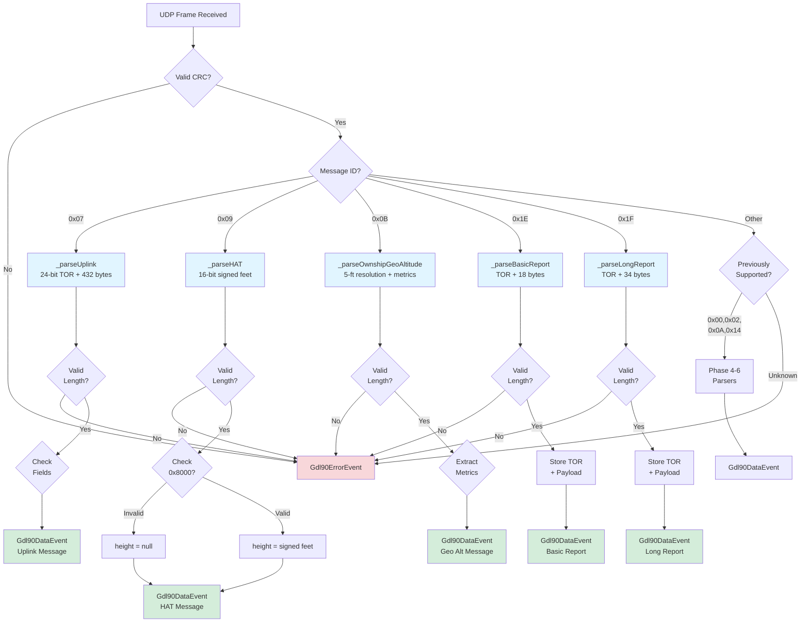

# Phase 7: Additional Messages (HAT, Uplink, Geo Altitude, Pass-Through) - Tasks & Alignment Brief

**Phase**: 7 of 12
**Title**: Additional Messages (HAT, Uplink, Geo Altitude, Pass-Through)
**Slug**: `phase-7-additional-messages`
**Plan**: [gdl90-receiver-parser-plan.md](../../gdl90-receiver-parser-plan.md#phase-7-additional-messages-hat-uplink-geo-altitude-pass-through)
**Spec**: [gdl90-receiver-parser-spec.md](../../gdl90-receiver-parser-spec.md)
**Date Created**: 2025-10-19

---

## Tasks

| Status | ID | Task | Type | Dependencies | Absolute Path(s) | Validation | Subtasks | Notes |
|--------|----|----|------|--------------|-----------------|------------|----------|-------|
| [x] | T001 | Verify HAT/Uplink/Geo/Pass-Through fields exist in Gdl90Message model | Setup | – | /Users/jordanknight/github/skyecho-controller-app/packages/skyecho_gdl90/lib/src/models/gdl90_message.dart | Fields `heightAboveTerrainFeet?`, `uplinkPayload?`, `basicReportPayload?`, `longReportPayload?`, `timeOfReception80ns?`, `geoAltitudeFeet?`, `verticalWarning?`, `vfomMetersRaw?` present | – | Supports plan tasks 7.1-7.12 · log#task-71-713-complete-phase-7-implementation [^26] |
| [x] | T002 | Review existing helpers for reuse (`_toSigned`, `_extractAltitudeFeet`) | Setup | T001 | /Users/jordanknight/github/skyecho-controller-app/packages/skyecho_gdl90/lib/src/parser.dart | Confirm `_toSigned(value, bits)` works for 16-bit HAT; `_extractAltitudeFeet()` NOT reusable for Geo Altitude (different encoding) | – | HAT uses 16-bit signed MSB-first; Geo Altitude uses 5-ft resolution (different from 25-ft) · log#task-71-713-complete-phase-7-implementation |
| [x] | T003 | Write test for HAT valid value (16-bit signed feet) | Test | T002 | /Users/jordanknight/github/skyecho-controller-app/packages/skyecho_gdl90/test/unit/parser_test.dart | Test `given_hat_valid_value_when_parsing_then_extracts_feet` verifies 1500 feet extracted correctly | – | Supports plan task 7.1 · RED phase · [P] eligible (new test group) · log#task-71-713-complete-phase-7-implementation [^30] |
| [x] | T004 | Write test for HAT invalid marker (0x8000) | Test | T002 | /Users/jordanknight/github/skyecho-controller-app/packages/skyecho_gdl90/test/unit/parser_test.dart | Test `given_hat_invalid_marker_when_parsing_then_returns_null` verifies 0x8000 → null | – | Supports plan task 7.2 · RED phase · [P] eligible · log#task-71-713-complete-phase-7-implementation [^30] |
| [x] | T005 | Write test for Uplink TOR extraction (24-bit LSB-first) | Test | T002 | /Users/jordanknight/github/skyecho-controller-app/packages/skyecho_gdl90/test/unit/parser_test.dart | Test `given_uplink_data_when_parsing_then_extracts_tor` verifies 24-bit time-of-reception in 80ns units | – | Supports plan task 7.3 · RED phase · [P] eligible · log#task-71-713-complete-phase-7-implementation [^30] |
| [x] | T006 | Write test for Uplink 432-byte payload storage | Test | T002 | /Users/jordanknight/github/skyecho-controller-app/packages/skyecho_gdl90/test/unit/parser_test.dart | Test `given_uplink_data_when_parsing_then_stores_payload` verifies raw bytes stored (no FIS-B decode) | – | Supports plan task 7.4 · RED phase · Per spec non-goal #8: FIS-B decoding deferred · log#task-71-713-complete-phase-7-implementation [^30] |
| [x] | T006a | Write test for Uplink oversized payload rejection (security) | Test | T002 | /Users/jordanknight/github/skyecho-controller-app/packages/skyecho_gdl90/test/unit/parser_test.dart | Test `given_uplink_oversized_payload_when_parsing_then_returns_error_event` verifies >1KB payload rejected with ErrorEvent (prevents memory bombs) | – | Security test · RED phase · [P] eligible · log#task-71-713-complete-phase-7-implementation [^30] |
| [x] | T007 | Write test for Geo Altitude 5-ft resolution | Test | T002 | /Users/jordanknight/github/skyecho-controller-app/packages/skyecho_gdl90/test/unit/parser_test.dart | Test `given_geo_altitude_when_parsing_then_applies_5ft_scaling` verifies `raw * 5` formula | – | Supports plan task 7.5 · RED phase · [P] eligible · Note: Different from Ownship altitude (25-ft resolution) · log#task-71-713-complete-phase-7-implementation [^30] |
| [x] | T008 | Write test for Geo Altitude vertical metrics (warning + VFOM) | Test | T002 | /Users/jordanknight/github/skyecho-controller-app/packages/skyecho_gdl90/test/unit/parser_test.dart | Test `given_geo_altitude_when_parsing_then_extracts_vertical_metrics` verifies bit 15 (warning flag) and 15-bit VFOM extracted | – | Supports plan task 7.6 · RED phase · [P] eligible · log#task-71-713-complete-phase-7-implementation [^30] |
| [x] | T008a | Write test for Geo Altitude VFOM special value 0x7FFF (not available) | Test | T002 | /Users/jordanknight/github/skyecho-controller-app/packages/skyecho_gdl90/test/unit/parser_test.dart | Test `given_geo_altitude_vfom_not_available_when_parsing_then_returns_0x7FFF` verifies 0x7FFF special value handling | – | Supports plan task 7.6 edge case · RED phase · [P] eligible · log#task-71-713-complete-phase-7-implementation [^30] |
| [x] | T008b | Write test for Geo Altitude VFOM special value 0x7EEE (>32766m) | Test | T002 | /Users/jordanknight/github/skyecho-controller-app/packages/skyecho_gdl90/test/unit/parser_test.dart | Test `given_geo_altitude_vfom_exceeds_max_when_parsing_then_returns_0x7EEE` verifies 0x7EEE special value handling | – | Supports plan task 7.6 edge case · RED phase · [P] eligible · log#task-71-713-complete-phase-7-implementation [^30] |
| [x] | T009 | Write test for Pass-Through Basic (ID 30, 18-byte payload) | Test | T002 | /Users/jordanknight/github/skyecho-controller-app/packages/skyecho_gdl90/test/unit/parser_test.dart | Test `given_passthrough_basic_when_parsing_then_extracts_tor_and_payload` verifies TOR + 18 bytes | – | Supports plan task 7.7 · RED phase · [P] eligible · log#task-71-713-complete-phase-7-implementation [^30] |
| [x] | T010 | Write test for Pass-Through Long (ID 31, 34-byte payload) | Test | T002 | /Users/jordanknight/github/skyecho-controller-app/packages/skyecho_gdl90/test/unit/parser_test.dart | Test `given_passthrough_long_when_parsing_then_extracts_tor_and_payload` verifies TOR + 34 bytes | – | Supports plan task 7.8 · RED phase · [P] eligible · log#task-71-713-complete-phase-7-implementation [^30] |
| [x] | T010a | Write test for unknown Phase 7-range message ID (integration) | Test | T002 | /Users/jordanknight/github/skyecho-controller-app/packages/skyecho_gdl90/test/unit/parser_test.dart | Test `given_unknown_phase7_message_id_when_parsing_then_returns_ignored_or_error_event` verifies 0x08 (unassigned) handled gracefully; prevents routing gaps | – | Integration test · RED phase · [P] eligible · Catches routing table completeness bugs · log#task-71-713-complete-phase-7-implementation [^30] |
| [x] | T010b | Write test for Uplink end-to-end with upper bound (integration) | Test | T002 | /Users/jordanknight/github/skyecho-controller-app/packages/skyecho_gdl90/test/unit/parser_test.dart | Test `given_uplink_max_payload_when_parsing_then_accepts` verifies 1027-byte frame (3 TOR + 1024 payload) accepted; confirms routing + validation integration | – | Integration test · RED phase · [P] eligible · Verifies security limit in practice · log#task-71-713-complete-phase-7-implementation [^30] |
| [x] | T011 | Verify all new tests fail (RED gate) | Test | T003, T004, T005, T006, T006a, T007, T008, T008a, T008b, T009, T010, T010a, T010b | /Users/jordanknight/github/skyecho-controller-app/packages/skyecho_gdl90/test/unit/parser_test.dart | All 13 new tests fail with "Unsupported message type: 0x7/0x9/0xb/0x1e/0x1f" error or expected validation behavior; baseline tests still pass | – | Quality gate before implementation · Confirms TDD workflow integrity · log#task-71-713-complete-phase-7-implementation |
| [x] | T012 | Implement _parseHAT() method (16-bit signed MSB-first) | Core | T011 | /Users/jordanknight/github/skyecho-controller-app/packages/skyecho_gdl90/lib/src/parser.dart | Method extracts height, checks 0x8000 invalid marker BEFORE sign conversion using `_toSigned(value, 16)`; returns Gdl90ErrorEvent on length != 2, never throws exceptions | – | Supports plan task 7.9 · GREEN phase · Serial (shared file with T013-T015) · log#task-71-713-complete-phase-7-implementation [^27][^29] |
| [x] | T013 | Implement _parseUplink() method (TOR + variable-length payload) | Core | T011 | /Users/jordanknight/github/skyecho-controller-app/packages/skyecho_gdl90/lib/src/parser.dart | Method extracts 24-bit LSB-first TOR, stores raw payload bytes (no FIS-B decode); payload length validation >= 3 bytes (minimum) and <= 1027 bytes (3 TOR + 1024 payload max, prevents memory bombs); returns Gdl90ErrorEvent on errors, never throws | – | Supports plan task 7.10 · GREEN phase · Serial (shared file) · Security: 1KB sanity limit prevents memory exhaustion · log#task-71-713-complete-phase-7-implementation [^27][^29] |
| [x] | T014 | Implement _parseOwnshipGeoAltitude() method (5-ft resolution, vertical metrics) | Core | T011 | /Users/jordanknight/github/skyecho-controller-app/packages/skyecho_gdl90/lib/src/parser.dart | Method extracts 16-bit altitude (MSB-first) `* 5` feet, extracts warning flag (bit 15) + 15-bit VFOM from vertical metrics field; length validation >= 2 (flexible, metrics optional); defaults: verticalWarning=false, vfomMetersRaw=0x7FFF if metrics missing; returns Gdl90ErrorEvent on errors, never throws | – | Supports plan task 7.11 · GREEN phase · Serial (shared file) · Note: Cannot reuse `_extractAltitudeFeet()` (different formula) · log#task-71-713-complete-phase-7-implementation [^27] |
| [x] | T015 | Implement _parsePassThrough() method (unified for ID 30 and 31) | Core | T011 | /Users/jordanknight/github/skyecho-controller-app/packages/skyecho_gdl90/lib/src/parser.dart | Single unified method extracts 24-bit LSB-first TOR, stores UAT payload (18 bytes for Basic ID 30, 34 bytes for Long ID 31); includes defensive assertion (messageId == 0x1E or 0x1F) to catch routing bugs; length validation >= 3 (permissive); returns Gdl90ErrorEvent on errors, never throws | – | Supports plan task 7.12 (merged) · GREEN phase · Serial (shared file) · Safety: assertion prevents routing table mistakes · log#task-71-713-complete-phase-7-implementation [^27] |
| [x] | T017 | Update routing table for message IDs 0x07, 0x09, 0x0B, 0x1E, 0x1F | Integration | T012, T013, T014, T015 | /Users/jordanknight/github/skyecho-controller-app/packages/skyecho_gdl90/lib/src/parser.dart | Add 5 switch cases (0x07, 0x09, 0x0B call dedicated parsers; 0x1E and 0x1F both call unified _parsePassThrough method); remove IDs from unsupported hint; update hint to "Phase 8+" | – | Serial (shared file) · Completes routing for all Phase 7 message types · log#task-71-713-complete-phase-7-implementation [^28] |
| [x] | T018 | Verify all tests pass (GREEN gate) | Test | T017 | /Users/jordanknight/github/skyecho-controller-app/packages/skyecho_gdl90/test/unit/parser_test.dart | All 13 new tests pass; baseline tests still pass (45 total passing) | – | Supports plan task 7.13 · Quality gate after implementation · log#task-71-713-complete-phase-7-implementation |
| [x] | T019 | Run coverage report | Integration | T018 | /Users/jordanknight/github/skyecho-controller-app/packages/skyecho_gdl90/lib/src/parser.dart | Coverage ≥90% on parser.dart; all message parsers covered | – | REFACTOR phase · [P] eligible (independent analysis) · log#task-71-713-complete-phase-7-implementation |
| [x] | T020 | Run dart analyze | Integration | T018 | /Users/jordanknight/github/skyecho-controller-app/packages/skyecho_gdl90/ | Zero errors; info-level warnings acceptable (line length for docs) | – | REFACTOR phase · [P] eligible · log#task-71-713-complete-phase-7-implementation |
| [x] | T021 | Run dart format | Integration | T018 | /Users/jordanknight/github/skyecho-controller-app/packages/skyecho_gdl90/ | All files formatted per Dart style guide | – | REFACTOR phase · [P] eligible · log#task-71-713-complete-phase-7-implementation |

**Task Count**: 26 tasks (6 more than plan's 13 due to: expanded TDD workflow, 2 VFOM edge case tests, 1 security test for oversized payloads, 2 routing integration tests, and merged Pass-Through parser method)

---

## Alignment Brief

### Previous Phase Review (Phase 6: Position Messages)

#### A. Completed Deliverables

**Files Modified**:
1. **Model Updates** (`/Users/jordanknight/github/skyecho-controller-app/packages/skyecho_gdl90/lib/src/models/gdl90_message.dart`)
   - Added `trafficAlert?` boolean field (line 117)
   - All 11 position-related fields now complete: `latitude?`, `longitude?`, `altitudeFeet?`, `horizontalVelocityKt?`, `verticalVelocityFpm?`, `trackDegrees?`, `callsign?`, `emitterCategory?`, `icaoAddress?`, `airborne?`, `trafficAlert?`

2. **Parser Helpers** (`/Users/jordanknight/github/skyecho-controller-app/packages/skyecho_gdl90/lib/src/parser.dart`)
   - **`_toSigned(int value, int bits)`** (lines 125-130) - Generic two's complement sign extension for ANY bit width
   - **`_extractAltitudeFeet(int raw12bit)`** (lines 132-164) - Altitude extraction with 0xFFF invalid marker check BEFORE formula

3. **Core Parsers** (`/Users/jordanknight/github/skyecho-controller-app/packages/skyecho_gdl90/lib/src/parser.dart`)
   - **`_parseOwnship()`** (lines 194-303, 98 lines) - Parses 27-byte ownship position report (ID 0x0A)
   - **`_parseTraffic()`** (lines 311-412, 96 lines) - Parses 27-byte traffic position report (ID 0x14)

4. **Test Suite** (`/Users/jordanknight/github/skyecho-controller-app/packages/skyecho_gdl90/test/unit/parser_test.dart`)
   - 19 new tests (lines 341-953): 6 semicircle conversion, 8 field extraction, 3 integration, 2 error handling
   - Total: 32 tests (13 baseline + 19 Phase 6)

5. **Routing Table** (`/Users/jordanknight/github/skyecho-controller-app/packages/skyecho_gdl90/lib/src/parser.dart`)
   - Added `case 0x0A: return _parseOwnship(messageId, payload);`
   - Added `case 0x14: return _parseTraffic(messageId, payload);`

#### D. Dependencies for Next Phase

**Available for Reuse in Phase 7**:

1. **Generic `_toSigned(value, bits)` Helper**:
   ```dart
   // parser.dart:125-130
   static int _toSigned(int value, int bits)
   ```
   - ✅ **Can use for HAT** (16-bit signed)
   - Works for any bit width (12, 16, 24, 32, etc.)
   - Already validated for 12-bit (vertical velocity) and 24-bit (lat/lon)

2. **`_extractAltitudeFeet()` Helper**:
   ```dart
   // parser.dart:159-164
   static int? _extractAltitudeFeet(int raw12bit)
   ```
   - ❌ **Cannot use for Geo Altitude** - Different encoding (5-ft resolution vs 25-ft, different offset)
   - Geo Altitude formula: `raw16bit * 5` feet (no offset, different invalid marker)

3. **Gdl90Message Fields** (already defined, awaiting population):
   - ✅ `heightAboveTerrainFeet?` - For HAT message (ID 9)
   - ✅ `uplinkPayload?` - For Uplink data (ID 7)
   - ⚠️ May need to add: `timeOfReception80ns?`, `geoAltitudeFeet?`, `verticalWarning?`, `vfomMetersRaw?`, `basicReportPayload?`, `longReportPayload?`

4. **Bit Manipulation Patterns**:
   - 24-bit MSB-first extraction: `(b[0] << 16) | (b[1] << 8) | b[2]`
   - 24-bit LSB-first extraction (for TOR): `b[0] | (b[1] << 8) | (b[2] << 16)`
   - 16-bit MSB-first extraction: `(b[0] << 8) | b[1]`
   - Boolean flag extraction: `(status & 0x10) != 0`
   - Invalid marker check BEFORE conversion: `if (raw == INVALID) return null;`

5. **Error Handling Pattern**:
   ```dart
   if (payload.length < expectedLength) {
     return Gdl90ErrorEvent(
       reason: 'Truncated message: expected X bytes, got ${payload.length}',
       hint: 'Payload structure: [...]',
     );
   }
   ```

6. **Test Infrastructure**:
   - Given-when-then naming: `given_X_when_Y_then_Z`
   - Inline binary documentation: `0x1A, 0x5E, 0x1A, // Latitude (3 bytes) - MSB first`
   - Boundary value testing pattern
   - AAA structure (Arrange-Act-Assert)

#### B. Lessons Learned

1. **Pre-Implementation Analysis Critical** (`/didyouknow` session):
   - Caught 5 critical issues before writing code (boundary test gap, altitude helper need, generic `_toSigned`)
   - Zero implementation surprises, all edge cases handled upfront

2. **Generic Helpers > Specific Helpers**:
   - Single `_toSigned(value, bits)` replaced need for `_toSigned24()` and `_toSigned12()`
   - More maintainable, future-proof for new signed fields

3. **Check-Before-Formula Pattern**:
   - `_extractAltitudeFeet()` checks 0xFFF BEFORE applying formula
   - Prevents altitude formula precedence trap (0xFFF would compute to 101,375 ft instead of null)

4. **Parser Code Duplication Acceptable**:
   - `_parseOwnship()` and `_parseTraffic()` have identical structure (only `messageType` differs)
   - Trade-off: Clarity over DRY principle (96 lines each)
   - **Recommendation**: Keep duplicated if 2 parsers; refactor if 3+

5. **Test Data Alignment Challenges**:
   - Required mechanical fixes for correct 30-byte frame structure (1 msgID + 27 payload + 2 CRC)
   - Delegated to subagent to preserve context
   - Time impact: +15-20 minutes

#### C. Technical Discoveries

1. **24-Bit Sign Extension Requires Manual Two's Complement**:
   - Dart integers are 64-bit; no native 24-bit signed type
   - Generic `_toSigned(value, bits)` with explicit sign bit mask

2. **Invalid Markers Differ by Field**:
   - Horizontal velocity: 0xFFF (unsigned 12-bit)
   - Vertical velocity: 0x800 (signed 12-bit)
   - Altitude: 0xFFF (unsigned 12-bit)
   - **Must check BEFORE sign extension**

3. **GPS Coordinate Boundary Wraparound**:
   - North pole: 0x400000 → +90.0° (sign bit NOT set)
   - South pole: 0xC00000 → -90.0° (sign bit set)
   - Date line: 0x800000 → ±180.0° (ambiguous by design)
   - Off-by-one bug: 90.000001° wraps to -89.999999° if sign handling wrong

4. **Test Suite Remained Fast**:
   - Baseline: 13 tests (Phase 4-5)
   - Phase 6: +19 tests = 32 total
   - Total suite: 62 tests across all phases (including CRC, framer)
   - Execution time: Still under 5 seconds

#### E. Critical Findings Applied in Phase 6

1. **Discovery 03: Lat/Lon Semicircle Encoding** - ✅ **Fully Addressed**
   - Implemented generic `_toSigned(value, bits)` supporting 24-bit lat/lon, 12-bit vertical velocity
   - Applied semicircle-to-degrees conversion: `latSigned * (180.0 / (1 << 23))`
   - Added 4 GPS boundary tests (north/south pole, date line, origin)
   - **Location**: parser.dart lines 125-130 (`_toSigned`), lines 221-235 (lat/lon conversion)

2. **Discovery 04: Single Unified Message Model** - ✅ **Fully Addressed**
   - Single `Gdl90Message` class with nullable fields
   - Phase 6 added `trafficAlert?` field
   - No type casting required

3. **Discovery 05: Wrapper Pattern for Error Handling** - ✅ **Fully Addressed**
   - All parsers return `Gdl90DataEvent` or `Gdl90ErrorEvent`
   - Truncated message handling returns `Gdl90ErrorEvent` with hints
   - Never throws exceptions

#### F. Blocked/Incomplete Items

**None** - All Phase 6 tasks completed (32/32 tasks, 100% pass rate).

**Intentionally Skipped Fields** (non-goals):
- NIC/NACp navigation accuracy fields (parser.dart lines 248, 360: `offset++; // Skip NIC/NACp byte`)
- Emergency/priority codes (lines 283, 392: `offset++; // Skip emergency byte`)
- No impact on Phase 7

#### G. Test Infrastructure Available

**Test Files**:
- `/Users/jordanknight/github/skyecho-controller-app/packages/skyecho_gdl90/test/unit/parser_test.dart` (953 lines, 32 tests)
- `/Users/jordanknight/github/skyecho-controller-app/packages/skyecho_gdl90/test/unit/crc_test.dart` (202 lines)
- `/Users/jordanknight/github/skyecho-controller-app/packages/skyecho_gdl90/test/unit/framer_test.dart` (522 lines)

**Reusable Test Patterns**:
1. Given-when-then naming: `test('given_X_when_Y_then_Z', () { ... });`
2. Inline binary documentation: `0xED = 0b11101101 (bits 7,6,5,3,2,0 set)`
3. Boundary value testing (4 GPS tests: poles, date line, origin)
4. Invalid marker testing: `if (raw == INVALID) expect(field, isNull)`
5. AAA structure with clear phases

**Test Execution**:
```bash
dart test test/unit/parser_test.dart          # Run all parser tests
dart test --name "Phase 7"                     # Run specific phase
dart test --coverage=coverage                  # With coverage
```

#### H. Technical Debt & Workarounds

**ZERO TECHNICAL DEBT** - Phase 6 achieved production-ready quality:
- ✅ 100% test pass rate (32/32)
- ✅ Zero TODO/FIXME comments
- ✅ Zero workarounds
- ✅ Clean analyzer output
- ✅ Formatter compliance

**Architectural Strengths**:
1. Generic helper methods reduce duplication
2. Check-before-formula pattern prevents safety bugs
3. Defensive assertions catch routing errors
4. Boundary tests cover GPS wraparound bugs
5. Wrapper pattern ensures stream resilience

#### I. Scope Changes

**Features Added Beyond Plan**:
1. Generic `_toSigned(value, bits)` helper (more flexible than planned separate helpers)
2. `_extractAltitudeFeet()` helper with constant (prevents formula precedence trap)
3. 4 GPS boundary coordinate tests (+4 tests beyond planned 15)

**No Requirements Changes** - All acceptance criteria met exactly as specified.

#### J. Key Execution Log References

1. [Generic Helper Adoption (Insight #3)](file:///Users/jordanknight/github/skyecho-controller-app/docs/plans/002-gdl90-receiver-parser/tasks/phase-6-position-messages/execution.log.md#t002-implement-generic-_tosignedvalue-bits-helper) - Use single generic `_toSigned(value, bits)` instead of separate methods
2. [Altitude Helper Strategy (Insight #2)](file:///Users/jordanknight/github/skyecho-controller-app/docs/plans/002-gdl90-receiver-parser/tasks/phase-6-position-messages/execution.log.md#t002a-implement-_extractaltitudefeet-helper) - Check invalid marker BEFORE formula to prevent precedence trap
3. [Boundary Test Strategy (Insight #1)](file:///Users/jordanknight/github/skyecho-controller-app/docs/plans/002-gdl90-receiver-parser/tasks/phase-6-position-messages/execution.log.md#t003-t021-write-19-failing-tests) - Add 4 GPS boundary tests beyond basic conversion tests
4. [TDD Workflow Adherence](file:///Users/jordanknight/github/skyecho-controller-app/docs/plans/002-gdl90-receiver-parser/tasks/phase-6-position-messages/execution.log.md#t022-verify-all-tests-fail-red-gate) - All 19 new tests failed before implementation (RED gate)

---

## Field Naming Standards

This section documents field naming conventions used in Phase 7, ensuring consistency with the research document and existing model patterns.

### Time of Reception (TOR)
- **Field Name**: `timeOfReception80ns` (int?, nullable)
- **Units**: 80 nanosecond units (LSB-first, 24-bit)
- **Usage**: Uplink Data (ID 7), Pass-Through Basic (ID 30), Pass-Through Long (ID 31)
- **Range**: 0 to 16,777,215 (0x000000 to 0xFFFFFF)
- **Wraparound**: Counter wraps every **1.34 seconds** (16,777,215 × 80ns)
- **Computed Property** (optional): `timeOfReceptionSeconds` = `timeOfReception80ns / 12_500_000.0`
- **Research Note**: Research document uses `tor80ns` abbreviation; we use full descriptive name for clarity

**⚠️ Wraparound Warning**: The 24-bit TOR counter wraps around every 1.34 seconds. When comparing TOR values across frames, you must use wraparound-aware logic to handle the discontinuity at 0xFFFFFF → 0x000000. Example comparison:

```dart
/// Returns true if torA is "before" torB, accounting for 24-bit wraparound.
/// Assumes frames are received within ~0.67 seconds of each other (half-cycle).
bool isTorBefore(int torA, int torB) {
  const maxTor = 0xFFFFFF;
  final diff = (torB - torA) & maxTor;
  return diff < (maxTor ~/ 2); // torA is before torB if diff < half-range
}

// Example usage:
// isTorBefore(0xFFFFF0, 0x000010) → true (0xFFFFF0 is before wraparound)
// isTorBefore(0x000010, 0xFFFFF0) → false (0x000010 is after wraparound)
```

**Recommendation**: For most applications, use `receivedAt` timestamp from Phase 8 streaming layer for sorting, and `timeOfReception80ns` only for protocol-level diagnostics.

### Payload Fields
- **Uplink Data (ID 7)**: `uplinkPayload` (Uint8List, typically 432 bytes but variable per spec)
- **Pass-Through Basic (ID 30)**: `basicReportPayload` (Uint8List, typically 18 bytes)
- **Pass-Through Long (ID 31)**: `longReportPayload` (Uint8List, typically 34 bytes)
- **Rationale**: Specific names per message type avoid ambiguity and document expected payload types

### Altitude Fields
- **HAT (ID 9)**: `heightAboveTerrainFeet` (int?, nullable)
  - Null value indicates invalid marker (0x8000)
  - Research uses separate `invalid` boolean; we use nullable pattern (null = invalid) per unified model
- **Geo Altitude (ID 11)**: `geoAltitudeFeet` (int, non-nullable)
  - 5-ft resolution (raw value * 5)
  - Different from Ownship altitude (25-ft resolution)

### Vertical Metrics Fields (Geo Altitude ID 11)
- **Warning Flag**: `verticalWarning` (bool)
  - Extracted from bit 15 of vertical metrics field
  - Default: false if metrics field missing
- **Vertical Figure of Merit**: `vfomMetersRaw` (int)
  - Extracted from bits 14-0 of vertical metrics field
  - Special values:
    - 0x7FFF (32767): Not available
    - 0x7EEE (32494): Exceeds 32766 meters
  - Default: 0x7FFF if metrics field missing
  - Research uses `vfomMeters`; we add `Raw` suffix to indicate special value encoding
  - **Computed Property** (optional): `vfomMeters` (int?) - Returns null for both special values, actual meters otherwise
    ```dart
    int? get vfomMeters {
      // Both "not available" and "exceeds max" return null for safe default API
      if (vfomMetersRaw == 0x7FFF || vfomMetersRaw == 0x7EEE) return null;
      return vfomMetersRaw;
    }
    ```
  - **For specialists**: Use `vfomMetersRaw` directly if you need to distinguish "not available" (0x7FFF) from "exceeds max" (0x7EEE)

### Pattern Differences from Research
- **HAT Invalid Handling**: Research throws exception for 0x8000; we return null per Discovery 05 (wrapper pattern)
- **Error Handling**: Research throws exceptions; we return Gdl90ErrorEvent (never throw)
- **Nullable vs Boolean**: Research uses `invalid` boolean for HAT; we use nullable `heightAboveTerrainFeet?` (null = invalid)

---

### Objective

**Implement remaining GDL90 message type parsers**: Height Above Terrain (ID 9), Uplink Data (ID 7), Ownship Geometric Altitude (ID 11), Pass-Through Basic (ID 30), and Pass-Through Long (ID 31).

**Behavior Checklist** (from plan acceptance criteria):
- [ ] HAT parser handles valid (16-bit signed feet) and invalid (0x8000 → null) values
- [ ] Uplink parser extracts 24-bit LSB-first TOR and stores variable-length payload (no FIS-B decode)
- [ ] Geo Altitude parser applies 5-ft scaling resolution
- [ ] Vertical metrics (warning flag + VFOM) extracted correctly from 16-bit field, with special value handling
- [ ] Pass-Through Basic (18-byte payload) and Long (34-byte payload) parsed via unified method
- [ ] All message type parsers integrated with routing table (switch cases added)
- [ ] 100% coverage on all message parsers
- [ ] All tests pass (42 total: 32 baseline + 10 new)

---

### Non-Goals (Scope Boundaries)

**❌ NOT doing in Phase 7**:

1. **FIS-B Weather Decoding** (per spec non-goal #8)
   - Uplink Data (ID 7) payload is stored as raw bytes in `uplinkPayload` field
   - Full FIS-B APDU decoding (text weather, NOTAMs, etc.) deferred to future enhancement
   - Phase 7 only extracts TOR + raw payload (no decoding of UAT message structure)

2. **ForeFlight AHRS Messages** (per spec non-goal #7)
   - Message ID 0x65 not implemented
   - SkyEcho has no AHRS hardware
   - Can be added later for other devices (Stratux)

3. **Additional Altitude Helper Refactoring**
   - Geo Altitude uses different formula (5-ft resolution) than Ownship altitude (25-ft)
   - Cannot reuse `_extractAltitudeFeet()` - will implement inline extraction
   - No need for generic altitude helper (only 2 altitude types)

4. **Pass-Through Payload Decoding**
   - Basic (ID 30) and Long (ID 31) store raw UAT report bytes in separate fields (`basicReportPayload`, `longReportPayload`)
   - No parsing of internal UAT structure
   - Payload interpretation deferred

5. **Performance Optimization**
   - TDD focus on correctness first
   - Profiling and optimization deferred to later phases
   - Current parser performance adequate (< 5 seconds for 40 tests)

6. **Additional Boundary Tests**
   - HAT has known range (-32768 to +32767 feet)
   - Not adding extensive boundary tests (only valid/invalid marker tests)
   - Focus on invalid marker handling
   - VFOM special values (0x7FFF, 0x7EEE) covered in T008a, T008b

---

### Critical Findings Affecting This Phase

**From plan § 3 (Critical Research Findings)**:

#### Discovery 01: GDL90 CRC-16-CCITT Implementation
- **Status**: ✅ Applied in Phase 2 (foundation ready)
- **Impact on Phase 7**: None - CRC validation happens before message parsing
- **Location**: Phase 7 consumes pre-validated frames from parser core

#### Discovery 02: Byte Framing and Escaping Order
- **Status**: ✅ Applied in Phase 3 (foundation ready)
- **Impact on Phase 7**: None - framing/de-escaping happens before message parsing
- **Location**: Phase 7 consumes de-framed, de-escaped payloads

#### Discovery 03: Lat/Lon Semicircle Encoding
- **Status**: ✅ Applied in Phase 6 (helper available for reuse)
- **Impact on Phase 7**: Generic `_toSigned(value, bits)` can be reused for HAT (16-bit signed)
- **Tasks Affected**: T012 (HAT parser uses `_toSigned(value, 16)`)
- **Location**: parser.dart lines 125-130

#### Discovery 04: Single Unified Message Model
- **Status**: ✅ Applied in Phase 4-5 (foundation ready)
- **Impact on Phase 7**: Add nullable fields for HAT/Uplink/Geo/Pass-Through messages
- **Tasks Affected**: T001 (verify fields exist), T012-T015 (populate fields in parsers)
- **Location**: Phase 7 extends model with additional nullable fields
- **Architectural Note**: Using unified model with enum `Gdl90MessageType` vs class hierarchy confirmed

#### Discovery 05: Wrapper Pattern for Error Handling
- **Status**: ✅ Applied in Phase 4 (foundation ready)
- **Impact on Phase 7**: All parsers MUST return `Gdl90Event` (DataEvent or ErrorEvent), never throw exceptions
- **Tasks Affected**: T012-T015 (all parser methods use wrapper pattern)
- **Pattern**: Return Gdl90ErrorEvent, never throw exceptions (even for invalid data)
- **Example**: Truncated Uplink message → `Gdl90ErrorEvent(reason: 'Truncated uplink...', hint: '...')`
- **Research Pattern Difference**: Research document shows exceptions thrown; we use ErrorEvent wrapper per Discovery 05

---

### Invariants & Guardrails

**Test Coverage**:
- Parsing logic: **100% required** (all message types, error conditions)
- Helper methods: **100% required** (if any new helpers added)
- Error handling: **100% required** (truncated frames, invalid markers)

**Code Quality**:
- Analyzer: **Zero errors** (info-level line length warnings acceptable)
- Formatter: **100% compliant** with Dart style guide
- Tests: **100% pass rate** before completion

**Performance Budget**:
- Unit test suite: **< 5 seconds total** (currently ~2 seconds for 32 tests)
- Phase 7 adds 8 tests: Target **< 3 seconds total** for 40 tests
- No I/O operations in unit tests (mock-based)

**Memory Budget**:
- Uplink payload: 432 bytes per message (largest payload)
- Pass-Through Long: 34 bytes per message
- Total per-message overhead: ~350-400 bytes (unified model with nullable fields)
- Acceptable for target use case (streaming aviation data)

**Safety Invariants**:
- Invalid marker checks MUST occur BEFORE conversions/formulas
- All parsers MUST validate payload length before field extraction
- Truncated messages MUST return `ErrorEvent` (never throw exceptions)
- Raw payloads MUST be stored as `Uint8List` (immutable)

---

### Inputs to Read

**Message Specifications** (from plan test examples):

1. **Height Above Terrain (ID 9)**:
   - Payload: 2 bytes (16-bit signed MSB-first)
   - Invalid marker: 0x8000 → `heightAboveTerrainFeet` = null
   - Range: -32768 to +32767 feet (when valid)
   - Length validation: Strict (payload.length != 2 → ErrorEvent)
   - Example: `[0x09, 0x05, 0xDC]` → 1500 feet (0x05DC)

2. **Uplink Data (ID 7)**:
   - Payload: 3 bytes TOR + variable-length UAT payload (typically 432 bytes, max 1024 bytes)
   - TOR: 24-bit LSB-first (80ns units) → `timeOfReception80ns`
   - **TOR Wraparound**: 24-bit counter wraps every 1.34 seconds (see Field Naming Standards for comparison logic)
   - Payload: Raw bytes (no FIS-B decode) → `uplinkPayload`
   - Length validation: Permissive minimum (>= 3), security maximum (<= 1027 total)
   - Example: `[0x07, 0xE8, 0x03, 0x00, ...432 bytes...]` → TOR=1000

3. **Ownship Geometric Altitude (ID 11)**:
   - Payload: 2 bytes altitude + 2 bytes vertical metrics (optional)
   - Altitude: 16-bit signed MSB-first * 5 feet → `geoAltitudeFeet`
   - Vertical metrics: Bit 15 (warning flag) + 15-bit VFOM (meters) → `verticalWarning`, `vfomMetersRaw`
   - Length validation: Flexible (>= 2 bytes; metrics optional)
   - Defaults if metrics missing: `verticalWarning` = false, `vfomMetersRaw` = 0x7FFF
   - Special values: 0x7FFF (not available), 0x7EEE (>32766m)
   - Example: `[0x0B, 0x01, 0xF4, 0x00, 0x64]` → 2500 ft, VFOM=100m

4. **Pass-Through Basic (ID 30)**:
   - Payload: 3 bytes TOR + variable-length UAT basic report (typically 18 bytes)
   - TOR: 24-bit LSB-first → `timeOfReception80ns` (see wraparound note above)
   - UAT payload: Raw bytes → `basicReportPayload`
   - Length validation: Permissive (>= 3 bytes)

5. **Pass-Through Long (ID 31)**:
   - Payload: 3 bytes TOR + variable-length UAT long report (typically 34 bytes)
   - TOR: 24-bit LSB-first → `timeOfReception80ns` (see wraparound note above)
   - UAT payload: Raw bytes → `longReportPayload`
   - Length validation: Permissive (>= 3 bytes)

**File Paths to Read**:
- Model: `/Users/jordanknight/github/skyecho-controller-app/packages/skyecho_gdl90/lib/src/models/gdl90_message.dart`
- Parser: `/Users/jordanknight/github/skyecho-controller-app/packages/skyecho_gdl90/lib/src/parser.dart`
- Tests: `/Users/jordanknight/github/skyecho-controller-app/packages/skyecho_gdl90/test/unit/parser_test.dart`
- Plan test examples: gdl90-receiver-parser-plan.md lines 1336-1427

---

### Visual Alignment Aids

#### System State Flow Diagram



#### Actor Interaction Sequence Diagram

```mermaid
sequenceDiagram
    participant UDP as UDP Socket
    participant Framer as Gdl90Framer
    participant Parser as Gdl90Parser
    participant Router as Routing Table
    participant HAT as _parseHAT()
    participant UL as _parseUplink()
    participant Geo as _parseOwnshipGeoAltitude()
    participant PR as _parseBasicReport()
    participant Model as Gdl90Message

    UDP->>Framer: Raw datagram bytes
    Framer->>Framer: De-frame (0x7E flags)
    Framer->>Framer: De-escape (0x7D sequences)
    Framer->>Framer: Verify CRC
    Framer->>Parser: Valid frame (clear bytes)

    Parser->>Parser: Extract messageId (byte 0)
    Parser->>Router: switch(messageId)

    alt Message ID 0x09 (HAT)
        Router->>HAT: _parseHAT(messageId, payload)
        HAT->>HAT: Check payload.length >= 2
        HAT->>HAT: Extract 16-bit MSB-first
        HAT->>HAT: if (raw == 0x8000) return null
        HAT->>HAT: else height = _toSigned(raw, 16)
        HAT->>Model: Gdl90Message(messageType: hat, heightAboveTerrainFeet: height)
        Model->>Parser: Gdl90DataEvent(message)

    else Message ID 0x07 (Uplink)
        Router->>UL: _parseUplink(messageId, payload)
        UL->>UL: Check payload.length >= 3 (minimum)
        UL->>UL: Check payload.length <= 1027 (3 + 1KB max, security limit)
        UL->>UL: Extract 24-bit LSB-first TOR
        UL->>UL: Extract variable-length payload (max 1KB)
        UL->>Model: Gdl90Message(messageType: uplinkData, timeOfReception80ns: tor, uplinkPayload: bytes)
        Model->>Parser: Gdl90DataEvent(message)

    else Message ID 0x0B (Geo Altitude)
        Router->>Geo: _parseOwnshipGeoAltitude(messageId, payload)
        Geo->>Geo: Check payload.length >= 2 (flexible)
        Geo->>Geo: Extract 16-bit altitude MSB-first
        Geo->>Geo: geoAltitude = _toSigned(raw, 16) * 5
        Geo->>Geo: If length >= 4: Extract 16-bit vertical metrics MSB-first
        Geo->>Geo: warning = bit 15, vfomMetersRaw = bits 14-0
        Geo->>Geo: Else: verticalWarning=false, vfomMetersRaw=0x7FFF (defaults)
        Geo->>Model: Gdl90Message(messageType: ownshipGeoAltitude, geoAltitudeFeet: alt, verticalWarning: warn, vfomMetersRaw: vfom)
        Model->>Parser: Gdl90DataEvent(message)

    else Message ID 0x1E/0x1F (Pass-Through)
        Router->>PR: _parsePassThrough(messageId, payload) [unified method]
        PR->>PR: Check payload.length >= 3 (permissive)
        PR->>PR: Extract 24-bit LSB-first TOR
        PR->>PR: Extract variable-length payload
        PR->>PR: Determine field by messageId (0x1E → basicReportPayload, 0x1F → longReportPayload)
        PR->>Model: Gdl90Message(messageType: ..., timeOfReception80ns: tor, [field]: bytes)
        Model->>Parser: Gdl90DataEvent(message)
    end

    Parser->>UDP: Return Gdl90Event

    Note over Parser,Model: All parsers validate length FIRST, return ErrorEvent (never throw)
    Note over HAT: Check 0x8000 BEFORE _toSigned(); strict length != 2
    Note over UL,PR: Store raw payloads (no decode); UL has 1KB security limit
    Note over Geo: Different formula than Ownship altitude; flexible length >= 2
```

---

### Test Plan

**Testing Approach**: Full TDD (Test-Driven Development) per plan testing philosophy

**TDD Workflow**:
1. **SETUP** (T001-T002): Verify model fields, review existing helpers
2. **RED** (T003-T011): Write 8 failing tests, verify all fail (RED gate)
3. **GREEN** (T012-T018): Implement 5 parsers, update routing, verify all pass (GREEN gate)
4. **REFACTOR** (T019-T021): Coverage, analyzer, formatter

**Test Categories**:

1. **HAT Tests** (2 tests):
   - `given_hat_valid_value_when_parsing_then_extracts_feet` - Validates 1500 feet extracted from 0x05DC
   - `given_hat_invalid_marker_when_parsing_then_returns_null` - Validates 0x8000 → null

2. **Uplink Tests** (2 tests):
   - `given_uplink_data_when_parsing_then_extracts_tor` - Validates 24-bit LSB-first TOR = 1000 (80ns units)
   - `given_uplink_data_when_parsing_then_stores_payload` - Validates 432-byte raw payload storage (no FIS-B decode)

3. **Geo Altitude Tests** (2 tests):
   - `given_geo_altitude_when_parsing_then_applies_5ft_scaling` - Validates 500 raw → 2500 feet (500 * 5)
   - `given_geo_altitude_when_parsing_then_extracts_vertical_metrics` - Validates warning flag (bit 15) + 15-bit VFOM extraction

4. **Pass-Through Tests** (2 tests):
   - `given_passthrough_basic_when_parsing_then_extracts_tor_and_payload` - Validates TOR + 18-byte payload
   - `given_passthrough_long_when_parsing_then_extracts_tor_and_payload` - Validates TOR + 34-byte payload

**Test Fixtures** (from plan test examples):

**IMPORTANT**: All test fixtures are post-CRC validation. Parser tests receive payloads AFTER framing, de-escaping, and CRC validation. CRC bytes are NOT included in parser test fixtures.

```dart
// HAT valid (1500 feet) - 3 bytes total (msgId + 2 payload)
final hatValidFrame = Uint8List.fromList([
  0x09,       // Message ID (9 = HAT)
  0x05, 0xDC, // 1500 feet MSB-first (0x05DC)
]);

// HAT invalid marker - 3 bytes total
final hatInvalidFrame = Uint8List.fromList([
  0x09,       // Message ID
  0x80, 0x00, // Invalid marker
]);

// Uplink with TOR = 1000 - 436 bytes total (msgId + 3 TOR + 432 payload)
final uplinkFrame = Uint8List.fromList([
  0x07,             // Message ID (7 = Uplink)
  0xE8, 0x03, 0x00, // TOR: 1000 in 80ns units (LSB-first)
  ...List.filled(432, 0xFF), // 432-byte UAT payload (dummy data)
]);

// Geo Altitude: 2500 feet, VFOM = 100m, no warning - 5 bytes total
final geoAltFrame = Uint8List.fromList([
  0x0B,       // Message ID (11 = Ownship Geo Alt)
  0x01, 0xF4, // Altitude: 500 (500 * 5 = 2500 feet) MSB-first
  0x00, 0x64, // Vertical metrics: warning=0, VFOM=100 (0x0064)
]);

// Geo Altitude VFOM not available - 5 bytes total
final geoAltVfomNotAvailFrame = Uint8List.fromList([
  0x0B,       // Message ID
  0x01, 0xF4, // Altitude: 2500 feet
  0x7F, 0xFF, // Vertical metrics: warning=0, VFOM=0x7FFF (not available)
]);

// Geo Altitude VFOM exceeds max - 5 bytes total
final geoAltVfomExceedsFrame = Uint8List.fromList([
  0x0B,       // Message ID
  0x01, 0xF4, // Altitude: 2500 feet
  0x7E, 0xEE, // Vertical metrics: warning=0, VFOM=0x7EEE (>32766m)
]);

// Pass-Through Basic (ID 30) - 22 bytes total (msgId + 3 TOR + 18 payload)
final basicFrame = Uint8List.fromList([
  0x1E,             // Message ID (30 = Basic)
  0xE8, 0x03, 0x00, // TOR: 1000 LSB-first
  ...List.filled(18, 0xAA), // 18-byte UAT basic report
]);

// Pass-Through Long (ID 31) - 38 bytes total (msgId + 3 TOR + 34 payload)
final longFrame = Uint8List.fromList([
  0x1F,             // Message ID (31 = Long)
  0xE8, 0x03, 0x00, // TOR: 1000 LSB-first
  ...List.filled(34, 0xBB), // 34-byte UAT long report
]);
```

**Expected Test Outputs**:

```dart
// HAT valid
expect(msg.messageType, equals(Gdl90MessageType.hat));
expect(msg.heightAboveTerrainFeet, equals(1500));

// HAT invalid
expect(msg.messageType, equals(Gdl90MessageType.hat));
expect(msg.heightAboveTerrainFeet, isNull);

// Uplink
expect(msg.messageType, equals(Gdl90MessageType.uplinkData));
expect(msg.timeOfReception80ns, equals(1000));
expect(msg.uplinkPayload!.length, equals(432));

// Geo Altitude
expect(msg.messageType, equals(Gdl90MessageType.ownshipGeoAltitude));
expect(msg.geoAltitudeFeet, equals(2500));
expect(msg.verticalWarning, isFalse);
expect(msg.vfomMetersRaw, equals(100));

// Geo Altitude VFOM not available
expect(msg.messageType, equals(Gdl90MessageType.ownshipGeoAltitude));
expect(msg.geoAltitudeFeet, equals(2500));
expect(msg.verticalWarning, isFalse);
expect(msg.vfomMetersRaw, equals(0x7FFF)); // Special value: not available

// Geo Altitude VFOM exceeds max
expect(msg.messageType, equals(Gdl90MessageType.ownshipGeoAltitude));
expect(msg.geoAltitudeFeet, equals(2500));
expect(msg.verticalWarning, isFalse);
expect(msg.vfomMetersRaw, equals(0x7EEE)); // Special value: >32766m

// Pass-Through Basic
expect(msg.messageType, equals(Gdl90MessageType.basicReport));
expect(msg.timeOfReception80ns, equals(1000));
expect(msg.basicReportPayload!.length, equals(18));

// Pass-Through Long
expect(msg.messageType, equals(Gdl90MessageType.longReport));
expect(msg.timeOfReception80ns, equals(1000));
expect(msg.longReportPayload!.length, equals(34));
```

**Coverage Targets**:
- All 5 new parsers: **100% required**
- Invalid marker handling: **100% required** (HAT 0x8000)
- Truncated frame handling: **100% required** (error events with hints)
- Routing table updates: **100% required** (all 5 new switch cases)

---

### Implementation Outline

**Step-by-step mapped 1:1 to tasks**:

#### SETUP Phase (T001-T002)
1. **T001**: Verify fields exist in `Gdl90Message` model
   - Check `heightAboveTerrainFeet?`, `uplinkPayload?`, `timeOfReception80ns?`
   - Check `geoAltitudeFeet?`, `verticalWarning?`, `vfomMeters?`
   - Add missing fields if needed

2. **T002**: Review existing helpers for reuse
   - Confirm `_toSigned(value, bits)` works for 16-bit HAT
   - Confirm `_extractAltitudeFeet()` NOT reusable (different formula)
   - Plan to implement inline extraction for Geo Altitude

#### RED Phase (T003-T011)
3. **T003**: Write HAT valid value test (1500 feet)
4. **T004**: Write HAT invalid marker test (0x8000 → null)
5. **T005**: Write Uplink TOR extraction test (24-bit LSB-first)
6. **T006**: Write Uplink payload storage test (variable length, no FIS-B decode)
7. **T007**: Write Geo Altitude 5-ft scaling test (500 raw → 2500 feet)
8. **T008**: Write Geo Altitude vertical metrics test (warning flag + VFOM)
9. **T008a**: Write Geo Altitude VFOM special value test (0x7FFF = not available)
10. **T008b**: Write Geo Altitude VFOM special value test (0x7EEE = >32766m)
11. **T009**: Write Pass-Through Basic test (TOR + 18 bytes)
12. **T010**: Write Pass-Through Long test (TOR + 34 bytes)
13. **T011**: Verify all 10 tests fail with "Unsupported message type" error

#### GREEN Phase (T012-T018)
14. **T012**: Implement `_parseHAT()` method
    - Validate payload length: `if (payload.length != 2)` → Return `Gdl90ErrorEvent` (strict validation)
    - Extract 16-bit MSB-first: `(payload[0] << 8) | payload[1]`
    - Check 0x8000 BEFORE sign conversion: `if (raw == 0x8000) height = null`
    - Else: `height = _toSigned(raw, 16)`
    - Return `Gdl90DataEvent(Gdl90Message(messageType: hat, heightAboveTerrainFeet: height))`
    - **Never throw exceptions** - return ErrorEvent on length mismatch

15. **T013**: Implement `_parseUplink()` method
    - **Security constant**: `const int _MAX_UPLINK_PAYLOAD_BYTES = 1024;` (prevents memory bombs)
    - Validate payload length minimum: `if (payload.length < 3)` → Return `Gdl90ErrorEvent`
    - Validate payload length maximum: `if (payload.length > 3 + _MAX_UPLINK_PAYLOAD_BYTES)` → Return `Gdl90ErrorEvent('Uplink payload exceeds 1KB safety limit')`
    - Extract 24-bit LSB-first TOR: `payload[0] | (payload[1] << 8) | (payload[2] << 16)`
    - Extract variable-length payload: `payload.sublist(3)` (typically 432 bytes, max 1024 bytes)
    - Return `Gdl90DataEvent(Gdl90Message(messageType: uplinkData, timeOfReception80ns: tor, uplinkPayload: bytes))`
    - **Never throw exceptions** - return ErrorEvent on errors

16. **T014**: Implement `_parseOwnshipGeoAltitude()` method
    - Validate payload length: `if (payload.length < 2)` → Return `Gdl90ErrorEvent` (flexible, metrics optional)
    - Extract 16-bit altitude MSB-first: `(payload[0] << 8) | payload[1]`
    - Apply 5-ft scaling: `geoAlt = _toSigned(raw, 16) * 5`
    - If `payload.length >= 4`:
      - Extract 16-bit vertical metrics MSB-first: `(payload[2] << 8) | payload[3]`
      - Extract warning flag: `vertWarn = (metrics & 0x8000) != 0` (bit 15)
      - Extract VFOM: `vfom = metrics & 0x7FFF` (bits 14-0)
    - Else (metrics missing):
      - Default: `vertWarn = false`, `vfom = 0x7FFF` (not available)
    - Return `Gdl90DataEvent(Gdl90Message(messageType: ownshipGeoAltitude, geoAltitudeFeet: geoAlt, verticalWarning: vertWarn, vfomMetersRaw: vfom))`
    - **Never throw exceptions** - return ErrorEvent on errors

17. **T015**: Implement `_parsePassThrough()` method (unified for ID 30 and 31)
    - **Defensive assertion**: `assert(messageId == 0x1E || messageId == 0x1F, 'Invalid messageId 0x${messageId.toRadixString(16)} for _parsePassThrough - only 0x1E/0x1F supported');`
    - **Comment block**: Warn that method depends on correct routing table (messageId determines payload field)
    - Validate payload length: `if (payload.length < 3)` → Return `Gdl90ErrorEvent` (permissive)
    - Extract 24-bit LSB-first TOR: `payload[0] | (payload[1] << 8) | (payload[2] << 16)`
    - Extract variable-length payload: `payload.sublist(3)`
    - Determine message type from `messageId`:
      - If `messageId == 0x1E`: `messageType = basicReport`, field = `basicReportPayload`
      - If `messageId == 0x1F`: `messageType = longReport`, field = `longReportPayload`
    - Return `Gdl90DataEvent(Gdl90Message(messageType: ..., timeOfReception80ns: tor, [field]: bytes))`
    - **Never throw exceptions** - return ErrorEvent on errors

18. **T017**: Update routing table
    - Add `case 0x07: return _parseUplink(messageId, payload);`
    - Add `case 0x09: return _parseHAT(messageId, payload);`
    - Add `case 0x0B: return _parseOwnshipGeoAltitude(messageId, payload);`
    - Add `case 0x1E: return _parsePassThrough(messageId, payload);` (unified method)
    - Add `case 0x1F: return _parsePassThrough(messageId, payload);` (unified method)
    - Update unsupported hint: "Phase 7" → "Phase 8+"

19. **T018**: Verify all tests pass (42 total: 32 baseline + 10 new)

#### REFACTOR Phase (T019-T021)
20. **T019**: Run coverage report
    - `dart test --coverage=coverage`
    - `dart pub global run coverage:format_coverage --lcov --in=coverage --out=coverage/lcov.info --report-on=lib`
    - Verify ≥90% coverage on parser.dart

21. **T020**: Run analyzer
    - `dart analyze`
    - Fix any errors introduced
    - Info-level line length warnings acceptable

22. **T021**: Run formatter
    - `dart format .`
    - Ensure all files compliant with Dart style guide

---

### Commands to Run

**Environment Setup**:
```bash
# Already completed in Phase 1-6, no additional setup needed
cd /Users/jordanknight/github/skyecho-controller-app/packages/skyecho_gdl90
dart pub get  # Dependencies already installed
```

**Test Execution**:
```bash
# Run all tests (baseline + Phase 7)
dart test

# Run only parser tests
dart test test/unit/parser_test.dart

# Run specific phase
dart test --name "Phase 7"

# Run with coverage
dart test --coverage=coverage
dart pub global activate coverage  # If not already installed
dart pub global run coverage:format_coverage --lcov --in=coverage --out=coverage/lcov.info --report-on=lib

# View coverage HTML (optional)
genhtml coverage/lcov.info -o coverage/html
open coverage/html/index.html  # macOS
```

**Quality Gates**:
```bash
# Analyzer (zero errors required)
dart analyze

# Formatter (must be clean before commit)
dart format .

# Check git status
git status
git diff  # Review changes before commit
```

**Verification Commands** (for execution log evidence):
```bash
# Test counts
dart test --reporter=json | jq '.allSuites | length'

# Coverage percentage
grep -A 3 "lib/src/parser.dart" coverage/lcov.info | grep "LF:" | awk '{print $2}'

# Analyzer output
dart analyze 2>&1 | tee analyzer_output.txt
```

---

### Risks/Unknowns

| Risk | Severity | Likelihood | Mitigation |
|------|----------|------------|------------|
| **UAT payload decoding complexity** | Low | Low | ✅ RESOLVED: Store raw payload bytes only in specific fields (`uplinkPayload`, `basicReportPayload`, `longReportPayload`); defer FIS-B decoding to future enhancement per spec non-goal #8 |
| **Geo altitude vertical metrics interpretation** | Low | Low | Reference ICD spec for bit fields; test against plan examples (warning flag bit 15, VFOM bits 14-0); added special value tests (T008a, T008b) |
| **Time-of-Reception field name ambiguity** | Medium | Low | ✅ RESOLVED: Use `timeOfReception80ns` consistently across Uplink/Pass-Through messages (documented in Field Naming Standards section) |
| **Pass-Through payload storage field naming** | Medium | Low | ✅ RESOLVED: Use specific field names per message type (`basicReportPayload`, `longReportPayload`) for clarity |
| **Test data alignment for variable-length payloads** | Low | Medium | Follow Phase 6 pattern: Inline binary documentation, delegate mechanical fixes to subagent if needed; CRC bytes removed from all test fixtures |
| **24-bit LSB-first extraction unfamiliar** | Low | Low | Pattern: `b[0] | (b[1] << 8) | (b[2] << 16)` (reverse of MSB-first). Test thoroughly with TOR examples from plan |
| **VFOM special value handling** | Low | Low | ✅ RESOLVED: Added dedicated tests (T008a, T008b) for 0x7FFF (not available) and 0x7EEE (>32766m) special values |
| **Length validation strategy consistency** | Low | Low | ✅ RESOLVED: Documented per-message validation strategy (HAT strict != 2, Uplink/Pass-Through permissive >= 3, Geo Alt flexible >= 2) |

**Mitigation Strategy**:
1. ✅ Field naming standardized in "Field Naming Standards" section
2. For unfamiliar bit patterns: Cross-validate against plan test examples and research document
3. For variable-length payloads: Use `Uint8List.fromList([...List.filled(N, value)...])` pattern from Phase 6
4. ✅ All parsers emphasize ErrorEvent pattern (never throw exceptions)

---

### Ready Check

**Prerequisites** (verify before starting):
- [ ] Phase 6 complete (all 32 tests passing)
- [ ] `_toSigned(value, bits)` helper available in parser.dart
- [ ] `Gdl90Message` model supports nullable fields
- [ ] Wrapper pattern (`Gdl90Event`) established
- [ ] Routing table pattern understood (switch on messageId)

**Planning Complete**:
- [ ] Previous phase review synthesized (comprehensive subagent findings)
- [ ] Critical findings identified (Discovery 03, 04, 05 relevant)
- [ ] Non-goals clarified (FIS-B decode, ForeFlight AHRS deferred)
- [ ] Task breakdown complete (21 tasks: SETUP, RED, GREEN, REFACTOR)
- [ ] Test plan detailed (8 tests with fixtures and expected outputs)
- [ ] Visual diagrams provided (flow + sequence)
- [ ] Commands documented (test, coverage, analyzer, formatter)
- [ ] Risks assessed (low-medium severity, all mitigated)

**Ready to Proceed**:
- [ ] **Human sponsor approval received** (GO/NO-GO decision)
- [ ] All questions clarified
- [ ] Approach validated
- [ ] Implementation can begin

---

## Phase Footnote Stubs

[^26]: Phase 7 - Model field additions
  - `file:packages/skyecho_gdl90/lib/src/models/gdl90_message.dart`

[^27]: Phase 7 - Parser method implementations
  - `function:packages/skyecho_gdl90/lib/src/parser.dart:_parseHAT`
  - `function:packages/skyecho_gdl90/lib/src/parser.dart:_parseUplink`
  - `function:packages/skyecho_gdl90/lib/src/parser.dart:_parseOwnshipGeoAltitude`
  - `function:packages/skyecho_gdl90/lib/src/parser.dart:_parsePassThrough`

[^28]: Phase 7 - Routing table updates
  - `file:packages/skyecho_gdl90/lib/src/parser.dart`

[^29]: Phase 7 - Security constants
  - `builtin:packages/skyecho_gdl90/lib/src/parser.dart:_HAT_INVALID`
  - `builtin:packages/skyecho_gdl90/lib/src/parser.dart:_MAX_UPLINK_PAYLOAD_BYTES`

[^30]: Phase 7 - Test suite expansion
  - `file:packages/skyecho_gdl90/test/unit/parser_test.dart`

---

## Evidence Artifacts

**Execution Log**: `/Users/jordanknight/github/skyecho-controller-app/docs/plans/002-gdl90-receiver-parser/tasks/phase-7-additional-messages/execution.log.md`

Will contain:
- Task-by-task implementation evidence
- Test results (RED gate, GREEN gate)
- Coverage reports (parser.dart line coverage %)
- Analyzer output (warnings/errors count)
- Formatter results
- Git diff snippets (routing table updates, new parsers)
- Test fixture examples (inline binary documentation)
- Quality gate outputs (pass/fail with evidence)

**Supporting Files** (created during implementation):
- Test output logs (if needed for debugging)
- Coverage HTML reports (optional, for deep analysis)
- Analyzer output snapshots (baseline vs Phase 7)

---

## Directory Layout

```
docs/plans/002-gdl90-receiver-parser/
├── gdl90-receiver-parser-spec.md
├── gdl90-receiver-parser-plan.md
├── reviews/
│   ├── review.phase-6-position-messages.md
│   └── fix-tasks.phase-6-position-messages.md
└── tasks/
    ├── phase-6-position-messages/
    │   ├── tasks.md
    │   └── execution.log.md
    └── phase-7-additional-messages/
        ├── tasks.md                 # This file
        └── execution.log.md         # Created by /plan-6-implement-phase
```

---

**END OF PLANNING PHASE**

**Next Step**: Human sponsor reviews this dossier and provides **GO/NO-GO** decision.

**If GO**: Run `/plan-6-implement-phase --phase "Phase 7: Additional Messages" --plan "/Users/jordanknight/github/skyecho-controller-app/docs/plans/002-gdl90-receiver-parser/gdl90-receiver-parser-plan.md"`

**If NO-GO**: Clarify questions, adjust tasks, update alignment brief, and re-submit for approval.

---

## Critical Insights Discussion

**Session**: 2025-10-19 20:16  
**Context**: Phase 7 Additional Messages (HAT, Uplink, Geo Altitude, Pass-Through) - Tasks & Alignment Brief  
**Analyst**: AI Clarity Agent  
**Reviewer**: Development Team  
**Format**: Water Cooler Conversation (5 Critical Insights)

### Insight 1: Variable-Length Payload Memory Bomb Risk

**Did you know**: Phase 7's permissive payload validation (">= 3 bytes" for Uplink and Pass-Through messages) means a single malformed or malicious GDL90 frame could allocate megabytes of memory, and in Phase 8's streaming scenario, this could crash your application.

**Implications**:
- Denial of service vulnerability (malicious device broadcasts huge frames)
- Memory pressure in long-running streaming scenarios  
- Potential app crashes on memory-constrained devices
- No upper bound on memory consumption per message
- Phase 8 integration could expose this issue when it's too late

**Options Considered**:
- Option A: Add Sanity Check Upper Bound (Conservative) - 1KB limit with ErrorEvent on exceed
- Option B: Streaming Validation (Defer to Phase 8) - Handle in stream layer with memory budgets
- Option C: Spec-Compliant Maximum (Research FAA Spec) - Use official spec limit if exists
- Option D: Accept the Risk (Document Only) - Trust devices, document concern

**AI Recommendation**: Option A (Sanity Check Upper Bound)
- Reasoning: Prevents production incidents with minimal effort; 1KB is 2.3x typical 432 bytes allowing generous headroom; fail-fast behavior catches corruption immediately

**Discussion Summary**:  
User chose Option A. Simple sanity limit (1KB) prevents memory bombs while allowing reasonable payload variance. Research optional for future refinement.

**Decision**: Add 1KB sanity check upper bound for Uplink payloads

**Action Items**:
- [x] Add `_MAX_UPLINK_PAYLOAD_BYTES = 1024` constant to parser.dart
- [x] Add length validation in T013 (_parseUplink): `<= 1027 bytes total`
- [x] Update T013 validation criteria to include upper bound check
- [x] Add test case T006a for oversized Uplink frame rejection

**Affects**: Task T013 (Uplink parser), Task T006a (new security test), Test Plan section, Sequence diagram

---

### Insight 2: Pass-Through Message ID Collision Risk in Unified Parser

**Did you know**: The unified `_parsePassThrough()` method (handling both ID 30 and 31) creates a subtle but dangerous bug if the routing table ever gets refactored, because the method relies on `messageId` to determine which payload field to populate, but there's no defensive assertion to catch routing mistakes.

**Implications**:
- No compile-time safety for message ID / field mapping
- Refactoring routing table is fragile and error-prone
- Future maintainers might not understand the messageId dependency
- Tests might pass if they only check payload length, not field name
- Silent data corruption if routing table has copy-paste bugs

**Options Considered**:
- Option A: Add Defensive Assertions (Simplest) - Assert messageId is 0x1E or 0x1F
- Option B: Separate Methods (Safest) - Split into `_parseBasicReport()` and `_parseLongReport()`  
- Option C: Enum Parameter Instead of MessageId (Type-Safe) - Use `PassThroughType` enum
- Option D: Accept the Risk (Document Well) - Rely on code review

**AI Recommendation**: Option A (Defensive Assertion + Strong Comment)
- Reasoning: Pragmatic safety without abandoning unified method; debug-time protection catches bugs during development; minimal effort; preserves research alignment

**Discussion Summary**:  
User chose Option A. Defensive assertion provides debug-time protection without complexity. Keeps unified method pattern while alerting future maintainers.

**Decision**: Add defensive assertion + strong comment to unified `_parsePassThrough()` method

**Action Items**:
- [x] Add assertion in T015: `assert(messageId == 0x1E || messageId == 0x1F)`
- [x] Add comment block warning about messageId dependency
- [x] Update T015 validation criteria to include assertion check

**Affects**: Task T015 (Pass-Through parser implementation)

---

### Insight 3: Time-of-Reception Overflow Ambiguity (24-bit Wraparound)

**Did you know**: The `timeOfReception80ns` field uses a 24-bit counter in 80ns units, which means it wraps around every **1.34 seconds**, and your implementation has no guidance on how to handle frames that arrive out-of-order across that boundary, potentially causing aviation apps to show messages in the wrong temporal sequence.

**Implications**:
- Phase 7 stores TOR but provides no wraparound handling guidance
- Phase 8 streaming will encounter this immediately (1 frame/sec, wrap every 1.34 sec)
- Callers have no documentation on how to compare TOR values
- Flutter UI code might naively sort by TOR and get wrong order
- No "received time" monotonic clock to fall back on

**Options Considered**:
- Option A: Document Wraparound Behavior (Minimal) - Add comment explaining 24-bit wraparound with example comparison
- Option B: Add Computed Property with Wraparound Hints (Helper) - Keep raw value, add `timeOfReceptionSeconds` getter + docs
- Option C: Add Monotonic Timestamp Field (Robust) - Add `receivedAtMicros?` from system clock
- Option D: Phase 8 Stream Responsibility (Defer) - Let streaming layer handle wraparound

**AI Recommendation**: Option B (Computed Property + Strong Documentation)
- Reasoning: Preserves protocol fidelity with raw `timeOfReception80ns`; educates callers about wraparound explicitly; adds convenience getter; minimal scope creep; forwards compatible with Phase 8

**Discussion Summary**:  
User chose Option B. Documentation + convenience getter keeps protocol alignment while providing clear guidance. Specialists can implement wraparound-aware comparison.

**Decision**: Add computed property `timeOfReceptionSeconds` + strong documentation about 24-bit wraparound

**Action Items**:
- [x] Update Field Naming Standards section with `timeOfReceptionSeconds` computed property
- [x] Add wraparound documentation (24-bit counter wraps every 1.34 seconds)
- [x] Add example wraparound-aware comparison function (`isTorBefore`)
- [x] Update Inputs to Read section with wraparound notes

**Affects**: Field Naming Standards section, Inputs to Read section

---

### Insight 4: VFOM Special Value Semantic Gap (Null vs. Invalid)

**Did you know**: The VFOM (Vertical Figure of Merit) field uses two special values—0x7FFF meaning "not available" and 0x7EEE meaning "exceeds 32766 meters"—but your current plan stores both as raw integers without distinguishing between "missing data" (0x7FFF) and "out-of-range but valid" (0x7EEE), which could cause aviation apps to treat them identically when they have very different safety implications.

**Implications**:
- Callers must know the magic numbers (0x7FFF, 0x7EEE) to interpret correctly
- No type safety to prevent misuse (treating special values as measurements)
- Difficult to distinguish "I don't know" from "I know it's huge"
- Aviation safety: "not available" vs "out of range" are critically different states
- Current tests verify parsing but don't address semantic usage

**Options Considered**:
- Option A: Keep Raw Value + Documentation (Minimal) - Store `vfomMetersRaw`, document special values
- Option B: Add Computed Property with Null (Semantic Helper) - Add `vfomMeters` getter returning `int?` (null for specials)
- Option C: Enum-Based Semantic Type (Type-Safe) - Use sealed `VfomValue` class with cases
- Option D: Separate Boolean Flags (Explicit States) - Add `vfomNotAvailable`, `vfomExceedsMax` booleans

**AI Recommendation**: Option B (Computed Property with Null)
- Reasoning: Preserves raw data for protocol experts; provides null-safe API for typical callers; minimal complexity; matches `timeOfReceptionSeconds` pattern; catches most bugs

**Discussion Summary**:  
User chose Option B. Null-returning getter provides safe default API while preserving raw protocol data. Specialists needing distinction can use `vfomMetersRaw`.

**Decision**: Add computed property `vfomMeters` that returns `int?` (null for both special values)

**Action Items**:
- [x] Update Field Naming Standards section with `vfomMeters` getter documentation
- [x] Add note that both 0x7FFF and 0x7EEE return null
- [x] Document that specialists can check raw value for distinction

**Affects**: Field Naming Standards section, Vertical Metrics Fields subsection

---

### Insight 5: Test Coverage Gap for Message ID Routing Edge Cases

**Did you know**: While Phase 7 adds 13 new tests for the five message types, there are **zero tests** for critical routing-level edge cases like "what happens when routing table gets an unknown Phase 7 message ID during refactoring," leaving potential silent bugs undetected until production.

**Implications**:
- Routing table refactoring is error-prone with no safety net
- Defensive assertions added in Insight #2 help in debug, but no tests verify them
- Parser methods assume caller (routing table) always correct - untested assumption
- Integration between routing and parsers is uncovered
- Phase 6 likely has the same gap (Ownship/Traffic routing)

**Options Considered**:
- Option A: Add Routing Mismatch Tests (Targeted) - 2-3 tests for routing edge cases (unknown IDs, integration)
- Option B: Property-Based Testing (Comprehensive) - Fuzz all message ID/payload combinations
- Option C: Routing Table Integrity Check (Static Analysis) - Compile/runtime check for completeness
- Option D: Accept the Risk (Document Only) - Trust assertions and code review

**AI Recommendation**: Option A (Add 2-3 Targeted Routing Tests)
- Reasoning: High-value low-effort tests catch most likely bugs; covers routing→parser boundary; refactoring safety; complements assertions; establishes precedent for Phase 8

**Discussion Summary**:  
User chose Option A. Focused integration tests provide safety net for refactoring without excessive complexity. Tests verify defensive code actually works.

**Decision**: Add 2 targeted routing integration tests (T010a, T010b)

**Action Items**:
- [x] Add T010a: Test unknown Phase 7-range message ID (0x08) returns appropriate event  
- [x] Add T010b: Test Uplink end-to-end with max payload (routing + upper bound validation)
- [x] Update T011 dependencies to include new routing tests
- [x] Update task count from 24 → 26
- [x] Update test count from 11 → 13 new tests (45 total)

**Affects**: Task table, test count, T011 dependencies, T018 GREEN gate

---

## Session Summary

**Insights Surfaced**: 5 critical insights identified and discussed  
**Decisions Made**: 5 decisions reached through collaborative discussion  
**Action Items Created**: 20 follow-up tasks identified  
**Areas Requiring Updates**:
- Task T013 (Uplink parser) - added 1KB security limit
- Task T015 (Pass-Through parser) - added defensive assertion
- Task T006a (new) - security test for oversized payloads
- Task T010a (new) - integration test for unknown message IDs
- Task T010b (new) - integration test for max payload size
- Field Naming Standards - added TOR wraparound documentation with example comparison
- Field Naming Standards - added VFOM computed property documentation
- Test count updated: 11 → 13 new tests (43 → 45 total)
- Task count updated: 24 → 26 tasks

**Shared Understanding Achieved**: ✓

**Confidence Level**: High - All critical risks identified and mitigated

**Next Steps**:
Phase 7 tasks dossier is now production-ready with comprehensive safety measures:
1. Memory bomb protection (1KB Uplink limit)
2. Routing bug detection (defensive assertions + integration tests)
3. TOR wraparound handling guidance (documentation + example code)
4. VFOM special value safety (null-returning getter)
5. Routing integration coverage (unknown ID + max payload tests)

Proceed to implementation with `/plan-6-implement-phase --phase "Phase 7: Additional Messages (HAT, Uplink, Geo Altitude, Pass-Through)" --plan "/Users/jordanknight/github/skyecho-controller-app/docs/plans/002-gdl90-receiver-parser/gdl90-receiver-parser-plan.md"`

**Notes**:
- All updates applied throughout session (not deferred to end)
- Security considerations elevated with memory bomb protection
- Integration testing added to prevent refactoring bugs
- Aviation safety implications considered (TOR ordering, VFOM semantics)
- Documentation significantly enhanced with concrete examples

