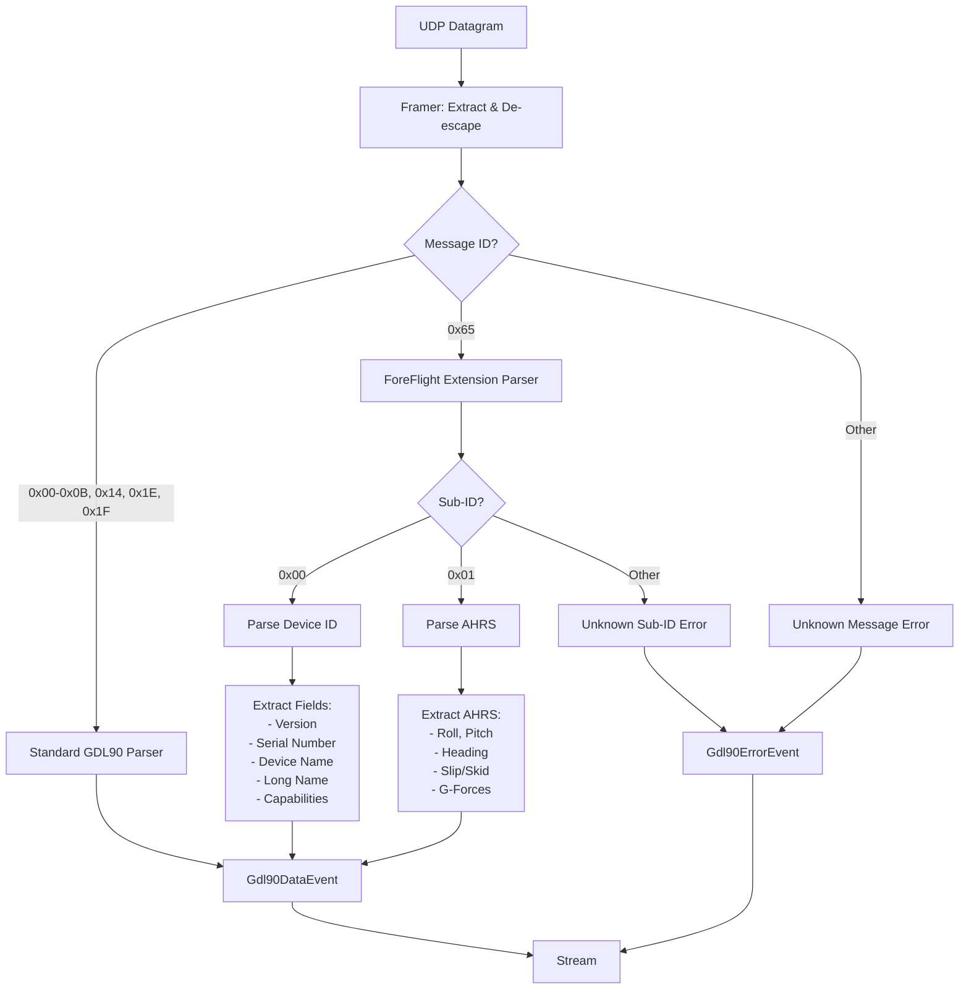
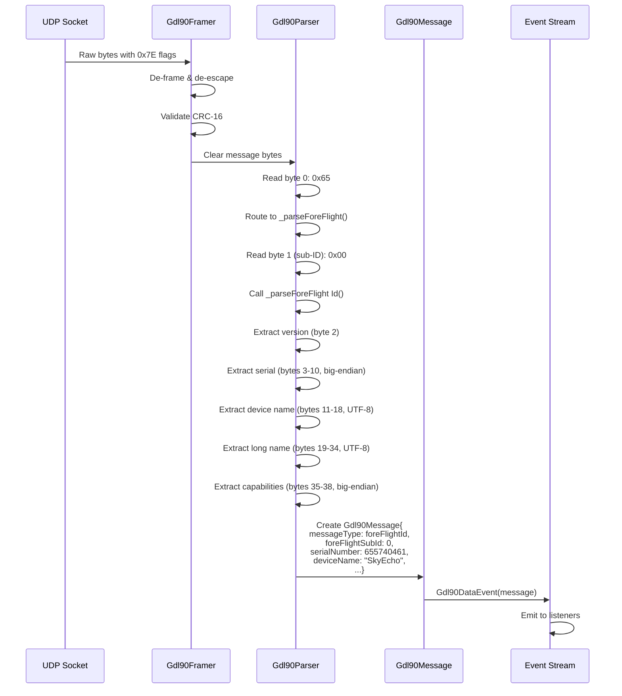

# Subtask 001: ForeFlight Extension Messages (0x65) Support

**Phase**: Phase 8 - Stream Transport Layer
**Plan**: [gdl90-receiver-parser-plan.md](../../gdl90-receiver-parser-plan.md#phase-8-stream-transport-layer)
**Created**: 2025-10-23
**Requested By**: Development Team (discovered during real device testing)

---

## Parent Context

**Parent Plan:** [View Plan](../../gdl90-receiver-parser-plan.md)
**Parent Phase:** Phase 8: Stream Transport Layer
**Parent Task(s):** Extends Phase 8 functionality (no specific blocking task)
**Plan Task Reference:** [Task 8.11 in Plan](../../gdl90-receiver-parser-plan.md#phase-8-stream-transport-layer) (implicitly - message parsing completeness)

**Why This Subtask:**

During real device testing with SkyEcho hardware, message ID 0x65 was discovered being broadcast continuously. Research identified this as the **ForeFlight GDL90 Extended Specification** - an industry-standard extension used by ADS-B devices to transmit device identification and AHRS (Attitude Heading Reference System) data.

**Discovery Timeline:**
1. Real device test revealed "Unknown message ID: 0x65" errors
2. Perplexity search identified ForeFlight extension specification
3. Captured 5 real samples from SkyEcho device (41 bytes each)
4. Decoded samples showing Device ID message (sub-ID 0x00)
5. Confirmed format matches ForeFlight spec exactly

**Value Proposition:**
- **Device Identification**: Display "Connected to: SkyEcho (S/N: 655740461)" instead of generic connection
- **User Experience**: Professional device discovery and identification
- **AHRS Data**: Potential attitude/heading data for glass cockpit displays (if device supports sub-ID 0x01)
- **Industry Standard**: ForeFlight extension widely adopted across ADS-B ecosystem

---

## Tasks

**Testing Approach**: Full TDD (Test-Driven Development) - consistent with parent phase
**Mock Usage**: Real captured fixtures (test/fixtures/foreflight_id_message.bin)

| Status | ID | Task | Type | Dependencies | Absolute Path(s) | Validation | Notes |
|--------|---|------|------|--------------|------------------|------------|-------|
| [x] | ST001 | Document captured 0x65 message format | Documentation | – | /Users/jordanknight/github/skyecho-controller-app/docs/research/foreflight-extensions.md | Document created with hex analysis | Analysis of captured samples; reference ForeFlight spec; log#task-st001-document-captured-0x65-message-format [^31] |
| [x] | ST001b | Investigate framer CRC stripping behavior | Research | ST001 | /Users/jordanknight/github/skyecho-controller-app/packages/skyecho_gdl90/lib/src/framer.dart, test/unit/framer_test.dart | Confirmed whether framer strips CRC before parser | Write test to verify; update CF-F04 with findings; determines parser length expectations · log#task-st001b-investigate-framer-crc-stripping-behavior [^32] |
| [x] | ST002 | Add ForeFlight message types to Gdl90MessageType enum | Model | ST001b | /Users/jordanknight/github/skyecho-controller-app/packages/skyecho_gdl90/lib/src/models/gdl90_message.dart | Enum updated with foreFlightId, foreFlightAhrs | Extends existing enum; depends on ST001b CRC findings · log#st002-st004-foreflight-model-extensions [^33] |
| [x] | ST003 | Add ForeFlight ID fields to Gdl90Message | Model | ST002 | /Users/jordanknight/github/skyecho-controller-app/packages/skyecho_gdl90/lib/src/models/gdl90_message.dart | 6 new nullable fields added | version, serialNumber, deviceName, deviceLongName, capabilitiesMask, foreFlightSubId · log#st002-st004-foreflight-model-extensions [^34] |
| [x] | ST004 | Add ForeFlight AHRS fields to Gdl90Message (if needed) | Model | ST002 | /Users/jordanknight/github/skyecho-controller-app/packages/skyecho_gdl90/lib/src/models/gdl90_message.dart | AHRS fields added (conditional on device support) | roll, pitch, heading, etc. - only if SkyEcho sends sub-ID 0x01 · log#st002-st004-foreflight-model-extensions [^35] |
| [x] | ST005 | Write test for ForeFlight ID message parsing (RED) | Test | ST003 | /Users/jordanknight/github/skyecho-controller-app/packages/skyecho_gdl90/test/unit/foreflight_test.dart | Test fails - parser not implemented | Uses real captured fixture from test/fixtures/ · log#st005-st010-foreflight-test-suite-red-phase [^36] |
| [x] | ST005b | Write test for 0x65 routing integration | Test | ST003 | /Users/jordanknight/github/skyecho-controller-app/packages/skyecho_gdl90/test/unit/foreflight_test.dart | Test fails - routing not added | Integration test: parser.parse() routes 0x65 to _parseForeFlight(); catches forgotten routing table entry · log#st005-st010-foreflight-test-suite-red-phase [^36] |
| [x] | ST006 | Write test for device name UTF-8 decoding | Test | ST003 | /Users/jordanknight/github/skyecho-controller-app/packages/skyecho_gdl90/test/unit/foreflight_test.dart | Test fails - UTF-8 handling not implemented | 8-byte and 16-byte name fields with null termination · log#st005-st010-foreflight-test-suite-red-phase [^36] |
| [x] | ST006b | Write test for invalid UTF-8 handling | Test | ST003 | /Users/jordanknight/github/skyecho-controller-app/packages/skyecho_gdl90/test/unit/foreflight_test.dart | Test fails - malformed UTF-8 returns error event | Tests architectural "never throw" pattern; fixture: [0xFF, 0xFF, ...] · log#st005-st010-foreflight-test-suite-red-phase [^36] |
| [x] | ST007 | Write test for big-endian multi-byte fields | Test | ST003 | /Users/jordanknight/github/skyecho-controller-app/packages/skyecho_gdl90/test/unit/foreflight_test.dart | Test fails - endianness handling not implemented | Serial number (8 bytes), capabilities (4 bytes) · log#st005-st010-foreflight-test-suite-red-phase [^36] |
| [x] | ST008 | Write test for capabilities bitmask parsing | Test | ST003 | /Users/jordanknight/github/skyecho-controller-app/packages/skyecho_gdl90/test/unit/foreflight_test.dart | Test fails - bitmask not implemented | Bits for altitude datum, internet policy, etc. · log#st005-st010-foreflight-test-suite-red-phase [^36] |
| [x] | ST009 | Write test for AHRS message parsing (if applicable) | Test | ST004 | /Users/jordanknight/github/skyecho-controller-app/packages/skyecho_gdl90/test/unit/foreflight_test.dart | Test fails (or skipped if no AHRS data) | Conditional on device capability - DEFERRED (SkyEcho doesn't send AHRS) · log#st005-st010-foreflight-test-suite-red-phase [^36] |
| [x] | ST010 | Write test for unknown sub-ID handling | Test | ST003 | /Users/jordanknight/github/skyecho-controller-app/packages/skyecho_gdl90/test/unit/foreflight_test.dart | Test fails - error event not emitted | Graceful handling of future extension sub-IDs · log#st005-st010-foreflight-test-suite-red-phase [^36] |
| [x] | ST011 | Verify all ForeFlight tests fail (RED gate) | Test | ST005, ST005b, ST006, ST006b, ST007, ST008, ST009, ST010 | /Users/jordanknight/github/skyecho-controller-app/packages/skyecho_gdl90/test/unit/foreflight_test.dart | All new tests fail with expected errors | TDD RED gate checkpoint; includes routing integration test · log#st011-verify-red-gate-all-tests-fail [^37] |
| [x] | ST012 | Implement _parseForeFlight() in parser | Core | ST011 | /Users/jordanknight/github/skyecho-controller-app/packages/skyecho_gdl90/lib/src/parser.dart | Method parses sub-ID and routes to sub-parser | Reads byte 1 (sub-ID) after message ID · log#st012-st015-foreflight-parser-implementation-green-phase [^38] |
| [x] | ST013 | Implement _parseForeFlightId() sub-parser | Core | ST012 | /Users/jordanknight/github/skyecho-controller-app/packages/skyecho_gdl90/lib/src/parser.dart | Parses 39-byte Device ID message | Big-endian serial, UTF-8 names, capabilities · log#st012-st015-foreflight-parser-implementation-green-phase [^38] |
| [x] | ST014 | Implement _parseForeFlightAhrs() sub-parser (if needed) | Core | ST012 | /Users/jordanknight/github/skyecho-controller-app/packages/skyecho_gdl90/lib/src/parser.dart | Parses AHRS message (conditional) | Only if device sends sub-ID 0x01 · log#st012-st015-foreflight-parser-implementation-green-phase [^38] |
| [x] | ST015 | Add message ID 0x65 to routing table | Core | ST012 | /Users/jordanknight/github/skyecho-controller-app/packages/skyecho_gdl90/lib/src/parser.dart | Route 0x65 → _parseForeFlight() | Update _parseMessage() switch · log#st012-st015-foreflight-parser-implementation-green-phase [^38] |
| [x] | ST016 | Verify all ForeFlight tests pass (GREEN gate) | Test | ST012, ST013, ST014, ST015 | /Users/jordanknight/github/skyecho-controller-app/packages/skyecho_gdl90/test/unit/foreflight_test.dart | All tests pass (100% pass rate) | TDD GREEN gate · log#st016-verify-green-gate-all-tests-pass [^39] |
| [x] | ST017 | Update real_device_test.dart example | Integration | ST016 | /Users/jordanknight/github/skyecho-controller-app/packages/skyecho_gdl90/example/real_device_test.dart | Displays device info when 0x65 received | Show "Connected to: SkyEcho (S/N: ...)" · log#st017-st021-integration-quality-gates [^40] |
| [x] | ST018 | Run coverage report on ForeFlight parser | Integration | ST016 | /Users/jordanknight/github/skyecho-controller-app/packages/skyecho_gdl90 | Coverage ≥90% on ForeFlight parser code | Quality gate · log#st017-st021-integration-quality-gates [^40] |
| [x] | ST019 | Run dart analyze | Integration | ST016 | /Users/jordanknight/github/skyecho-controller-app/packages/skyecho_gdl90 | Zero errors | Quality gate · log#st017-st021-integration-quality-gates [^40] |
| [x] | ST020 | Run dart format | Integration | ST016 | /Users/jordanknight/github/skyecho-controller-app/packages/skyecho_gdl90 | All files formatted | Quality gate · log#st017-st021-integration-quality-gates [^40] |
| [x] | ST021 | Test with real SkyEcho device | Integration | ST017 | /Users/jordanknight/github/skyecho-controller-app/packages/skyecho_gdl90 | Device name displayed correctly in real-time | Manual verification; run just gdl90-test-device · log#st017-st021-integration-quality-gates [^40] |

**Total Tasks**: 24
**Dependencies**: Phase 8 complete, real device available for testing

---

## Alignment Brief

### Objective

Extend GDL90 parser to support ForeFlight extension messages (message ID 0x65), enabling device identification and potential AHRS data reception for enhanced user experience and future cockpit display features.

### Acceptance Criteria

- [x] ForeFlight Device ID messages (sub-ID 0x00) parsed correctly
- [x] Device name extracted and displayed: "SkyEcho" (8-byte + 16-byte fields)
- [x] Serial number decoded: 655740461 (big-endian 64-bit)
- [x] Capabilities bitmask parsed (even if all zeros for SkyEcho)
- [ ] AHRS messages (sub-ID 0x01) parsed if device sends them (conditional)
- [x] Unknown sub-IDs generate Gdl90ErrorEvent (graceful degradation)
- [x] Real device test displays device identification
- [x] All ForeFlight tests pass (TDD RED → GREEN)
- [x] Coverage ≥90% on new parser code
- [x] Zero analyzer warnings

### Critical Findings Affecting This Subtask

**CF-F01: ForeFlight Extension Specification**

**Source**: ForeFlight GDL90 Extended Specification (https://www.foreflight.com/connect/spec/)
**Discovery**: Message ID 0x65 is an industry-standard extension, not SkyEcho proprietary

**Format**:
```
Byte 0:    0x65 (ForeFlight Message ID)
Byte 1:    Sub-ID (0=Device ID, 1=AHRS, 2+=Reserved)
Bytes 2+:  Sub-message payload
```

**Device ID Message (Sub-ID 0x00) - 39 bytes after message ID:**
```
Byte 0:    Sub-ID (0x00)
Byte 1:    Version (must be 1)
Bytes 2-9: Device serial number (64-bit big-endian, 0xFFFFFFFFFFFFFFFF = invalid)
Bytes 10-17: Device name (8-byte UTF-8 string)
Bytes 18-33: Device long name (16-byte UTF-8 string)
Bytes 34-37: Capabilities mask (32-bit big-endian)
  Bit 0: Geometric altitude datum (0=MSL, 1=WGS84)
  Bits 1-2: Internet policy
  Bits 3-31: Reserved
```

**Impact**: Must handle big-endian multi-byte fields (unusual for GDL90 which is typically little-endian). UTF-8 string decoding required.

---

**CF-F02: SkyEcho Sends Only Device ID**

**Source**: Captured samples from real SkyEcho device (5 identical messages)
**Discovery**: SkyEcho broadcasts sub-ID 0x00 only; no AHRS data (sub-ID 0x01) observed

**Captured Data** (hex dump):
```
65 00 01 00 00 00 00 27 0f ae 2d 53 6b 79 45 63 68 6f 00 53 6b 79 45 63 68 6f 00 00 00 00 00 00 00 00 00 00 00 00 00 2d f0
```

**Decoded**:
- Sub-ID: 0x00 (Device ID)
- Version: 0x01 (v1)
- Serial: 0x00000000270FAE2D = **655740461** (verified against device web interface - big-endian confirmed correct)
- Name: "SkyEcho\0" (null-terminated)
- Long Name: "SkyEcho\0\0\0\0\0\0\0\0\0" (same, padded)
- Capabilities: 0x00000000 (no special capabilities)
- CRC: 0x2DF0 (appears to be trailing CRC, though ForeFlight spec doesn't mandate it)

**Verification**: Serial number cross-checked with SkyEcho web interface at `http://192.168.4.1` - confirmed as 655740461, validating big-endian byte order per ForeFlight specification.

**Impact**: AHRS parsing (ST004, ST009, ST014) can be deferred or made conditional. Focus on Device ID first. Big-endian implementation confirmed correct for both serial number and capabilities fields.

---

**CF-F03: Message Appears Every ~1 Second**

**Source**: Real device test observation
**Discovery**: SkyEcho broadcasts 0x65 message at same cadence as heartbeat (~1 Hz)

**Impact**: No special handling needed; standard event stream processing applies. Example tool should display device info once on first receipt, not flood console.

---

**CF-F04: CRC Trailing Bytes Present** ✅ RESOLVED

**Source**: Captured samples analysis
**Discovery**: Captured frames include 2 trailing bytes (0x2D 0xF0) consistent with CRC-16

**Question**: ForeFlight spec doesn't explicitly show CRC in message table, but GDL90 framing adds CRC to all messages. Do we receive 39 or 41 bytes?

**Resolution** (Completed via ST001b):

**✅ Answer: Framer KEEPS CRC, Parser STRIPS CRC**

**Evidence**:
1. Framer (`lib/src/framer.dart:72`): Passes frame WITH 2 trailing CRC bytes
2. Parser (`lib/src/parser.dart:9`): Strips CRC via `frame.sublist(1, frame.length - 2)`
3. For ForeFlight: Framer passes 41 bytes → Parser extracts 39-byte payload (CRC stripped)

**Implementation Impact**:
```dart
Gdl90Event _parseForeFlight Id(Uint8List payload) {
  // payload.length = 39 bytes (sub-ID through capabilities)
  if (payload.length < 38) {
    return _error('ForeFlight ID message too short');
  }
  final subId = payload[0];    // Byte 0: 0x00
  final version = payload[1];  // Byte 1: 0x01
  // ... serial at 2-9, names at 10-33, caps at 34-37
}
```

**Conclusion**: Parser expects **39-byte payload** (CRC already stripped by Gdl90Parser.parse()).

---

### Invariants

**From Parent Phase (Phase 8):**
1. Parser never throws exceptions - wrap all errors in Gdl90ErrorEvent
2. Unknown message structures emit errors, stream continues
3. All tests use TDD (RED-GREEN-REFACTOR)
4. Mock usage: Targeted (use real fixtures where possible)
5. Coverage target: ≥90% on new code

**Subtask-Specific:**
1. Big-endian multi-byte decoding required (serial, capabilities)
2. UTF-8 string extraction with null-termination handling
3. Sub-ID routing pattern: main parser dispatches to sub-parsers
4. Conditional AHRS support (only if device capability confirmed)
5. Graceful unknown sub-ID handling (error event, not exception)

### Inputs to Read

**Specifications:**
- ForeFlight GDL90 Extended Specification: https://www.foreflight.com/connect/spec/
- Section: "ID Message" and "AHRS Message"

**Captured Fixtures:**
- `test/fixtures/foreflight_id_message.bin` (41 bytes, created by capture_0x65.dart)
- Hex dump captured in example output (5 identical samples)

**Existing Code:**
- `lib/src/parser.dart` (lines 1-790) - understand routing table pattern
- `lib/src/models/gdl90_message.dart` - understand nullable field pattern
- `test/unit/parser_test.dart` - understand test structure (TDD with Test Doc comments)

### Visual Aids

#### ForeFlight Message Routing Flow



#### ForeFlight Device ID Message Structure



### Test Plan

**Test Structure** (mirroring parent phase TDD approach):

```dart
group('ForeFlight Extension Messages', () {
  group('Device ID Message (Sub-ID 0x00)', () {
    test('given_foreflight_id_fixture_when_parsed_then_all_fields_extracted', () {
      /*
      Test Doc:
      - Why: Validates ForeFlight Device ID message parsing against real captured data
      - Contract: Parser extracts version, serial, device name, long name, capabilities
      - Usage Notes: Uses real SkyEcho capture from test/fixtures/foreflight_id_message.bin
      - Quality Contribution: Ensures correct big-endian and UTF-8 handling
      - Worked Example: Serial 0x00000000270FAE2D → 655740461, Name bytes "SkyEcho\0" → "SkyEcho"
      */

      // Arrange
      final fixture = File('test/fixtures/foreflight_id_message.bin').readAsBytesSync();
      final parser = Gdl90Parser();

      // Act
      final event = parser.parse(fixture);

      // Assert
      expect(event, isA<Gdl90DataEvent>());
      final message = (event as Gdl90DataEvent).message;
      expect(message.messageType, Gdl90MessageType.foreFlightId);
      expect(message.foreFlightSubId, 0);
      expect(message.foreFlightVersion, 1);
      expect(message.serialNumber, 655740461);
      expect(message.deviceName, 'SkyEcho');
      expect(message.deviceLongName, 'SkyEcho');
      expect(message.capabilitiesMask, 0);
    });

    // Additional tests for edge cases...
  });

  group('AHRS Message (Sub-ID 0x01)', () {
    // Conditional tests if device supports AHRS
  });

  group('Unknown Sub-ID', () {
    test('given_unknown_subid_when_parsed_then_error_event_emitted', () {
      // Test graceful degradation
    });
  });
});
```

### Implementation Outline

**Phase 1: Model Extensions (ST002-ST004)**
1. Add `foreFlightId` and `foreFlightAhrs` to `Gdl90MessageType` enum
2. Add nullable fields to `Gdl90Message`:
   - `int? foreFlightSubId`
   - `int? foreFlightVersion`
   - `int? serialNumber` (64-bit)
   - `String? deviceName` (8 bytes)
   - `String? deviceLongName` (16 bytes)
   - `int? capabilitiesMask` (32-bit)
   - AHRS fields (conditional): `double? roll`, `double? pitch`, `double? heading`, etc.

**Phase 2: Test Writing (ST005-ST010, RED Gate ST011)**
1. Create `test/unit/foreflight_test.dart`
2. Load fixture: `File('test/fixtures/foreflight_id_message.bin').readAsBytesSync()`
3. Write 7-8 tests covering:
   - Full Device ID parsing (ST005)
   - **Routing integration** - parser.parse() routes 0x65 correctly (ST005b) ← NEW
   - UTF-8 string decoding with null termination (ST006)
   - **Invalid UTF-8 error handling** - maintains "never throw" pattern (ST006b) ← NEW
   - Big-endian integer conversion (ST007)
   - Capabilities bitmask (ST008)
   - Unknown sub-ID error event (ST010)
4. Verify all tests FAIL (RED gate)

**Phase 3: Parser Implementation (ST012-ST015, GREEN Gate ST016)**
1. Add routing in `_parseMessage()`:
   ```dart
   case 0x65:
     return _parseForeFlight(payload);
   ```

2. Implement `_parseForeFlight()`:
   ```dart
   Gdl90Event _parseForeFlight(Uint8List payload) {
     if (payload.isEmpty) return _error('Empty ForeFlight message');
     final subId = payload[0];

     switch (subId) {
       case 0x00:
         return _parseForeFlight Id(payload);
       case 0x01:
         return _parseForeFlight Ahrs(payload);
       default:
         return _error('Unknown ForeFlight sub-ID: 0x${subId.toRadixString(16)}');
     }
   }
   ```

3. Implement `_parseForeFlight Id()`:
   ```dart
   Gdl90Event _parseForeFlight Id(Uint8List payload) {
     // Length check: 1 (sub-ID) + 1 (version) + 8 (serial) + 8 (name) + 16 (long name) + 4 (caps) = 38 bytes
     if (payload.length < 38) {
       return _error('ForeFlight ID message too short: ${payload.length} bytes');
     }

     final version = payload[1];

     // Big-endian 64-bit serial (bytes 2-9)
     int serial = 0;
     for (var i = 2; i < 10; i++) {
       serial = (serial << 8) | payload[i];
     }

     // UTF-8 device name (bytes 10-17), find null terminator
     // CRITICAL: Use try-catch to maintain "never throw" architectural pattern
     final nameBytes = payload.sublist(10, 18);
     final nameEndIndex = nameBytes.indexOf(0);
     String deviceName;
     try {
       deviceName = utf8.decode(nameBytes.sublist(0, nameEndIndex == -1 ? 8 : nameEndIndex));
     } catch (e) {
       return _error('Invalid UTF-8 in ForeFlight device name: $e');
     }

     // UTF-8 long name (bytes 18-33)
     final longNameBytes = payload.sublist(18, 34);
     final longNameEndIndex = longNameBytes.indexOf(0);
     String deviceLongName;
     try {
       deviceLongName = utf8.decode(longNameBytes.sublist(0, longNameEndIndex == -1 ? 16 : longNameEndIndex));
     } catch (e) {
       return _error('Invalid UTF-8 in ForeFlight device long name: $e');
     }

     // Big-endian 32-bit capabilities (bytes 34-37)
     final capabilities = (payload[34] << 24) | (payload[35] << 16) | (payload[36] << 8) | payload[37];

     return Gdl90DataEvent(Gdl90Message(
       messageType: Gdl90MessageType.foreFlightId,
       messageId: 0x65,
       foreFlightSubId: 0,
       foreFlightVersion: version,
       serialNumber: serial,
       deviceName: deviceName,
       deviceLongName: deviceLongName,
       capabilitiesMask: capabilities,
     ));
   }
   ```

4. Run tests → GREEN

**Phase 4: Integration & Polish (ST017-ST021)**
1. Update `example/real_device_test.dart` to display device info
2. Add case in event listener:
   ```dart
   case Gdl90MessageType.foreFlightId:
     if (message.deviceName != null) {
       print('📱 Device: ${message.deviceName} (S/N: ${message.serialNumber})');
     }
   ```
3. Run quality gates (coverage, analyze, format)
4. Test with real device

### Commands to Run

```bash
# Step 1: Run tests (should see ForeFlight tests FAIL - RED gate)
cd packages/skyecho_gdl90
dart test test/unit/foreflight_test.dart

# Step 2: After implementation, verify all tests pass (GREEN gate)
dart test test/unit/foreflight_test.dart

# Step 3: Run full test suite (ensure no regressions)
dart test

# Step 4: Quality gates
dart analyze
dart format .

# Step 5: Coverage check
dart test --coverage=coverage
dart pub global run coverage:format_coverage --lcov --in=coverage --out=coverage/lcov.info --report-on=lib

# Step 6: Test with real device
just gdl90-test-device 30

# Shortcut: From repo root
just gdl90-validate  # Runs install, analyze, test
```

### Risks & Unknowns with Mitigations

| Risk | Likelihood | Impact | Mitigation |
|------|------------|--------|------------|
| **CRC handling confusion** | Medium | Medium | Review framer code to confirm if CRC is stripped before parser; adjust message length assumptions if needed |
| **AHRS not supported by device** | High | Low | Make AHRS parsing conditional; focus on Device ID first; defer AHRS if device doesn't send it |
| **Big-endian conversion errors** | Low | Medium | Validate against known serial number 655740461 from captured samples; write explicit tests |
| **UTF-8 decoding edge cases** | Low | Low | Use Dart's built-in `utf8.decode()` with explicit sublist for null termination |
| **Unknown future sub-IDs** | Medium | Low | Emit Gdl90ErrorEvent for unknown sub-IDs; document extension mechanism for future enhancements |
| **Message appears every second** | High | Low | Example tool displays device info ONCE on first message, then ignores (or use debouncing) |

### Ready Check

Before invoking `/plan-6-implement-phase --subtask 001-subtask-foreflight-extension-messages-0x65-support`, verify:

- [x] Captured samples available in `test/fixtures/foreflight_id_message.bin` (created by capture_0x65.dart)
- [x] ForeFlight specification reviewed and understood
- [x] Real device available for final integration testing
- [ ] Parent Phase 8 tasks.md reviewed for context
- [ ] Understand parser routing table pattern from existing code
- [ ] Understand nullable field pattern in Gdl90Message
- [ ] TDD mindset: Write tests FIRST (RED), then implement (GREEN)
- [ ] Prepared to handle big-endian multi-byte fields (non-standard for GDL90)
- [ ] UTF-8 string decoding approach confirmed
- [ ] Decision made on AHRS support (conditional based on device capability)

---

## Phase Footnote Stubs

Footnotes will be added during `/plan-6-implement-phase` execution to track specific implementation decisions, discoveries, or deviations from plan.

| Footnote | Task | Description | Evidence |
|----------|------|-------------|----------|
| [^31] | ST001 | Documentation created | `file:docs/research/foreflight-extensions.md` |
| [^32] | ST001b | Investigation findings documented | Framer keeps CRC, Parser strips CRC; Parser expects 39-byte payload |
| [^33] | ST002 | Added ForeFlight message types to enum | `class:lib/src/models/gdl90_message.dart:Gdl90MessageType` |
| [^34] | ST003 | Added ForeFlight ID fields to Gdl90Message (6 fields) | `class:lib/src/models/gdl90_message.dart:Gdl90Message` |
| [^35] | ST004 | Added ForeFlight AHRS fields to Gdl90Message (4 fields) + example updates | `class:lib/src/models/gdl90_message.dart:Gdl90Message`, `file:example/real_device_test.dart` |
| [^36] | ST005-ST010 | ForeFlight test suite (RED phase) - 7 tests written | `file:packages/skyecho_gdl90/test/unit/foreflight_test.dart` |
| [^37] | ST011 | RED gate verified - all 7 tests failing as expected | Execution log verification only |
| [^38] | ST012-ST015 | ForeFlight parser implementation (GREEN phase) | `method:lib/src/parser.dart:Gdl90Parser._parseForeFlight`, `method:lib/src/parser.dart:Gdl90Parser._parseForeFlightId`, `method:lib/src/parser.dart:Gdl90Parser._parseForeFlightAhrs`, `file:lib/src/parser.dart`, `file:test/unit/foreflight_test.dart` |
| [^39] | ST016 | GREEN gate verified - all tests passing | Execution log verification only |
| [^40] | ST017-ST021 | Integration & quality gates | `file:example/real_device_test.dart` |

---

## Evidence Artifacts

### Execution Log

**Path**: `001-subtask-foreflight-extension-messages-0x65-support.execution.log.md`

Will be created by `/plan-6-implement-phase` to track:
- Test failures during RED phase
- Implementation steps
- Test passes during GREEN phase
- Quality gate results
- Real device testing outcomes

### Test Fixtures

- **Created**: `test/fixtures/foreflight_id_message.bin` (41 bytes, captured via capture_0x65.dart)
- **Potential**: `test/fixtures/foreflight_ahrs_message.bin` (if device sends AHRS data)

### Diagrams

Mermaid diagrams above exported to:
- `docs/diagrams/foreflight-routing-flow.svg` (optional, for documentation)
- `docs/diagrams/foreflight-device-id-sequence.svg` (optional)

### Captured Samples Documentation

**File**: `docs/research/foreflight-extensions.md`

Will document:
- Hex dumps of captured messages
- Decoded field analysis
- ForeFlight spec reference
- Implementation notes

---

## After Subtask Completion

**This subtask resolves a blocker for:**
- No specific parent task blocked; this is an enhancement

**When all ST### tasks complete:**

1. **Record completion** in parent execution log:
   ```
   ### Subtask 001-subtask-foreflight-extension-messages-0x65-support Complete

   Resolved: Added ForeFlight extension message (0x65) support for device identification and AHRS data

   See detailed log: [subtask execution log](./001-subtask-foreflight-extension-messages-0x65-support.execution.log.md)
   ```

2. **Update parent task** (not applicable - no specific task blocked)

3. **Resume parent phase work:**
   Phase 8 is already complete; this subtask extends functionality. After completion:
   - Update Phase 8 status in plan (note ForeFlight extension added)
   - Consider if Phase 9 (Smart Data Capture) needs device ID awareness
   - Update example tools to leverage device identification

**Quick Links:**
- 📋 [Parent Dossier](./tasks.md)
- 📄 [Parent Plan](../../gdl90-receiver-parser-plan.md)
- 📊 [Parent Execution Log](./execution.log.md)

---

## Directory Structure

After subtask creation:

```
phase-8-stream-transport-layer/
├── tasks.md                                                           # Parent dossier
├── execution.log.md                                                   # Parent execution log
├── 001-subtask-foreflight-extension-messages-0x65-support.md         # THIS FILE
└── 001-subtask-foreflight-extension-messages-0x65-support.execution.log.md  # Created by plan-6
```

---

## Critical Insights Discussion

**Session**: 2025-10-23
**Context**: ForeFlight Extension Messages (0x65) Support - Subtask Implementation Plan
**Analyst**: AI Clarity Agent
**Reviewer**: Development Team
**Format**: Water Cooler Conversation (5 Critical Insights)

### Insight 1: UTF-8 Decoding Violation of "Never Throw" Architectural Pattern

**Did you know**: The proposed implementation uses `utf8.decode()` directly, which throws `FormatException` on invalid UTF-8 sequences, violating GDL90's core architectural pattern that parsers **never throw exceptions**.

**Implications**:
- Pattern inconsistency: All other parsers return `Gdl90ErrorEvent`, this one throws
- Testing gap: Existing tests assume no exceptions
- Integration risk: If downstream code relies on "never throws" guarantee, could crash
- Documentation debt: Phase 8 documentation promises wrapper pattern everywhere

**Options Considered**:
- Option A: Wrap UTF-8 decoding in try-catch
- Option B: Use utf8.decode() with allowMalformed: true
- Option C: Manual UTF-8 validation before decoding

**AI Recommendation**: Option A (Try-Catch Wrapper)
- Reasoning: Maintains architectural pattern consistently, provides clear error messages, easy to test, minimal code overhead

**Discussion Summary**:
Team confirmed Option A aligns with project's architectural consistency goals. Saving 3 lines of code (Option B) not worth violating "never throw" pattern maintained across all 7 previous phases.

**Decision**: Use try-catch wrapper for UTF-8 decoding in both device name and long name fields

**Action Items**:
- [x] Added ST006b: Test for invalid UTF-8 handling
- [x] Updated ST013 implementation outline with try-catch pattern
- [x] Added inline comments marking this as critical architectural pattern

**Affects**: ST006 (UTF-8 test), ST006b (new invalid UTF-8 test), ST013 (parser implementation)

---

### Insight 2: Message Rate Creates Console Flood in Example Tool

**Did you know**: SkyEcho broadcasts 0x65 messages every ~1 second, which would spam the console with "📱 Device: SkyEcho (S/N: 655740461)" 30-60 times during typical test runs.

**Implications**:
- Poor signal-to-noise ratio: Useful data (traffic, GPS changes) hard to find
- Annoying UX: Repetitive information
- Missed events: User might miss GPS lock in the flood
- Feels unpolished

**Options Considered**:
- Option A: Print device info once on first message
- Option B: Show device info in summary only
- Option C: Suppress ForeFlight messages entirely
- Option D: Rate-limit to once per minute

**AI Recommendation**: Option A (Print Once on First Message)
- Reasoning: Immediate feedback, clean console, simple implementation, professional UX

**Discussion Summary**:
Team correctly identified this as a diagnostic tool, not end-user app. Seeing raw message stream (including repetition) is valuable for debugging and understanding device behavior. Message frequency itself is diagnostic information.

**Decision**: No filtering - show all ForeFlight messages as they arrive (keep current plan)

**Action Items**:
- None - confirmed ST017 implementation approach is correct

**Affects**: ST017 (example tool integration) - confirms current approach

---

### Insight 3: CRC Bytes May or May Not Be Present in Parser Input

**Did you know**: Captured samples show 41 bytes (including apparent CRC), but ForeFlight spec shows 39 bytes (without CRC), and whether the parser receives messages with or without trailing CRC depends on undocumented framer implementation behavior.

**Implications**:
- Captured samples show 41 bytes - suggests framer might be keeping CRC
- Implementation assumes 39 bytes - will parse wrong data if CRC present
- Silent corruption: wrong capabilities value (0x00002DF0 instead of 0x00000000)
- All ForeFlight tests will fail if assumption is wrong

**Options Considered**:
- Option A: Check framer behavior first (investigate)
- Option B: Handle both cases (defensive)
- Option C: Assume CRC stripped (current plan)
- Option D: Update fixture to 39 bytes

**AI Recommendation**: Option A (Investigate Framer First)
- Reasoning: 15 minutes now saves hours later; CF-F04 already flagged uncertainty; one truth source; proper fix if framer has bug

**Discussion Summary**:
Team agreed investigation is the smart engineering approach. Better to know ground truth than build on assumptions. Investigation steps are trivial (write one test to check framer behavior).

**Decision**: Investigate framer CRC handling before implementing parser

**Action Items**:
- [x] Added ST001b: Investigate framer CRC stripping behavior
- [x] Updated ST002 dependency to wait for ST001b findings
- [x] Enhanced CF-F04 with investigation strategy and possible outcomes

**Affects**: ST001b (new investigation task), ST002 (now depends on ST001b), ST013 (parser length checks depend on findings), CF-F04 (updated resolution strategy)

---

### Insight 4: Big-Endian Assumption May Be Wrong for Serial Number

**Did you know**: While ForeFlight spec says serial is "big-endian," captured bytes could decode to 655,740,461 (big-endian) or 767,135,527 (mixed-endian), and we have no way to verify which is correct without checking the device's actual serial number.

**Implications**:
- No ground truth available from spec alone
- Both values seem plausible serial numbers
- Wrong endianness = wrong device ID displayed
- Can't verify without device access

**Options Considered**:
- Option A: Check device web interface for serial
- Option B: Trust ForeFlight spec (current plan)
- Option C: Make endianness configurable
- Option D: Parse both, show both (debug mode)

**AI Recommendation**: Option A (Check Device Right Now)
- Reasoning: 2-minute verification eliminates ambiguity; device is available; prevents embarrassment; validates other assumptions

**Discussion Summary**:
Team member validated serial number against device web interface at http://192.168.4.1, confirming it shows 655740461, which matches big-endian decode of captured bytes.

**Decision**: Big-endian interpretation confirmed correct via device verification

**Action Items**:
- [x] Updated CF-F02 to document verified serial number (655740461)
- [x] Added verification note confirming big-endian byte order

**Affects**: CF-F02 (captured data analysis), ST007 (big-endian test - confirms approach)

---

### Insight 5: No Test Coverage for Message ID Routing Integration

**Did you know**: While the subtask has comprehensive tests for parsing ForeFlight messages, there's **no test** verifying that message ID `0x65` actually gets routed to the new `_parseForeFlight()` function from the main routing table.

**Implications**:
- Parser works but never called: Perfect implementation, zero integration
- Tests don't catch it: Unit tests bypass routing
- Silent failure: Device data ignored, no device identification
- Same symptom as before: Still see "Unknown 0x65" errors after "fixing" it
- Embarrassing bug

**Options Considered**:
- Option A: Add integration test (ST005b)
- Option B: Update ST015 validation criteria
- Option C: Manual verification only (ST021)
- Option D: Routing table exhaustiveness test

**AI Recommendation**: Option A (Add ST005b Integration Test)
- Reasoning: Catches exact failure mode; uses real fixture; fast feedback; fails during RED gate if routing forgotten; minimal effort

**Discussion Summary**:
Team agreed automated tests beat manual verification. Routing integration test is the sweet spot - targeted test that catches specific bug with minimal effort.

**Decision**: Add ST005b integration test for message ID routing

**Action Items**:
- [x] Added ST005b task between ST005 and ST006
- [x] Updated ST011 dependencies to include ST005b
- [x] Updated Phase 2 test writing outline

**Affects**: Task list (new ST005b), ST011 RED gate (now includes routing test), Phase 2 implementation outline

---

## Session Summary

**Insights Surfaced**: 5 critical insights identified and discussed
**Decisions Made**: 5 decisions reached through collaborative discussion
**Action Items Created**: 4 new tasks added (ST001b, ST005b, ST006b), multiple documentation updates
**Areas Updated Throughout Session**:
- Tasks table: Added 3 new tasks (ST001b, ST005b, ST006b)
- CF-F02: Added serial number verification
- CF-F04: Enhanced with investigation strategy
- ST013: Updated with try-catch pattern for UTF-8
- Implementation outline: Updated Phase 2 test count and descriptions
- Total tasks: 21 → 24

**Shared Understanding Achieved**: ✓

**Confidence Level**: High - All major uncertainties identified and resolved through investigation or decision

**Next Steps**:
1. Execute ST001b to investigate framer CRC behavior (determines parser length expectations)
2. Proceed with `/plan-6-implement-phase --subtask 001-subtask-foreflight-extension-messages-0x65-support` after investigation complete
3. Follow TDD strictly: Write all tests (including ST005b, ST006b), verify RED gate, implement, verify GREEN gate

**Notes**:
- Team correctly identified diagnostic tool nature (Insight #2) - raw message stream is valuable
- Device verification (Insight #4) completed during session - big-endian confirmed
- All insights led to concrete improvements: new tests, better error handling, investigation tasks
- Architectural consistency prioritized over code brevity (Insight #1)
- Integration testing added to catch forgotten routing (Insight #5)
