# Subtask 001: POC Config Screen and iOS 26 Deployment Workaround

**Created**: 2025-10-30
**Requested By**: Development Team

---

## Parent Context

**Parent Plan:** [View Plan](../../flutter-tactical-radar-app-plan.md)
**Parent Phase:** Phase 1: Project Setup & Architecture Foundation
**Parent Task(s):**
- [T1.2: Configure pubspec.yaml with package dependencies](../../flutter-tactical-radar-app-plan.md#phase-1-project-setup--architecture-foundation)
- [T1.6: Configure iOS Info.plist with network permissions](../../flutter-tactical-radar-app-plan.md#phase-1-project-setup--architecture-foundation)
- [T1.9: Verify iOS build succeeds](../../flutter-tactical-radar-app-plan.md#phase-1-project-setup--architecture-foundation)

**Why This Subtask:**

During Phase 1 setup, we discovered critical iOS 26 compatibility issues that required immediate investigation and workaround implementation. Rather than blocking all progress, this subtask documents the POC config screen development and iOS 26 deployment solution that validates the app can run on latest hardware (iPhone 17 Pro, iOS 26.0.1).

**Key Discoveries**:
1. **Flutter VSyncClient Crash**: Flutter 3.35.7 debug mode crashes on iOS 26 physical devices due to null pointer in `createTouchRateCorrectionVSyncClientIfNeeded` (GitHub issue #153971)
2. **Plugin Swift Runtime Crashes**: `flutter_fgbg` and `shared_preferences` both crash on iOS 26 with Swift runtime errors
3. **Release Mode Workaround**: Release builds work perfectly on iOS 26, bypassing VSyncClient debug instrumentation
4. **POC Validation**: Simple config screen proves `skyecho` package integrates successfully with Flutter on real hardware

---

## Tasks

| Status | ID | Task | Type | Dependencies | Absolute Path(s) | Validation | Subtasks | Notes |
|--------|-----|------|------|--------------|------------------|------------|----------|-------|
| [x] | ST001 | Create POC ConfigScreen widget | Core | - | /Users/jordanknight/github/skyecho-controller-app/apps/tactical_radar/lib/screens/config_screen.dart | Widget renders and polls device | – | StatefulWidget with direct SkyEchoClient usage (no Riverpod yet); supports T1.9 |
| [x] | ST002 | Implement live device polling | Core | ST001 | /Users/jordanknight/github/skyecho-controller-app/apps/tactical_radar/lib/screens/config_screen.dart | Polls every 5 seconds, handles errors gracefully | – | Uses Timer.periodic with 5s interval; supports T1.9 |
| [x] | ST003 | Add app bar status indicator | UI | ST001, ST002 | /Users/jordanknight/github/skyecho-controller-app/apps/tactical_radar/lib/screens/config_screen.dart | App bar grey when disconnected, green when transmitting | – | Reads _deviceTransmitting state from polls; supports T1.9 |
| [x] | ST004 | Implement user edit tracking | Core | ST001, ST002 | /Users/jordanknight/github/skyecho-controller-app/apps/tactical_radar/lib/screens/config_screen.dart | Polling doesn't overwrite UI fields during editing | – | _hasUserEdits flag prevents setState during user input; supports T1.9 |
| [x] | ST005 | Configure iOS App Transport Security | iOS | - | /Users/jordanknight/github/skyecho-controller-app/apps/tactical_radar/ios/Runner/Info.plist | HTTP connections to 192.168.4.1 allowed | – | Added NSAppTransportSecurity with exception for 192.168.4.1; supports T1.6 |
| [x] | ST006 | Remove flutter_fgbg plugin | Fix | - | /Users/jordanknight/github/skyecho-controller-app/apps/tactical_radar/pubspec.yaml | App builds without Swift crash | – | Removed due to iOS 26 Swift runtime crash in register(with:); supports T1.2 |
| [x] | ST007 | Remove shared_preferences plugin | Fix | - | /Users/jordanknight/github/skyecho-controller-app/apps/tactical_radar/pubspec.yaml | App builds without Swift crash | – | Removed due to iOS 26 Swift runtime crash; supports T1.2 |
| [x] | ST008 | Upgrade flutter_riverpod to 3.0.3 | Maint | - | /Users/jordanknight/github/skyecho-controller-app/apps/tactical_radar/pubspec.yaml | Dependency resolves | – | Upgraded from 2.6.1; supports T1.2 |
| [x] | ST009 | Upgrade flutter_lints to 6.0.0 | Maint | - | /Users/jordanknight/github/skyecho-controller-app/apps/tactical_radar/pubspec.yaml | Analyzer runs clean | – | Upgraded from 5.0.0; supports T1.2 |
| [x] | ST010 | Test debug build on iOS simulator | Test | ST001-ST009 | - | Simulator runs successfully | – | Debug mode works fine on simulator; supports T1.9 |
| [x] | ST011 | Investigate debug build crash on iPhone 17 Pro | Debug | ST001-ST009 | - | Identified VSyncClient crash in Flutter framework | – | Used Xcode Device Window crash logs; supports T1.9 |
| [x] | ST012 | Implement release build workaround | Core | ST011 | /Users/jordanknight/github/skyecho-controller-app/apps/tactical_radar | Release build installs and runs on physical device | – | flutter build ios --release; supports T1.9 |
| [x] | ST013 | Add justfile release build commands | DevX | ST012 | /Users/jordanknight/github/skyecho-controller-app/justfile | just app-install-ios-release succeeds | – | Added app-build-ios-release and app-install-ios-release; supports T1.9 |
| [x] | ST014 | Update app launch test | Test | ST001 | /Users/jordanknight/github/skyecho-controller-app/apps/tactical_radar/test/widget/app_launch_test.dart | Test expects ConfigScreen instead of placeholder | – | Updated to find.textContaining('SkyEcho'); supports T1.9 |
| [x] | ST015 | Clean build artifacts and rebuild | Fix | ST001-ST014 | /Users/jordanknight/github/skyecho-controller-app/apps/tactical_radar | Clean build completes successfully | – | flutter clean, pod deintegrate, rm DerivedData; supports T1.9 |

---

## Alignment Brief

### Objective

Validate that the Flutter Tactical Radar app can successfully:
1. Import and use the `skyecho` package for device communication
2. Build and deploy to iOS 26.0.1 on iPhone 17 Pro hardware
3. Display live device configuration with polling
4. Handle iOS 26 compatibility issues with documented workarounds

This subtask extends Phase 1 by creating a proof-of-concept config screen that validates package integration and deployment pipeline, while discovering and solving critical iOS 26 compatibility issues.

### Checklist

- [x] ConfigScreen widget created and renders device configuration
- [x] Live polling (5-second interval) maintains connection status
- [x] App bar status indicator (grey/green) reflects device transmit state
- [x] User edit tracking prevents polling from overwriting UI during input
- [x] iOS Info.plist configured for HTTP local network access
- [x] Problematic plugins (flutter_fgbg, shared_preferences) removed
- [x] Dependencies upgraded (riverpod 3.0.3, lints 6.0.0)
- [x] iOS simulator debug builds work correctly
- [x] VSyncClient crash identified and documented (Flutter issue #153971)
- [x] Release build workaround implemented and tested
- [x] Justfile commands added for release builds
- [x] Widget test updated for new ConfigScreen
- [x] App successfully runs on iPhone 17 Pro (iOS 26.0.1) in release mode

### Critical Findings Affecting This Subtask

#### Discovery: Flutter VSyncClient Crash on iOS 26 Physical Devices

**Category**: Platform Constraint | Blocker
**Impact**: Critical

**Problem**: Flutter 3.35.7 debug mode apps crash immediately on iOS 26 physical devices with:
```
Thread 0 Crashed:
0   Flutter    -[VSyncClient initWithTaskRunner:callback:] + 300
1   Flutter    -[FlutterViewController createTouchRateCorrectionVSyncClientIfNeeded] + 216
2   Flutter    -[FlutterViewController viewDidLoad] + 396
```

**Root Cause**: Flutter engine bug on iOS 26 where VSyncClient initialization receives NULL callback parameter. This is specific to ProMotion displays (120Hz variable refresh rate) on iPhone 17 Pro. Related to GitHub issue #153971 which was marked fixed in April 2025, but appears to be a regression in Flutter 3.35.7 + iOS 26 combination.

**Behavior**:
- ✅ Works: Debug mode with debugger attached (`flutter run`)
- ✅ Works: Debug mode on iOS Simulator
- ✅ Works: Release mode on physical device
- ❌ Fails: Debug mode standalone launch on physical device

**Solution**: Use release builds for physical device testing:
```bash
flutter build ios --release --device-id <DEVICE_ID>
flutter install --device-id <DEVICE_ID>
```

**Affects**: All physical device testing during development. Team must use simulator for debug mode, or attach debugger for physical device debug sessions.

---

#### Discovery: Swift Plugin Runtime Crashes on iOS 26

**Category**: Dependency Constraint | Blocker
**Impact**: Critical

**Problem**: Both `flutter_fgbg: ^0.3.0` and `shared_preferences: ^2.3.5` crash on iOS 26 with Swift runtime errors:
```
Thread 0 Crashed:
0   libswiftCore.dylib    swift_getObjectType + 40
1   flutter_fgbg          static SwiftFlutterFGBGPlugin.register(with:) + 176
```

**Root Cause**: Swift plugin registration mechanism incompatible with iOS 26 runtime. Null pointer dereference during `registerWithRegistrar:` call.

**Solution**: Remove both plugins from dependencies:
- `flutter_fgbg`: Lifecycle management not needed for POC; defer to Phase 9
- `shared_preferences`: State persistence not needed for POC; defer to Phase 9

**Affects**: Phase 9 (State Persistence) and Phase 8 (Lifecycle Management) will need iOS 26-compatible alternatives.

---

### Invariants

1. **Package Integration**: App MUST use `skyecho` and `skyecho_gdl90` packages via path dependencies
2. **iOS Compatibility**: App MUST run on iOS 26.0.1 (latest production release)
3. **Network Permissions**: App MUST configure Info.plist for local network access
4. **Error Handling**: App MUST handle SkyEcho errors gracefully (network failures, device offline)
5. **Build Pipeline**: App MUST support both debug (simulator) and release (physical device) builds

### Guardrails

- **NO Riverpod usage yet**: POC uses StatefulWidget; state management refactoring comes in Phase 2
- **NO persistence**: Device URL hardcoded to 192.168.4.1; persistence deferred to Phase 9
- **NO lifecycle management**: App doesn't suspend stream on background; deferred to Phase 8
- **NO comprehensive testing**: Focus on smoke tests; full TAD coverage in later phases
- **NO architectural purity**: POC violates layer boundaries (UI calls package directly); refactor in Phase 2+

### Inputs to Read

**Existing Files**:
- `/Users/jordanknight/github/skyecho-controller-app/packages/skyecho/lib/skyecho.dart` - SkyEchoClient API
- `/Users/jordanknight/github/skyecho-controller-app/apps/tactical_radar/pubspec.yaml` - Dependency configuration
- `/Users/jordanknight/github/skyecho-controller-app/apps/tactical_radar/ios/Runner/Info.plist` - iOS permissions

**Specifications**:
- [Flutter Tactical Radar App Spec](../../flutter-tactical-radar-app-spec.md)
- [Phase 1 Plan](../../flutter-tactical-radar-app-plan.md#phase-1-project-setup--architecture-foundation)

**Device Details**:
- **Hardware**: iPhone 17 Pro (iPhone18,2)
- **OS**: iOS 26.0.1 (23A355) - production release, not beta
- **Flutter**: 3.35.7 (stable channel, 8 days old)
- **Device ID**: `00008150-000625063A20401C` (jakphone)

### Visual Aids

#### ConfigScreen Component Flow


#### iOS 26 Debug Mode Crash Sequence

```mermaid
sequenceDiagram
    participant User
    participant iOS as iOS 26 Home Screen
    participant App as Flutter App
    participant Flutter as Flutter Engine
    participant VSyncClient

    User->>iOS: Tap App Icon
    iOS->>App: Launch (no debugger)
    App->>Flutter: Initialize FlutterViewController
    Flutter->>Flutter: viewDidLoad()
    Flutter->>VSyncClient: createTouchRateCorrectionVSyncClientIfNeeded()
    VSyncClient->>VSyncClient: initWithTaskRunner:callback:
    Note over VSyncClient: callback parameter is NULL
    VSyncClient--xFlutter: EXC_BAD_ACCESS (SIGSEGV)
    Flutter--xApp: Crash
    App--xUser: App closes immediately

    Note over User,VSyncClient: Workaround: Use Release Build

    User->>iOS: Tap App Icon (Release Build)
    iOS->>App: Launch (release mode)
    App->>Flutter: Initialize FlutterViewController
    Flutter->>Flutter: viewDidLoad() [no VSyncClient debug instrumentation]
    Flutter->>App: ✅ Launch Success
    App->>User: ConfigScreen Displays
```



#### Dependency Resolution Diagram


### Test Plan

**Approach**: Lightweight smoke tests for POC validation. Full TAD coverage deferred to Phase 2+.

**Tests Implemented**:

1. **Widget Test**: `app_launch_test.dart`
   - **Purpose**: Verify app launches and renders ConfigScreen
   - **Validates**: App initialization, widget tree structure
   - **Run**: `flutter test test/widget/app_launch_test.dart`

**Manual Tests**:

1. **iOS Simulator Debug Build**
   - Build: `flutter build ios --simulator --debug`
   - Expected: App launches, ConfigScreen displays
   - Status: ✅ PASS

2. **Physical Device Release Build**
   - Build: `just app-install-ios-release`
   - Expected: App installs, launches, connects to device at 192.168.4.1
   - Status: ✅ PASS

3. **Device Polling**
   - Connect to SkyEcho WiFi network
   - Launch app
   - Expected: App bar shows "TRANSMITTING" (green) or "STANDBY" (grey)
   - Expected: Text fields populate with device config
   - Status: ✅ PASS

4. **User Edit Tracking**
   - Edit ICAO hex field
   - Wait 5 seconds (polling interval)
   - Expected: Field value NOT overwritten by poll
   - Status: ✅ PASS

5. **Connection Loss Handling**
   - Disconnect from SkyEcho WiFi
   - Expected: After 10 seconds, app bar shows "DISCONNECTED" (grey)
   - Expected: Error message displays
   - Status: ✅ PASS

**Test Coverage**: Not measured for POC. Coverage tracking starts in Phase 2.

### Implementation Outline

**Step-by-Step Execution** (maps to ST tasks):

1. **Create ConfigScreen Widget** (ST001)
   - Create `lib/screens/config_screen.dart`
   - Define StatefulWidget with TextEditingControllers
   - Initialize SkyEchoClient in initState

2. **Implement Polling** (ST002)
   - Add Timer.periodic with 5-second interval
   - Call `_client.fetchSetupConfig()` in poll handler
   - Handle SkyEchoError exceptions

3. **Build App Bar Status Indicator** (ST003)
   - Add `_deviceTransmitting` bool state
   - Compute app bar color: grey (disconnected/standby), green (transmitting)
   - Display status text: "DISCONNECTED" | "STANDBY" | "TRANSMITTING"

4. **Add User Edit Tracking** (ST004)
   - Add `_hasUserEdits` bool flag
   - Set flag in TextField onChanged callbacks
   - Skip field updates in poll when flag is true

5. **Configure iOS Permissions** (ST005)
   - Add NSAppTransportSecurity to Info.plist
   - Add exception for 192.168.4.1
   - Add NSBonjourServices array

6. **Fix Plugin Crashes** (ST006-ST007)
   - Remove flutter_fgbg from pubspec.yaml
   - Remove shared_preferences from pubspec.yaml
   - Run `flutter pub get`

7. **Upgrade Dependencies** (ST008-ST009)
   - Update flutter_riverpod to ^3.0.3
   - Update flutter_lints to ^6.0.0
   - Run `flutter pub get`

8. **Test Simulator Build** (ST010)
   - Run `flutter build ios --simulator --debug`
   - Verify no build errors
   - Test on iOS Simulator

9. **Debug Physical Device Crash** (ST011)
   - Install debug build on iPhone 17 Pro
   - Observe crash
   - Retrieve crash log from Xcode → Devices
   - Identify VSyncClient as crash location

10. **Implement Release Workaround** (ST012)
    - Run `flutter build ios --release --device-id <DEVICE>`
    - Install and test on physical device
    - Verify app launches successfully

11. **Add Justfile Commands** (ST013)
    - Add `app-build-ios-release` recipe
    - Add `app-install-ios-release` recipe
    - Test: `just app-install-ios-release`

12. **Update Widget Test** (ST014)
    - Change test expectation to `find.textContaining('SkyEcho')`
    - Add check for "Save Configuration" button
    - Run `flutter test test/widget/app_launch_test.dart`

13. **Clean Rebuild** (ST015)
    - Run `flutter clean`
    - Run `cd ios && pod deintegrate && pod install`
    - Remove DerivedData cache
    - Rebuild and verify success

### Commands to Run

**Build & Deploy**:
```bash
# Simulator (debug mode)
cd apps/tactical_radar
flutter build ios --simulator --debug
flutter run -d "iPhone 17 Pro"

# Physical Device (release mode - iOS 26 workaround)
just app-install-ios-release

# Or manually:
cd apps/tactical_radar
flutter build ios --release --device-id 00008150-000625063A20401C
flutter install --device-id 00008150-000625063A20401C
```

**Testing**:
```bash
cd apps/tactical_radar

# Widget tests
flutter test test/widget/app_launch_test.dart

# Analyzer
dart analyze

# Format
dart format lib/ test/
```

**Cleanup** (if build issues):
```bash
cd apps/tactical_radar

# Flutter clean
flutter clean
flutter pub get

# CocoaPods clean
cd ios
pod deintegrate
rm -rf Pods Podfile.lock
pod install
cd ..

# Xcode DerivedData clean
rm -rf ~/Library/Developer/Xcode/DerivedData/*
```

### Risks & Unknowns

| Risk | Likelihood | Impact | Mitigation | Status |
|------|------------|--------|------------|--------|
| VSyncClient crash persists in future Flutter releases | Medium | High | Monitor Flutter issue #153971; test new releases | ✅ Mitigated (release mode works) |
| Release mode breaks hot reload/debugging workflow | High | Medium | Use simulator for debug sessions; physical device for integration tests only | ✅ Accepted tradeoff |
| iOS 26.1 breaks release mode workaround | Low | Critical | Monitor iOS updates; test release candidates early | ⚠️ Monitoring required |
| Missing lifecycle management causes battery drain | Medium | Medium | Defer to Phase 8; document for user | ✅ Deferred |
| Missing persistence loses device URL on restart | Low | Low | Defer to Phase 9; hardcoded URL acceptable for POC | ✅ Deferred |
| App rejected from TestFlight due to permission usage | Low | Medium | Ensure NSLocalNetworkUsageDescription clearly explains ADS-B usage | ⚠️ To be validated in Phase 11 |

### Ready Check

Pre-implementation checklist (already complete):

- [x] Phase 1 tasks 1.1-1.5 completed (Flutter project created, dependencies configured)
- [x] SkyEcho package API understood (`SkyEchoClient`, `fetchSetupConfig`, `applySetup`)
- [x] iOS Info.plist location identified
- [x] Physical device available for testing (jakphone - iPhone 17 Pro)
- [x] Xcode Device Window accessible for crash log retrieval
- [x] Justfile exists for automation

Post-implementation validation:

- [x] All ST001-ST015 tasks completed
- [x] App launches on iOS simulator (debug mode)
- [x] App launches on iPhone 17 Pro (release mode)
- [x] ConfigScreen displays and polls device successfully
- [x] App bar status indicator reflects device state
- [x] User edits not overwritten by polling
- [x] Widget test passes
- [x] `dart analyze` clean
- [x] Justfile commands tested

---

## Phase Footnote Stubs

Footnotes will be added during implementation via `/plan-6-implement-phase` or `/plan-6a-update-progress`.

Format:
```markdown
| Footnote | Date | Task | Change Summary | Evidence |
|----------|------|------|----------------|----------|
| [^1] | 2025-10-30 | ST011 | Discovered VSyncClient crash via Xcode crash logs | [Crash log excerpt](#vsyncclient-crash-log) |
```

---

## Evidence Artifacts

### Execution Log

**Path**: `/Users/jordanknight/github/skyecho-controller-app/docs/plans/003-flutter-tactical-radar-app/tasks/phase-1-project-setup-architecture-foundation/001-subtask-poc-config-screen-ios26-workaround.execution.log.md`

**Created by**: `/plan-6-implement-phase --subtask 001-subtask-poc-config-screen-ios26-workaround`

**Contents**:
- Timestamped command execution logs
- Build output summaries
- Test results
- Error messages and debugging steps
- Crash logs from Xcode Device Window

### Source Files Created/Modified

**New Files**:
- `/Users/jordanknight/github/skyecho-controller-app/apps/tactical_radar/lib/screens/config_screen.dart` (202 lines)
- `/Users/jordanknight/github/skyecho-controller-app/.vscode/launch.json` (device configurations)

**Modified Files**:
- `/Users/jordanknight/github/skyecho-controller-app/apps/tactical_radar/lib/main.dart` (import ConfigScreen, replace placeholder)
- `/Users/jordanknight/github/skyecho-controller-app/apps/tactical_radar/pubspec.yaml` (remove plugins, upgrade deps)
- `/Users/jordanknight/github/skyecho-controller-app/apps/tactical_radar/ios/Runner/Info.plist` (NSAppTransportSecurity)
- `/Users/jordanknight/github/skyecho-controller-app/justfile` (release build commands)
- `/Users/jordanknight/github/skyecho-controller-app/apps/tactical_radar/test/widget/app_launch_test.dart` (update expectations)
- `/Users/jordanknight/github/skyecho-controller-app/.vscode/settings.json` (dart.projectSearchDepth: 10)

### Git Diff Summary

```diff
Modified Files (12):
 .vscode/settings.json                              |   1 +
 apps/tactical_radar/ios/Podfile.lock               |  13 -
 apps/tactical_radar/ios/Runner.xcodeproj/...       | 103 +++----
 apps/tactical_radar/ios/Runner/Info.plist          |  15 +
 apps/tactical_radar/lib/main.dart                  |  10 +-
 apps/tactical_radar/macos/...                      |   2 -
 apps/tactical_radar/pubspec.lock                   | 309 ++++++++++++++-------
 apps/tactical_radar/pubspec.yaml                   |  10 +-
 apps/tactical_radar/test/widget/app_launch_test.dart|  11 +-
 docs/plans/003-.../flutter-tactical-radar-app-plan.md|  28 +-
 docs/plans/003-.../flutter-tactical-radar-app-spec.md|  44 +--
 justfile                                           |  60 ++++

Total: 384 insertions(+), 222 deletions(-)
```

**Key Changes**:
1. **Removed Dependencies**: `flutter_fgbg`, `shared_preferences`
2. **Upgraded Dependencies**: `flutter_riverpod` (2.6.1 → 3.0.3), `flutter_lints` (5.0.0 → 6.0.0)
3. **iOS Permissions**: Added NSAppTransportSecurity exception for 192.168.4.1
4. **New Screen**: ConfigScreen with live polling and status indicator
5. **Build Pipeline**: Justfile commands for release builds

### VSyncClient Crash Log

**Incident**: 74BD9B85-0E37-4668-B14A-3408E50F41DF
**Device**: iPhone 17 Pro (iPhone18,2)
**OS**: iOS 26.0.1 (23A355)
**App Version**: 1.0.0 (1)
**Date**: 2025-10-30 08:35:36 +1000

**Exception Type**: `EXC_BAD_ACCESS (SIGSEGV)`
**Exception Subtype**: `KERN_INVALID_ADDRESS` at `0x0000000000000000`

**Crashed Thread Stack**:
```
Thread 0 Crashed:
0   Flutter                       -[VSyncClient initWithTaskRunner:callback:] + 300
1   Flutter                       -[FlutterViewController createTouchRateCorrectionVSyncClientIfNeeded] + 216
2   Flutter                       -[FlutterViewController viewDidLoad] + 396
3   UIKitCore                     -[UIViewController _sendViewDidLoadWithAppearanceProxyObjectTaggingEnabled] + 83
...
```

**Analysis**: Null pointer dereference in VSyncClient initialization. The `callback` parameter (register `x20: 0x0000000000000000`) is NULL, causing segfault when dereferenced. This is specific to ProMotion display touch rate correction on iPhone 17 Pro.

---

## After Subtask Completion

**This subtask resolves a blocker for:**
- Parent Task: [T1.2: Configure pubspec.yaml](../../flutter-tactical-radar-app-plan.md#phase-1-project-setup--architecture-foundation)
- Parent Task: [T1.6: Configure iOS Info.plist](../../flutter-tactical-radar-app-plan.md#phase-1-project-setup--architecture-foundation)
- Parent Task: [T1.9: Verify iOS build succeeds](../../flutter-tactical-radar-app-plan.md#phase-1-project-setup--architecture-foundation)

**Status**: ✅ **COMPLETED** (all ST001-ST015 tasks finished)

**Summary**:
- POC ConfigScreen validates `skyecho` package integration
- iOS 26 deployment pipeline established (release mode workaround)
- Critical compatibility issues documented for future phases
- App successfully runs on iPhone 17 Pro (iOS 26.0.1)

**Known Limitations** (to be addressed in later phases):
- No Riverpod state management (Phase 2)
- No GDL90 stream integration (Phase 3)
- No state persistence (Phase 9)
- No lifecycle management (Phase 8)
- UI calls package directly (violates architecture boundaries; refactor in Phase 2)

**When all ST tasks complete** (✅ DONE):

1. **Record completion** in parent execution log:
   ```markdown
   ### Subtask 001-subtask-poc-config-screen-ios26-workaround Complete

   Resolved: Created POC ConfigScreen and established iOS 26 deployment pipeline with release mode workaround for VSyncClient crash bug.

   Key deliverables:
   - ConfigScreen with live device polling
   - App bar status indicator (grey/green)
   - iOS Info.plist network permissions configured
   - flutter_fgbg and shared_preferences removed (iOS 26 Swift crashes)
   - Release build commands added to justfile
   - Dependencies upgraded (riverpod 3.0.3, lints 6.0.0)

   See detailed log: [subtask execution log](./001-subtask-poc-config-screen-ios26-workaround.execution.log.md)
   ```

2. **Update parent task** (if it was blocked):
   - Open: [`../../flutter-tactical-radar-app-plan.md`](../../flutter-tactical-radar-app-plan.md)
   - Tasks 1.2, 1.6, 1.9 can be marked complete with notes referencing this subtask

3. **Resume parent phase work**:
   ```bash
   /plan-6-implement-phase --phase "Phase 1: Project Setup & Architecture Foundation" \
     --plan "/Users/jordanknight/github/skyecho-controller-app/docs/plans/003-flutter-tactical-radar-app/flutter-tactical-radar-app-plan.md"
   ```
   (Note: NO `--subtask` flag to resume main phase)

**Quick Links**:
- 📋 [Parent Plan](../../flutter-tactical-radar-app-plan.md)
- 📄 [Parent Spec](../../flutter-tactical-radar-app-spec.md)
- 🎯 [Phase 1 Tasks](../../flutter-tactical-radar-app-plan.md#phase-1-project-setup--architecture-foundation)

---

## Directory Structure

```
docs/plans/003-flutter-tactical-radar-app/
├── flutter-tactical-radar-app-plan.md
├── flutter-tactical-radar-app-spec.md
└── tasks/
    └── phase-1-project-setup-architecture-foundation/
        ├── 001-subtask-poc-config-screen-ios26-workaround.md           # This file
        └── 001-subtask-poc-config-screen-ios26-workaround.execution.log.md  # Created by plan-6
```

---

**End of Subtask Dossier**
