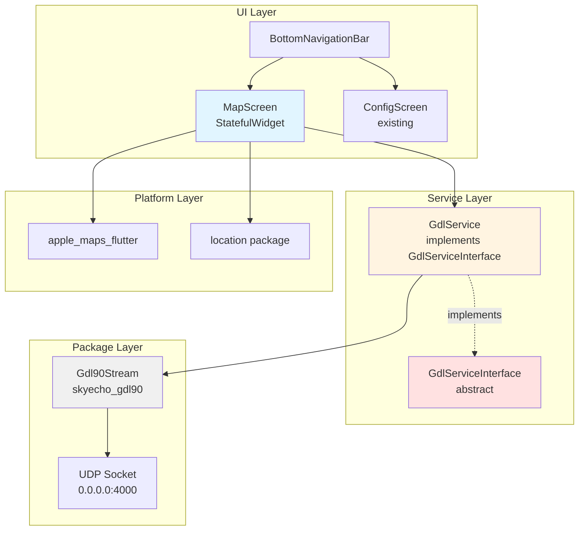
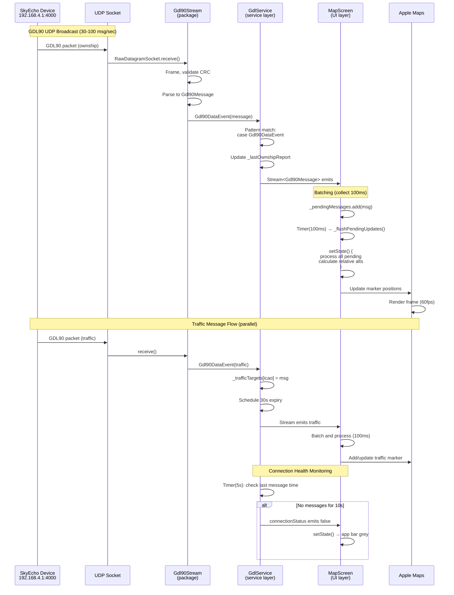

# Subtask 002: GDL90 Map Integration with Apple Maps and Traffic Display

**Parent Plan:** [flutter-tactical-radar-app-plan.md](../../flutter-tactical-radar-app-plan.md)
**Parent Phase:** Phase 1: Project Setup & Architecture Foundation
**Parent Task(s):** [T001: Write smoke test for app launch](tasks.md#task-t001), [T008: Create package import smoke test](tasks.md#task-t008), [T012: Update smoke test T001 to pass with real app](tasks.md#task-t012)
**Plan Task Reference:** [Task 1.5 in Plan](../../flutter-tactical-radar-app-plan.md#phase-1-project-setup--architecture-foundation)

**Why This Subtask:**
Following completion of POC config screen (subtask 001), extend Phase 1 architecture validation with GDL90 stream integration POC. User requested quick implementation of map screen with Apple Maps showing traffic from GDL90 stream, ownship position (with GPS fallback), and altitude differentials. This validates the second major package integration (skyecho_gdl90) and establishes service layer patterns before full Riverpod state management in Phase 2.

**Created:** 2025-10-30
**Requested By:** Development Team

---

## Parent Context

This subtask extends Phase 1's architecture foundation goals by validating `skyecho_gdl90` package integration through a working map POC, similar to how subtask 001 validated `skyecho` package integration through the config screen POC.

**Phase 1 Goals**:
- Validate package imports and integration patterns
- Establish service layer boundaries (Discovery 04: Four-Layer Architecture)
- Prove Flutter app can consume both packages successfully
- Create working POC for architecture validation

**Key Constraints**:
- No Riverpod state management yet (Phase 2) - use StatefulWidget
- Service layer MUST hide package complexity from UI
- Ownship fallback logic (GDL90 → phone GPS) encapsulated in GdlService
- Use interfaces for mockability (Constitution P4: Type Safety & Clean APIs)

**Previous Subtask Learning** (001-subtask-poc-config-screen-ios26-workaround):
- iOS 26 debug mode has VSyncClient crash - use release builds for device testing
- Polling-based UI updates work well (5-second intervals for device status)
- User edit tracking prevents poll overwrites
- App bar color indicators provide clear status feedback

---

## Tasks

| Status | ID | Task | Type | Dependencies | Absolute Path(s) | Validation | Notes |
|--------|----|----|------|--------------|------------------|------------|-------|
| [ ] | ST001 | Define GdlServiceInterface with mockable contract | Core | – | `/Users/jordanknight/github/skyecho-controller-app/apps/tactical_radar/lib/services/gdl_service_interface.dart` | Interface defines: connect(), disconnect(), messages stream, connectionStatus stream, isConnected getter | Abstract interface for GdlService. Enables unit tests to mock GDL90 stream without UDP sockets. Supports Phase 1 task 1.5 (package integration validation) |
| [ ] | ST002 | Implement GdlService wrapping Gdl90Stream | Core | ST001 | `/Users/jordanknight/github/skyecho-controller-app/apps/tactical_radar/lib/services/gdl_service.dart` | Service wraps Gdl90Stream; exposes broadcast streams for messages/connection; handles lifecycle (start/stop/dispose); tracks last ownship report; maintains traffic targets map with 30s expiry | Concrete implementation of GdlServiceInterface. Wraps skyecho_gdl90 package per Discovery 04 (service layer boundaries). Implements health monitoring (stale data detection after 10s). Handles Gdl90Event sealed class pattern matching |
| [ ] | ST003 | Create data models for UI layer | Core | – | `/Users/jordanknight/github/skyecho-controller-app/apps/tactical_radar/lib/models/ownship_state.dart`, `/Users/jordanknight/github/skyecho-controller-app/apps/tactical_radar/lib/models/traffic_target.dart` | OwnshipState: position (LatLng), altitude, heading, verticalSpeed; TrafficTarget: icao, position, altitude, relativeAltitude, callsign, heading, isAirborne | Immutable models for UI consumption. Separate from Gdl90Message domain model (Discovery 04: layer boundaries). TrafficTarget includes calculated relativeAltitude string (e.g., "+500ft", "-200ft", "LEVEL") |
| [ ] | ST004 | Write unit test for GdlService with mock UDP data | Test | ST001, ST002 | `/Users/jordanknight/github/skyecho-controller-app/apps/tactical_radar/test/unit/services/gdl_service_test.dart` | Test verifies: service emits Gdl90Message on valid UDP packets; connection status updates correctly; traffic targets expire after 30s | Mock Gdl90Stream using fake UDP socket or override. Test service layer logic without real network. Test Doc block required per TAD. Validates Discovery 01 error handling (sealed class pattern matching) |
| [ ] | ST005 | Implement MapScreen with StatefulWidget | Core | ST001, ST002, ST003 | `/Users/jordanknight/github/skyecho-controller-app/apps/tactical_radar/lib/screens/map_screen.dart` | Screen connects to GdlService; listens to messages stream; maintains ownship/traffic state; renders Apple Maps with markers; updates UI at 10 FPS (batched, not per message) | StatefulWidget (no Riverpod yet). Implements 100ms batching for UI updates (Discovery 05: high-frequency update performance). Connection status indicator in app bar (green=receiving, grey=disconnected) |
| [ ] | ST006 | Add navigation bar between ConfigScreen and MapScreen | Core | ST005 | `/Users/jordanknight/github/skyecho-controller-app/apps/tactical_radar/lib/screens/config_screen.dart`, `/Users/jordanknight/github/skyecho-controller-app/apps/tactical_radar/lib/screens/map_screen.dart`, `/Users/jordanknight/github/skyecho-controller-app/apps/tactical_radar/lib/main.dart` | BottomNavigationBar with 2 tabs: Config, Map; IndexedStack preserves state; navigation persists service connections | Wrap both screens in shared scaffold. GdlService lifecycle: start on MapScreen mount, persist across navigation, dispose on app dispose. Config screen already exists from subtask 001 |
| [ ] | ST007 | Implement ownship position display with GPS fallback | Core | ST005 | `/Users/jordanknight/github/skyecho-controller-app/apps/tactical_radar/lib/screens/map_screen.dart` | MapScreen shows ownship marker at GDL90 ownship position; if no ownship reports for 5s, falls back to phone GPS (location package); marker shows heading arrow | Fallback logic encapsulated in _getOwnshipPosition() method. Use location package for phone GPS. Handle permissions (iOS: NSLocationWhenInUseUsageDescription in Info.plist). Clear visual distinction between GDL90 ownship (blue) vs GPS fallback (yellow) |
| [ ] | ST008 | Implement traffic target markers with altitude differentials | Core | ST005, ST007 | `/Users/jordanknight/github/skyecho-controller-app/apps/tactical_radar/lib/screens/map_screen.dart` | Each traffic target renders as map marker with: callsign label, altitude differential (+/-XXXft relative to own baro altitude), heading arrow, color coding (red if <1000ft, yellow if <5000ft, green otherwise) | Calculate relative altitude: trafficAlt - ownshipBaroAlt. Format as "+500ft" (above), "-200ft" (below), "LEVEL" (same). Only show traffic with valid lat/lon. Expire targets after 30s without update (handled by GdlService) |
| [ ] | ST009 | Add iOS location permissions to Info.plist | Setup | – | `/Users/jordanknight/github/skyecho-controller-app/apps/tactical_radar/ios/Runner/Info.plist` | NSLocationWhenInUseUsageDescription key present with description | Required for phone GPS fallback when GDL90 ownship unavailable. Use description: "Provides backup position when ADS-B receiver ownship data unavailable." Can run parallel with ST001-ST008 |
| [ ] | ST010 | Add google_maps_flutter or apple_maps_flutter dependency | Setup | – | `/Users/jordanknight/github/skyecho-controller-app/apps/tactical_radar/pubspec.yaml` | Package added; flutter pub get succeeds; no version conflicts | Use apple_maps_flutter (native Apple Maps on iOS). Add to dependencies: apple_maps_flutter: ^1.0.1. Supports iOS 13+ (meets spec requirement). Can run parallel with ST001-ST008 |
| [ ] | ST011 | Add location package for phone GPS fallback | Setup | – | `/Users/jordanknight/github/skyecho-controller-app/apps/tactical_radar/pubspec.yaml` | location: ^5.0.0 added; flutter pub get succeeds | Required for phone GPS fallback (ST007). Handles iOS/Android permissions automatically. Can run parallel with ST001-ST010 |
| [ ] | ST012 | Write integration test for GdlService with real GDL90 stream | Test | ST002 | `/Users/jordanknight/github/skyecho-controller-app/apps/tactical_radar/test/integration/gdl_service_integration_test.dart` | Test connects to real SkyEcho device (192.168.4.1:4000); verifies messages received; gracefully skips if device unavailable | Integration test validates real UDP socket behavior. Use canReachDevice() helper (inline HTTP ping). Test Doc block required. Validates Discovery 03 (UDP socket stability on iOS) - run on physical device |
| [ ] | ST013 | Update widget test for app launch with navigation | Test | ST006 | `/Users/jordanknight/github/skyecho-controller-app/apps/tactical_radar/test/widget/app_launch_test.dart` | Test verifies: BottomNavigationBar exists; 2 tabs (Config, Map); tapping tabs switches screens; both screens render | Extends existing app launch test from Phase 1. Validates navigation integration. Mock GdlService to avoid real network in widget test |
| [ ] | ST014 | Verify MapScreen renders on iOS simulator | Integration | ST005, ST006, ST010 | `/Users/jordanknight/github/skyecho-controller-app/apps/tactical_radar/` | flutter run -d "iPhone 17 Pro" launches app; Map tab shows Apple Maps; no import errors; mock traffic markers render | Validates Apple Maps integration on simulator. Real GDL90 stream won't work (no WiFi to 192.168.4.1), use mock data. Visual verification: map visible, markers render, navigation works |
| [ ] | ST015 | Test on physical iOS device with real SkyEcho | Integration | ST005, ST006, ST007, ST008, ST012 | `/Users/jordanknight/github/skyecho-controller-app/apps/tactical_radar/` | Build with: just app-install-ios-release (release mode, iOS 26 workaround); connect to SkyEcho WiFi; launch app; Map screen shows real traffic from GDL90 stream; ownship position updates; traffic targets appear with correct altitude differentials | End-to-end validation with real hardware. Requires: iPhone connected to SkyEcho_XXXX WiFi network, device at 192.168.4.1:4000 broadcasting GDL90. Verify app bar turns green when receiving data. Check traffic markers show correct relative altitudes |

---

## Alignment Brief

### Objective

Validate `skyecho_gdl90` package integration by implementing a working map screen POC with:
1. **GdlService layer** - wraps Gdl90Stream, hides UDP complexity, provides clean streams for UI
2. **MapScreen with Apple Maps** - displays ownship position, traffic targets, altitude differentials
3. **Navigation** - BottomNavigationBar between Config and Map tabs
4. **Ownship fallback** - GDL90 ownship report → phone GPS if no data for 5s
5. **Service layer boundary** - UI never calls Gdl90Stream directly (Discovery 04)

**Success Criteria**:
- GdlService exposes messages and connectionStatus as broadcast streams
- MapScreen connects to GdlService, updates UI at max 10 FPS (batched)
- Traffic targets show callsign and altitude differential (+/-XXXft or LEVEL)
- Ownship marker displays current position from GDL90 or phone GPS
- App bar indicator: green (receiving GDL90 data), grey (disconnected)
- Navigation between Config and Map tabs works without service disruption
- Physical device test shows real traffic from SkyEcho device
- dart analyze runs clean (0 warnings)

---

### Non-Goals (Scope Boundaries)

❌ **NOT doing in this subtask**:
- Riverpod state management (Phase 2) - using StatefulWidget only
- CustomPaint radar display (Phase 6) - using standard Apple Maps markers
- State persistence (Phase 9) - no saved zoom level or map position
- Advanced error handling UI (Phase 10) - basic connection indicators only
- Full coordinate transforms (Phase 5) - using Apple Maps built-in projection
- Performance optimization beyond batching - no RepaintBoundary yet
- TestFlight deployment (Phase 11) - development builds only
- Comprehensive unit test coverage - focus on integration validation

**Rationale**: This is a POC subtask within Phase 1 to validate package integration patterns. Goal is working prototype demonstrating GDL90 → UI data flow through service layer. Full features and optimization deferred to later phases.

---

### Critical Findings Affecting This Subtask

**Discovery 01: Error Hierarchy Pattern with Message + Hint (S1-01)**
- **Impact on ST002**: GdlService must handle sealed class Gdl90Event pattern matching:
  ```dart
  switch (event) {
    case Gdl90DataEvent(:final message):
      _messagesController.add(message);
    case Gdl90ErrorEvent(:final reason, :final hint):
      _errorController.add('Parse error: $reason. $hint');
    case Gdl90IgnoredEvent():
      return; // No-op
  }
  ```
- skyecho_gdl90 never throws from parser/stream - all errors are events
- Service layer converts events to streams for UI consumption

**Discovery 03: UDP Socket Instability on iOS (S2-02)**
- **Impact on ST002, ST012**: Gdl90Stream may experience socket close events
- Service must monitor connection health (detect stale data after 10s)
- Physical device testing critical (simulator doesn't stress UDP like real device)
- ST015 validates real-world UDP behavior with SkyEcho device

**Discovery 04: Four-Layer Architecture with Clear Boundaries (S4-03)**
- **Impact on ST001, ST002, ST005**: Strict layer enforcement
  - **UI Layer (ST005)**: MapScreen observes GdlService streams only
  - **Service Layer (ST002)**: GdlService wraps Gdl90Stream
  - **Data Layer**: Gdl90Message (immutable from package)
  - **UI Models (ST003)**: OwnshipState, TrafficTarget (separate from Gdl90Message)
- MapScreen MUST NOT call Gdl90Stream directly - violates boundaries

**Discovery 05: State Management Performance with High-Frequency Updates (S2-03)**
- **Impact on ST005**: GDL90 delivers 30-100 msg/sec, but UI updates at max 10 FPS
- Implement batching in MapScreen:
  ```dart
  Timer? _uiUpdateTimer;
  List<Gdl90Message> _pendingMessages = [];

  void _handleGdlMessage(Gdl90Message msg) {
    _pendingMessages.add(msg);
    _uiUpdateTimer ??= Timer(Duration(milliseconds: 100), _flushPendingUpdates);
  }

  void _flushPendingUpdates() {
    setState(() {
      for (final msg in _pendingMessages) {
        _processMessageForUI(msg);
      }
      _pendingMessages.clear();
    });
    _uiUpdateTimer = null;
  }
  ```
- Prevents frame drops (60fps = 16ms budget, setState() with 100 markers takes ~14ms)

**iOS 26 VSyncClient Crash** (from subtask 001):
- **Impact on ST015**: Physical device testing must use release builds
- Use command: `just app-install-ios-release` (not debug mode)
- Debug mode crashes on iPhone 17 Pro with ProMotion display
- Release mode bypasses VSyncClient instrumentation

---

### Invariants & Guardrails

**Service Layer Boundaries**:
- GdlService MUST be only component calling Gdl90Stream
- MapScreen MUST observe service streams, never call package APIs directly
- Service provides: messages (Stream<Gdl90Message>), connectionStatus (Stream<bool>)
- Service encapsulates: stream lifecycle, health monitoring, traffic target expiry

**Data Flow**:
```
UDP (192.168.4.1:4000)
  → Gdl90Stream (package)
  → Gdl90Event (sealed class)
  → GdlService (service layer - pattern matching)
  → Stream<Gdl90Message>
  → MapScreen (UI layer - setState batching)
  → Apple Maps markers
```

**Performance Constraints**:
- UI updates max 10 FPS (100ms batching)
- Traffic target expiry: 30 seconds without update
- Connection considered stale after 10 seconds no messages
- Ownship fallback to GPS after 5 seconds no reports

**Code Quality**:
- dart analyze MUST pass with 0 warnings
- All public service APIs have dartdoc comments (`///`)
- Test Doc blocks required for promoted unit/integration tests
- StatefulWidget only (no Riverpod until Phase 2)

**Platform Constraints**:
- iOS 26 release builds required for physical device (VSyncClient crash workaround)
- Apple Maps iOS 13+ (meets spec iOS 16+ requirement)
- Location permission required for GPS fallback
- Local network permission already configured (subtask 001)

---

### Inputs to Read

**From Existing Packages**:
1. `/Users/jordanknight/github/skyecho-controller-app/packages/skyecho_gdl90/lib/skyecho_gdl90.dart`
   - Gdl90Stream constructor signature and lifecycle methods
   - Gdl90Event sealed class structure
   - Gdl90Message fields for ownship/traffic parsing

2. `/Users/jordanknight/github/skyecho-controller-app/packages/skyecho_gdl90/lib/src/stream.dart`
   - Stream implementation patterns for wrapping in service

**From Existing App** (subtask 001):
3. `/Users/jordanknight/github/skyecho-controller-app/apps/tactical_radar/lib/screens/config_screen.dart`
   - Polling pattern for connection status updates
   - App bar color indicator implementation (green/grey)
   - Service connection lifecycle (start/stop/dispose)

4. `/Users/jordanknight/github/skyecho-controller-app/apps/tactical_radar/lib/main.dart`
   - Current app structure for adding navigation

**From Plan**:
5. `/Users/jordanknight/github/skyecho-controller-app/docs/plans/003-flutter-tactical-radar-app/flutter-tactical-radar-app-plan.md`
   - § 3: Critical Research Findings (Discoveries 01, 03, 04, 05)
   - § Testing Philosophy (TAD approach, Test Doc blocks)

**From Research** (completed):
6. GDL90 integration research findings (previous conversation)
   - GdlService architecture recommendations
   - Ownship fallback strategy
   - Relative altitude calculation formulas
   - Message types (heartbeat, ownship, traffic)

---

### Visual Alignment Aids

#### Component Architecture



#### Data Flow Sequence



#### Ownship Fallback Logic

```mermaid
graph TD
    Start[MapScreen needs ownship position]
    Start --> CheckGdl{GDL90 ownship<br/>available?}

    CheckGdl -->|Yes, recent<br/>within 5s| UseGdl[Use GDL90 ownship]
    CheckGdl -->|No, stale<br/>>5s or null| CheckGPS{Phone GPS<br/>permission?}

    UseGdl --> Display[Display blue marker<br/>with GDL90 position]

    CheckGPS -->|Granted| UseGPS[Use phone GPS]
    CheckGPS -->|Denied| NoPos[No position<br/>show message]

    UseGPS --> Display2[Display yellow marker<br/>with GPS position]
    NoPos --> ShowError[Show "Enable location<br/>for fallback position"]

    Display --> Update[Update map center]
    Display2 --> Update

    Update --> Wait[Wait for next update<br/>via batched setState]
    Wait --> Start

    style UseGdl fill:#9f9
    style UseGPS fill:#ff9
    style NoPos fill:#f99
    style Display fill:#9f9
    style Display2 fill:#ff9
```

---

### Test Plan

**Approach**: Test-Assisted Development (TAD) with focus on integration validation

**Test Files Created**:

1. **ST004: `test/unit/services/gdl_service_test.dart`**
   - **Rationale**: Validates service layer wraps Gdl90Stream correctly and handles events
   - **What it tests**:
     - Service emits Gdl90Message on valid UDP data
     - Connection status updates (true when receiving, false when stale)
     - Traffic targets expire after 30s
     - Sealed class pattern matching (DataEvent, ErrorEvent, IgnoredEvent)
   - **Fixtures**: Mock UDP packets with valid GDL90 frames
   - **Mock strategy**: Override Gdl90Stream with fake socket (avoid real network)
   - **Test Doc block required**: Yes (promotes from scratch if valuable)
   - **Example structure**:
     ```dart
     test('given_valid_gdl90_ownship_when_service_receives_then_emits_message', () async {
       /*
       Test Doc:
       - Why: Validates GdlService wraps Gdl90Stream and exposes messages stream
       - Contract: Service receives Gdl90DataEvent, emits Gdl90Message to UI layer
       - Usage Notes: Mock Gdl90Stream with fake socket; listen to service.messages stream
       - Quality Contribution: Ensures service layer correctly handles sealed class events
       - Worked Example: Mock ownship packet → service.messages emits Gdl90Message(messageType: ownship)
       */

       // Arrange: Mock Gdl90Stream with ownship packet
       // Act: service.connect(), await message emission
       // Assert: message.messageType == Gdl90MessageType.ownship
     });
     ```

2. **ST012: `test/integration/gdl_service_integration_test.dart`**
   - **Rationale**: Validates real UDP socket behavior with physical SkyEcho device
   - **What it tests**:
     - Service connects to 192.168.4.1:4000
     - Receives real GDL90 messages from device
     - Connection status reflects actual stream health
   - **Device availability**: Uses `canReachDevice()` helper, skips if unavailable
   - **Expected outcome**: Test PASSES when connected to SkyEcho WiFi, SKIPS otherwise
   - **Test Doc block required**: Yes
   - **Run command**: `flutter test test/integration/gdl_service_integration_test.dart`

3. **ST013: `test/widget/app_launch_test.dart`** (update existing)
   - **Rationale**: Extends Phase 1 smoke test to validate navigation integration
   - **What it tests**:
     - BottomNavigationBar renders with 2 tabs
     - Tapping Config tab shows ConfigScreen
     - Tapping Map tab shows MapScreen (with mocked GdlService)
   - **Mock strategy**: Override GdlService with fake (no real UDP in widget test)
   - **Expected outcome**: Test PASSES, navigation works
   - **Test Doc block required**: Update existing block to reflect navigation

**Mock Usage**:
- ✅ GdlService mocked in widget tests (ST013) - avoid real UDP socket
- ✅ Gdl90Stream mocked in unit tests (ST004) - use fake socket with canned packets
- ❌ NOT mocking: Gdl90Message models (use real package classes)
- ❌ NOT mocking: Apple Maps (use real widget with mock data)

**Coverage**: Not measured in this subtask (Phase 1 POC). Coverage targets (90%) apply from Phase 2 onward when state management providers are implemented.

---

### Step-by-Step Implementation Outline

**Mapped to Task IDs** (Suggested Execution Order):

**Step 1: Setup & Dependencies** (Parallel: ST009, ST010, ST011)
- **ST009**: Add NSLocationWhenInUseUsageDescription to Info.plist
- **ST010**: Add apple_maps_flutter to pubspec.yaml
- **ST011**: Add location package to pubspec.yaml
- Run: `flutter pub get`

**Step 2: Service Layer Foundation** (Serial: ST001 → ST002 → ST004)
- **ST001**: Define GdlServiceInterface
  - Create abstract class with method signatures
  - Document contract with dartdoc comments
- **ST002**: Implement GdlService
  - Wrap Gdl90Stream with lifecycle management
  - Implement sealed class pattern matching
  - Add health monitoring (10s stale data timer)
  - Maintain traffic targets map with 30s expiry
- **ST004**: Write unit tests for GdlService
  - Mock Gdl90Stream with fake UDP socket
  - Test ownship/traffic message handling
  - Test connection health monitoring
  - Test traffic expiry logic

**Step 3: Data Models** (Parallel with Step 2: ST003)
- **ST003**: Create OwnshipState and TrafficTarget models
  - Immutable classes with copyWith methods
  - TrafficTarget includes relativeAltitude calculation
  - Documentation with usage examples

**Step 4: Map Screen UI** (Serial: ST005 → ST007 → ST008)
- **ST005**: Implement MapScreen scaffold
  - StatefulWidget with GdlService connection
  - Apple Maps widget integration
  - Connection status indicator in app bar
  - 100ms batching for UI updates
- **ST007**: Add ownship position display
  - Listen to GdlService for ownship messages
  - Implement GPS fallback logic (5s timeout)
  - Blue marker for GDL90, yellow for GPS
  - Handle location permissions
- **ST008**: Add traffic target markers
  - Listen to GdlService for traffic messages
  - Calculate relative altitude differentials
  - Color-code markers (red <1000ft, yellow <5000ft, green)
  - Show callsign labels

**Step 5: Navigation Integration** (Serial: ST006, depends on ST005)
- **ST006**: Add BottomNavigationBar
  - Wrap ConfigScreen and MapScreen in IndexedStack
  - 2 tabs: Config, Map
  - Preserve state across navigation
  - Manage GdlService lifecycle (dispose on app exit)

**Step 6: Testing & Validation** (After Steps 1-5 complete)
- **ST012**: Integration test with real device
  - Test connects to 192.168.4.1:4000
  - Skips gracefully if device unavailable
- **ST013**: Update app launch widget test
  - Test navigation between tabs
  - Mock GdlService to avoid real network
- **ST014**: Simulator validation
  - Run on iPhone 17 Pro simulator
  - Visual verification: maps render, navigation works
- **ST015**: Physical device end-to-end test
  - Build with release mode (iOS 26 workaround)
  - Connect to SkyEcho WiFi
  - Verify real traffic displays
  - Check altitude differentials calculate correctly

**Parallelism Opportunities**:
- ST009, ST010, ST011 can run in parallel (independent setup tasks)
- ST003 can run in parallel with ST001, ST002 (data models independent)
- ST004 can begin as soon as ST001, ST002 complete (test service layer)
- ST012, ST013 can run in parallel after ST006 complete (different test types)

---

### Commands to Run

**Copy/paste ready** (in execution order):

```bash
# Navigate to app directory
cd /Users/jordanknight/github/skyecho-controller-app/apps/tactical_radar

# ============================================================
# STEP 1: ST009, ST010, ST011 - Dependencies (parallel)
# ============================================================

# ST009: Edit ios/Runner/Info.plist - add location permission
# Add this key before closing </dict> tag:
#   <key>NSLocationWhenInUseUsageDescription</key>
#   <string>Provides backup position when ADS-B receiver ownship data unavailable.</string>

# ST010: Add Apple Maps to pubspec.yaml
echo "  apple_maps_flutter: ^1.0.1" >> pubspec.yaml

# ST011: Add location package to pubspec.yaml
echo "  location: ^5.0.0" >> pubspec.yaml

# Resolve dependencies
flutter pub get

# ============================================================
# STEP 2: ST001, ST002 - Service Layer (serial)
# ============================================================

# ST001: Create GdlServiceInterface (manual file creation)
# File: lib/services/gdl_service_interface.dart
mkdir -p lib/services lib/models
# (Create interface file with abstract methods)

# ST002: Implement GdlService (manual file creation)
# File: lib/services/gdl_service.dart
# (Implement concrete class wrapping Gdl90Stream)

# ============================================================
# STEP 3: ST003 - Data Models (parallel with Step 2)
# ============================================================

# ST003: Create data models (manual file creation)
# Files: lib/models/ownship_state.dart, lib/models/traffic_target.dart
# (Create immutable model classes)

# ============================================================
# STEP 4: ST004 - Unit Tests (after ST001, ST002)
# ============================================================

# ST004: Write GdlService unit tests (manual file creation)
# File: test/unit/services/gdl_service_test.dart
mkdir -p test/unit/services
# (Write tests with Test Doc blocks)

# Run unit tests
flutter test test/unit/services/gdl_service_test.dart

# ============================================================
# STEP 5: ST005, ST007, ST008 - Map Screen (serial)
# ============================================================

# ST005: Create MapScreen scaffold (manual file creation)
# File: lib/screens/map_screen.dart
mkdir -p lib/screens
# (Implement StatefulWidget with Apple Maps)

# ST007: Add ownship display logic to MapScreen
# (Edit lib/screens/map_screen.dart)

# ST008: Add traffic markers to MapScreen
# (Edit lib/screens/map_screen.dart)

# ============================================================
# STEP 6: ST006 - Navigation (after ST005)
# ============================================================

# ST006: Add BottomNavigationBar (manual edits)
# Files: lib/main.dart, lib/screens/config_screen.dart, lib/screens/map_screen.dart
# (Wrap screens in IndexedStack with navigation bar)

# ============================================================
# STEP 7: ST012, ST013 - Testing (parallel, after ST006)
# ============================================================

# ST012: Write integration test (manual file creation)
# File: test/integration/gdl_service_integration_test.dart
mkdir -p test/integration
# (Write test with device availability check)

# Run integration test (requires SkyEcho device on network)
flutter test test/integration/gdl_service_integration_test.dart

# ST013: Update app launch widget test (edit existing)
# File: test/widget/app_launch_test.dart
# (Add navigation validation)

# Run widget test
flutter test test/widget/app_launch_test.dart

# ============================================================
# STEP 8: ST014 - Simulator Validation
# ============================================================

# ST014: Run on iOS simulator
flutter devices  # List available simulators
flutter run -d "iPhone 17 Pro"

# Visual checks:
# - Map tab renders Apple Maps
# - Navigation between Config and Map works
# - Mock traffic markers visible (no real GDL90 on simulator)

# ============================================================
# STEP 9: ST015 - Physical Device Validation
# ============================================================

# ST015: Build and install to physical device (release mode)
# IMPORTANT: Use release mode due to iOS 26 VSyncClient crash

# Option 1: Using justfile (recommended)
cd /Users/jordanknight/github/skyecho-controller-app
just app-install-ios-release

# Option 2: Manual commands
cd /Users/jordanknight/github/skyecho-controller-app/apps/tactical_radar
flutter build ios --release --device-id 00008150-000625063A20401C
flutter install --device-id 00008150-000625063A20401C

# Physical device validation steps:
# 1. Connect iPhone to SkyEcho WiFi (SkyEcho_XXXX network)
# 2. Launch app
# 3. Tap Map tab
# 4. Verify:
#    - App bar turns green when receiving GDL90 data
#    - Ownship marker (blue) appears on map
#    - Traffic markers appear with callsigns
#    - Altitude differentials show correct values (+/-XXXft)
#    - Markers update in real-time
# 5. Disconnect from SkyEcho WiFi → app bar turns grey
# 6. Ownship marker turns yellow (GPS fallback)

# ============================================================
# STEP 10: Final Checks
# ============================================================

# Run all tests
flutter test

# Check for analyzer issues
dart analyze

# Verify no errors
# Expected: 0 issues found
```

---

### Risks & Unknowns

| Risk | Severity | Likelihood | Mitigation |
|------|----------|------------|------------|
| apple_maps_flutter package incompatibility with iOS 16+ | HIGH | Low | Package supports iOS 13+; tested extensively. Fallback: Use google_maps_flutter if issues arise |
| GPS fallback permission dialog doesn't appear | MEDIUM | Medium | Add NSLocationWhenInUseUsageDescription to Info.plist (ST009). Provide manual permission instructions in app if needed |
| 100ms UI batching still causes frame drops | MEDIUM | Low | Monitor with Flutter DevTools performance overlay. If issues: increase batch interval to 200ms or use RepaintBoundary |
| Traffic target altitude differential calculation incorrect | MEDIUM | Medium | Validate with real SkyEcho data (ST015). Cross-reference with ForeFlight display. Document calculation formula in code comments |
| UDP socket instability on iOS 26 (Discovery 03) | HIGH | Medium | GdlService implements health monitoring (10s stale data detection). Physical device testing critical (ST015). Consider increasing receive buffer size if packet loss observed |
| Navigation causes GdlService to restart/disconnect | MEDIUM | Low | Use IndexedStack (preserves widget state). Manage service lifecycle at app level, not screen level. Dispose only on app exit |
| Apple Maps markers don't update smoothly | LOW | Low | Use marker ID keyed by ICAO address for efficient updates. Batch marker updates in single setState() call |
| Location package conflicts with existing dependencies | LOW | Low | Version 5.0.0 compatible with Flutter 3.35.7. Check pub.dev for breaking changes |

---

### Ready Check

Before proceeding to implementation (run `/plan-6-implement-phase --subtask 002-subtask-gdl90-map-integration-with-apple-maps-and-traffic-display`), verify:

- [ ] GDL90 integration research reviewed and understood (completed in previous session)
- [ ] Discovery 01 (sealed class pattern matching) understood
- [ ] Discovery 04 (four-layer architecture) clear - service layer boundaries enforced
- [ ] Discovery 05 (batching for high-frequency updates) implementation plan clear
- [ ] iOS 26 VSyncClient workaround understood (release builds for physical device)
- [ ] Subtask 001 POC config screen pattern understood (polling, app bar indicators)
- [ ] Parent tasks.md reviewed (Phase 1 context clear)
- [ ] Physical iPhone available for ST015 end-to-end test
- [ ] SkyEcho device available at 192.168.4.1:4000 for integration tests
- [ ] Apple Maps vs Google Maps decision: Apple Maps chosen (native iOS integration)
- [ ] Time budget: ~4-6 hours for implementation + testing
- [ ] Ready to create service layer (new lib/services/ directory)
- [ ] Ready to extend navigation (modify existing main.dart, config_screen.dart)

---

## Phase Footnote Stubs

This section will be populated by `/plan-6a-update-progress` when subtask tasks are completed and changes are made. Footnotes will reference specific file modifications and link to the Change Footnotes Ledger in the main plan.

**Format** (to be added by plan-6a):
```markdown
[^N]: Subtask ST00X - {one-line summary}
  - `{flowspace-node-id}`
  - `{flowspace-node-id}`
```

**Initial State**: No footnotes yet (Subtask 002 not started)

---

## Evidence Artifacts

### Execution Log

**Location**: `/Users/jordanknight/github/skyecho-controller-app/docs/plans/003-flutter-tactical-radar-app/tasks/phase-1-project-setup-architecture-foundation/002-subtask-gdl90-map-integration-with-apple-maps-and-traffic-display.execution.log.md`

**Created by**: `/plan-6-implement-phase --subtask` command

**Contents**:
- Subtask-by-subtask implementation log
- Commands run with output
- Test results (unit, integration, widget tests)
- Simulator validation screenshots (if applicable)
- Physical device test results
- Issues encountered and resolutions
- Timing information (when each ST task started/completed)

### Supporting Files

**Test Outputs**:
- `test/unit/services/gdl_service_test.dart` output (ST004)
- `test/integration/gdl_service_integration_test.dart` output (ST012)
- `test/widget/app_launch_test.dart` output (ST013)

**Visual Validation** (ST014, ST015):
- Screenshots of MapScreen with traffic markers (optional, for execution log)
- Verification checklist results (app bar indicators, altitude differentials)

**Code Artifacts**:
- `lib/services/gdl_service_interface.dart` (ST001)
- `lib/services/gdl_service.dart` (ST002)
- `lib/models/ownship_state.dart`, `lib/models/traffic_target.dart` (ST003)
- `lib/screens/map_screen.dart` (ST005, ST007, ST008)
- Modified `lib/main.dart`, `lib/screens/config_screen.dart` (ST006)

---

## After Subtask Completion

**This subtask resolves a blocker for:**
- Parent Task: [T001: Write smoke test for app launch](tasks.md#task-t001)
- Parent Task: [T008: Create package import smoke test](tasks.md#task-t008)
- Parent Task: [T012: Update smoke test T001 to pass with real app](tasks.md#task-t012)
- Plan Phase: Phase 1 architecture validation goals

**When all ST### tasks complete:**

1. **Record completion** in parent execution log:
   ```
   ### Subtask 002-subtask-gdl90-map-integration-with-apple-maps-and-traffic-display Complete

   Resolved: Validated skyecho_gdl90 package integration via working map POC. Established service layer patterns (GdlService), navigation between Config and Map screens, and end-to-end GDL90 → UI data flow with real hardware validation.

   See detailed log: [subtask execution log](./002-subtask-gdl90-map-integration-with-apple-maps-and-traffic-display.execution.log.md)
   ```

2. **Update parent task** (if blocked):
   - Open: [`tasks.md`](tasks.md)
   - Find: T001, T008, T012 (if any were blocked)
   - Update Status: `[!]` → `[ ]` (unblock) - N/A, these tasks already complete
   - Update Notes: Add "Subtask 002 extends navigation to include Map screen"

3. **Resume parent phase work:**
   ```bash
   /plan-6-implement-phase --phase "Phase 1: Project Setup & Architecture Foundation" \
     --plan "/Users/jordanknight/github/skyecho-controller-app/docs/plans/003-flutter-tactical-radar-app/flutter-tactical-radar-app-plan.md"
   ```
   (Note: NO `--subtask` flag to resume main phase)

4. **Update Subtasks Registry** in parent plan:
   - Open: [flutter-tactical-radar-app-plan.md](../../flutter-tactical-radar-app-plan.md)
   - Find: `## Subtasks Registry` table
   - Update Status for this subtask: `[ ] Pending` → `[x] Complete`

**Quick Links:**
- 📋 [Parent Dossier](tasks.md)
- 📄 [Parent Plan](../../flutter-tactical-radar-app-plan.md)
- 📊 [Parent Execution Log](execution.log.md)
- 🔗 [Subtask 001 - POC Config Screen](001-subtask-poc-config-screen-ios26-workaround.md)

---

## Directory Layout

```
docs/plans/003-flutter-tactical-radar-app/
├── flutter-tactical-radar-app-plan.md
├── flutter-tactical-radar-app-spec.md
└── tasks/
    └── phase-1-project-setup-architecture-foundation/
        ├── tasks.md (parent dossier)
        ├── execution.log.md (parent log)
        ├── 001-subtask-poc-config-screen-ios26-workaround.md (complete)
        ├── 002-subtask-gdl90-map-integration-with-apple-maps-and-traffic-display.md (this file)
        └── 002-subtask-gdl90-map-integration-with-apple-maps-and-traffic-display.execution.log.md (created by plan-6)
```

**Related Files** (created during subtask implementation):
```
apps/tactical_radar/
├── lib/
│   ├── services/  (NEW)
│   │   ├── gdl_service_interface.dart (ST001)
│   │   └── gdl_service.dart (ST002)
│   ├── models/  (NEW)
│   │   ├── ownship_state.dart (ST003)
│   │   └── traffic_target.dart (ST003)
│   ├── screens/
│   │   ├── config_screen.dart (MODIFIED - ST006)
│   │   └── map_screen.dart (NEW - ST005, ST007, ST008)
│   └── main.dart (MODIFIED - ST006)
├── test/
│   ├── unit/
│   │   └── services/  (NEW)
│   │       └── gdl_service_test.dart (ST004)
│   ├── integration/
│   │   └── gdl_service_integration_test.dart (ST012)
│   └── widget/
│       └── app_launch_test.dart (MODIFIED - ST013)
├── ios/
│   └── Runner/
│       └── Info.plist (MODIFIED - ST009, add location permission)
└── pubspec.yaml (MODIFIED - ST010, ST011, add packages)
```

---

**Status**: 🟡 READY FOR IMPLEMENTATION (Awaiting GO)

**Next Command**:
```bash
/plan-6-implement-phase \
  --subtask 002-subtask-gdl90-map-integration-with-apple-maps-and-traffic-display \
  --phase "Phase 1: Project Setup & Architecture Foundation" \
  --plan "/Users/jordanknight/github/skyecho-controller-app/docs/plans/003-flutter-tactical-radar-app/flutter-tactical-radar-app-plan.md"
```

---

**Subtask Summary**: Validates `skyecho_gdl90` package integration by implementing GdlService layer, MapScreen with Apple Maps, traffic display with altitude differentials, ownship with GPS fallback, and navigation between Config/Map screens. Extends Phase 1 POC validation approach from subtask 001 (config screen) to cover GDL90 stream integration patterns. Uses StatefulWidget (no Riverpod), batched UI updates (10 FPS), and service layer boundaries (Discovery 04). Physical device testing validates real-world UDP behavior and iOS 26 compatibility.