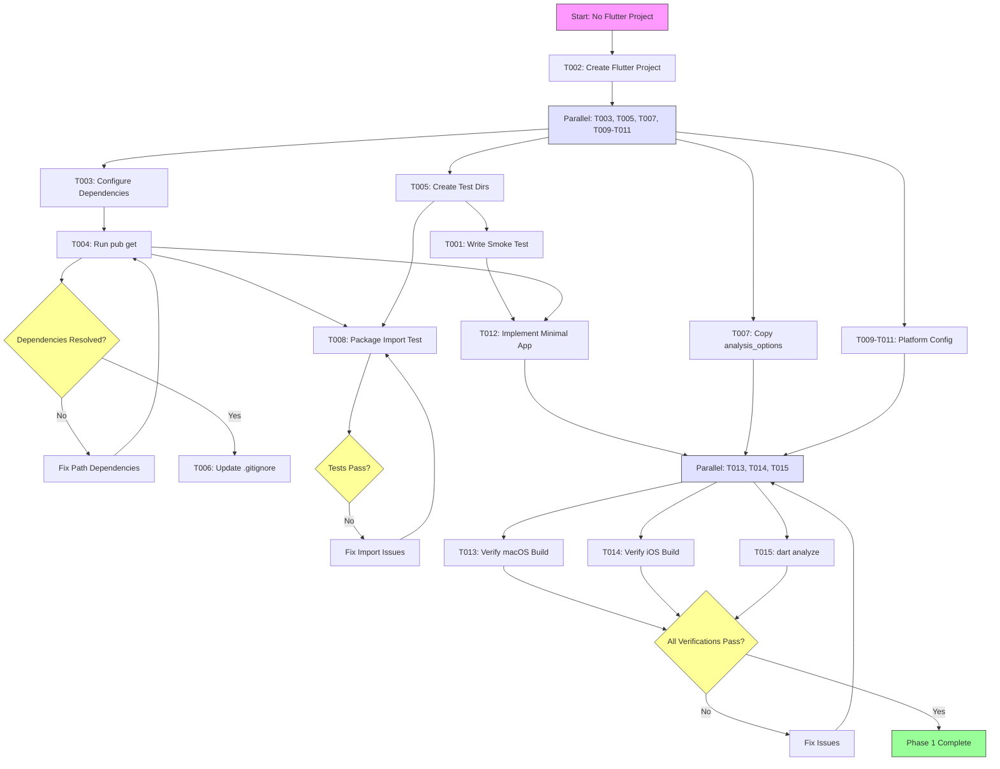
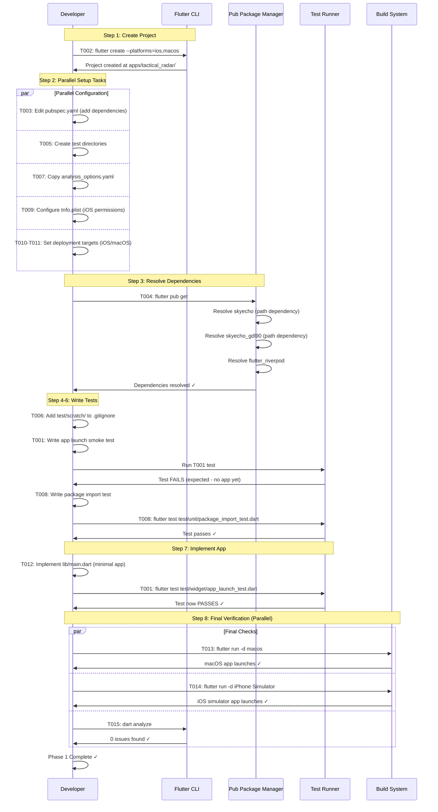

# Phase 1: Project Setup & Architecture Foundation

**Phase**: Phase 1
**Slug**: `phase-1-project-setup-architecture-foundation`
**Plan**: [flutter-tactical-radar-app-plan.md](/Users/jordanknight/github/skyecho-controller-app/docs/plans/003-flutter-tactical-radar-app/flutter-tactical-radar-app-plan.md#phase-1-project-setup--architecture-foundation)
**Spec**: [flutter-tactical-radar-app-spec.md](/Users/jordanknight/github/skyecho-controller-app/docs/plans/003-flutter-tactical-radar-app/flutter-tactical-radar-app-spec.md)
**Created**: 2025-10-27

---

## Tasks

| Status | ID | Task | Type | Dependencies | Absolute Path(s) | Validation | Subtasks | Notes |
|--------|----|----|------|--------------|------------------|------------|----------|-------|
| [ ] | T002 | Create Flutter project with macOS and iOS platforms | Setup | – | `/Users/jordanknight/github/skyecho-controller-app/apps/tactical_radar/` (entire project directory) | `flutter create` succeeds; pubspec.yaml exists; lib/main.dart created | – | Org ID: com.skyecho.tacticalradar. Platforms: ios,macos. Supports plan task 1.1. MUST run first (creates all directories) |
| [ ] | T003 | Configure pubspec.yaml dependencies | Setup | T002 | `/Users/jordanknight/github/skyecho-controller-app/apps/tactical_radar/pubspec.yaml` | All 6 packages added with correct paths/versions | – | Add: skyecho (path), skyecho_gdl90 (path), flutter_riverpod, shared_preferences, flutter_fgbg: ^0.3.0, http (dev). Supports plan task 1.2 |
| [ ] | T004 | Run flutter pub get to resolve dependencies | Setup | T003 | `/Users/jordanknight/github/skyecho-controller-app/apps/tactical_radar/pubspec.lock` | pub get succeeds; .dart_tool/package_config.json created; no resolution errors | – | Verifies path dependencies resolve correctly. Serial (same project) |
| [ ] | T005 | Create test directory structure | Setup | T002 | `/Users/jordanknight/github/skyecho-controller-app/apps/tactical_radar/test/scratch/`, `/Users/jordanknight/github/skyecho-controller-app/apps/tactical_radar/test/unit/`, `/Users/jordanknight/github/skyecho-controller-app/apps/tactical_radar/test/widget/`, `/Users/jordanknight/github/skyecho-controller-app/apps/tactical_radar/test/integration/`, `/Users/jordanknight/github/skyecho-controller-app/apps/tactical_radar/test/fixtures/` | All 5 directories exist | – | Mirror structure from skyecho/skyecho_gdl90 packages. Supports plan task 1.3. Can run in parallel with T003 |
| [ ] | T006 | Add test/scratch/ to .gitignore | Setup | T005 | `/Users/jordanknight/github/skyecho-controller-app/apps/tactical_radar/.gitignore` | .gitignore contains `test/scratch/` entry | – | Per TAD workflow: scratch tests never committed. Serial (depends on T005 completing) |
| [ ] | T007 | Copy analysis_options.yaml from skyecho package | Setup | T002 | `/Users/jordanknight/github/skyecho-controller-app/apps/tactical_radar/analysis_options.yaml` | File exists; dart analyze runs (may have warnings before code written) | – | Inherit lint rules from skyecho package. Supports plan task 1.4. Can run in parallel with T003, T005 |
| [ ] | T009 | Configure iOS Info.plist with network permissions | Setup | T002 | `/Users/jordanknight/github/skyecho-controller-app/apps/tactical_radar/ios/Runner/Info.plist` | NSLocalNetworkUsageDescription key present; NSBonjourServices array with _dartobservatory._tcp | – | Per Discovery 02 (S2-01): Both keys required for iOS local network access. iOS-only (macOS doesn't need these). Permission functionality validated in Phase 3+ when iOS deployment begins. Supports plan task 1.6. Can run in parallel with T003, T005, T007 |
| [ ] | T010 | Set iOS minimum deployment target to 16.0 | Setup | T002 | `/Users/jordanknight/github/skyecho-controller-app/apps/tactical_radar/ios/Podfile`, `/Users/jordanknight/github/skyecho-controller-app/apps/tactical_radar/ios/Runner.xcodeproj/project.pbxproj` | Podfile has platform :ios, '16.0'; Xcode project IPHONEOS_DEPLOYMENT_TARGET = 16.0 for all configurations | – | Per spec: iOS 16+ minimum. Use Xcode GUI: Open ios/Runner.xcodeproj → Runner target → General tab → Minimum Deployments → iOS 16.0. Edit Podfile manually. Supports plan task 1.7. Can run in parallel with T003, T005, T007, T009 |
| [ ] | T011 | Set macOS minimum deployment target to 13.0 | Setup | T002 | `/Users/jordanknight/github/skyecho-controller-app/apps/tactical_radar/macos/Runner.xcodeproj/project.pbxproj` | MACOSX_DEPLOYMENT_TARGET = 13.0 in Xcode project for all configurations | – | Per spec: macOS 13+ minimum. Use Xcode GUI: Open macos/Runner.xcodeproj → Runner target → General tab → Minimum Deployments → macOS 13.0. Supports plan task 1.7. Can run in parallel with T003, T005, T007, T009, T010 (different platform) |
| [ ] | T001 | Write smoke test for app launch (test-first) | Test | T005 | `/Users/jordanknight/github/skyecho-controller-app/apps/tactical_radar/test/widget/app_launch_test.dart` | Test file created; test fails (no app yet); imports flutter_test package | – | Test-first approach: write after test/widget/ directory exists (T005), before implementing custom app logic in T012. Supports plan task 1.0. Can run in parallel with T003, T004, T006, T007, T009, T010, T011 |
| [ ] | T008 | Create package import smoke test | Test | T004, T005 | `/Users/jordanknight/github/skyecho-controller-app/apps/tactical_radar/test/unit/package_import_test.dart` | Test imports both packages; verifies constructors callable; test passes | 002-subtask-gdl90-map-integration-with-apple-maps-and-traffic-display | Supports plan task 1.5. Needs T004 (dependencies resolved) and T005 (test/unit/ directory exists). Can run in parallel with T001, T006, T007, T009, T010, T011. Subtask 002 extends package validation with working GDL90 map POC |
| [ ] | T012 | Update smoke test T001 to pass with real app | Core | T001, T003, T004 | `/Users/jordanknight/github/skyecho-controller-app/apps/tactical_radar/test/widget/app_launch_test.dart`, `/Users/jordanknight/github/skyecho-controller-app/apps/tactical_radar/lib/main.dart` | Smoke test from T001 now passes; app renders MaterialApp with title | – | Implement minimal main.dart to make T001 pass. Needs T001 (test exists), T003 (pubspec configured), T004 (dependencies resolved). Serial (updates T001 test file) |
| [ ] | T013 | Verify macOS desktop build | Integration | T012, T007, T011 | `/Users/jordanknight/github/skyecho-controller-app/apps/tactical_radar/` | `flutter run -d macos` succeeds; app window opens; no import errors | – | Supports plan task 1.9. Needs T012 (app implemented), T007 (analysis options), T011 (macOS deployment target). Must run on macOS |
| [ ] | T014 | Verify iOS simulator build | Integration | T012, T007, T009, T010 | `/Users/jordanknight/github/skyecho-controller-app/apps/tactical_radar/` | `flutter run -d "iPhone 15 Simulator"` succeeds; app launches; no import errors | – | Supports plan task 1.9. Needs T012 (app implemented), T007 (analysis options), T009 (Info.plist permissions), T010 (iOS deployment target). Requires iOS simulator. Can run in parallel with T013 |
| [ ] | T015 | Run dart analyze verification | Integration | T012, T007 | `/Users/jordanknight/github/skyecho-controller-app/apps/tactical_radar/` | `dart analyze` exits 0; zero errors/warnings | – | Final code quality check. Needs T012 (app code exists), T007 (analysis_options.yaml copied). Can run in parallel with T013, T014 |

---

## Alignment Brief

### Objective

Establish the foundational Flutter application structure for the Tactical Radar app, ensuring:
1. Flutter project created with macOS (development) and iOS (production) platform support
2. Path dependencies to `skyecho` and `skyecho_gdl90` packages successfully configured
3. TAD (Test-Assisted Development) directory structure in place
4. iOS platform permissions configured for local network access (Discovery 02)
5. Minimum OS versions set (iOS 16+, macOS 13+)
6. Smoke tests validate package imports and app launch
7. Both macOS and iOS builds succeed

**Success Criteria**:
- `flutter pub get` resolves all dependencies without errors
- `dart analyze` runs clean (0 warnings, 0 errors)
- Package import test passes (can construct `SkyEchoClient` and `Gdl90Stream`)
- App launch test passes (MaterialApp renders)
- macOS desktop build succeeds
- iOS simulator build succeeds
- Info.plist contains both NSLocalNetworkUsageDescription and NSBonjourServices

---

### Non-Goals (Scope Boundaries)

❌ **NOT doing in Phase 1**:
- Writing actual UI screens (Config view, Radar view) → Phase 4-7
- Implementing Riverpod state management providers → Phase 2
- Creating GDL90 stream or device status logic → Phase 2-3
- Setting up navigation between views → Phase 8
- Implementing state persistence → Phase 9
- Adding error handling UI → Phase 10
- Performance optimization or CustomPaint rendering → Phase 6
- Integration tests with physical SkyEcho device → Phase 2 (device), Phase 3 (GDL90)
- Production iOS deployment (TestFlight, App Store) → Phase 11
- Documentation (README, docs/how/) → Phase 12

**Rationale**: Phase 1 is purely foundational setup. Goal is to establish a working Flutter project skeleton that can import both packages and pass basic health checks. All business logic, UI, and integration work happens in subsequent phases.

---

### Critical Findings Affecting This Phase

**Discovery 02: iOS Local Network Permission Dialog Not Triggering (S2-01)**
- **Impact**: Task T009 must add BOTH NSLocalNetworkUsageDescription AND NSBonjourServices to Info.plist
- **Constraint**: iOS requires both keys or local network permission dialog won't appear
- **Implementation**: Add to `/Users/jordanknight/github/skyecho-controller-app/apps/tactical_radar/ios/Runner/Info.plist`:
  ```xml
  <key>NSLocalNetworkUsageDescription</key>
  <string>Connect to ADS-B receiver at 192.168.4.1 for real-time aircraft traffic data and device configuration.</string>
  <key>NSBonjourServices</key>
  <array>
      <string>_dartobservatory._tcp</string>
  </array>
  ```
- **Validation**: Task T014 verifies Info.plist keys are present
- **Note**: Permission dialog may still not appear on iOS 17.4+/18.x (known iOS bug). Full permission testing deferred to Phase 3 when GDL90 stream is implemented.

---

### Invariants & Guardrails

**Platform Compatibility**:
- Project MUST support both macOS (development) and iOS (production)
- NO Android, Windows, Linux, or Web support in Phase 1
- Minimum versions: iOS 16.0, macOS 13.0 (per spec)

**Dependency Management**:
- Use path dependencies for `skyecho` and `skyecho_gdl90` (not pub.dev)
- Path syntax: `path: ../../packages/skyecho/` (relative from apps/tactical_radar/)
- Use versioned dependencies for pub.dev packages (e.g., `flutter_fgbg: ^0.3.0`)

**Code Quality**:
- `dart analyze` MUST exit 0 (zero warnings/errors)
- Follow analysis_options.yaml from skyecho package (strict mode, public_member_api_docs)
- All files formatted with `dart format`

**Test Organization** (per TAD):
- `test/scratch/` → Gitignored exploratory tests (excluded from CI)
- `test/unit/` → Promoted tests with Test Doc blocks
- `test/widget/` → Flutter widget tests
- `test/integration/` → Real device/platform integration tests
- `test/fixtures/` → Sample data (HTML, GDL90 bytes)

---

### Inputs to Read

**From Existing Packages**:
1. `/Users/jordanknight/github/skyecho-controller-app/packages/skyecho/pubspec.yaml`
   - Check dependencies (http, html versions)
   - Verify SDK constraints
2. `/Users/jordanknight/github/skyecho-controller-app/packages/skyecho/analysis_options.yaml`
   - Copy lint rules for consistency
3. `/Users/jordanknight/github/skyecho-controller-app/packages/skyecho/lib/skyecho.dart`
   - Verify `SkyEchoClient` constructor signature for smoke test
4. `/Users/jordanknight/github/skyecho-controller-app/packages/skyecho_gdl90/lib/skyecho_gdl90.dart`
   - Verify `Gdl90Stream` constructor signature for smoke test

**From Plan**:
5. `/Users/jordanknight/github/skyecho-controller-app/docs/plans/003-flutter-tactical-radar-app/flutter-tactical-radar-app-plan.md`
   - § 3: Critical Research Findings (Discovery 02 affects Info.plist)
   - § Phase 1 Acceptance Criteria
6. `/Users/jordanknight/github/skyecho-controller-app/docs/plans/003-flutter-tactical-radar-app/flutter-tactical-radar-app-spec.md`
   - § Testing Strategy (TAD approach)
   - § Clarifications (minimum OS versions, platforms)

---

### Visual Alignment Aids

#### System State Flow



#### Implementation Sequence



---

### Test Plan

**Approach**: Test-Assisted Development (TAD) with test-first for smoke tests

**Test Files Created**:

1. **T001: `test/widget/app_launch_test.dart`** (Test-first)
   - **Rationale**: Validates Flutter project setup and basic app structure
   - **What it tests**: MaterialApp renders, app title displayed, no runtime errors
   - **When to write**: BEFORE implementing main.dart (test-first approach)
   - **Expected outcome (initially)**: Test FAILS (no app code exists yet)
   - **Expected outcome (after T012)**: Test PASSES
   - **Test Doc block required**: No (foundational smoke test, promotes later if valuable)

2. **T008: `test/unit/package_import_test.dart`**
   - **Rationale**: Verifies path dependencies resolve and packages are importable
   - **What it tests**: Can import skyecho and skyecho_gdl90, can construct SkyEchoClient and Gdl90Stream
   - **Fixtures**: None (uses constructors directly)
   - **Expected outcome**: Test PASSES (validates dependency resolution)
   - **Test Doc block required**: Yes (if promoted from scratch, per TAD)
   - **Example**:
     ```dart
     import 'package:skyecho/skyecho.dart';
     import 'package:skyecho_gdl90/skyecho_gdl90.dart';
     import 'package:test/test.dart';

     void main() {
       test('skyecho package imports successfully', () {
         final client = SkyEchoClient('http://192.168.4.1');
         expect(client, isNotNull);
       });

       test('skyecho_gdl90 package imports successfully', () {
         final stream = Gdl90Stream(port: 4000);
         expect(stream, isNotNull);
       });
     }
     ```

**Mock Usage**: None required for Phase 1 (no network calls, no external I/O)

**Coverage**: Not measured in Phase 1. Phase 1 contains only smoke tests validating project setup and package imports. Coverage targets (90% for core logic, state management, error handling) apply from Phase 2 onward when business logic is implemented.

---

### Step-by-Step Implementation Outline

**Mapped to Task IDs** (Execution Order):

1. **T002**: Create Flutter project
   - Run: `flutter create --org=com.skyecho --platforms=ios,macos apps/tactical_radar`
   - Verify: `apps/tactical_radar/pubspec.yaml` exists
   - **Critical**: MUST run first - creates all directories and base structure

2. **T003-T011** (Parallel Setup Tasks):
   After T002 completes, these can run in parallel:

   - **T003**: Configure dependencies
     - Edit `pubspec.yaml`:
       ```yaml
       dependencies:
         flutter:
           sdk: flutter
         skyecho:
           path: ../../packages/skyecho
         skyecho_gdl90:
           path: ../../packages/skyecho_gdl90
         flutter_riverpod: ^2.4.0
         shared_preferences: ^2.2.2
         flutter_fgbg: ^0.3.0

       dev_dependencies:
         flutter_test:
           sdk: flutter
         http: ^1.2.1  # For MockClient in tests
       ```

   - **T005**: Create test directories
     - Create: `test/scratch`, `test/unit`, `test/widget`, `test/integration`, `test/fixtures`

   - **T007**: Copy analysis options
     - Copy `/packages/skyecho/analysis_options.yaml` → `/apps/tactical_radar/analysis_options.yaml`

   - **T009**: Configure iOS permissions
     - Edit `ios/Runner/Info.plist`, add:
       ```xml
       <key>NSLocalNetworkUsageDescription</key>
       <string>Connect to ADS-B receiver at 192.168.4.1 for real-time aircraft traffic data and device configuration.</string>
       <key>NSBonjourServices</key>
       <array>
           <string>_dartobservatory._tcp</string>
       </array>
       ```

   - **T010**: Set iOS minimum deployment target
     - Edit `ios/Podfile`: `platform :ios, '16.0'`
     - Use Xcode GUI: Open `ios/Runner.xcodeproj` → Select Runner target → General tab → Minimum Deployments → Set iOS to 16.0

   - **T011**: Set macOS minimum deployment target
     - Use Xcode GUI: Open `macos/Runner.xcodeproj` → Select Runner target → General tab → Minimum Deployments → Set macOS to 13.0

3. **T004**: Resolve dependencies
   - Run: `flutter pub get`
   - Verify: No errors, `pubspec.lock` created
   - **Depends on**: T003 completing

4. **T006**: Add test/scratch/ to .gitignore
   - Add `test/scratch/` to `.gitignore`
   - **Depends on**: T005 completing

5. **T001**: Write app launch smoke test (test-first)
   - Create `test/widget/app_launch_test.dart`
   - Test expects MaterialApp with title "Tactical Radar"
   - Test will FAIL initially (no app code)
   - **Depends on**: T005 completing (test/widget/ directory exists)

6. **T008**: Write package import smoke test
   - Create `test/unit/package_import_test.dart` (see Test Plan above)
   - Run: `flutter test test/unit/package_import_test.dart`
   - Verify: Test PASSES
   - **Depends on**: T004 (dependencies resolved), T005 (test/unit/ directory exists)

7. **T012**: Implement minimal app to pass T001 test
   - Edit `lib/main.dart`:
     ```dart
     import 'package:flutter/material.dart';

     void main() {
       runApp(const TacticalRadarApp());
     }

     class TacticalRadarApp extends StatelessWidget {
       const TacticalRadarApp({super.key});

       @override
       Widget build(BuildContext context) {
         return MaterialApp(
           title: 'Tactical Radar',
           home: Scaffold(
             appBar: AppBar(title: const Text('Tactical Radar')),
             body: const Center(child: Text('App Setup Complete')),
           ),
         );
       }
     }
     ```
   - Run T001 smoke test: `flutter test test/widget/app_launch_test.dart`
   - Verify: Test PASSES
   - **Depends on**: T001 (test exists), T003 (pubspec configured), T004 (dependencies resolved)

8. **T013-T015** (Final Verification - Parallel):
   After T012 completes, these can run in parallel:

   - **T013**: Verify macOS build
     - Run: `flutter run -d macos`
     - Verify: App window opens, shows "Tactical Radar" title
     - **Depends on**: T012, T007, T011

   - **T014**: Verify iOS simulator build
     - Run: `flutter run -d "iPhone 15 Simulator"` (or any iOS sim)
     - Verify: App launches in simulator, shows "Tactical Radar" title
     - **Depends on**: T012, T007, T009, T010

   - **T015**: Run final lint check
     - Run: `dart analyze`
     - Verify: 0 issues found
     - **Depends on**: T012, T007

---

### Commands to Run

**Copy/paste ready** (in execution order):

```bash
# Navigate to repo root
cd /Users/jordanknight/github/skyecho-controller-app

# ============================================================
# STEP 1: T002 - Create Flutter project (MUST RUN FIRST)
# ============================================================
flutter create --org=com.skyecho --platforms=ios,macos apps/tactical_radar

# ============================================================
# STEP 2: T003-T011 - Parallel Setup Tasks
# ============================================================
cd apps/tactical_radar

# T003: Edit pubspec.yaml manually (add dependencies)
# Then continue with:

# T005: Create test directories
mkdir -p test/scratch test/unit test/widget test/integration test/fixtures

# T007: Copy analysis options
cp ../../packages/skyecho/analysis_options.yaml analysis_options.yaml

# T009-T011: Configure iOS/macOS platform settings
# T009: Edit ios/Runner/Info.plist (add NSLocalNetworkUsageDescription and NSBonjourServices)
# T010: Edit ios/Podfile (set platform :ios, '16.0'), then open ios/Runner.xcodeproj in Xcode
#       → Runner target → General tab → Minimum Deployments → iOS 16.0
# T011: Open macos/Runner.xcodeproj in Xcode → Runner target → General tab
#       → Minimum Deployments → macOS 13.0

# ============================================================
# STEP 3: T004 - Resolve dependencies (after T003)
# ============================================================
flutter pub get

# ============================================================
# STEP 4: T006 - Update .gitignore (after T005)
# ============================================================
echo "test/scratch/" >> .gitignore

# ============================================================
# STEP 5: T001 - Write app launch smoke test (after T005)
# ============================================================
# Create test/widget/app_launch_test.dart manually
# Then run it (will FAIL initially - expected):
flutter test test/widget/app_launch_test.dart

# ============================================================
# STEP 6: T008 - Write package import test (after T004, T005)
# ============================================================
# Create test/unit/package_import_test.dart manually
# Then run it (should PASS):
flutter test test/unit/package_import_test.dart

# ============================================================
# STEP 7: T012 - Implement minimal app (after T001, T003, T004)
# ============================================================
# Edit lib/main.dart to implement minimal MaterialApp
# Then verify T001 test now passes:
flutter test test/widget/app_launch_test.dart

# ============================================================
# STEP 8: T013-T015 - Final Verification (parallel, after T012)
# ============================================================

# T013: Verify macOS build (requires T012, T007, T011)
flutter run -d macos

# T014: Verify iOS simulator build (requires T012, T007, T009, T010)
flutter devices  # List available simulators
flutter run -d "iPhone 15 Simulator"

# T015: Run dart analyze (requires T012, T007)
dart analyze

# ============================================================
# Optional: Comprehensive Checks
# ============================================================

# Run ALL tests
flutter test

# Check for outdated dependencies
flutter pub outdated
```

---

### Risks & Unknowns

| Risk | Severity | Likelihood | Mitigation |
|------|----------|------------|------------|
| Path dependency resolution fails (packages not found) | HIGH | Low | Verify relative paths are correct from apps/tactical_radar/ to packages/; use `flutter pub get --verbose` to debug |
| iOS/macOS deployment target conflicts with Flutter SDK | MEDIUM | Low | Flutter stable channel supports iOS 12+ and macOS 10.14+; our minimums (iOS 16+, macOS 13+) are well within range |
| Info.plist permission keys don't trigger dialog (known iOS bug) | MEDIUM | Medium | Accept as known issue (Discovery 02); defer full permission testing to Phase 3 when GDL90 stream implemented |
| analysis_options.yaml from skyecho package too strict | LOW | Low | Can relax specific rules in apps/tactical_radar/analysis_options.yaml if needed |
| Xcode project file editing breaks build | MEDIUM | Low | Use Xcode GUI to set deployment targets if manual editing fails |
| Test framework version mismatch | LOW | Low | Use `flutter test` (not `dart test`) to ensure Flutter test framework used |

---

### Ready Check

Before proceeding to implementation (run `/plan-6-implement-phase`), verify:

- [ ] Plan document reviewed and understood (Phase 1 objectives clear)
- [ ] Critical Discovery 02 understood (Info.plist requires BOTH keys)
- [ ] macOS development environment available (can run `flutter run -d macos`)
- [ ] iOS simulator available (can run `flutter devices` and see iOS simulator)
- [ ] Flutter SDK installed (run `flutter doctor` to verify)
- [ ] Repo cloned and both packages exist at `packages/skyecho/` and `packages/skyecho_gdl90/`
- [ ] Ready to create `apps/tactical_radar/` directory (currently doesn't exist)
- [ ] Time budget: ~2-3 hours for Phase 1 (mostly waiting for builds, platform setup)

---

## Phase Footnote Stubs

This section will be populated by `/plan-6a-update-progress` when tasks are completed and changes are made. Footnotes will reference specific file modifications and link to the Change Footnotes Ledger in the main plan.

**Format** (to be added by plan-6a):
```markdown
[^N]: Task T00X - {one-line summary}
  - `{flowspace-node-id}`
  - `{flowspace-node-id}`
```

**Initial State**: No footnotes yet (Phase 1 not started)

---

## Evidence Artifacts

### Execution Log

**Location**: `/Users/jordanknight/github/skyecho-controller-app/docs/plans/003-flutter-tactical-radar-app/tasks/phase-1-project-setup-architecture-foundation/execution.log.md`

**Created by**: `/plan-6-implement-phase` command

**Contents**:
- Task-by-task implementation log
- Commands run with output
- Test results
- Build verification
- Issues encountered and resolutions
- Timing information (when each task started/completed)

### Supporting Files

**Test Outputs**:
- `apps/tactical_radar/.dart_tool/test_coverage/` (if coverage enabled)
- Test pass/fail output captured in execution log

**Build Artifacts** (not committed):
- `apps/tactical_radar/build/` (ignored)
- `apps/tactical_radar/.dart_tool/` (ignored)
- `apps/tactical_radar/ios/Pods/` (ignored)

---

## Directory Layout

```
docs/plans/003-flutter-tactical-radar-app/
├── flutter-tactical-radar-app-plan.md
├── flutter-tactical-radar-app-spec.md
└── tasks/
    └── phase-1-project-setup-architecture-foundation/
        ├── tasks.md (this file)
        └── execution.log.md (created by /plan-6)
```

**Related Files** (created during implementation):
```
apps/
└── tactical_radar/  (created by T002)
    ├── pubspec.yaml
    ├── lib/
    │   └── main.dart
    ├── test/
    │   ├── scratch/  (gitignored)
    │   ├── unit/
    │   │   └── package_import_test.dart
    │   ├── widget/
    │   │   └── app_launch_test.dart
    │   ├── integration/
    │   └── fixtures/
    ├── ios/
    │   └── Runner/
    │       └── Info.plist (edited in T009)
    ├── macos/
    └── analysis_options.yaml (copied in T007)
```

---

**Status**: 🟢 READY FOR IMPLEMENTATION (Validated & Refined)

**Next Command**: `/plan-6-implement-phase --phase "Phase 1: Project Setup & Architecture Foundation" --plan "/Users/jordanknight/github/skyecho-controller-app/docs/plans/003-flutter-tactical-radar-app/flutter-tactical-radar-app-plan.md"`

---

## Critical Insights Discussion

**Session**: 2025-10-30
**Context**: Phase 1 Tasks Document - Pre-Implementation Validation
**Analyst**: AI Clarity Agent
**Reviewer**: Development Team
**Format**: Water Cooler Conversation (5 Critical Insights)

### Insight 1: Test-First Logical Impossibility

**Did you know**: Task T001 ("Write smoke test for app launch") creates a logical impossibility - the test file path requires `apps/tactical_radar/test/widget/` to exist, but that directory is created by T002 (flutter create).

**Implications**:
- Developer can't execute T001 before T002 due to filesystem constraints
- Test-first discipline appears violated by task structure
- Developer confusion about whether to manually create directories first

**Options Considered**:
- Option A: Create minimal directory structure before test
- Option B: Reorder tasks (project first, then test)
- Option C: Scaffold project, delete defaults, then write test
- Option D: Accept pragmatic test-first (test after project, before app logic)

**AI Recommendation**: Option D - Accept Pragmatic Test-First
- Reasoning: Acknowledges Flutter project structure reality; test still precedes custom app logic (T012)

**Discussion Summary**: Team agreed that fighting Flutter's project creation is impractical. Test-first spirit maintained by writing test before implementing main.dart.

**Decision**: Accept pragmatic test-first - test written after T002 project creation, before T012 app implementation

**Action Items**:
- [x] Updated T001 note to clarify: "write immediately after T002 project creation, before implementing custom app logic in T012"

**Affects**: Task T001 notes

---

### Insight 2: Circular Dependency in Task Dependencies Column

**Did you know**: T002's dependencies column originally said "T001" but T001 physically requires T002's directory structure to execute, creating a circular dependency that would deadlock automated task runners.

**Implications**:
- Dependencies column didn't reflect physical execution prerequisites
- Automated CI/task runners would fail or deadlock
- Multiple directory-creation tasks (T001, T005, T008) had missing or incorrect dependencies
- Build tasks (T013-T015) had incomplete dependency chains

**Options Considered**:
- Option A: Fix dependency column to match physical execution reality
- Option B: Remove dependencies for setup tasks, document in notes
- Option C: Reorder task IDs to match execution sequence
- Option D: Add explicit execution order column

**AI Recommendation**: Option A - Fix Dependency Column to Match Reality
- Reasoning: Makes dependencies column a reliable execution guide; prevents automation failures

**Discussion Summary**: Team chose to fix all logical inconsistencies systematically using a subagent to scan all 15 tasks.

**Decision**: Comprehensive dependency fix across all tasks

**Action Items**:
- [x] T001 dependencies: "–" → "T005" (needs test/widget/ directory)
- [x] T002 dependencies: "T001" → "–" (must run first)
- [x] T008 dependencies: "T004" → "T004, T005" (needs test/unit/ directory)
- [x] T012 dependencies: "T002, T003, T004" → "T001, T003, T004" (updates T001 file)
- [x] T013 dependencies: streamlined to "T012, T007, T011"
- [x] T014 dependencies: streamlined to "T012, T007, T009, T010"
- [x] T015 dependencies: reordered to "T012, T007"
- [x] Updated Mermaid diagrams (System State Flow, Implementation Sequence)
- [x] Updated Step-by-Step Implementation Outline to match corrected order
- [x] Updated Commands section with 8-step execution flow

**Affects**: All 15 tasks, Mermaid diagrams, implementation outline, commands section

---

### Insight 3: Xcode Project File Editing is Fragile and Error-Prone

**Did you know**: Tasks T010 and T011 originally instructed developers to manually edit Xcode `.xcodeproj/project.pbxproj` files, which are fragile NeXTSTEP property list files that can silently corrupt and break builds if edited incorrectly.

**Implications**:
- Manual text editing can break plist syntax → Xcode won't open project
- Multiple deployment target occurrences (Debug/Release/Profile) → inconsistent configs
- Xcode overwrites manual edits when project is saved
- Silent failures (wrong deployment target used in Release builds)

**Options Considered**:
- Option A: Use Xcode GUI (safest, recommended)
- Option B: Use `sed` with multiple replacements (scriptable)
- Option C: Use `plutil` or `PlistBuddy` (Apple tools)
- Option D: Hybrid - Podfile text edit + Xcode GUI for .pbxproj
- Option E: Accept risk, add validation

**AI Recommendation**: Option A - Use Xcode GUI
- Reasoning: Guarantees valid syntax, updates all configurations consistently, industry standard approach

**Discussion Summary**: Team chose Xcode GUI for safety and consistency.

**Decision**: Use Xcode GUI for all .xcodeproj deployment target edits

**Action Items**:
- [x] Updated T010 note: "Use Xcode GUI: Open ios/Runner.xcodeproj → Runner target → General tab → Minimum Deployments → iOS 16.0"
- [x] Updated T011 note: "Use Xcode GUI: Open macos/Runner.xcodeproj → Runner target → General tab → Minimum Deployments → macOS 13.0"
- [x] Updated Step-by-Step Implementation Outline with Xcode GUI workflow
- [x] Updated Commands section with Xcode GUI instructions

**Affects**: Tasks T010, T011, implementation outline, commands section

---

### Insight 4: Discovery 02 Validation is Impossible Until Phase 3

**Did you know**: Task T009 adds iOS local network permission keys to Info.plist, but there's no way to verify they work until Phase 3 when GDL90 UDP stream is implemented. Permission effectiveness can't be validated without network activity.

**Implications**:
- False confidence (task appears complete but permissions might not work)
- Deferred debugging (permission issues won't surface until Phase 3)
- iOS 17.4+ has known bug where dialog may never appear
- Manual Settings enablement may be required (can't test until iOS deployment)

**Options Considered**:
- Option A: Accept deferred validation, document in notes
- Option B: Add minimal UDP test to Phase 1 (early validation)
- Option C: Document manual verification steps in Settings
- Option D: Add validation task to Phase 3 acceptance criteria

**AI Recommendation**: Option A + Option C (Hybrid)
- Reasoning: Can't truly validate without network code; manual Settings check catches gross errors

**Discussion Summary**: Team clarified macOS desktop is primary focus; iOS configs added now for future readiness but won't be validated until iOS deployment phase.

**Decision**: Accept deferred validation with macOS-first context

**Action Items**:
- [x] Updated T009 note: "iOS-only (macOS doesn't need these). Permission functionality validated in Phase 3+ when iOS deployment begins."

**Affects**: Task T009 notes

---

### Insight 5: Test Coverage Target is Misleading for Phase 1

**Did you know**: The Test Plan section claimed "Coverage Target: 100% for minimal code" but Phase 1 has no coverage workflow tasks, creating unclear expectations about whether coverage should be measured.

**Implications**:
- Test Plan sets expectation but implementation tasks don't include coverage
- No coverage commands in "Commands to Run" section
- Developer confusion: "Should I run coverage? Is it required?"
- Phase 1 code is trivial (MaterialApp scaffold), coverage not meaningful yet

**Options Considered**:
- Option A: Remove coverage target from Phase 1, apply from Phase 2 onward
- Option B: Add coverage task to Phase 1 (enforce from start)
- Option C: Clarify coverage is informational only
- Option D: Defer coverage to Phase 2+ (when business logic exists)

**AI Recommendation**: Option D - Defer Coverage to Phase 2+
- Reasoning: Phase 1 is setup-focused; coverage more meaningful when providers/services exist

**Discussion Summary**: Team agreed coverage targets (90%) apply to real business logic, not setup scaffolding.

**Decision**: Remove coverage measurement from Phase 1; apply 90% targets from Phase 2 onward

**Action Items**:
- [x] Updated Test Plan section: "Coverage: Not measured in Phase 1. Coverage targets (90%) apply from Phase 2 onward when business logic is implemented."

**Affects**: Test Plan section

---

## Session Summary

**Insights Surfaced**: 5 critical insights identified and discussed
**Decisions Made**: 5 decisions reached through collaborative discussion
**Action Items Created**: 17 updates applied to tasks document
**Areas Updated**:
- Task dependencies (all 15 tasks corrected)
- Task notes (T001, T009, T010, T011 clarified)
- Mermaid diagrams (System State Flow, Implementation Sequence)
- Step-by-Step Implementation Outline (restructured for correct execution)
- Commands section (8-step execution flow documented)
- Test Plan section (coverage expectations clarified)

**Shared Understanding Achieved**: ✓

**Confidence Level**: High - All logical inconsistencies resolved; execution order matches dependencies; platform-specific concerns addressed

**Next Steps**:
Review updated tasks.md, then proceed with `/plan-6-implement-phase` when ready to begin implementation.

**Notes**:
- All dependency fixes ensure tasks can execute in documented order
- Xcode GUI approach prevents .pbxproj corruption
- iOS permission validation explicitly deferred to Phase 3+
- Coverage discipline begins in Phase 2 when meaningful logic exists
- macOS desktop development focus maintained throughout Phase 1
