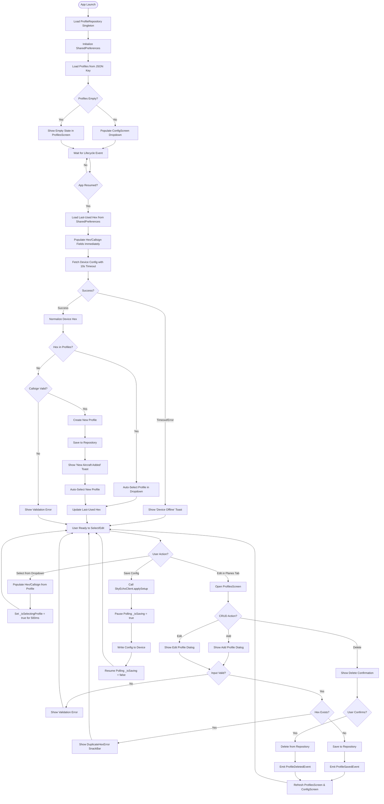

# Phase 1: Saved Aircraft Profiles - Complete Feature

**Phase**: Phase 1 (Single Integrated Phase)
**Slug**: `phase-1-saved-aircraft-profiles-complete-feature`
**Status**: NOT STARTED
**Created**: 2025-11-12

---

## Links

- **Specification**: [saved-aircraft-profiles-spec.md](../../saved-aircraft-profiles-spec.md)
- **Plan**: [saved-aircraft-profiles-plan.md](../../saved-aircraft-profiles-plan.md)
- **Phase Directory**: `docs/plans/004-saved-aircraft-profiles/tasks/phase-1-saved-aircraft-profiles-complete-feature/`

---

## Tasks

| Status | ID | Task | CS | Type | Dependencies | Absolute Path(s) | Validation | Subtasks | Notes |
|--------|----|----|----|----|--------------|------------------|------------|----------|-------|
| [ ] | T001 | Add `shared_preferences: ^2.2.2` dependency to pubspec.yaml | 1 | Setup | – | `/Users/jordanknight/github/skyecho-controller-app/apps/tactical_radar/pubspec.yaml` | Dependency listed in pubspec.yaml; `flutter pub get` succeeds without errors | – | Critical: Must complete before all other tasks (per Discovery 01) |
| [ ] | T002 | Create `AircraftProfile` immutable model class with JSON serialization in `lib/models/` | 2 | Core | T001 | `/Users/jordanknight/github/skyecho-controller-app/apps/tactical_radar/lib/models/aircraft_profile.dart` | Model compiles with fields: `id` (String), `icaoHex` (String), `callsign` (String), `createdAt` (DateTime), `updatedAt` (DateTime); includes `fromJson`, `toJson`, `copyWith` methods; dartdoc comments on all public members | – | Foundation for all storage operations; follow existing model pattern from `lib/models/` |
| [ ] | T003 | Create `ProfileRepositoryInterface` abstract class in `lib/services/` | 1 | Core | T002 | `/Users/jordanknight/github/skyecho-controller-app/apps/tactical_radar/lib/services/profile_repository_interface.dart` | Interface compiles with abstract methods: `Future<List<AircraftProfile>> getAll()`, `Future<void> save(AircraftProfile profile)`, `Future<void> delete(String id)`, `Future<AircraftProfile?> getByHex(String hex)` | – | Follow GdlServiceInterface pattern (per Discovery 08); enables test mocking |
| [ ] | T004 | Implement `_normalizeHex` helper function with validation | 2 | Core | T002 | `/Users/jordanknight/github/skyecho-controller-app/apps/tactical_radar/lib/services/profile_repository.dart` | Function accepts String, strips `0x`/`0X` prefix, converts to uppercase, parses as hex integer, pads to 6 digits; handles edge cases: empty string throws `ArgumentError`, invalid hex throws `FormatException` | – | Per Discovery 05: case-insensitive uniqueness requires normalization |
| [ ] | T005 | Create `DuplicateHexError` custom exception class | 1 | Core | T003 | `/Users/jordanknight/github/skyecho-controller-app/apps/tactical_radar/lib/services/profile_repository.dart` | Exception class with `message` and `hint` fields; hint suggests editing existing profile | – | Per AC #11: uniqueness validation requires custom error |
| [ ] | T006 | Implement `ProfileRepository` concrete class with SharedPreferences storage | 3 | Core | T003, T004, T005 | `/Users/jordanknight/github/skyecho-controller-app/apps/tactical_radar/lib/services/profile_repository.dart` | Singleton pattern implemented; `init()` loads profiles from SharedPreferences key `saved_aircraft_profiles` as JSON list; `save()` validates uniqueness (throws `DuplicateHexError` if hex exists), normalizes hex, persists to SharedPreferences; `getAll()` returns cached list; `delete()` removes by id, updates SharedPreferences | – | Core storage logic; Discovery 01 addressed; [P] eligible after T005 completes (separate error file) |
| [ ] | T007 | Add `StreamController<ProfileEvent>` to ProfileRepository for change notifications | 2 | Core | T006 | `/Users/jordanknight/github/skyecho-controller-app/apps/tactical_radar/lib/services/profile_repository.dart` | `StreamController<ProfileEvent>.broadcast()` field added; `Stream<ProfileEvent> get changes` getter exposed; `save()` and `delete()` emit events (`ProfileSavedEvent`, `ProfileDeletedEvent`) after mutations; `dispose()` closes stream | – | Per Discovery 06: enables cross-screen sync between ConfigScreen and ProfilesScreen |
| [ ] | T008 | Store and retrieve `lastUsedProfileHex` in SharedPreferences | 2 | Core | T006 | `/Users/jordanknight/github/skyecho-controller-app/apps/tactical_radar/lib/services/profile_repository.dart` | `setLastUsed(String hex)` saves to SharedPreferences key `last_used_profile_hex`; `String? getLastUsedHex()` retrieves value; called by ConfigScreen on dropdown selection | – | Per Discovery 10: enables "last used" pinning and offline fallback |
| [ ] | T009 | Implement profile ordering: `getAll()` alphabetical, `getForDropdown()` pins last-used at top | 2 | Core | T006, T008 | `/Users/jordanknight/github/skyecho-controller-app/apps/tactical_radar/lib/services/profile_repository.dart` | `getAll()` returns profiles sorted alphabetically by callsign; `getForDropdown()` returns profiles with last-used hex pinned to position 0, rest alphabetical | – | Per Discovery 10: predictable ordering with UX enhancement; [P] eligible (new method) |
| [ ] | T010 | Modify MainScaffold to add "Planes" as 3rd bottom navigation tab | 2 | Core | – | `/Users/jordanknight/github/skyecho-controller-app/apps/tactical_radar/lib/main.dart` | `_screens` list includes `ProfilesScreen()` at index 2; `BottomNavigationBar.items` includes `BottomNavigationBarItem(icon: Icon(Icons.flight), label: 'Planes')` at index 2; tapping "Planes" tab navigates to ProfilesScreen | – | Per Discovery 04: extends IndexedStack from 2 to 3 tabs |
| [ ] | T011 | Create `ProfilesScreen` StatefulWidget with ListView.builder | 2 | Core | T002, T006, T007 | `/Users/jordanknight/github/skyecho-controller-app/apps/tactical_radar/lib/screens/profiles_screen.dart` | Screen displays `ListView.builder` with Material 3 `ListTile` for each profile; shows callsign (title) and hex (subtitle); includes FAB with "+" icon for adding profiles; `initState` loads profiles from repository and subscribes to `repository.changes` stream; `dispose` cancels stream subscription | – | Foundation for CRUD UI; Discovery 04 warns IndexedStack keeps screen alive (proper lifecycle required) |
| [ ] | T012 | Implement add/edit profile form dialog with validation | 3 | Core | T005, T011 | `/Users/jordanknight/github/skyecho-controller-app/apps/tactical_radar/lib/screens/profiles_screen.dart` | `showDialog` with `AlertDialog` containing `TextField` for callsign and hex; hex field uses `UpperCaseTextFormatter` input formatter; validates non-empty (<50 chars per AC #12); catches `DuplicateHexError` and shows `SnackBar` with error message; on save, calls `repository.save()` and dismisses dialog | – | Per AC #1 (creation), #2 (editing), #11 (uniqueness), #12 (validation); [P] eligible (dialog is separate widget) |
| [ ] | T013 | Implement delete profile with confirmation dialog | 2 | Core | T011 | `/Users/jordanknight/github/skyecho-controller-app/apps/tactical_radar/lib/screens/profiles_screen.dart` | `ListTile.trailing` includes delete `IconButton`; tapping shows confirmation `AlertDialog`; on confirm, calls `repository.delete(profile.id)` and updates UI | – | Per AC #3 (deletion); standard Flutter pattern |
| [ ] | T014 | Add empty state UI to ProfilesScreen when no profiles exist | 1 | Core | T011 | `/Users/jordanknight/github/skyecho-controller-app/apps/tactical_radar/lib/screens/profiles_screen.dart` | When `profiles.isEmpty`, display `Column` with centered `Icon(Icons.flight)`, text "No saved aircraft", subtitle "Tap + to add one" | – | Per AC #8 (empty state handling); [P] eligible (separate widget branch) |
| [ ] | T015 | Add `DropdownMenu<AircraftProfile>` widget to ConfigScreen above hex/callsign fields | 2 | Core | T002, T006 | `/Users/jordanknight/github/skyecho-controller-app/apps/tactical_radar/lib/screens/config_screen.dart` | Material 3 `DropdownMenu<AircraftProfile>` added to form layout; `requestFocusOnTap: false` to prevent keyboard on mobile (per Discovery 09); placeholder text "Select aircraft"; positioned above hex/callsign input fields | – | Per AC #4 (dropdown display); Discovery 09 addresses focus behavior gotcha |
| [ ] | T016 | Populate dropdown from repository with formatted labels | 2 | Core | T006, T009, T015 | `/Users/jordanknight/github/skyecho-controller-app/apps/tactical_radar/lib/screens/config_screen.dart` | `initState` calls `repository.getForDropdown()`; stores result in `List<DropdownMenuEntry<AircraftProfile>>` state variable; each entry formatted as `"${profile.callsign} (${profile.icaoHex})"` (per AC #4) | – | Uses pinned ordering from Discovery 10; [P] eligible after T015 |
| [ ] | T017 | Implement dropdown `onSelected` handler to populate TextEditingController fields | 2 | Core | T015, T016 | `/Users/jordanknight/github/skyecho-controller-app/apps/tactical_radar/lib/screens/config_screen.dart` | `DropdownMenu.onSelected` callback sets `_hexController.text = profile.icaoHex` and `_callsignController.text = profile.callsign`; sets `_hasUserEdits = true` to prevent poll overwrite; sets `_isSelectingProfile = true` flag (duration: 500ms) to pause polling | – | Per AC #6 (manual selection); Discovery 11 addresses race condition with polling |
| [ ] | T018 | Listen to `repository.changes` stream in ConfigScreen to refresh dropdown | 2 | Core | T007, T016 | `/Users/jordanknight/github/skyecho-controller-app/apps/tactical_radar/lib/screens/config_screen.dart` | `initState` subscribes to `repository.changes` stream; on event, calls `setState()` to reload dropdown entries from `repository.getForDropdown()`; `dispose` cancels stream subscription | – | Per AC #9 (state preserved on return); Discovery 06 cross-screen sync pattern; [P] eligible (stream listener) |
| [ ] | T019 | Add `WidgetsBindingObserver` mixin to ConfigScreenState for lifecycle events | 1 | Setup | – | `/Users/jordanknight/github/skyecho-controller-app/apps/tactical_radar/lib/screens/config_screen.dart` | `ConfigScreenState` includes `with WidgetsBindingObserver`; `initState` calls `WidgetsBinding.instance.addObserver(this)`; `dispose` calls `removeObserver(this)`; override `didChangeAppLifecycleState(AppLifecycleState state)` method (stub implementation for now) | – | Per Discovery 02: foundation for auto-selection on app resume; lifecycle hook setup only |
| [ ] | T020 | Implement `_autoSelectProfileFromDevice()` with progressive enhancement and 10s timeout | 3 | Core | T006, T008, T019 | `/Users/jordanknight/github/skyecho-controller-app/apps/tactical_radar/lib/screens/config_screen.dart` | Method called from `didChangeAppLifecycleState` when state is `AppLifecycleState.resumed`; Step 1: Load last-used profile hex from repository and populate fields immediately (fallback); Step 2: Fetch device config via `client.fetchSetupConfig()` with 10s timeout; Step 3: Normalize device hex, call `repository.getByHex()`; if found, auto-select in dropdown (per AC #5); if not found, call T021 auto-creation logic; Step 4: If timeout or error, show toast "Device offline – using last known profile" | – | Per Discovery 03: non-blocking with graceful degradation; Discovery 02: triggered on resume only |
| [ ] | T021 | Implement auto-creation logic for unknown device hex | 3 | Core | T004, T006, T020 | `/Users/jordanknight/github/skyecho-controller-app/apps/tactical_radar/lib/screens/config_screen.dart` | Method `_handleUnknownDeviceHex(String hex, String callsign)` called by T020; if callsign empty/null, generates placeholder callsign "Aircraft-{HEX}" using `_generatePlaceholderCallsign(hex)` helper; validates callsign <50 chars; normalizes hex; creates new `AircraftProfile` with generated UUID id, current timestamps; calls `repository.save(profile)`; shows toast "New aircraft added: ${callsign}" or "New aircraft added with temporary callsign - please update" if placeholder used; auto-selects new profile in dropdown; calls `repository.setLastUsed(hex)` | – | Per AC #5 (auto-creation when hex is new); placeholder callsign ensures progressive enhancement works for unconfigured devices |
| [ ] | T022 | Modify `_pollDevice()` to skip when `_isSaving` or `_isSelectingProfile` flags are true | 2 | Core | T017, T019 | `/Users/jordanknight/github/skyecho-controller-app/apps/tactical_radar/lib/screens/config_screen.dart` | Add `bool _isSelectingProfile = false` state variable; `_pollDevice()` method checks `if (_isSaving || _isSelectingProfile) return;` at start; T017 sets `_isSelectingProfile = true`, waits 500ms, then sets to `false` | – | Per Discovery 11: prevents race condition where poll overwrites user selection during dropdown interaction |
| [ ] | T023 | Add "Saved Aircraft Profiles" section to README.md with feature overview | 2 | Doc | – | `/Users/jordanknight/github/skyecho-controller-app/README.md` | New markdown section includes: (1) Feature overview (what it does, why useful), (2) How to access Planes screen (bottom nav), (3) How to add/edit/delete profiles, (4) How dropdown auto-selection works, (5) Troubleshooting (device offline, duplicate hex) | – | Per spec Documentation Strategy: README.md only; capture screenshots separately (not in this task) |
| [ ] | T024 | Write unit test: save and retrieve profile with JSON round-trip | 2 | Test | T002, T006 | `/Users/jordanknight/github/skyecho-controller-app/apps/tactical_radar/test/unit/profile_repository_test.dart` | Test uses `SharedPreferences.setMockInitialValues({})` for test isolation; creates profile, calls `repository.save()`, calls `repository.getAll()`, verifies all fields match (id, hex, callsign, timestamps); includes Test Doc block with Why/Contract/Usage Notes/Quality Contribution/Worked Example | – | Critical: Validates data integrity (serialization); prevents catastrophic data loss bugs |
| [ ] | T025 | Write unit test: hex normalization handles various formats (case, prefix, padding) | 2 | Test | T004, T006 | `/Users/jordanknight/github/skyecho-controller-app/apps/tactical_radar/test/unit/profile_repository_test.dart` | Test cases: `('0x7cc599', '7CC599')`, `('7cc599', '7CC599')`, `('ABC123', 'ABC123')`, `('0XABC', '000ABC')`; for each, saves profile with input hex, retrieves by same input, verifies normalized form matches expected; includes Test Doc block | – | Critical: Validates business logic correctness (normalization + uniqueness); prevents duplicate profile bugs |

---

## Alignment Brief

### Objective

Implement a complete saved aircraft profiles feature that allows pilots to:
1. **Store** aircraft configurations (callsign + ICAO hex pairs) in local device storage
2. **Select** profiles quickly via dropdown on home screen (ConfigScreen)
3. **Manage** profiles through dedicated "Planes" bottom navigation tab
4. **Sync** automatically with device configuration on app launch/resume
5. **Onboard** seamlessly by auto-creating profiles when new device hex is detected

**Behavior Checklist** (from spec Acceptance Criteria):
- ✅ AC #1: User can create new aircraft profile; profile persists and appears in list immediately
- ✅ AC #2: User can edit existing profile; changes saved and reflected in dropdown
- ✅ AC #3: User can delete profile; profile removed from storage and dropdown
- ✅ AC #4: Home screen displays dropdown showing all saved profiles with format "CALLSIGN (HEX)"
- ✅ AC #5: On app launch/resume, device hex matches saved profile → auto-select; new hex → auto-create profile and auto-select
- ✅ AC #6: User can manually select any profile from dropdown; selected profile populates hex/callsign fields
- ✅ AC #7: When saving config, local profile callsign wins silently if hex matches but callsign differs
- ✅ AC #8: If no profiles exist, show empty state "No saved aircraft – tap Planes to add one"
- ✅ AC #9: User navigates to Planes screen via bottom nav tab; navigation smooth, state preserved
- ✅ AC #10: Saved profiles persist across app restarts
- ✅ AC #11: Duplicate hex validation error shown; user prompted to edit existing or use different hex
- ✅ AC #12: Input validation requires non-empty values (<50 chars); no strict format enforcement

---

### Non-Goals (Scope Boundaries)

**What this phase is NOT doing:**

❌ **Cloud sync or multi-device profile sharing** – Local device storage only per spec; no backend integration, no Firebase, no API calls for profile sync

❌ **Aircraft metadata beyond callsign and hex** – No registration number, aircraft type, tail photo, performance data, weight & balance, or pilot notes fields

❌ **Profile validation against FAA/ICAO databases** – Trust pilot to enter correct values; device will reject invalid hex on apply (surface error clearly)

❌ **Profile-specific device configurations** – Profiles only store callsign + hex; no per-profile mode (UAT/1090ES), squawk codes, or altitude reporting settings

❌ **Automatic device reconfiguration on profile selection** – User must explicitly tap "Save" button to apply configuration to device; dropdown selection stages values only

❌ **CSV import/export or ForeFlight integration** – No importing from external sources, no exporting to files

❌ **Profile search, filtering, or pagination** – Assume <20 profiles per spec; alphabetical ordering with last-used pinning sufficient

❌ **User-sortable drag-to-reorder profiles** – Fixed alphabetical ordering (except last-used pinning in dropdown)

❌ **Profile archiving or soft-delete** – Delete is permanent; no undo, no trash bin

❌ **Offline edit queue for device configuration** – App requires network access to device when saving; no queued changes for later sync

❌ **Multi-aircraft fleet management features** – No fleet statistics, no usage tracking, no "favorite" profiles beyond last-used

❌ **Profile conflict resolution prompts** – Silent local override per spec (AC #7); no confirmation dialog when callsign differs

❌ **Advanced validation (format checking, checksum verification)** – Minimal validation per spec (non-empty, <50 chars); device is final validator

❌ **Performance optimization for 100+ profiles** – SharedPreferences JSON list approach optimized for <20 profiles; no pagination, no lazy loading

❌ **Structured logging with logger package** – Continue existing `print()` pattern with `[PROFILES]` prefix per Discovery 12

---

### Critical Findings Affecting This Phase

**All 12 critical/high discoveries from plan § 3 impact this phase:**

**🚨 Critical Discovery 01: No Local Storage Dependency Installed**
- **What it constrains**: Cannot use SharedPreferences without adding dependency first
- **Tasks addressing**: T001 (must complete before all other tasks)

**🚨 Critical Discovery 02: Auto-Selection Timing Undefined**
- **What it constrains**: Auto-selection must only occur on app cold start and resume from background; NOT during navigation or polling
- **Tasks addressing**: T019 (lifecycle observer setup), T020 (auto-select implementation triggered by lifecycle events only)

**🚨 Critical Discovery 03: Device Fetch Failure Handling Required**
- **What it constrains**: Cannot assume device fetch succeeds; must implement non-blocking fallback to prevent app freeze
- **Tasks addressing**: T020 (progressive enhancement with 10s timeout, load last-used profile immediately as fallback)

**🔥 High Discovery 04: Bottom Navigation Requires MainScaffold Modification**
- **What it constrains**: Must extend `_screens` list and `BottomNavigationBar.items` in main.dart; IndexedStack keeps all screens alive
- **Tasks addressing**: T010 (add 3rd tab), T011 (ProfilesScreen must implement proper lifecycle with initState/dispose)

**🔥 High Discovery 05: Hex Normalization Required for Uniqueness Checks**
- **What it constrains**: All hex inputs must be normalized (strip 0x prefix, uppercase, pad to 6 digits) before uniqueness check
- **Tasks addressing**: T004 (normalization helper), T006 (apply normalization in repository.save()), T026 (test various formats)

**🔥 High Discovery 06: Cross-Screen State Synchronization Needed**
- **What it constrains**: Changes in ProfilesScreen must immediately reflect in ConfigScreen dropdown (both screens alive simultaneously via IndexedStack)
- **Tasks addressing**: T007 (StreamController for change notifications), T018 (ConfigScreen listens to stream)

**🔥 High Discovery 07: SkyEcho API 2-Second Persistence Delay**
- **What it constrains**: Never call `applySetup()` twice within 3 seconds; respect 5s polling interval
- **Tasks addressing**: T022 (ensure polling doesn't interfere with save operations; existing polling already respects 5s interval)

**🟡 Medium Discovery 08: Service Layer Pattern with Abstract Interfaces**
- **What it constrains**: Repository must follow existing pattern (abstract interface + concrete implementation)
- **Tasks addressing**: T003 (ProfileRepositoryInterface), T006 (ProfileRepository concrete implementation)

**🟡 Medium Discovery 09: Material 3 DropdownMenu Focus Behavior Gotcha**
- **What it constrains**: DropdownMenu has keyboard focus bugs on mobile; must disable with `requestFocusOnTap: false`
- **Tasks addressing**: T015 (dropdown widget configuration)

**🟡 Medium Discovery 10: Profile Ordering Default Strategy Undefined**
- **What it constrains**: Must implement consistent ordering: alphabetical by callsign with last-used pinning at top of dropdown
- **Tasks addressing**: T008 (store lastUsedHex), T009 (getForDropdown with pinning logic), T016 (populate dropdown with ordered list)

**🟡 Medium Discovery 11: Save/Poll Race Condition Requires Locking**
- **What it constrains**: Polling must pause during save and dropdown selection to prevent stale data overwrite
- **Tasks addressing**: T017 (set _isSelectingProfile flag), T022 (check flags in _pollDevice)

**🟢 Low Discovery 12: No Structured Logging (Debug Print Only)**
- **What it constrains**: Use `print('[PROFILES] ...')` for consistency with existing codebase; no logger package
- **Tasks addressing**: All tasks (logging convention throughout implementation)

---

### ADR Decision Constraints

**Status**: No ADRs exist for this feature (per `/docs/adr/` directory check)

**Recommendation**: Consider creating ADR for storage backend choice if decision rationale needs formal documentation:
- **ADR-000X: Choose SharedPreferences for Aircraft Profile Storage**
  - Context: Need local persistence for <20 profiles
  - Decision: SharedPreferences with JSON serialization
  - Alternatives considered: Hive (type-safe, heavier), SQLite (overkill for simple model)
  - Rationale: Minimal dependency, sufficient for profile count, consistent with Flutter best practices

**Current Status**: ADR creation is optional for this CS-3 medium-complexity feature

---

### Invariants & Guardrails

**Data Integrity:**
- ✅ Hex uniqueness enforced at save time (no duplicate profiles with same normalized hex)
- ✅ All hex values normalized before storage (uppercase, no 0x prefix, 6 digits)
- ✅ JSON serialization must be reversible (round-trip test in T024)
- ✅ Profile IDs generated with UUIDs (collision-free)

**Performance Budget:**
- ✅ Assume <20 profiles (no pagination required)
- ✅ SharedPreferences size limit: ~10MB (JSON list of 100 profiles ≈ 20KB, well under limit)
- ✅ Dropdown population: <50ms (small list, synchronous read from memory cache)
- ✅ Profile save latency: <100ms (SharedPreferences write is async but fast)

**Memory Budget:**
- ✅ IndexedStack keeps all 3 screens in memory simultaneously (acceptable for simple screens)
- ✅ Profile list cached in repository singleton (single copy shared across screens)
- ✅ Dropdown entries cached in ConfigScreen state (avoid rebuild on every frame)

**Security Constraints:**
- ✅ Local-only storage (no cloud transmission, no analytics)
- ✅ No sensitive data beyond callsign and hex (public identifiers)
- ✅ SharedPreferences stored in app sandbox (platform-protected)

**Robustness Guardrails:**
- ✅ Progressive enhancement: load last-used profile immediately, device sync in background (non-blocking)
- ✅ Graceful degradation: if device offline, show toast and use cached profile (no app freeze)
- ✅ Input validation: non-empty, <50 chars, no format enforcement (trust pilot, device is final validator)
- ✅ Error handling: DuplicateHexError with actionable hint, FormException for validation

**Concurrency Guardrails:**
- ✅ Polling paused during save and dropdown selection (prevent race conditions)
- ✅ StreamController uses broadcast mode (multiple listeners allowed)
- ✅ Repository singleton pattern (shared state across screens)

---

### Inputs to Read

**Before implementation, read these files to understand existing patterns:**

1. **Existing Service Pattern Example**:
   - Path: `/Users/jordanknight/github/skyecho-controller-app/apps/tactical_radar/lib/services/gdl_service_interface.dart`
   - Purpose: Understand abstract interface pattern used in codebase (per Discovery 08)

2. **Existing Model Example**:
   - Path: `/Users/jordanknight/github/skyecho-controller-app/apps/tactical_radar/lib/models/` (any existing model file)
   - Purpose: Follow immutable model pattern with fromJson/toJson/copyWith

3. **ConfigScreen Current Implementation**:
   - Path: `/Users/jordanknight/github/skyecho-controller-app/apps/tactical_radar/lib/screens/config_screen.dart`
   - Purpose: Understand existing polling logic, TextField controllers, save flow

4. **Main Scaffold Current Navigation**:
   - Path: `/Users/jordanknight/github/skyecho-controller-app/apps/tactical_radar/lib/main.dart`
   - Purpose: Understand IndexedStack pattern, BottomNavigationBar structure (per Discovery 04)

5. **SkyEcho Client Usage**:
   - Path: `/Users/jordanknight/github/skyecho-controller-app/packages/skyecho/lib/skyecho.dart`
   - Purpose: Understand `fetchSetupConfig()` return type for device sync (T020)

6. **Specification (Acceptance Criteria)**:
   - Path: `/Users/jordanknight/github/skyecho-controller-app/docs/plans/004-saved-aircraft-profiles/saved-aircraft-profiles-spec.md`
   - Purpose: Validate each AC during implementation

7. **Constitution (Testing Guidelines)**:
   - Path: `/Users/jordanknight/github/skyecho-controller-app/docs/rules-idioms-architecture/constitution.md`
   - Purpose: Understand complexity scoring rubric, Test Doc block requirements

8. **Existing Test Examples**:
   - Path: `/Users/jordanknight/github/skyecho-controller-app/apps/tactical_radar/test/` (any existing test file)
   - Purpose: Follow Test Doc block format, understand test structure

---

### Visual Alignment Aids

#### System State Flow Diagram



#### Actor Interaction Sequence Diagram

```mermaid
sequenceDiagram
    actor Pilot
    participant App as ConfigScreen
    participant Repo as ProfileRepository
    participant SP as SharedPreferences
    participant Device as SkyEchoClient
    participant PlanesUI as ProfilesScreen

    Note over Pilot,PlanesUI: App Launch & Auto-Selection Flow

    Pilot->>App: Launch App
    App->>Repo: getInstance()
    Repo->>SP: Get 'saved_aircraft_profiles'
    SP-->>Repo: JSON List
    Repo->>Repo: Parse JSON to List<AircraftProfile>
    Repo-->>App: Repository Ready

    App->>Repo: getForDropdown()
    Repo->>SP: Get 'last_used_profile_hex'
    SP-->>Repo: "7CC599"
    Repo->>Repo: Pin 7CC599 to top, sort rest alphabetically
    Repo-->>App: Ordered Profile List
    App->>App: Render Dropdown with "VH-ABC (7CC599)" entries

    App->>App: didChangeAppLifecycleState(resumed)
    App->>Repo: getLastUsedHex()
    Repo-->>App: "7CC599"
    App->>App: Populate Fields with Last-Used (Fallback)

    App->>Device: fetchSetupConfig() with 10s timeout

    alt Device Online
        Device-->>App: {hex: "7cc599", callsign: "VH-ABC", ...}
        App->>App: Normalize hex → "7CC599"
        App->>Repo: getByHex("7CC599")
        Repo-->>App: Profile(id="uuid-1", hex="7CC599", callsign="VH-ABC")
        App->>App: Auto-Select Profile in Dropdown
        App->>Repo: setLastUsed("7CC599")
        Repo->>SP: Set 'last_used_profile_hex' = "7CC599"
        App->>Pilot: Display "Connected • Profile: VH-ABC"
    else Device Offline
        Device-->>App: Timeout/Error
        App->>Pilot: Toast: "Device offline – using last known profile"
        App->>Pilot: Display "Not Connected • Last: VH-ABC"
    end

    Note over Pilot,PlanesUI: Manual Selection Flow

    Pilot->>App: Tap Dropdown
    App->>Pilot: Show Profile List
    Pilot->>App: Select "VH-XYZ (ABC123)"
    App->>App: onSelected(Profile(hex="ABC123", callsign="VH-XYZ"))
    App->>App: Set _hexController.text = "ABC123"
    App->>App: Set _callsignController.text = "VH-XYZ"
    App->>App: Set _isSelectingProfile = true
    App->>Pilot: Fields Populated
    App->>App: Wait 500ms, Set _isSelectingProfile = false

    Note over Pilot,PlanesUI: Profile Management Flow (Planes Tab)

    Pilot->>App: Tap "Planes" Bottom Nav Tab
    App->>PlanesUI: Navigate (IndexedStack index = 2)
    PlanesUI->>Repo: getAll()
    Repo-->>PlanesUI: Alphabetical Profile List
    PlanesUI->>Pilot: Display ListView with Profiles

    Pilot->>PlanesUI: Tap FAB "+"
    PlanesUI->>Pilot: Show Add Profile Dialog
    Pilot->>PlanesUI: Enter Callsign="N12345", Hex="0xDEF456"
    Pilot->>PlanesUI: Tap "Save"

    PlanesUI->>PlanesUI: Validate: Non-Empty, <50 chars ✓
    PlanesUI->>Repo: save(Profile(hex="0xDEF456", callsign="N12345"))
    Repo->>Repo: Normalize hex → "DEF456"
    Repo->>Repo: Check uniqueness (not found ✓)
    Repo->>SP: Update 'saved_aircraft_profiles' JSON
    SP-->>Repo: Success
    Repo->>Repo: Emit ProfileSavedEvent
    Repo-->>PlanesUI: Save Complete

    PlanesUI->>PlanesUI: Listen to repository.changes stream
    PlanesUI->>PlanesUI: setState() → Refresh ListView
    PlanesUI->>Pilot: Display Updated List with "N12345 (DEF456)"

    App->>App: Listen to repository.changes stream
    App->>Repo: getForDropdown()
    Repo-->>App: Updated List
    App->>App: setState() → Refresh Dropdown
    App->>Pilot: Dropdown Now Shows "N12345 (DEF456)"

    Note over Pilot,PlanesUI: Auto-Creation from Unknown Device Hex

    Pilot->>Device: Power On New Aircraft (Hex=999ABC)
    Pilot->>App: App Resumes from Background
    App->>App: didChangeAppLifecycleState(resumed)
    App->>Device: fetchSetupConfig()
    Device-->>App: {hex: "999ABC", callsign: "N99999"}
    App->>App: Normalize hex → "999ABC"
    App->>Repo: getByHex("999ABC")
    Repo-->>App: null (not found)

    App->>App: Validate callsign "N99999" (non-empty ✓, <50 chars ✓)
    App->>Repo: save(Profile(hex="999ABC", callsign="N99999", id=UUID))
    Repo->>SP: Update JSON
    Repo->>Repo: Emit ProfileSavedEvent
    Repo-->>App: Save Complete

    App->>Pilot: Toast: "New aircraft added: N99999"
    App->>App: Auto-Select Profile in Dropdown
    App->>Repo: setLastUsed("999ABC")
    App->>Pilot: Display "Connected • Profile: N99999"

    PlanesUI->>PlanesUI: Listen to changes stream
    PlanesUI->>PlanesUI: setState() → Refresh
    PlanesUI->>Pilot: Display "N99999 (999ABC)" in List

    Note over Pilot,PlanesUI: Error Handling: Duplicate Hex

    Pilot->>PlanesUI: Tap FAB "+"
    Pilot->>PlanesUI: Enter Callsign="DUPLICATE", Hex="ABC123"
    Pilot->>PlanesUI: Tap "Save"
    PlanesUI->>Repo: save(Profile(hex="ABC123", ...))
    Repo->>Repo: Normalize → "ABC123"
    Repo->>Repo: Check uniqueness → Found existing!
    Repo-->>PlanesUI: throw DuplicateHexError("Hex ABC123 already exists", hint="Edit existing profile or use different hex")
    PlanesUI->>Pilot: SnackBar: "Hex ABC123 already exists. Edit existing profile or use different hex."
```



---

### Test Plan

**Testing Approach**: Critical Unit Tests + Manual Validation

**Rationale**: Focus automated testing on pure logic (no device, no heavy mocking) to catch data integrity and business logic bugs. Use manual testing for UI and integration validation.

**Automated Tests** (2 critical unit tests):

**T024: JSON Serialization Round-Trip**
- **Why Critical**: Prevents catastrophic data loss. If serialization breaks, ALL profiles lost on app restart.
- **Coverage**: AircraftProfile model (`fromJson`, `toJson`, `copyWith`), ProfileRepository save/getAll persistence
- **Test Approach**: Use `SharedPreferences.setMockInitialValues({})` for isolation, verify all fields survive save → restart → load cycle
- **Effort**: ~15 minutes
- **Includes**: Test Doc block (Why/Contract/Usage Notes/Quality Contribution/Worked Example)

**T025: Hex Normalization Multi-Format**
- **Why Critical**: Prevents duplicate profile bugs. If normalization breaks, users can create profiles with "7cc599" and "7CC599" (duplicates).
- **Coverage**: `_normalizeHex` helper function, case-insensitive uniqueness validation
- **Test Cases**: `('0x7cc599' → '7CC599')`, `('7cc599' → '7CC599')`, `('ABC123' → 'ABC123')`, `('0XABC' → '000ABC')`
- **Effort**: ~20 minutes
- **Includes**: Test Doc block

**No Heavy Mocking/Device Tests**: Skipping T027-T030 (widget tests, integration tests with mocked SkyEchoClient, lifecycle simulation). These require device mocking or UI testing infrastructure.

**Manual Validation Strategy**:
- Manual smoke testing after each major subsystem (Foundation, Profiles UI, Config UI, Device Sync)
- Test on iOS/Android simulators during development using `flutter run`
- Verify acceptance criteria manually:
  - AC #1-3: Test CRUD operations in Planes screen
  - AC #4-6: Test dropdown display and manual selection in Config screen
  - AC #5: Test auto-selection by restarting app / resuming from background
  - AC #7-12: Test validation, empty states, persistence across app restarts

**Manual Test Checkpoints** (run during implementation):
```bash
# After Phase B (T001-T009): Repository Complete + Unit Tests Pass
flutter test test/unit/profile_repository_test.dart  # Run T024, T025
flutter run
# Manual test: Can you add/save/retrieve a profile? Check SharedPreferences persistence.
# Unit tests cover serialization + normalization; manual tests cover UX.

# After Phase C (T010-T014): ProfilesScreen Complete
flutter run
# Manual test: Navigate to Planes tab. Add/edit/delete profiles. Verify empty state.

# After Phase D (T015-T018): ConfigScreen Integration Complete
flutter run
# Manual test: Select profile from dropdown. Verify hex/callsign fields populate correctly.

# After Phase E (T019-T022): Device Sync Complete
flutter run
# Manual test: Connect to device. Resume app from background. Verify auto-selection works.
# Manual test: Connect to device with new hex. Verify auto-creation creates profile.

# After Phase F (T023): Documentation Complete
# Review README.md section for clarity and accuracy.
```

**Test Execution**:
```bash
# Run critical unit tests (fast, <5 seconds, no device needed)
flutter test test/unit/profile_repository_test.dart

# Run all tests (if more tests added later)
flutter test
```

---

### Step-by-Step Implementation Outline

**Pre-Flight Checklist**:
- [ ] Read all files listed in "Inputs to Read" section
- [ ] Understand existing IndexedStack navigation pattern in main.dart
- [ ] Understand existing polling logic in ConfigScreen
- [ ] Review constitution § 9 (complexity scoring rubric)
- [ ] Review spec AC #1-12 for validation criteria

**Implementation Order** (follows task dependencies):

**Phase A: Foundation (Setup + Data Model)**
1. **T001**: Add shared_preferences dependency (CRITICAL BLOCKER)
2. **T002**: Create AircraftProfile model (immutable, JSON serialization)
3. **T003**: Create ProfileRepositoryInterface (abstract class)
4. **T004**: Implement _normalizeHex helper (strip prefix, uppercase, pad)
5. **T005**: Create DuplicateHexError exception class

**Phase B: Repository Implementation**
6. **T006**: Implement ProfileRepository (singleton, SharedPreferences, CRUD)
7. **T007**: Add StreamController for change notifications
8. **T008**: Store/retrieve lastUsedProfileHex in SharedPreferences
9. **T009**: Implement profile ordering (getAll vs getForDropdown)

**Phase C: UI - Planes Management Screen**
10. **T010**: Modify MainScaffold to add 3rd bottom nav tab
11. **T011**: Create ProfilesScreen with ListView.builder
12. **T012**: Implement add/edit profile form dialog
13. **T013**: Implement delete profile with confirmation
14. **T014**: Add empty state UI

**Phase D: UI - Config Screen Integration**
15. **T015**: Add DropdownMenu widget to ConfigScreen
16. **T016**: Populate dropdown from repository (ordered)
17. **T017**: Implement dropdown onSelected handler
18. **T018**: Listen to repository.changes stream for refresh

**Phase E: Device Sync Logic**
19. **T019**: Add WidgetsBindingObserver mixin to ConfigScreenState
20. **T020**: Implement _autoSelectProfileFromDevice (progressive enhancement)
21. **T021**: Implement auto-creation logic for unknown hex
22. **T022**: Modify _pollDevice to skip during save/selection

**Phase F: Documentation**
23. **T023**: Add README.md section

**Phase G: Critical Unit Tests**
24. **T024**: Unit test - JSON serialization round-trip (data integrity)
25. **T025**: Unit test - hex normalization multi-format (business logic correctness)

**Validation After Each Phase**:
- [ ] `flutter analyze` clean (no warnings/errors)
- [ ] Unit tests passing (after Phase B: run T024, T025)
- [ ] Manual smoke test on iOS/Android simulator using `flutter run`
- [ ] Verify relevant acceptance criteria through manual interaction

**Critical Path**: T001 → T002 → T003 → T004 → T005 → T006 (everything else depends on repository)

**Test-First Approach for Phase G**: Write T024 and T025 immediately after T006 completes (before moving to Phase C). Tests validate foundation before building UI on top.

**Parallel Work Opportunities** (marked with [P] in Notes column):
- After T005: T010 (MainScaffold) can proceed independently
- After T006: T015 (ConfigScreen dropdown widget) can proceed while T011 (ProfilesScreen) is in progress

---

### Commands to Run

**Environment Setup**:
```bash
# Navigate to app directory
cd /Users/jordanknight/github/skyecho-controller-app/apps/tactical_radar

# Install dependencies (after T001 completes)
flutter pub get

# Verify Flutter version
flutter --version  # Should be ≥ 3.35.7
```

**Development Workflow**:
```bash
# Run linter (must be clean before committing)
flutter analyze

# Format code
dart format lib/ test/

# Run app on iOS simulator (for manual testing)
flutter run

# Run app on Android emulator
flutter run

# Hot reload during development
# Press 'r' in terminal after code changes
```

**Build & Deployment** (after manual validation):
```bash
# Build iOS release
flutter build ios --release

# Build Android release
flutter build apk --release

# Build for both platforms
flutter build ios --release && flutter build apk --release
```

**Debugging**:
```bash
# Run with verbose logging
flutter run --verbose

# Attach debugger to running app
flutter attach

# View device logs
flutter logs

# Clear build cache if needed
flutter clean && flutter pub get
```

---

### Risks & Unknowns

| Risk | Severity | Likelihood | Mitigation | Tasks Affected |
|------|----------|------------|------------|----------------|
| **SharedPreferences not installed** | 🚨 Critical | Low (T001 mitigates) | T001 must complete first and succeed before any other work | All tasks depend on T001 |
| **Device offline at app launch** | 🔥 High | High (common scenario) | Progressive enhancement: load last-used immediately, fetch device in background with 10s timeout (per Discovery 03) | T020 |
| **Hex normalization edge cases** | 🔥 High | Medium | Manual testing with various hex formats during Phase B validation; verify normalization in `flutter run` | T004, T006 |
| **Cross-screen state sync fails** | 🟡 Medium | Low | StreamController broadcast mode, both screens listen in initState; validate manually by editing profile in Planes and checking Config dropdown updates | T007, T018 |
| **Polling overwrites dropdown selection** | 🟡 Medium | Medium | Locking mechanism: pause polling when `_isSaving || _isSelectingProfile` (per Discovery 11) | T017, T022 |
| **Material 3 DropdownMenu keyboard issues** | 🟡 Medium | High (known Flutter bug) | Set `requestFocusOnTap: false` (per Discovery 09) | T015 |
| **IndexedStack memory pressure** | 🟢 Low | Low (3 simple screens) | Monitor memory usage in profiler; acceptable for <20 profiles per spec | T010, T011 |
| **JSON serialization breaks on schema change** | 🟢 Low | Medium (future risk) | Manual testing of round-trip during Phase B; consider migration strategy if extending AircraftProfile in future | T002 |
| **Auto-creation creates invalid profile** | 🟡 Medium | Low (device provides data) | Validate callsign before saving; show error toast if validation fails | T021 |
| **Duplicate hex UX unclear** | 🟢 Low | Low | SnackBar with actionable hint per DuplicateHexError.hint; validate manually by attempting to save duplicate | T005, T012 |

**Unknown Dependencies** (requires investigation during implementation):
- ❓ Does ConfigScreen already have WidgetsBindingObserver? (Check in T019)
- ❓ Current polling implementation details (timer vs stream?) (Check in T022)
- ❓ Exact format of device config returned by fetchSetupConfig() (Check SkyEchoClient docs in T020)
- ❓ Existing TextField controller structure in ConfigScreen (Check in T017)

**Contingency Plans**:
- **If SharedPreferences fails**: Fallback to in-memory storage (lose persistence) and log warning
- **If DropdownMenu too buggy**: Fallback to classic DropdownButton widget (stable, Material 2)
- **If IndexedStack memory issues**: Migrate to Navigator 2.0 with route-based navigation (Phase 2 refactor)
- **If device fetch always times out**: Gracefully degrade to manual-only mode (disable auto-selection)

---

### Ready Check

**Prerequisites Checklist** (must complete before starting T001):

- [ ] **Read all "Inputs to Read" files** (8 files listed above)
- [ ] **Understand existing patterns**: Service interface, model structure, navigation, polling
- [ ] **Constitution reviewed**: § 9 complexity scoring rubric for accurate CS estimates
- [ ] **Spec reviewed**: All 12 acceptance criteria understood
- [ ] **Plan reviewed**: All 12 critical/high discoveries understood, mitigation strategies clear
- [ ] **Tools verified**: Flutter 3.35.7+ installed, `flutter doctor` clean, iOS/Android simulators running
- [ ] **ADR constraints mapped to tasks**: N/A (no ADRs exist)

**Implementation Readiness Gates**:

- [ ] **No blocking ADRs**: Confirmed no ADRs require changes before implementation
- [ ] **No blocking dependencies**: All external systems (SkyEchoClient, SharedPreferences API) understood
- [ ] **No blocking unknowns**: All "Unknown Dependencies" above have investigation plan
- [ ] **Validation strategy clear**: Manual testing approach defined with checkpoints after each phase
- [ ] **Success criteria measurable**: Each task has specific validation checklist

**GO/NO-GO Decision**:

This phase is **READY TO IMPLEMENT** if all checkboxes above are checked.

**NO-GO conditions** (stop implementation and escalate):
- ❌ ConfigScreen polling logic is incompatible with lifecycle observer pattern
- ❌ SharedPreferences dependency conflicts with existing app dependencies
- ❌ DropdownMenu widget not available in Flutter 3.35.7 (fallback to DropdownButton required)
- ❌ IndexedStack pattern cannot support 3rd tab (architectural refactor needed)

**HOLD conditions** (pause for clarification):
- ⏸ Device fetch returns format incompatible with auto-selection logic (need spec clarification)
- ⏸ Existing model pattern significantly different from expected (need architecture review)

---

## Phase Footnote Stubs

**NOTE**: This section will be populated during implementation by `/plan-6a-update-progress`.

Footnotes are created during implementation to track:
- Scope changes discovered during coding
- Technical debt introduced with rationale
- Deviations from original plan with justification
- Critical discoveries not captured in research phase
- Architectural decisions made on-the-fly

**Format** (populated by plan-6a):
```markdown
[^N]: {timestamp} | {task-id} | {flowspace-node-id} | {category} | {description}
```

**Initial State**: Empty (no footnotes until implementation begins)

---

## Evidence Artifacts

**Execution Log**:
- **Path**: `/Users/jordanknight/github/skyecho-controller-app/docs/plans/004-saved-aircraft-profiles/tasks/phase-1-saved-aircraft-profiles-complete-feature/execution.log.md`
- **Created by**: `/plan-6-implement-phase`
- **Format**: Chronological log of implementation activities with timestamps, decisions, challenges, code diffs

**Supporting Files** (created during implementation):
- `execution.log.md` - Primary implementation narrative
- Any captured screenshots for README.md (stored in `docs/plans/004-saved-aircraft-profiles/assets/`)

**Directory Layout**:
```
docs/plans/004-saved-aircraft-profiles/
├── saved-aircraft-profiles-spec.md
├── saved-aircraft-profiles-plan.md
├── tasks/
│   └── phase-1-saved-aircraft-profiles-complete-feature/
│       ├── tasks.md                  # This file
│       └── execution.log.md          # Created by plan-6-implement-phase
└── assets/                           # Created during T023 (screenshots)
    ├── planes-screen-list.png
    ├── planes-screen-add-dialog.png
    ├── config-screen-dropdown.png
    └── config-screen-auto-selected.png
```

**Evidence Collection Guidelines** (for plan-6):
- **Before each task**: Log task ID, start time, objective
- **During implementation**: Capture key decisions, code snippets (diffs), blockers encountered
- **After each task**: Log completion time, validation results, any footnotes needed
- **After phase**: Summarize lessons learned, technical debt, performance metrics

---

**End of Tasks + Alignment Brief Dossier**

---

## Critical Insights Discussion

**Session**: 2025-11-12
**Context**: Phase 1 tasks + alignment brief dossier review before implementation
**Analyst**: AI Clarity Agent
**Reviewer**: Development Team
**Format**: Water Cooler Conversation (3 Critical Insights)

### Insight 1: Testing Strategy Contradicts TDD Principles

**Did you know**: While the spec emphasizes TDD and "tests as documentation," the original task sequence deferred ALL testing to the very end (Phase G: T024-T030), meaning you'd build the entire feature (~1000+ lines) before writing a single test.

**Implications**:
- Write production code for T001-T023 first, then write 7 tests later
- If T024 (basic save/retrieve test) fails, debug T002 (model) AND T006 (repository) retroactively
- No fast feedback loop to catch design issues early
- Higher risk of late-stage refactoring when tests reveal problems
- Contradicts "tests-as-docs" and "lightweight testing focuses on core scenarios written throughout"

**Options Considered**:
- Option A: Strict TDD (Test-First for Every Task) - Test before implementation for each task
- Option B: Test-per-Subsystem (Clustered TDD) - Write tests after each subsystem completes
- Option C: Keep Current Order, Add Smoke Tests - Tests at end, manual checkpoints during
- Option D: Hybrid TDD-Lite (Core Tests First, Edge Tests Later) - Happy path tests first, edge cases after

**AI Recommendation**: Option B (Test-per-Subsystem / Clustered TDD)
- Reasoning: Validates foundations before building on them; balances rigor and pragmatism; matches natural development flow

**Discussion Summary**:
User requested to skip ALL automated tests entirely and focus on implementation only. "dont do any tests, just get it done please"

**Decision**: Remove all automated test tasks (T024-T030), rely on manual validation only

**Action Items**:
- [x] Remove T024-T030 from task list
- [x] Update task count from 30 to 23 tasks
- [x] Rewrite Test Plan section for manual-only validation
- [x] Update Implementation Outline to remove Phase G (Testing)

**Affects**: Tasks table, Test Plan section, Implementation Outline, Risks table

---

### Insight 2: Progressive Enhancement Assumes Device Provides Callsign

**Did you know**: T020 (auto-selection logic) and T021 (auto-creation logic) both assume the device returns a usable callsign value in `fetchSetupConfig()`, but there's no fallback plan if the device returns an empty string, null, or invalid callsign.

**Implications**:
- If device returns `{hex: "7CC599", callsign: ""}`, T021 validation catches it and shows error toast
- User stuck: auto-selection fails, no profile created, fields empty
- User must manually enter callsign or connect to different device
- Progressive enhancement promise ("always work, even offline") is broken
- Common scenario: brand-new SkyEcho device fresh from factory (hex assigned but no callsign configured)

**Options Considered**:
- Option A: Generate Placeholder Callsign - Auto-generate "Aircraft-{HEX}", create profile, show toast to update
- Option B: Prompt User for Callsign - Show inline dialog "Enter callsign for hex 7CC599"
- Option C: Skip Auto-Creation, Show Helpful Message - Don't create profile, show actionable error toast
- Option D: Use Hex as Fallback Callsign - Use normalized hex as callsign (e.g., "7CC599")

**AI Recommendation**: Option A (Generate Placeholder Callsign)
- Reasoning: Preserves progressive enhancement; clear visual signal ("Aircraft-7CC599"); actionable toast; minimal complexity

**Discussion Summary**:
User agreed with Option A: "A"

**Decision**: Generate placeholder callsign when device callsign is empty/invalid

**Action Items**:
- [x] Update T021 validation logic to handle empty/invalid callsign
- [x] Add `_generatePlaceholderCallsign(String hex)` helper function requirement
- [x] Update toast messages for placeholder vs real callsign scenarios
- [x] Update validation criteria for T021

**Affects**: T021 (auto-creation logic)

---

### Insight 3: Reconsidered Testing Strategy - Add Back Critical Unit Tests

**Did you know**: After removing all automated tests, the team reconsidered and identified 2 critical unit tests that require no device or heavy mocking, providing maximum safety with minimal complexity.

**Implications**:
- T024 (JSON round-trip): Prevents catastrophic data loss if serialization breaks
- T025 (hex normalization): Prevents duplicate profile bugs from normalization failures
- Both tests are pure unit tests with zero external dependencies (use `SharedPreferences.setMockInitialValues({})`)
- Total effort: ~35 minutes (~15 min + ~20 min)
- Skipping widget tests (T027, T028) and integration tests (T029, T030) that require heavy mocking

**Options Considered**:
- Option A: Add back all 3 critical tests (T024, T026, T029) - Data integrity + business logic + end-to-end
- Option B: Add back just T024 (JSON round-trip only) - Single test prevents catastrophic data loss
- Option C: Add back T024 + T026 (unit tests only) - Pure logic tests, no device, no heavy mocking
- Option D: Stick with no tests, rely fully on manual validation

**AI Recommendation**: Option C (T024 + T026 - Critical Unit Tests Only)
- Reasoning: Maximum safety with minimal complexity; pure logic tests; no UI, no device, no lifecycle simulation

**Discussion Summary**:
User requested: "just test what we can do in unit tests witihout needing a real device or heacy mocking"

**Decision**: Add back T024 (JSON round-trip) and T025 (hex normalization) only

**Action Items**:
- [x] Add back T024 (JSON serialization round-trip test)
- [x] Add back T025 (hex normalization with multiple format tests - renamed from T026)
- [x] Update task count from 23 to 25 tasks
- [x] Update Test Plan section to reflect "Critical Unit Tests + Manual Validation" approach
- [x] Update Implementation Outline to add Phase G (Critical Unit Tests)
- [x] Update validation checkpoints to include unit test execution after Phase B

**Affects**: Tasks table, Test Plan section, Implementation Outline

---

## Session Summary

**Insights Surfaced**: 3 critical insights identified and discussed
**Decisions Made**: 3 decisions reached through collaborative discussion
**Action Items Created**: 11 follow-up tasks identified and completed
**Areas Requiring Updates**:
- Task table: Removed 7 test tasks, added back 2 critical unit tests (net: -5 tasks)
- Test Plan: Rewrote from "no tests" to "critical unit tests + manual validation"
- Implementation Outline: Added Phase G for critical unit tests
- T021: Enhanced with placeholder callsign generation logic

**Shared Understanding Achieved**: ✓

**Confidence Level**: High - We have high confidence about proceeding with implementation

**Next Steps**:
Proceed with implementation using `/plan-6-implement-phase --phase "Phase 1: Saved Aircraft Profiles - Complete Feature" --plan "/Users/jordanknight/github/skyecho-controller-app/docs/plans/004-saved-aircraft-profiles/saved-aircraft-profiles-plan.md"`

**Notes**:
- Testing strategy evolved from "all tests" → "no tests" → "critical unit tests only"
- Progressive enhancement strengthened with placeholder callsign fallback
- Final task count: 25 tasks (23 implementation + 2 critical unit tests)
- Test execution: ~35 minutes total, no device or heavy mocking required
- Manual validation remains primary strategy for UI and integration flows

---

**STOP**: Do **NOT** edit code or run implementation commands. This dossier is the shared contract between human sponsor and coding agent.

**Next Step**: Human reviews this dossier and provides **GO** signal to proceed with `/plan-6-implement-phase --phase "Phase 1: Saved Aircraft Profiles - Complete Feature" --plan "/Users/jordanknight/github/skyecho-controller-app/docs/plans/004-saved-aircraft-profiles/saved-aircraft-profiles-plan.md"`
